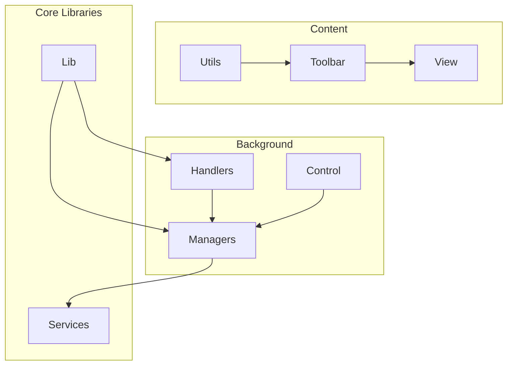
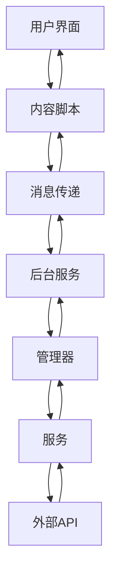
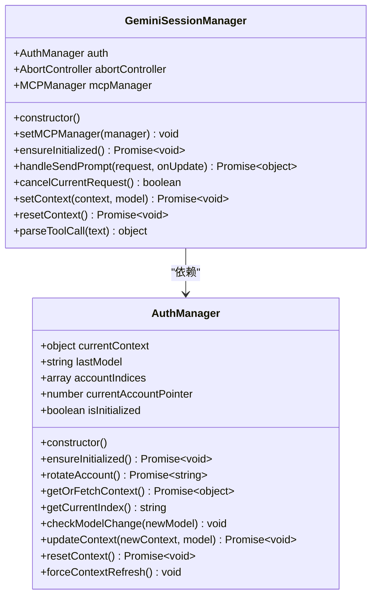
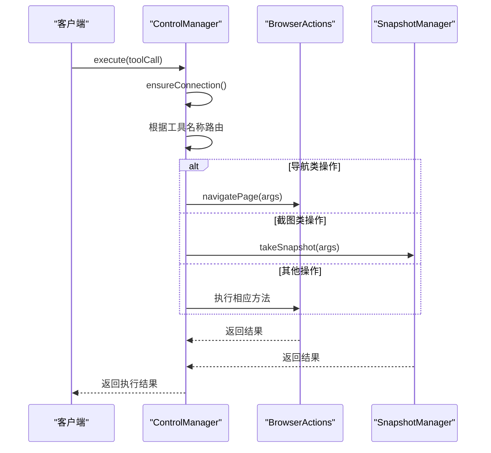
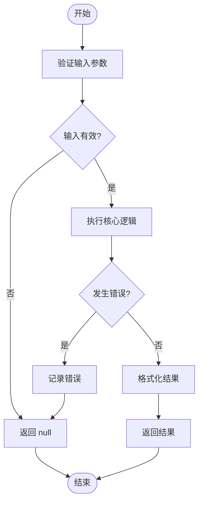
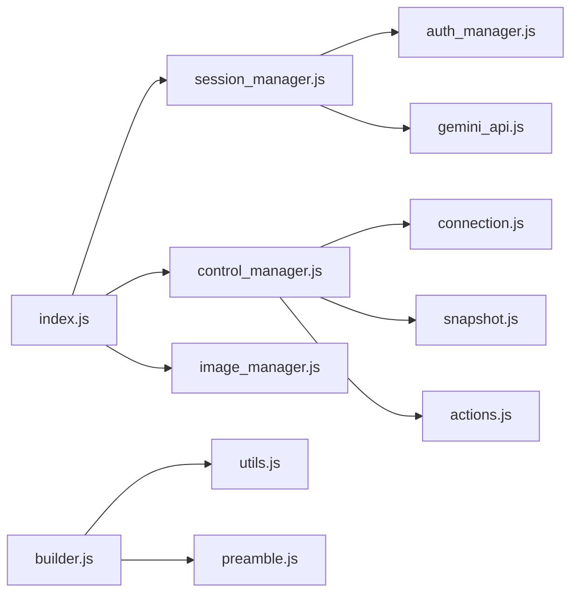

# 代码规范与风格指南

<cite>
**本文档引用的文件**
- [session_manager.js](file://background/managers/session_manager.js)
- [control_manager.js](file://background/managers/control_manager.js)
- [auth_manager.js](file://background/managers/auth_manager.js)
- [utils.js](file://background/handlers/session/utils.js)
- [utils.js](file://lib/utils.js)
- [gemini_api.js](file://services/gemini_api.js)
- [index.js](file://background/index.js)
- [base.js](file://background/control/actions/base.js)
- [builder.js](file://background/handlers/session/prompt/builder.js)
- [manifest.json](file://manifest.json)
- [package.json](file://package.json)
- [constants.js](file://lib/constants.js)
</cite>

## 目录
1. [简介](#简介)
2. [项目结构](#项目结构)
3. [核心组件](#核心组件)
4. [架构概述](#架构概述)
5. [详细组件分析](#详细组件分析)
6. [依赖分析](#依赖分析)
7. [性能考虑](#性能考虑)
8. [故障排除指南](#故障排除指南)
9. [结论](#结论)

## 简介
本文档旨在为Gemini Nexus项目制定统一的JavaScript/TypeScript代码规范，涵盖编码标准、模块化组织原则和命名约定。通过分析现有代码库中的关键文件，提取最佳实践并提供可执行的指导建议。文档重点关注utils.js和manager类文件的编码风格，解析函数命名、类结构、注释规范和错误处理模式。同时，详细说明ES6+模块语法的使用规范，包括import/export的最佳实践。此外，提供代码格式化配置建议（如Prettier规则）和静态检查工具（如ESLint）集成方案。特别强调异步编程中Promise和await的正确使用方式，避免回调地狱问题。结合session_manager.js中的状态管理逻辑，阐明数据封装和接口暴露的最佳实践。

## 项目结构
Gemini Nexus项目采用分层的模块化架构，将功能按职责分离到不同的目录中。核心逻辑主要分布在background、content、lib和services等目录下。background目录包含后台服务逻辑，包括管理器（managers）、控制器（handlers）和控制模块（control）。content目录负责内容脚本和用户界面交互，实现浏览器扩展的核心功能。lib目录存放通用工具函数和常量，提供跨模块共享的基础功能。services目录封装外部API调用，实现与Gemini等服务的通信。这种清晰的目录结构有助于维护代码的可读性和可维护性，使开发者能够快速定位相关功能模块。

**图源**
- [manifest.json](file://manifest.json#L1-L93)
- [package.json](file://package.json#L1-L24)

**本节来源**
- [manifest.json](file://manifest.json#L1-L93)
- [package.json](file://package.json#L1-L24)

## 核心组件
项目的核心组件包括会话管理器（Session Manager）、控制管理器（Control Manager）和认证管理器（Auth Manager）。这些管理器类采用面向对象的设计模式，通过构造函数初始化依赖项，并提供清晰的公共接口。会话管理器负责处理与Gemini API的通信，管理用户会话状态。控制管理器协调浏览器操作，执行各种自动化任务。认证管理器处理用户身份验证和会话管理。所有管理器都遵循单一职责原则，每个类专注于特定领域的功能。工具函数分散在多个utils.js文件中，根据功能领域分别位于不同目录，体现了功能模块化的组织原则。

**本节来源**
- [session_manager.js](file://background/managers/session_manager.js#L1-L285)
- [control_manager.js](file://background/managers/control_manager.js#L1-L159)
- [auth_manager.js](file://background/managers/auth_manager.js#L1-L130)

## 架构概述
系统采用分层架构设计，分为表示层、业务逻辑层和数据访问层。表示层由content目录下的内容脚本组成，负责用户界面交互和DOM操作。业务逻辑层包含background目录下的管理器和处理器，实现核心业务规则和流程控制。数据访问层由services目录中的模块构成，处理与外部API的通信。各层之间通过明确定义的接口进行通信，保持松耦合。模块间依赖通过构造函数注入，提高了代码的可测试性和灵活性。异步操作广泛使用async/await语法，使代码更易读且避免了回调地狱问题。

**图源**
- [index.js](file://background/index.js#L1-L30)
- [manifest.json](file://manifest.json#L1-L93)

## 详细组件分析

### 会话管理器分析
GeminiSessionManager类展示了良好的面向对象设计实践。类成员变量在构造函数中初始化，遵循一致的命名约定。方法设计遵循单一职责原则，每个方法只完成一个明确的任务。异步操作统一使用async/await语法，使控制流更清晰。错误处理采用try-catch块，对不同类型的错误进行分类处理，并提供用户友好的错误消息。类通过依赖注入获取AuthManager实例，降低了耦合度。方法间通过Promise链式调用实现复杂的业务流程，如处理工具调用和重试机制。

#### 类图

**图源**
- [session_manager.js](file://background/managers/session_manager.js#L6-L284)
- [auth_manager.js](file://background/managers/auth_manager.js#L5-L129)

**本节来源**
- [session_manager.js](file://background/managers/session_manager.js#L1-L285)
- [auth_manager.js](file://background/managers/auth_manager.js#L1-L130)

### 控制管理器分析
BrowserControlManager类体现了命令模式的应用，通过execute方法统一处理各种工具调用。类采用组合模式，将不同功能域的操作委托给专门的处理器，如BrowserActions和SnapshotManager。这种设计提高了代码的可扩展性，新功能可以作为独立模块添加而不影响现有代码。switch语句用于路由不同的工具调用，每个case分支调用相应的处理方法。错误处理在顶层try-catch块中完成，确保任何未捕获的异常都能被妥善处理并返回有意义的错误信息。

#### 序列图

**图源**
- [control_manager.js](file://background/managers/control_manager.js#L11-L158)
- [actions.js](file://background/control/actions.js#L1-L100)
- [snapshot.js](file://background/control/snapshot.js#L1-L50)

**本节来源**
- [control_manager.js](file://background/managers/control_manager.js#L1-L159)
- [actions.js](file://background/control/actions.js#L1-L100)

### 工具函数分析
工具函数文件展示了实用的函数式编程实践。函数设计遵循纯函数原则，输入相同则输出相同，无副作用。每个函数只完成一个特定任务，如parseToolCommand用于解析工具命令，getActiveTabContent用于获取活动标签页内容。异步函数统一返回Promise，便于链式调用和错误处理。错误处理采用防御性编程，对可能出错的操作进行try-catch包装，并返回null或默认值而不是抛出异常。函数命名采用动词开头的驼峰命名法，清晰表达函数意图。

#### 流程图

**图源**
- [utils.js](file://background/handlers/session/utils.js#L4-L21)
- [utils.js](file://lib/utils.js#L1-L59)

**本节来源**
- [utils.js](file://background/handlers/session/utils.js#L1-L64)
- [utils.js](file://lib/utils.js#L1-L59)

## 依赖分析
项目依赖关系清晰，遵循分层架构原则。高层模块依赖低层模块，但低层模块不依赖高层模块。ES6模块语法被广泛使用，通过import/export实现模块间的依赖管理。循环依赖被严格避免，确保编译和运行时的稳定性。第三方依赖在package.json中明确定义，包括d3、html2canvas、markmap和mermaid等库。这些依赖通过npm包管理器进行版本控制，确保开发环境的一致性。内部模块间的依赖通过相对路径导入，如import { AuthManager } from './auth_manager.js'，提高了代码的可读性和可维护性。

**图源**
- [package.json](file://package.json#L1-L24)
- [index.js](file://background/index.js#L4-L11)

**本节来源**
- [package.json](file://package.json#L1-L24)
- [index.js](file://background/index.js#L1-L30)

## 性能考虑
代码库在性能方面表现出良好的实践。异步操作被正确使用，避免阻塞主线程。网络请求使用AbortController实现可取消性，允许用户中断长时间运行的操作。资源密集型操作如文件上传采用并行处理，通过Promise.all提高效率。内存管理方面，事件监听器被正确清理，避免内存泄漏。DOM操作被最小化，批量更新以提高渲染性能。错误处理不包含昂贵的操作，确保异常情况下的性能稳定性。对于可能耗时的操作，提供了进度更新机制，通过onUpdate回调函数向用户反馈执行状态。

## 故障排除指南
当遇到问题时，首先检查控制台日志，查看是否有错误信息。认证相关问题通常表现为"未登录"或"会话已过期"错误，可通过重新登录解决。网络问题可能由速率限制引起，表现为"请求过于频繁"错误，此时应等待几分钟后重试。如果功能无响应，检查浏览器控制台是否有JavaScript错误。对于内容脚本相关问题，确认当前页面是否在允许的主机权限范围内。调试时可启用详细的日志记录，通过console.log输出关键变量的值。使用浏览器开发者工具的断点调试功能，逐步执行代码以定位问题根源。

**本节来源**
- [session_manager.js](file://background/managers/session_manager.js#L149-L198)
- [gemini_api.js](file://services/gemini_api.js#L197-L218)

## 结论
Gemini Nexus项目的代码库展示了高质量的JavaScript编码实践。通过分析关键文件，我们总结出一套统一的代码规范，涵盖命名约定、类设计、异步编程和错误处理等方面。项目采用模块化架构，依赖关系清晰，易于维护和扩展。建议进一步完善文档注释，增加类型定义以提高代码可读性。引入ESLint和Prettier等工具，可以确保代码风格的一致性。未来可考虑将部分工具函数提取到独立的npm包中，促进代码复用。总体而言，该项目为大型浏览器扩展开发提供了优秀的实践范例。