# Chrome API功能扩展

<cite>
**本文档引用的文件**
- [manifest.json](file://manifest.json)
- [background/index.js](file://background/index.js)
- [background/menus.js](file://background/menus.js)
- [background/messages.js](file://background/messages.js)
- [background/handlers/session/utils.js](file://background/handlers/session/utils.js)
- [content/index.js](file://content/index.js)
- [content/overlay.js](file://content/overlay.js)
- [content/toolbar/controller.js](file://content/toolbar/controller.js)
- [content/toolbar/actions.js](file://content/toolbar/actions.js)
- [sidepanel/index.js](file://sidepanel/index.js)
</cite>

## 目录
1. [简介](#简介)
2. [项目结构](#项目结构)
3. [核心组件](#核心组件)
4. [架构概览](#架构概览)
5. [详细组件分析](#详细组件分析)
6. [依赖关系分析](#依赖关系分析)
7. [性能考虑](#性能考虑)
8. [调试指南](#调试指南)
9. [结论](#结论)

## 简介

本项目是一个基于Chrome扩展平台的AI助手工具，实现了完整的Chrome API功能扩展。该扩展通过多种Chrome API实现了丰富的功能：使用chrome.scripting API进行内容脚本注入、通过contextMenus添加右键菜单项、利用storage API进行配置持久化、通过command API实现快捷键激活侧边栏等。

项目采用模块化的架构设计，包含后台脚本、内容脚本、侧边栏界面等多个组件，形成了完整的扩展生态系统。本文档将详细介绍这些Chrome API的使用方法和最佳实践。

## 项目结构

该项目采用清晰的模块化组织结构，主要分为以下几个核心部分：

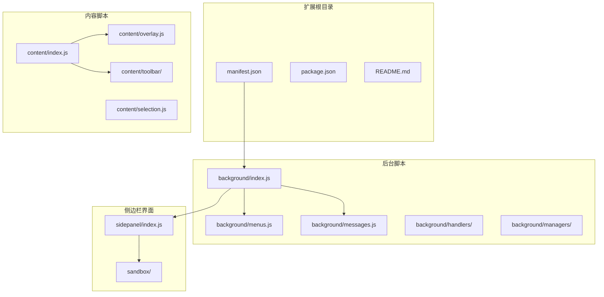

**图表来源**
- [manifest.json](file://manifest.json#L1-L93)
- [background/index.js](file://background/index.js#L1-L30)
- [content/index.js](file://content/index.js#L1-L190)

**章节来源**
- [manifest.json](file://manifest.json#L1-L93)
- [background/index.js](file://background/index.js#L1-L30)

## 核心组件

### Chrome扩展权限管理

项目在manifest.json中声明了必要的权限，遵循最小权限原则：

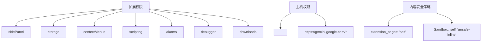

**图表来源**
- [manifest.json](file://manifest.json#L6-L10)
- [manifest.json](file://manifest.json#L89-L92)

### 命令系统（Command API）

项目实现了基于快捷键的命令系统，特别是Alt+S激活侧边栏的功能：

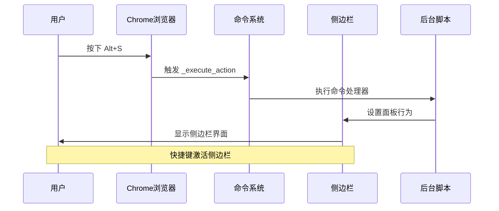

**图表来源**
- [manifest.json](file://manifest.json#L25-L33)
- [background/index.js](file://background/index.js#L13-L14)

**章节来源**
- [manifest.json](file://manifest.json#L6-L33)
- [background/index.js](file://background/index.js#L13-L29)

## 架构概览

扩展采用了分层架构设计，各组件职责明确：

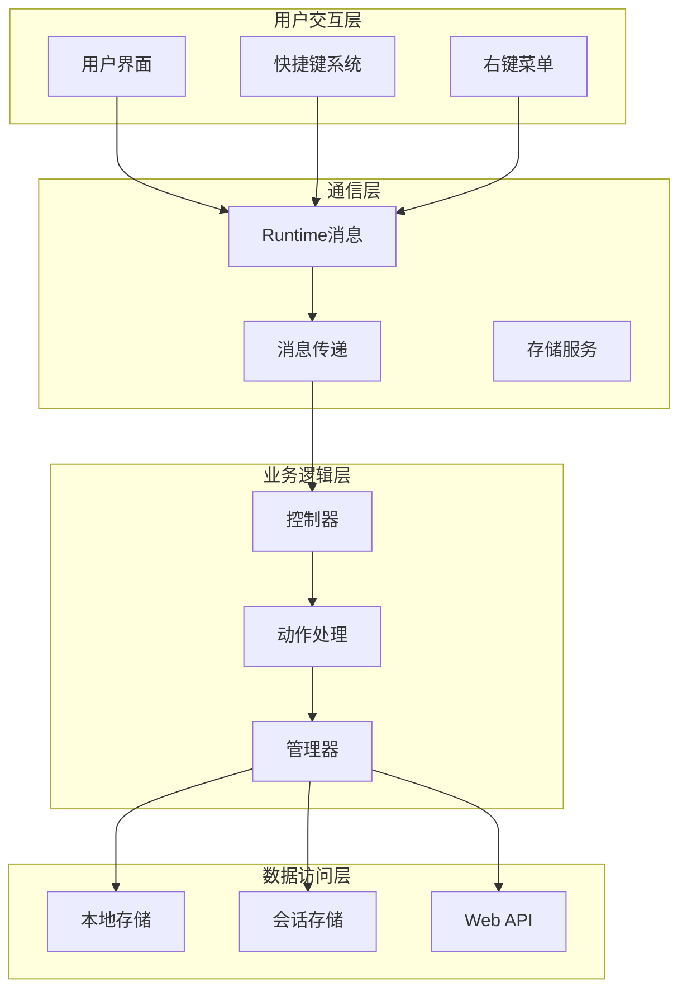

**图表来源**
- [content/index.js](file://content/index.js#L117-L152)
- [sidepanel/index.js](file://sidepanel/index.js#L22-L37)
- [background/messages.js](file://background/messages.js#L14-L81)

## 详细组件分析

### 内容脚本注入机制

项目实现了灵活的内容脚本注入系统，支持主动生成和回退注入两种策略：

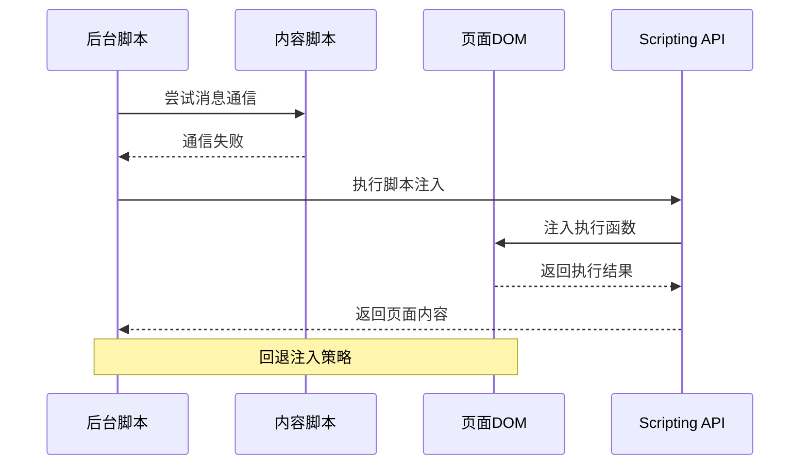

**图表来源**
- [background/handlers/session/utils.js](file://background/handlers/session/utils.js#L41-L58)

#### 注入策略实现

项目实现了两阶段注入策略：

1. **优先策略**：尝试通过消息通信获取页面内容
2. **回退策略**：使用chrome.scripting.executeScript进行脚本注入

这种设计确保了在内容脚本不可用时仍能获取页面信息。

**章节来源**
- [background/handlers/session/utils.js](file://background/handlers/session/utils.js#L23-L63)

### 右键菜单系统

扩展提供了完整的右键菜单功能，支持多种操作模式：

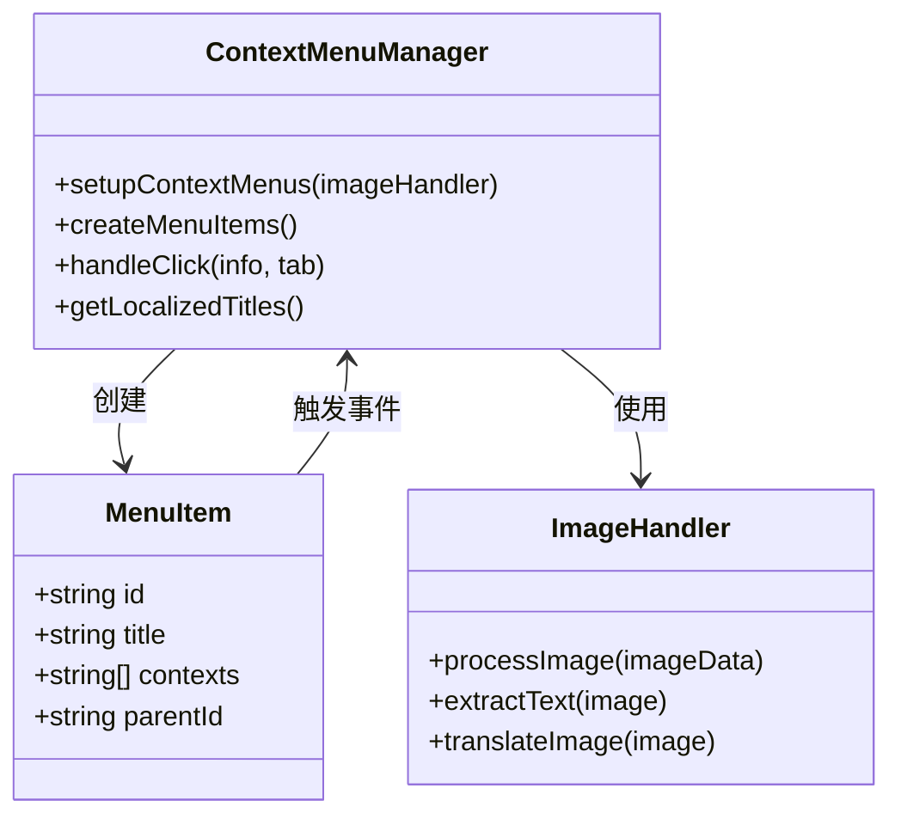

**图表来源**
- [background/menus.js](file://background/menus.js#L8-L95)

#### 菜单功能特性

右键菜单支持以下功能：
- 快速提问（Quick Ask）
- 与当前网页对话（Chat with Page）
- OCR文字提取
- 截图翻译
- 区域截图（Snip）

**章节来源**
- [background/menus.js](file://background/menus.js#L1-L95)

### 存储系统架构

项目使用chrome.storage API实现配置的持久化存储：

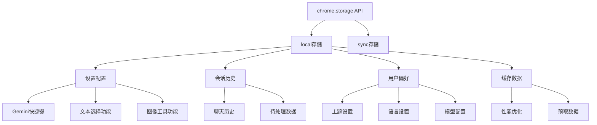

**图表来源**
- [content/index.js](file://content/index.js#L117-L152)
- [sidepanel/index.js](file://sidepanel/index.js#L22-L37)

#### 存储配置示例

项目使用以下存储键值：
- `geminiShortcuts`: 自定义快捷键配置
- `geminiTextSelectionEnabled`: 文本选择功能开关
- `geminiImageToolsEnabled`: 图像工具功能开关
- `geminiSessions`: 聊天会话历史
- `geminiTheme`: 主题设置
- `geminiLanguage`: 语言设置

**章节来源**
- [content/index.js](file://content/index.js#L117-L152)
- [sidepanel/index.js](file://sidepanel/index.js#L22-L37)

### 侧边栏控制机制

侧边栏作为扩展的核心界面，实现了复杂的控制逻辑：

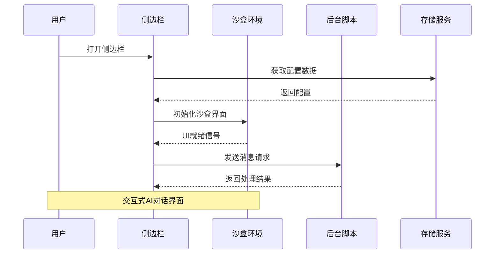

**图表来源**
- [sidepanel/index.js](file://sidepanel/index.js#L1-L137)

#### 侧边栏功能特性

侧边栏提供了以下核心功能：
- 实时AI对话界面
- 会话历史管理
- 配置参数设置
- 图像处理工具
- 下载和导出功能

**章节来源**
- [sidepanel/index.js](file://sidepanel/index.js#L1-L425)

### 内容脚本交互系统

内容脚本负责与页面元素的直接交互：

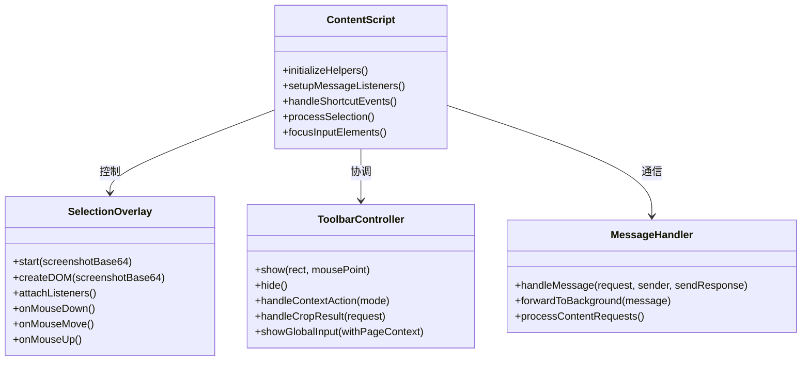

**图表来源**
- [content/index.js](file://content/index.js#L1-L190)
- [content/overlay.js](file://content/overlay.js#L1-L213)
- [content/toolbar/controller.js](file://content/toolbar/controller.js#L1-L301)

**章节来源**
- [content/index.js](file://content/index.js#L1-L190)
- [content/overlay.js](file://content/overlay.js#L1-L213)
- [content/toolbar/controller.js](file://content/toolbar/controller.js#L1-L301)

## 依赖关系分析

扩展的依赖关系体现了清晰的分层架构：

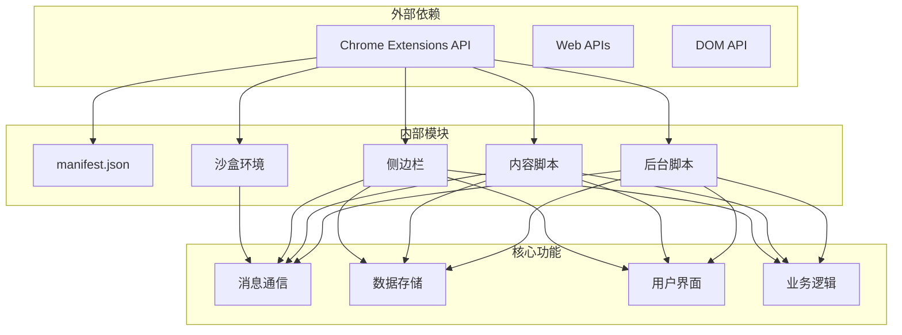

**图表来源**
- [manifest.json](file://manifest.json#L1-L93)
- [background/index.js](file://background/index.js#L1-L30)

**章节来源**
- [manifest.json](file://manifest.json#L1-L93)
- [background/index.js](file://background/index.js#L1-L30)

## 性能考虑

### 加载优化策略

项目实现了多项性能优化措施：

1. **异步数据预取**：侧边栏启动时并行获取多个配置项
2. **本地缓存机制**：使用localStorage缓存主题和语言设置
3. **懒加载策略**：按需加载功能模块
4. **事件委托优化**：减少事件监听器数量

### 内存管理

- 及时清理DOM元素和事件监听器
- 合理使用WeakMap避免内存泄漏
- 及时释放大对象引用

## 调试指南

### Chrome扩展调试工具

推荐使用以下工具进行调试：

1. **chrome://extensions** 页面
   - 查看扩展状态和权限
   - 监控API调用错误
   - 查看后台脚本日志

2. **开发者工具**
   - 后台脚本标签页查看控制台输出
   - 应用标签页检查侧边栏界面
   - 网络标签页监控API请求

### 常见问题排查

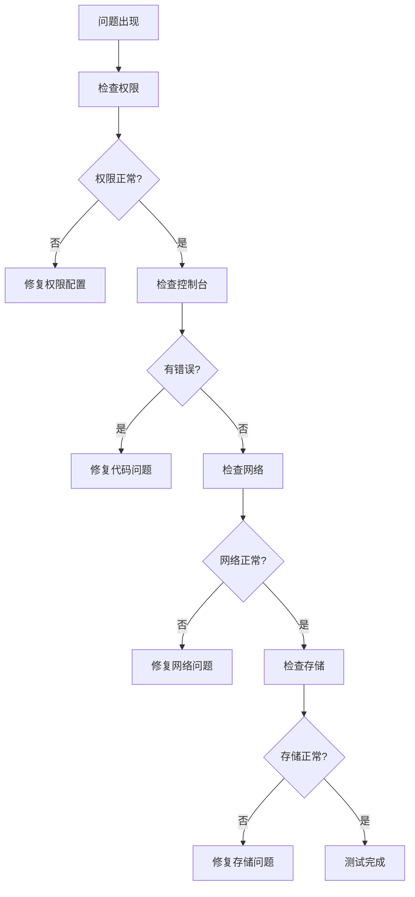

**章节来源**
- [manifest.json](file://manifest.json#L6-L10)

## 结论

本项目展示了Chrome扩展开发的最佳实践，通过合理使用Chrome API实现了功能丰富且性能优良的扩展应用。主要特点包括：

1. **权限管理**：严格遵循最小权限原则，仅申请必要权限
2. **架构设计**：采用模块化分层架构，职责清晰
3. **用户体验**：提供流畅的快捷键操作和界面交互
4. **数据持久化**：使用chrome.storage实现可靠的配置保存
5. **调试友好**：完善的错误处理和日志记录机制

该扩展为Chrome平台API的使用提供了完整的参考实现，特别适合学习和借鉴其架构设计和最佳实践。