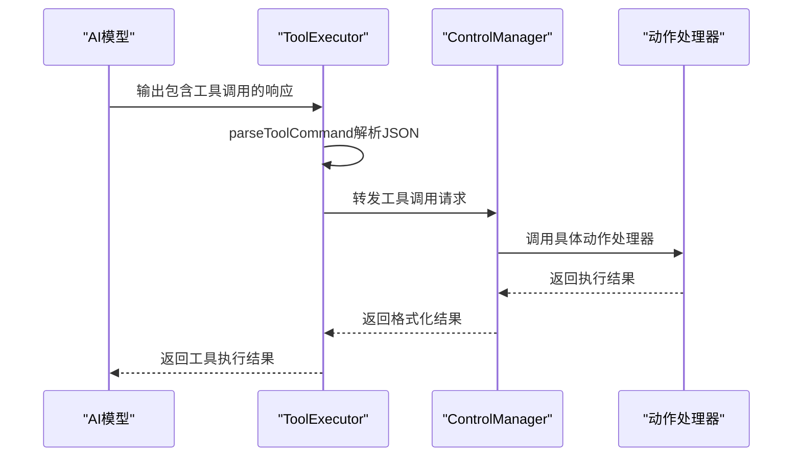
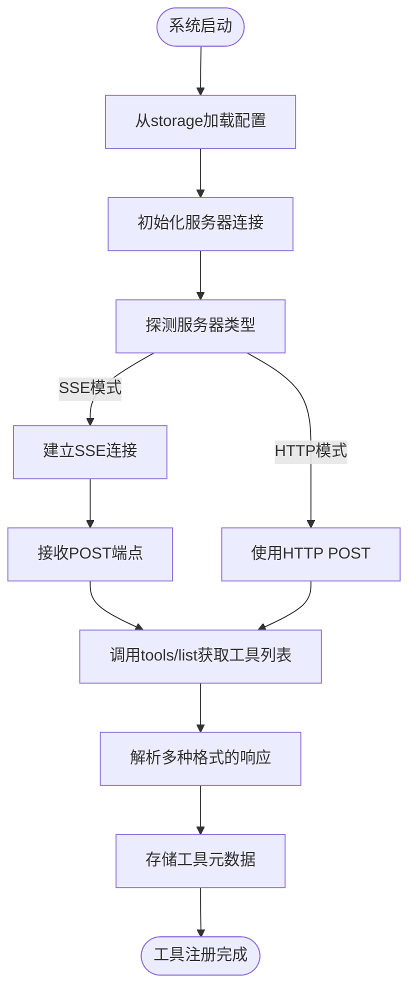
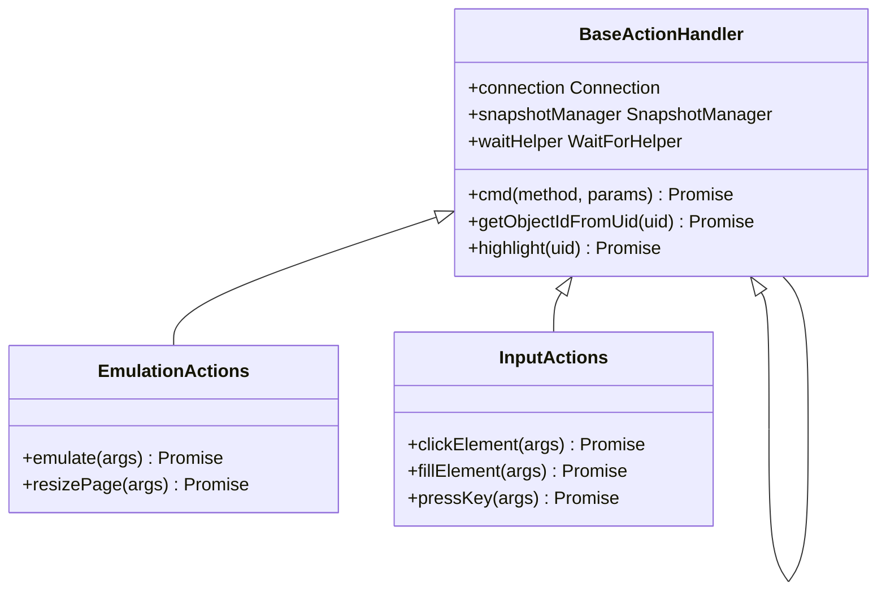
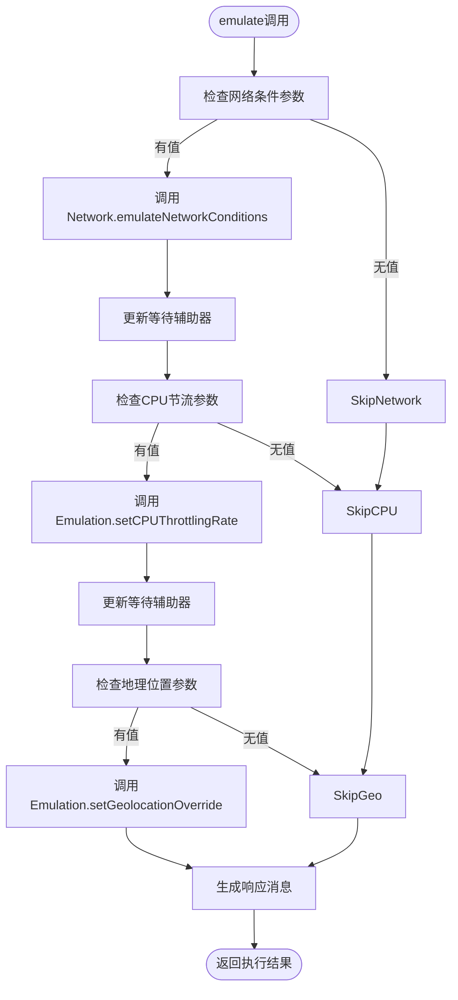
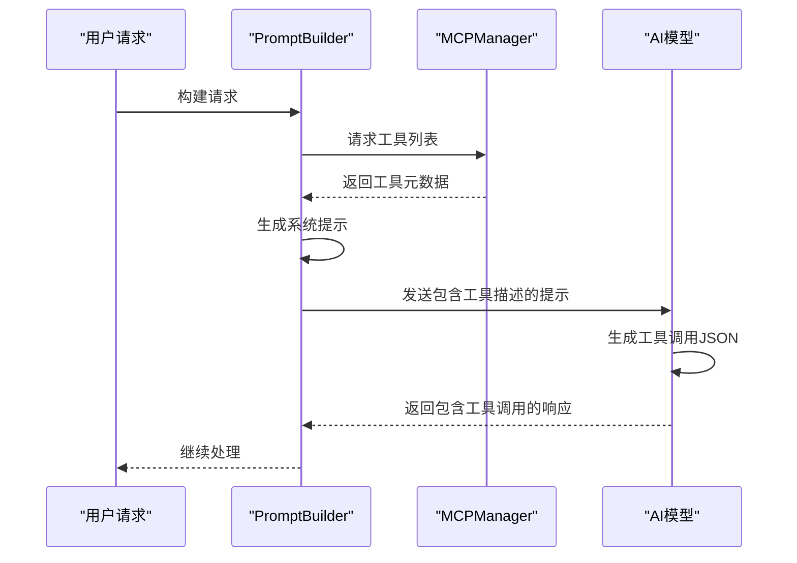
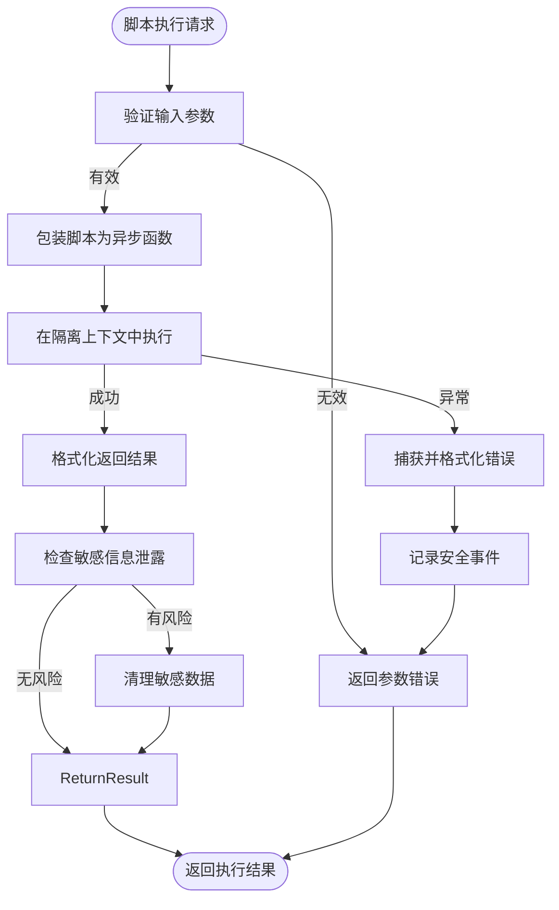

# MCP工具集成扩展

<cite>
**本文档引用文件**  
- [tool_executor.js](file://background/handlers/session/prompt/tool_executor.js)
- [emulation.js](file://background/control/actions/emulation.js)
- [builder.js](file://background/handlers/session/prompt/builder.js)
- [mcp_manager.js](file://background/managers/mcp_manager.js)
- [control_manager.js](file://background/managers/control_manager.js)
- [utils.js](file://background/handlers/session/utils.js)
- [preamble.js](file://background/handlers/session/prompt/preamble.js)
- [actions.js](file://background/control/actions.js)
- [base.js](file://background/control/actions/base.js)
- [input.js](file://background/control/actions/input.js)
</cite>

## 目录
1. [MCP工具执行机制](#mcp工具执行机制)
2. [注册MCP工具命令](#注册mcp工具命令)
3. [自定义工具处理器实现](#自定义工具处理器实现)
4. [浏览器控制能力封装示例](#浏览器控制能力封装示例)
5. [与PromptBuilder协同工作](#与promptbuilder协同工作)
6. [安全审查与沙箱环境](#安全审查与沙箱环境)

## MCP工具执行机制

MCP（Model Context Protocol）工具执行机制的核心是`ToolExecutor`类，它负责解析AI模型输出的工具调用指令并执行相应的浏览器控制操作。该机制通过`executeIfPresent`方法实现，首先调用`parseToolCommand`函数从AI响应文本中提取JSON格式的工具调用指令。

当检测到有效的工具命令时，系统会通过`ControlManager`将请求转发给相应的动作处理器。执行结果会被格式化为包含工具名称、输出内容和可能的文件附件的对象。对于返回图像数据的工具（如`take_screenshot`），系统会自动将其封装为base64编码的文件附件。

**图示来源**  
- [tool_executor.js](file://background/handlers/session/prompt/tool_executor.js#L9-L48)
- [control_manager.js](file://background/managers/control_manager.js#L43-L158)

**本节来源**  
- [tool_executor.js](file://background/handlers/session/prompt/tool_executor.js#L9-L48)
- [utils.js](file://background/handlers/session/utils.js#L4-L21)

## 注册MCP工具命令

MCP工具命令的注册和管理主要通过`MCPManager`类实现。系统启动时会从`chrome.storage.local`中加载配置，自动连接启用的服务器并初始化工具列表。工具注册支持多种传输模式，包括标准的SSE（Server-Sent Events）和HTTP模式。

工具发现通过`tools/list`方法实现，系统会尝试多种响应格式来解析工具列表，包括标准JSON-RPC格式、直接工具数组格式等。每个工具包含名称、描述和输入模式（inputSchema）等元数据，这些信息会被用于生成AI模型的系统提示。

**图示来源**  
- [mcp_manager.js](file://background/managers/mcp_manager.js#L8-L213)
- [mcp_manager.js](file://background/managers/mcp_manager.js#L287-L306)

**本节来源**  
- [mcp_manager.js](file://background/managers/mcp_manager.js#L8-L213)
- [mcp_manager.js](file://background/managers/mcp_manager.js#L287-L306)

## 自定义工具处理器实现

实现自定义工具处理器需要遵循特定的架构模式。所有动作处理器都继承自`BaseActionHandler`类，该基类提供了通用的命令发送、节点高亮和等待辅助功能。开发者可以通过创建新的动作处理器类来扩展系统功能。

工具处理器的实现包括三个关键环节：命令解析、参数验证和响应格式化。命令解析通过`parseToolCommand`函数完成，该函数使用正则表达式匹配JSON代码块中的工具调用。参数验证在各个动作处理器的方法中实现，确保输入参数的完整性和正确性。响应格式化则根据具体需求返回文本结果或包含文件附件的结构化结果。

**图示来源**  
- [base.js](file://background/control/actions/base.js#L5-L64)
- [emulation.js](file://background/control/actions/emulation.js#L13-L65)
- [input.js](file://background/control/actions/input.js#L8-L62)

**本节来源**  
- [base.js](file://background/control/actions/base.js#L5-L64)
- [emulation.js](file://background/control/actions/emulation.js#L13-L65)
- [input.js](file://background/control/actions/input.js#L8-L62)

## 浏览器控制能力封装示例

以`emulation.js`中的输入模拟功能为例，展示了如何将浏览器控制能力封装为可调用工具。`EmulationActions`类提供了网络条件模拟、CPU节流和地理位置覆盖等功能，这些功能通过Chrome DevTools Protocol（CDP）命令实现。

网络条件模拟功能预定义了多种标准配置（如"Slow 3G"、"Fast 4G"），并根据选择的配置调整下载吞吐量、上传吞吐量和延迟参数。CPU节流功能通过`Emulation.setCPUThrottlingRate`命令实现，可以模拟不同性能级别的设备。地理位置覆盖功能允许设置自定义的经纬度坐标，用于测试基于位置的服务。

**图示来源**  
- [emulation.js](file://background/control/actions/emulation.js#L14-L65)
- [base.js](file://background/control/actions/base.js#L14-L16)

**本节来源**  
- [emulation.js](file://background/control/actions/emulation.js#L14-L65)
- [base.js](file://background/control/actions/base.js#L14-L16)

## 与PromptBuilder协同工作

`PromptBuilder`与工具系统紧密协作，确保AI模型能够正确理解和使用可用工具。当启用浏览器控制时，系统会注入包含所有可用工具描述的系统前言（preamble），指导AI如何格式化工具调用请求。

工具描述信息通过`MCPManager`的`getSystemPrompt`方法生成，该方法收集所有已连接服务器的工具元数据，包括名称、描述和参数模式。生成的提示词明确说明了工具调用的格式要求，即必须使用特定的JSON代码块格式，并在输出工具调用后停止生成。

**图示来源**  
- [builder.js](file://background/handlers/session/prompt/builder.js#L10-L44)
- [mcp_manager.js](file://background/managers/mcp_manager.js#L407-L477)
- [preamble.js](file://background/handlers/session/prompt/preamble.js#L4-L109)

**本节来源**  
- [builder.js](file://background/handlers/session/prompt/builder.js#L10-L44)
- [mcp_manager.js](file://background/managers/mcp_manager.js#L407-L477)
- [preamble.js](file://background/handlers/session/prompt/preamble.js#L4-L109)

## 安全审查与沙箱环境

系统实施了多层次的安全审查机制来防止恶意脚本执行。对于`evaluate_script`和`run_javascript`等执行JavaScript的工具，系统通过包装在异步IIFE（立即调用函数表达式）中来限制作用域，并使用try-catch块捕获和返回错误信息。

关键的安全措施包括：在沙箱环境中执行用户提供的脚本、验证输入参数的有效性、限制对敏感API的访问，以及使用内容安全策略（CSP）防止跨站脚本攻击。`WaitForHelper`类还提供了DOM稳定性检测，防止在页面加载过程中执行可能导致不稳定状态的操作。

**图示来源**  
- [observation.js](file://background/control/actions/observation.js#L57-L96)
- [wait_helper.js](file://background/control/wait_helper.js#L100-L121)
- [app.js](file://sandbox/boot/app.js#L1-L90)

**本节来源**  
- [observation.js](file://background/control/actions/observation.js#L57-L96)
- [wait_helper.js](file://background/control/wait_helper.js#L100-L121)
- [app.js](file://sandbox/boot/app.js#L1-L90)