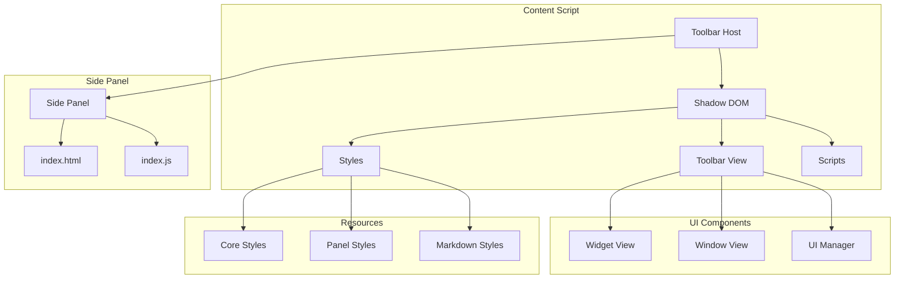
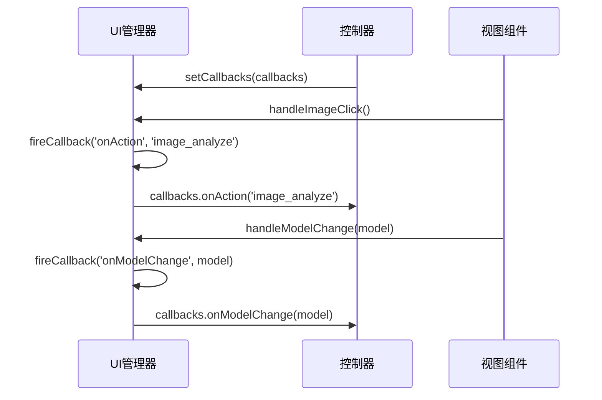
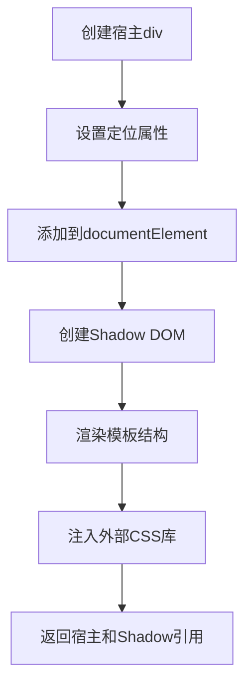
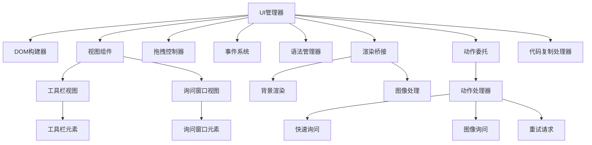

# UI组件扩展指南

<cite>
**本文档引用的文件**
- [manager.js](file://content/toolbar/ui/manager.js)
- [i18n.js](file://content/toolbar/i18n.js)
- [icons.js](file://content/toolbar/icons.js)
- [dom.js](file://content/toolbar/view/dom.js)
- [widget.js](file://content/toolbar/view/widget.js)
- [window.js](file://content/toolbar/view/window.js)
- [index.js](file://content/toolbar/view/index.js)
- [core.js](file://content/toolbar/styles/core.js)
- [manifest.json](file://manifest.json)
- [actions.js](file://content/toolbar/actions.js)
</cite>

## 目录
1. [简介](#简介)
2. [项目结构](#项目结构)
3. [核心组件](#核心组件)
4. [架构概述](#架构概述)
5. [详细组件分析](#详细组件分析)
6. [依赖分析](#依赖分析)
7. [性能考虑](#性能考虑)
8. [故障排除指南](#故障排除指南)
9. [结论](#结论)

## 简介
本指南详细介绍了如何在Chrome扩展程序中扩展UI组件，重点介绍在内容脚本工具栏中添加新按钮的完整路径。文档涵盖了DOM注入、事件绑定和样式隔离等关键技术，以及通过chrome.sidePanel API扩展侧边栏界面的流程。以toolbar/manager.js为例，展示了组件生命周期管理和状态同步机制。同时提供React与Vanilla JS两种实现模式的对比建议，并强调无障碍访问（a11y）和响应式设计要求，确保扩展元素与原生UI风格一致。文档还包含图标资源规范和多语言支持（i18n）集成方法。

## 项目结构
该项目是一个功能完整的Chrome扩展程序，采用模块化架构设计。核心UI功能集中在content/toolbar目录下，通过多个子模块协同工作实现复杂的用户界面交互。样式系统采用JavaScript注入方式，确保样式隔离和动态加载。整个项目遵循清晰的分层架构，将视图、控制器、样式和工具函数分离，便于维护和扩展。



**图表来源**
- [dom.js](file://content/toolbar/view/dom.js#L6-L25)
- [index.js](file://content/toolbar/view/index.js#L8-L17)
- [manifest.json](file://manifest.json#L34-L36)

**本节来源**
- [manifest.json](file://manifest.json#L1-L93)
- [dom.js](file://content/toolbar/view/dom.js#L1-L50)

## 核心组件
核心UI组件采用分层架构设计，由UI管理器统一协调。管理器负责组件生命周期、视图编排和公共接口的提供。通过依赖注入模式，将DOM构建器、视图控制器、拖拽控制器、事件系统等子组件组合在一起，实现高内聚低耦合的设计。状态同步通过回调函数机制实现，确保UI变化能够及时通知到控制器层。

**本节来源**
- [manager.js](file://content/toolbar/ui/manager.js#L21-L277)
- [view/index.js](file://content/toolbar/view/index.js#L8-L132)

## 架构概述
系统采用经典的MVC模式变体，将数据、视图和控制逻辑分离。UI管理器作为控制器层，协调视图组件和数据模型之间的交互。视图层进一步分为工具栏视图和询问窗口视图，分别处理浮动工具栏和主窗口的显示逻辑。样式系统通过JavaScript动态注入CSS，确保样式隔离和按需加载。

```mermaid
classDiagram
class ToolbarUI {
+host : HTMLElement
+shadow : ShadowRoot
+view : ToolbarView
+dragController : DragController
+events : Events
+domBuilder : DOMBuilder
+callbacks : Object
+isBuilt : boolean
+build()
+show(rect, mousePoint)
+hide()
+showAskWindow(rect, contextText, title, mousePoint, gemId)
+showResult(text, title, isStreaming, images)
+setSelectedModel(model)
+setGrammarMode(enabled, sourceElement, selectionRange)
}
class ToolbarView {
+shadow : ShadowRoot
+elements : Object
+widgetView : WidgetView
+windowView : WindowView
+cacheElements()
+showToolbar(rect, mousePoint)
+hideToolbar()
+showAskWindow(rect, contextText, title, resetDrag, mousePoint)
+showResult(text, title, isStreaming, isHtml)
+setSelectedModel(model)
}
class ToolbarDOM {
+host : HTMLElement
+shadow : ShadowRoot
+create()
+_render()
+_loadMathLibs()
}
class WidgetView {
+elements : Object
+showToolbar(rect, mousePoint)
+hideToolbar()
+showImageButton(rect)
+hideImageButton()
+toggleCopySelectionIcon(success)
}
class WindowView {
+elements : Object
+isPinned : boolean
+togglePin()
+show(rect, contextText, title, resetDrag, mousePoint, gemId)
+hide()
+showLoading(msg)
+showResult(htmlContent, title, isStreaming)
+updateStreamingState(isStreaming)
+setError(text)
+dockWindow(side, top)
+undockWindow()
}
ToolbarUI --> ToolbarView : "使用"
ToolbarUI --> ToolbarDOM : "使用"
ToolbarUI --> DragController : "使用"
ToolbarUI --> Events : "使用"
ToolbarView --> WidgetView : "包含"
ToolbarView --> WindowView : "包含"
ToolbarDOM --> "Shadow DOM" : "创建"
```

**图表来源**
- [manager.js](file://content/toolbar/ui/manager.js#L21-L277)
- [view/index.js](file://content/toolbar/view/index.js#L8-L132)
- [view/widget.js](file://content/toolbar/view/widget.js#L9-L59)
- [view/window.js](file://content/toolbar/view/window.js#L14-L188)

## 详细组件分析
### UI管理器分析
UI管理器是整个工具栏系统的核心协调者，负责组件的初始化、生命周期管理和公共API的提供。它采用构造函数模式创建实例，并通过build()方法延迟初始化各个子组件。这种设计模式实现了按需加载和资源优化。

#### 组件生命周期管理
```mermaid
flowchart TD
A[创建UI管理器实例] --> B[调用build()方法]
B --> C[创建DOM宿主和Shadow DOM]
C --> D[初始化视图组件]
D --> E[初始化子管理器]
E --> F[初始化拖拽控制器]
F --> G[初始化事件系统]
G --> H[绑定事件处理器]
H --> I[标记为已构建]
I --> J[提供公共API]
```

**图表来源**
- [manager.js](file://content/toolbar/ui/manager.js#L44-L93)

#### 状态同步机制
UI管理器通过回调函数机制实现状态同步，允许控制器层监听UI事件。这种设计模式解耦了UI组件和业务逻辑，提高了代码的可测试性和可维护性。



**图表来源**
- [manager.js](file://content/toolbar/ui/manager.js#L107-L131)

### DOM注入与样式隔离
系统采用Shadow DOM技术实现样式隔离，确保扩展的样式不会影响页面原有样式，同时页面样式也不会影响扩展UI。

#### DOM注入流程


**图表来源**
- [dom.js](file://content/toolbar/view/dom.js#L12-L25)

#### 样式隔离实现
系统通过JavaScript动态注入CSS样式，将所有样式规则集中管理。核心样式、面板样式、Markdown渲染样式等分别定义在不同的JavaScript文件中，通过字符串拼接的方式合并后注入Shadow DOM。

```mermaid
classDiagram
class Styles {
+Core : string
+Widget : string
+Panel : string
+Markdown : string
}
class DOMBuilder {
+create()
+_render()
+_loadMathLibs()
}
Styles --> DOMBuilder : "注入"
DOMBuilder --> "Shadow DOM" : "注入样式"
```

**图表来源**
- [core.js](file://content/toolbar/styles/core.js#L3-L28)
- [dom.js](file://content/toolbar/view/dom.js#L34-L45)

### 事件绑定机制
事件系统采用委托模式，将事件处理器集中绑定到视图元素上，提高性能并简化事件管理。

#### 事件绑定流程
```mermaid
flowchart TD
A[UI管理器调用build()] --> B[创建事件系统实例]
B --> C[获取所有视图元素]
C --> D[遍历元素并绑定事件]
D --> E[为每个按钮设置点击处理器]
E --> F[处理器调用UI管理器方法]
F --> G[UI管理器执行相应操作]
```

**图表来源**
- [manager.js](file://content/toolbar/ui/manager.js#L87-L90)
- [actions.js](file://content/toolbar/actions.js#L4-L196)

## 依赖分析
系统依赖关系清晰，采用模块化设计，各组件之间通过明确定义的接口进行交互。核心依赖包括DOM操作、事件处理、拖拽控制、国际化支持等。



**图表来源**
- [manager.js](file://content/toolbar/ui/manager.js#L21-L86)
- [manifest.json](file://manifest.json#L40-L78)

**本节来源**
- [manager.js](file://content/toolbar/ui/manager.js#L1-L280)
- [manifest.json](file://manifest.json#L1-L93)

## 性能考虑
系统在性能方面做了多项优化，包括延迟加载、资源缓存、事件委托等。通过Shadow DOM实现样式隔离，避免了全局样式冲突导致的重排重绘。采用按需加载策略，只有在用户触发相应操作时才加载必要的资源。

## 故障排除指南
当UI组件无法正常显示时，首先检查manifest.json中的content_scripts配置是否正确包含所有必要的JavaScript文件。确保DOM注入没有被页面安全策略阻止，检查控制台是否有相关错误信息。对于样式问题，验证Shadow DOM中的样式是否正确注入，可以通过浏览器开发者工具检查Shadow边界内的元素样式。

**本节来源**
- [manifest.json](file://manifest.json#L40-L78)
- [dom.js](file://content/toolbar/view/dom.js#L12-L25)

## 结论
本指南详细介绍了Chrome扩展UI组件的扩展方法，涵盖了从DOM注入到事件绑定的完整技术栈。通过分析toolbar/manager.js的实现，展示了组件生命周期管理和状态同步的最佳实践。系统采用模块化设计，确保了代码的可维护性和可扩展性。对于新功能的添加，建议遵循相同的架构模式，保持代码风格的一致性。