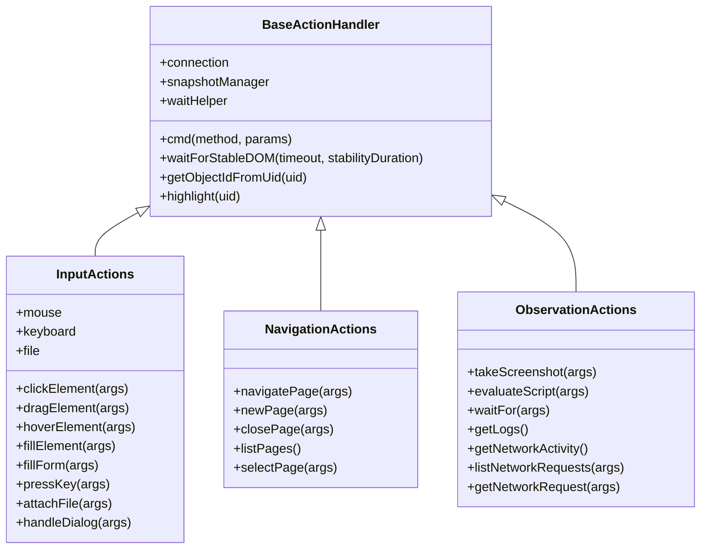
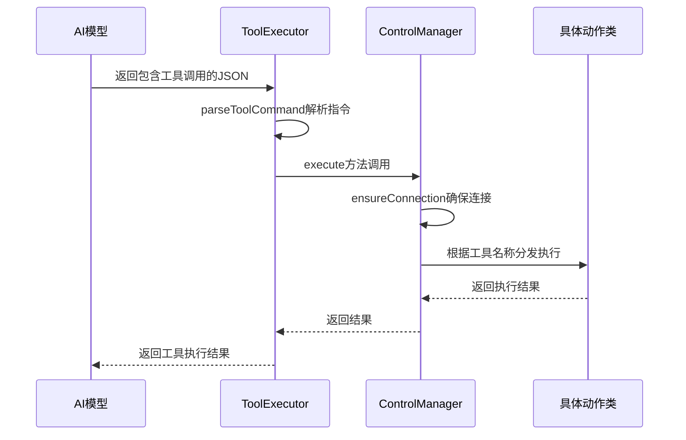
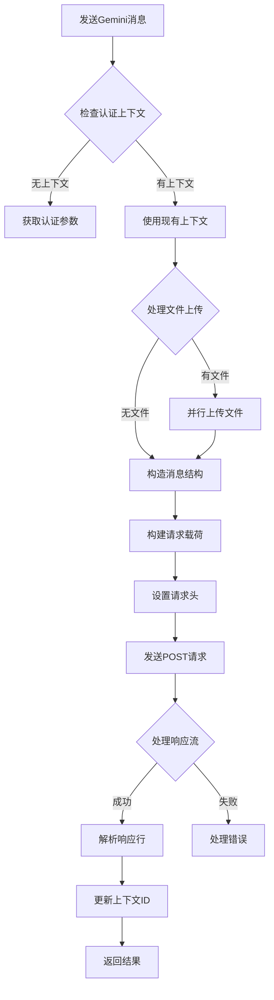
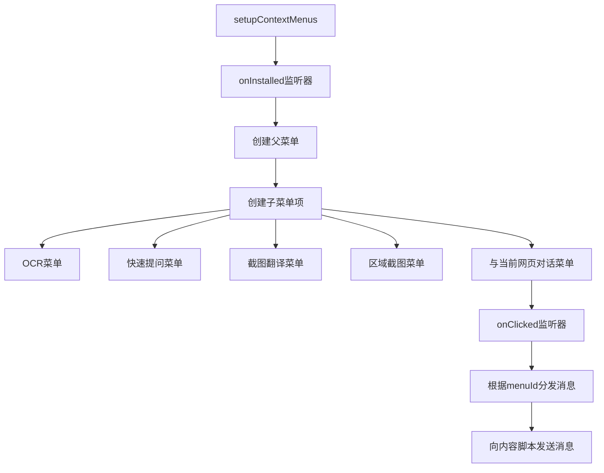
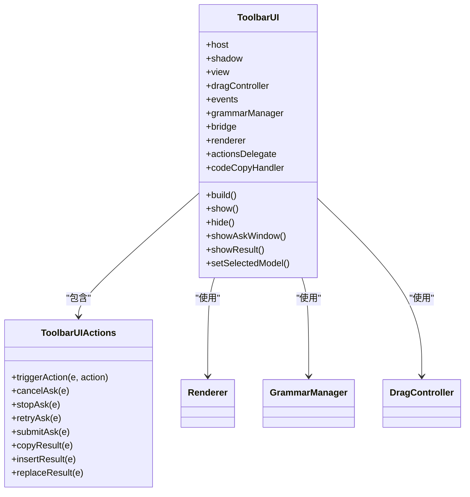

# 功能扩展开发指南

<cite>
**本文档引用的文件**
- [base.js](file://background/control/actions/base.js)
- [input.js](file://background/control/actions/input.js)
- [navigation.js](file://background/control/actions/navigation.js)
- [observation.js](file://background/control/actions/observation.js)
- [actions.js](file://background/control/actions.js)
- [control_manager.js](file://background/managers/control_manager.js)
- [tool_executor.js](file://background/handlers/session/prompt/tool_executor.js)
- [utils.js](file://background/handlers/session/utils.js)
- [gemini_api.js](file://services/gemini_api.js)
- [menus.js](file://background/menus.js)
- [manager.js](file://content/toolbar/ui/manager.js)
- [actions_delegate.js](file://content/toolbar/ui/actions_delegate.js)
- [manifest.json](file://manifest.json)
</cite>

## 目录
1. [引言](#引言)
2. [新功能添加与控制动作创建](#新功能添加与控制动作创建)
3. [AI工具接口扩展](#ai工具接口扩展)
4. [大模型API集成](#大模型api集成)
5. [脚本注入与右键菜单扩展](#脚本注入与右键菜单扩展)
6. [UI组件扩展](#ui组件扩展)
7. [扩展安全性审查](#扩展安全性审查)

## 引言
本指南旨在为开发者提供系统性的功能扩展开发指导，涵盖新功能添加、控制动作创建、外部服务集成等核心方面。通过分析项目架构和关键组件，本文将详细说明如何基于现有模板扩展功能，确保开发者能够高效、安全地进行二次开发。

## 新功能添加与控制动作创建

本项目采用模块化的控制动作系统，所有动作类均继承自`base.js`中的`BaseActionHandler`基类。开发者可通过创建新的动作类并将其集成到动作系统中来扩展功能。



**图示来源**
- [base.js](file://background/control/actions/base.js#L5-L63)
- [input.js](file://background/control/actions/input.js#L8-L61)
- [navigation.js](file://background/control/actions/navigation.js#L5-L60)
- [observation.js](file://background/control/actions/observation.js#L5-L199)

**新动作类定义流程：**
1. 创建新的动作文件，继承`BaseActionHandler`类
2. 在构造函数中调用`super()`初始化基类
3. 实现具体的功能方法，可使用`this.cmd()`方法发送Chrome DevTools协议命令
4. 在`actions.js`中导入新动作类并添加到`BrowserActions`构造函数中
5. 在`control_manager.js`的`execute`方法中添加对应的动作处理逻辑

**Section sources**
- [base.js](file://background/control/actions/base.js#L5-L63)
- [actions.js](file://background/control/actions.js#L13-L54)
- [control_manager.js](file://background/managers/control_manager.js#L11-L158)

## AI工具接口扩展

项目的MCP（Model Control Protocol）工具调用机制由`tool_executor.js`实现，通过解析AI返回的JSON指令来执行相应的控制动作。



**图示来源**
- [tool_executor.js](file://background/handlers/session/prompt/tool_executor.js#L4-L48)
- [control_manager.js](file://background/managers/control_manager.js#L11-L158)
- [utils.js](file://background/handlers/session/utils.js#L4-L20)

**工具扩展步骤：**
1. 在`control_manager.js`的`execute`方法的`switch`语句中添加新的`case`分支
2. 调用相应的动作类方法处理请求
3. 确保返回格式符合要求（字符串或包含`text`和`image`字段的对象）
4. 在AI提示词中定义新的工具调用格式

**Section sources**
- [tool_executor.js](file://background/handlers/session/prompt/tool_executor.js#L4-L48)
- [control_manager.js](file://background/managers/control_manager.js#L42-L157)
- [utils.js](file://background/handlers/session/utils.js#L4-L20)

## 大模型API集成

`gemini_api.js`文件提供了与Gemini API交互的完整封装，采用批处理执行（Batchexecute）风格的端点进行通信。该模式可作为集成其他大模型API的标准参考。



**图示来源**
- [gemini_api.js](file://services/gemini_api.js#L26-L229)

**API集成标准方法：**
1. 创建新的服务文件（如`other_model_api.js`）
2. 定义模型配置常量（类似`MODEL_CONFIGS`）
3. 实现统一的请求发送函数，包含：
   - 认证处理
   - 文件上传支持
   - 请求载荷构造
   - 请求头设置
   - 流式响应处理
4. 错误处理应包含会话过期、频率限制等常见情况
5. 返回标准化的结果对象

**Section sources**
- [gemini_api.js](file://services/gemini_api.js#L7-L229)
- [auth.js](file://services/auth.js)
- [upload.js](file://services/upload.js)

## 脚本注入与右键菜单扩展

项目通过`chrome.scripting` API实现脚本注入，并通过`chrome.contextMenus` API提供右键菜单功能。

### 脚本注入实现
```javascript
// 使用chrome.scripting.executeScript进行脚本注入
await chrome.scripting.executeScript({
    target: { tabId: tab.id },
    func: () => document.body ? document.body.innerText : ""
});
```

### 右键菜单扩展
`menus.js`文件定义了右键菜单的创建和点击处理逻辑，支持多语言本地化。



**图示来源**
- [menus.js](file://background/menus.js#L8-L94)

**扩展方法：**
1. 在`setupContextMenus`函数中添加新的菜单项
2. 在`onClicked`监听器中添加对应的处理逻辑
3. 通过`chrome.tabs.sendMessage`与内容脚本通信
4. 确保支持多语言本地化

**Section sources**
- [menus.js](file://background/menus.js#L8-L94)
- [manifest.json](file://manifest.json#L6)

## UI组件扩展

UI组件主要位于`content/toolbar/ui/`目录下，采用模块化设计，各组件职责分明。

### 主要UI组件


**图示来源**
- [manager.js](file://content/toolbar/ui/manager.js#L21-L279)
- [actions_delegate.js](file://content/toolbar/ui/actions_delegate.js#L7-L75)

### 工具栏按钮扩展流程
1. 在`manager.js`的DOM构建过程中添加新的按钮元素
2. 在`actions_delegate.js`中添加对应的事件处理方法
3. 在`events.js`中绑定按钮点击事件
4. 通过`fireCallback`机制通知控制器处理动作
5. 确保按钮样式与现有UI一致

**Section sources**
- [manager.js](file://content/toolbar/ui/manager.js#L21-L279)
- [actions_delegate.js](file://content/toolbar/ui/actions_delegate.js#L7-L75)
- [manifest.json](file://manifest.json#L40-L78)

## 扩展安全性审查

为确保扩展的安全性，必须遵循CSP（内容安全策略）和权限最小化原则。

### CSP配置
```json
"content_security_policy": {
    "extension_pages": "script-src 'self'; object-src 'self'",
    "sandbox": "sandbox allow-scripts allow-forms allow-popups allow-modals; script-src 'self' 'unsafe-inline'; img-src https: http: data: blob:; media-src https: http: data: blob:;"
}
```

### 权限审查要点
1. **权限最小化**：仅请求必要的权限
   - `sidePanel`：用于侧边栏功能
   - `storage`：用于存储用户设置
   - `contextMenus`：用于右键菜单
   - `scripting`：用于脚本注入
   - `alarms`：用于定时任务
   - `debugger`：用于DevTools协议通信
   - `downloads`：用于下载文件

2. **主机权限**：限制在必要范围内
   - `https://gemini.google.com/*`：核心服务
   - `<all_urls>`：必要的页面交互

3. **安全实践**：
   - 避免使用`eval()`和`new Function()`
   - 验证所有外部输入
   - 使用异步错误处理
   - 限制敏感API的使用范围
   - 定期审查依赖项安全性

**Section sources**
- [manifest.json](file://manifest.json#L6-L92)
- [content/toolbar/controller.js](file://content/toolbar/controller.js)
- [background/index.js](file://background/index.js)