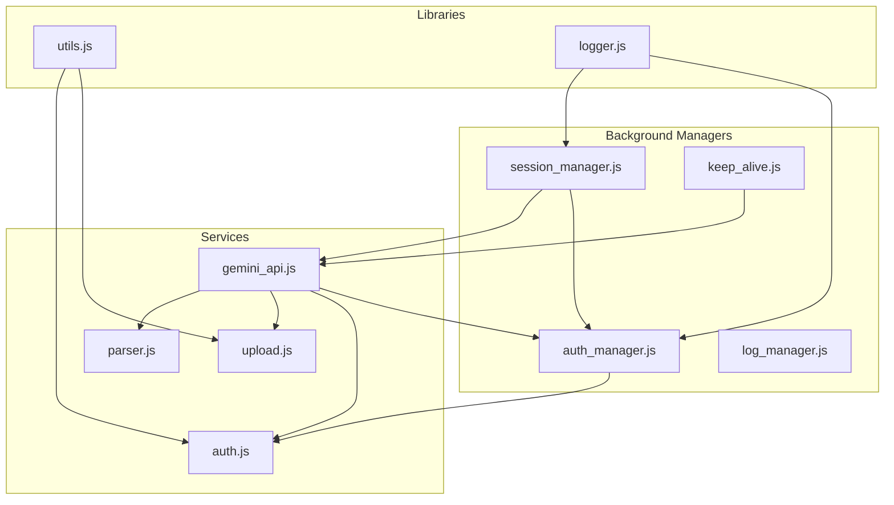
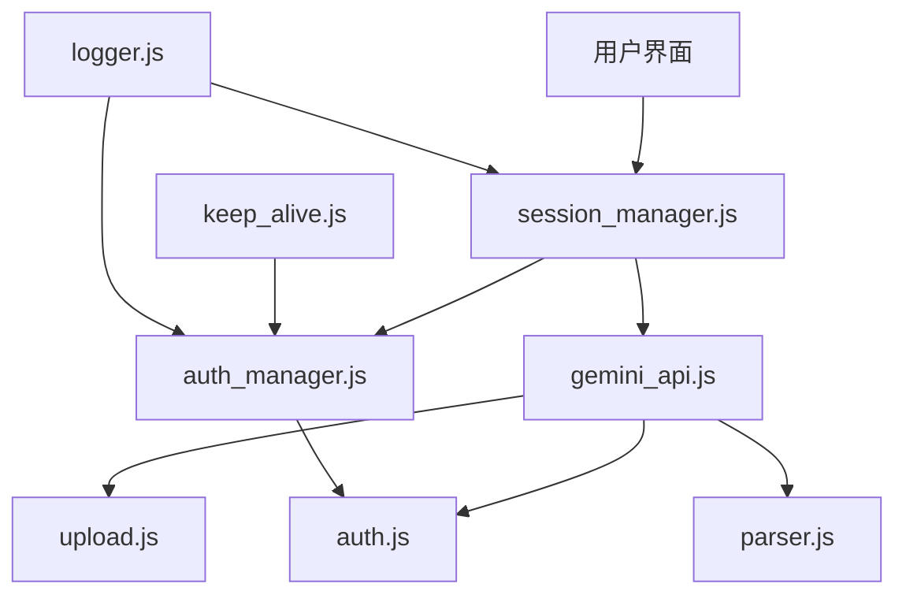
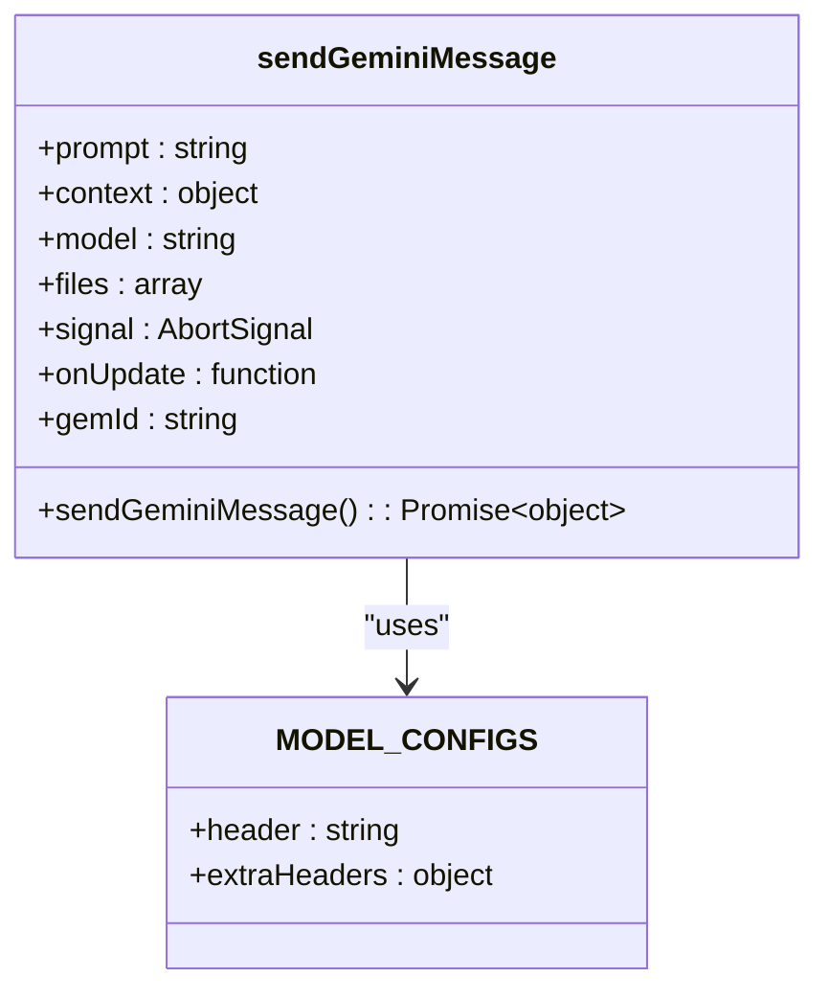
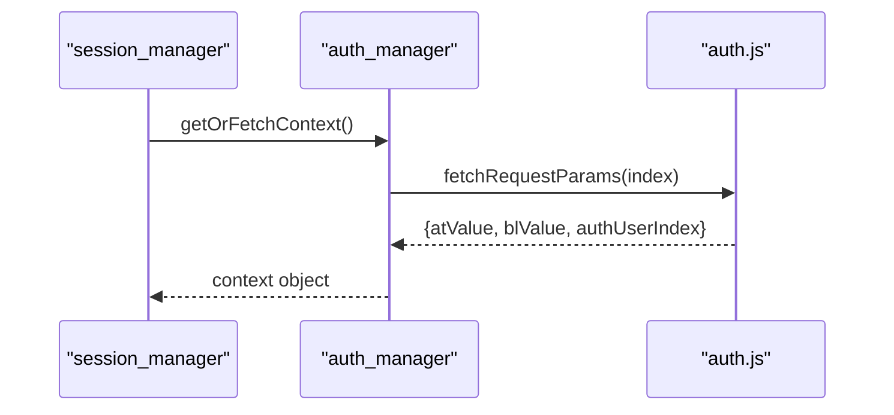
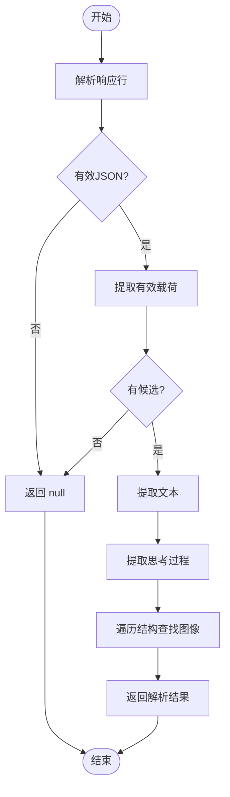
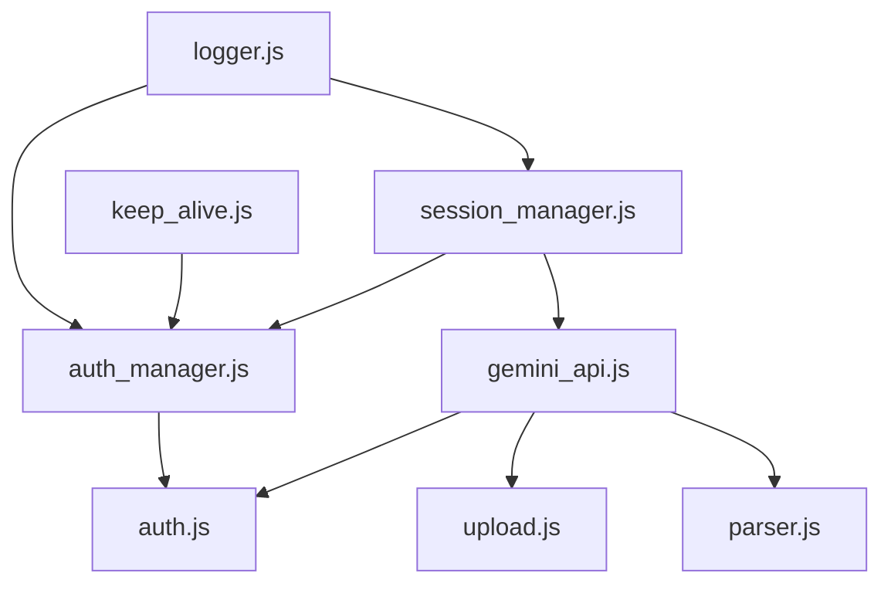

# 外部API服务集成

<cite>
**本文档引用的文件**  
- [gemini_api.js](file://services/gemini_api.js)
- [auth.js](file://services/auth.js)
- [auth_manager.js](file://background/managers/auth_manager.js)
- [parser.js](file://services/parser.js)
- [upload.js](file://services/upload.js)
- [session_manager.js](file://background/managers/session_manager.js)
- [logger.js](file://lib/logger.js)
- [utils.js](file://lib/utils.js)
- [keep_alive.js](file://background/managers/keep_alive.js)
</cite>

## 目录
1. [简介](#简介)
2. [项目结构](#项目结构)
3. [核心组件](#核心组件)
4. [架构概述](#架构概述)
5. [详细组件分析](#详细组件分析)
6. [依赖分析](#依赖分析)
7. [性能考虑](#性能考虑)
8. [故障排除指南](#故障排除指南)
9. [结论](#结论)

## 简介
本文档旨在基于 `gemini_api.js` 的封装模式，提供集成其他大模型API的标准方法论。文档将详细说明如何抽象请求参数、处理认证（参考 `auth.js`）、构造请求体和解析流式响应。同时，指导开发者适配不同API的速率限制、错误码和数据格式，并以Gemini多模型支持为例，展示如何设计可扩展的API配置系统。文档还包含超时处理、重试策略和日志记录的最佳实践，强调与现有 `AuthManager` 的集成路径，确保用户凭证的安全存储和自动刷新。

## 项目结构
项目采用模块化设计，主要分为 `background`、`content`、`services` 和 `lib` 等目录。`services` 目录包含与外部API交互的核心逻辑，如 `gemini_api.js` 和 `auth.js`。`background` 目录中的 `managers` 子目录负责管理会话、认证和日志等核心功能。`lib` 目录提供通用工具函数，如日志记录和数据转换。

**图示来源**
- [gemini_api.js](file://services/gemini_api.js)
- [auth_manager.js](file://background/managers/auth_manager.js)
- [session_manager.js](file://background/managers/session_manager.js)

**本节来源**
- [gemini_api.js](file://services/gemini_api.js)
- [auth_manager.js](file://background/managers/auth_manager.js)

## 核心组件
`gemini_api.js` 是外部API集成的核心，负责发送请求、处理认证和解析响应。`auth.js` 提供认证令牌的获取和刷新功能。`auth_manager.js` 管理用户会话和认证状态。`parser.js` 负责解析流式响应，提取文本、思考过程和生成的图像。`upload.js` 处理文件上传，支持多模态输入。

**本节来源**
- [gemini_api.js](file://services/gemini_api.js#L1-L230)
- [auth.js](file://services/auth.js#L1-L41)
- [auth_manager.js](file://background/managers/auth_manager.js#L1-L130)

## 架构概述
系统架构采用分层设计，上层为UI和业务逻辑，下层为API服务和认证管理。`session_manager.js` 作为协调者，调用 `gemini_api.js` 发送请求，并通过 `auth_manager.js` 确保认证状态有效。`keep_alive.js` 定期刷新认证令牌，防止会话过期。

**图示来源**
- [session_manager.js](file://background/managers/session_manager.js)
- [gemini_api.js](file://services/gemini_api.js)
- [auth_manager.js](file://background/managers/auth_manager.js)

## 详细组件分析

### Gemini API 封装分析
`gemini_api.js` 封装了与Gemini API的交互，支持多模型选择和文件上传。它通过 `MODEL_CONFIGS` 对象定义不同模型的配置，包括请求头和额外参数。`sendGeminiMessage` 函数负责构造请求体、处理文件上传、发送请求和解析流式响应。

**图示来源**
- [gemini_api.js](file://services/gemini_api.js#L7-L230)

### 认证管理分析
`auth_manager.js` 管理用户认证状态，支持多账户切换和自动刷新。它通过 `fetchRequestParams` 从 `auth.js` 获取认证令牌，并在会话过期时自动旋转账户。

**图示来源**
- [auth_manager.js](file://background/managers/auth_manager.js#L75-L92)
- [auth.js](file://services/auth.js#L7-L40)

### 流式响应解析分析
`parser.js` 解析Gemini API的流式响应，提取文本、思考过程和生成的图像。它采用深度遍历策略，从复杂的JSON结构中提取图像URL。

**图示来源**
- [parser.js](file://services/parser.js#L4-L157)

**本节来源**
- [gemini_api.js](file://services/gemini_api.js#L1-L230)
- [auth.js](file://services/auth.js#L1-L41)
- [parser.js](file://services/parser.js#L1-L157)
- [upload.js](file://services/upload.js#L1-L40)

## 依赖分析
系统依赖关系清晰，`gemini_api.js` 依赖 `auth.js`、`upload.js` 和 `parser.js`。`session_manager.js` 依赖 `auth_manager.js` 和 `gemini_api.js`。`auth_manager.js` 依赖 `auth.js` 进行认证令牌的获取。

**图示来源**
- [gemini_api.js](file://services/gemini_api.js)
- [session_manager.js](file://background/managers/session_manager.js)
- [auth_manager.js](file://background/managers/auth_manager.js)

**本节来源**
- [gemini_api.js](file://services/gemini_api.js)
- [session_manager.js](file://background/managers/session_manager.js)
- [auth_manager.js](file://background/managers/auth_manager.js)

## 性能考虑
系统通过并行上传文件、缓存认证令牌和定期刷新会话来优化性能。`keep_alive.js` 的定时任务确保认证令牌在过期前刷新，避免了请求时的延迟。

## 故障排除指南
常见问题包括认证失败、速率限制和响应解析失败。系统通过多账户旋转和错误码映射提供自动恢复机制。例如，当收到401或403错误时，系统会清除本地上下文并提示用户重新登录。

**本节来源**
- [session_manager.js](file://background/managers/session_manager.js#L129-L192)
- [keep_alive.js](file://background/managers/keep_alive.js#L82-L93)

## 结论
本文档详细介绍了基于 `gemini_api.js` 的外部API服务集成方法论。通过模块化设计和清晰的依赖关系，系统实现了高效、安全的API交互。未来可扩展支持更多大模型，并进一步优化错误处理和性能。