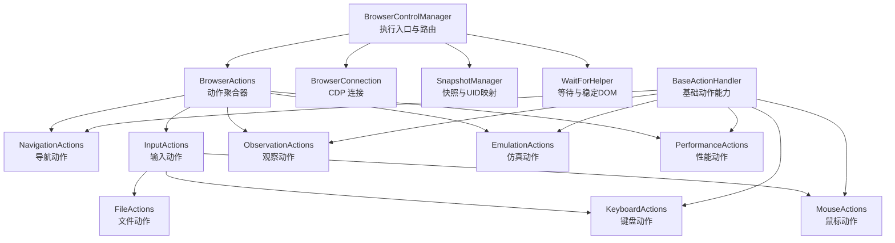
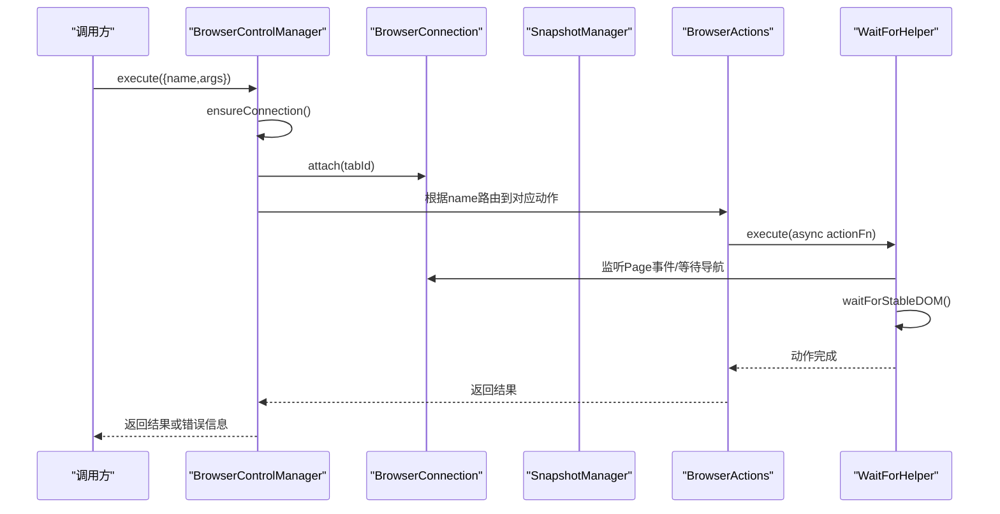
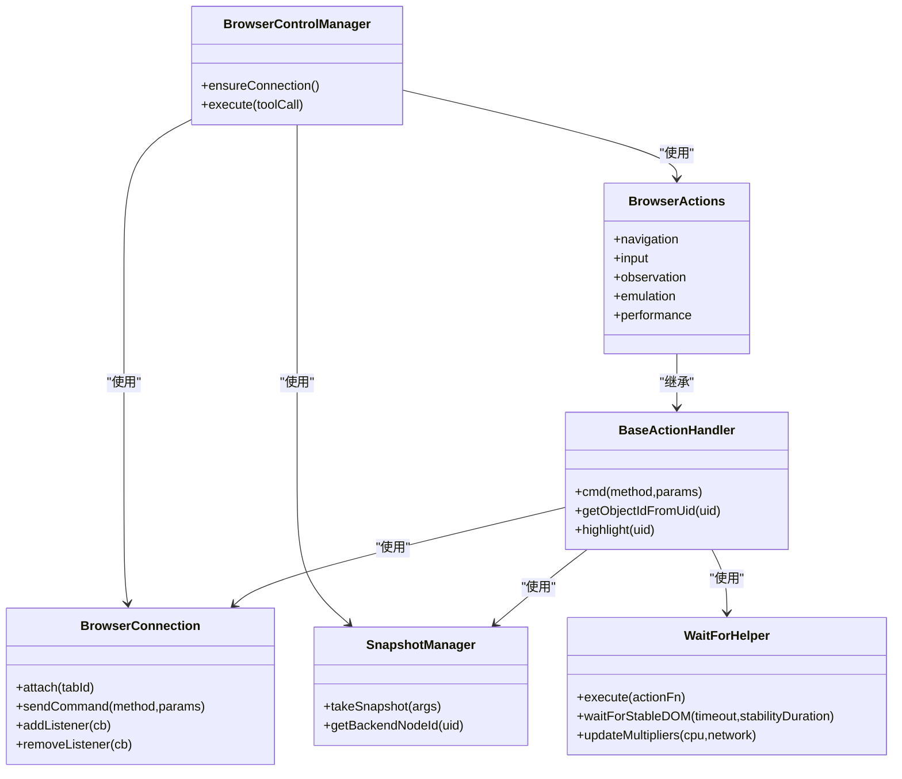
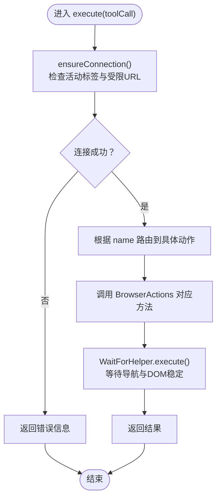

# 控制动作扩展开发

<cite>
**本文档引用的文件**
- [base.js](file://background/control/actions/base.js)
- [control_manager.js](file://background/managers/control_manager.js)
- [actions.js](file://background/control/actions.js)
- [input.js](file://background/control/actions/input.js)
- [navigation.js](file://background/control/actions/navigation.js)
- [observation.js](file://background/control/actions/observation.js)
- [mouse.js](file://background/control/actions/input/mouse.js)
- [keyboard.js](file://background/control/actions/input/keyboard.js)
- [wait_helper.js](file://background/control/wait_helper.js)
- [connection.js](file://background/control/connection.js)
- [snapshot.js](file://background/control/snapshot.js)
- [emulation.js](file://background/control/actions/emulation.js)
- [performance.js](file://background/control/actions/performance.js)
</cite>

## 目录
1. [简介](#简介)
2. [项目结构](#项目结构)
3. [核心组件](#核心组件)
4. [架构总览](#架构总览)
5. [详细组件分析](#详细组件分析)
6. [依赖关系分析](#依赖关系分析)
7. [性能考虑](#性能考虑)
8. [故障排除指南](#故障排除指南)
9. [结论](#结论)
10. [附录](#附录)

## 简介
本指南面向希望为 Gemini Nexus 扩展开发“控制动作”的开发者，重点讲解如何基于 base.js 创建新的控制动作类，解释 ControlManager 的注册机制与动作执行流程（包括输入参数验证、异步处理与错误传播），并提供具体示例：页面截图、DOM 元素高亮、表单批量填充等。同时明确动作类必须实现的接口方法与生命周期钩子，指导通过继承 BaseActionHandler 并重写核心方法来定义自定义行为；最后给出权限配置要求（如 activeTab 声明）与性能优化建议，确保新动作不会阻塞主线程。

## 项目结构
该扩展采用“后台管理器 + 动作聚合器 + 具体动作模块 + 基础能力层”的分层架构：
- 管理器层负责连接建立、快照采集与动作调度
- 动作聚合器统一暴露各领域动作入口
- 动作模块按领域拆分（导航、输入、观察、仿真、性能）
- 基础能力层提供等待辅助、连接管理、快照映射与高亮反馈

图表来源
- [control_manager.js](file://background/managers/control_manager.js#L11-L159)
- [actions.js](file://background/control/actions.js#L13-L55)
- [base.js](file://background/control/actions/base.js#L5-L64)

章节来源
- [control_manager.js](file://background/managers/control_manager.js#L11-L159)
- [actions.js](file://background/control/actions.js#L13-L55)

## 核心组件
- BaseActionHandler：所有动作类的基类，提供连接封装、对象解析、高亮反馈、等待辅助等通用能力。
- BrowserActions：动作聚合器，按领域划分导航、输入、观察、仿真、性能等子模块，并统一对外暴露方法。
- BrowserControlManager：执行入口，负责连接校验、快照采集、动作路由与错误捕获。
- WaitForHelper：等待辅助器，自动监听导航事件、等待 DOM 稳定、根据 CPU/网络倍数调整超时。
- BrowserConnection：Chrome Debugger Protocol 连接管理，负责命令发送、事件监听与域启用。
- SnapshotManager：基于无障碍树生成 LLM 友好的文本快照，并维护 uid 与 backendNodeId 映射。

章节来源
- [base.js](file://background/control/actions/base.js#L5-L64)
- [actions.js](file://background/control/actions.js#L13-L55)
- [control_manager.js](file://background/managers/control_manager.js#L11-L159)
- [wait_helper.js](file://background/control/wait_helper.js#L8-L148)
- [connection.js](file://background/control/connection.js#L8-L147)
- [snapshot.js](file://background/control/snapshot.js#L9-L183)

## 架构总览
下面的序列图展示了从调用工具到最终返回结果的完整流程，包括连接检查、动作路由、异步等待与错误传播。

图表来源
- [control_manager.js](file://background/managers/control_manager.js#L43-L157)
- [wait_helper.js](file://background/control/wait_helper.js#L40-L90)
- [connection.js](file://background/control/connection.js#L60-L106)

## 详细组件分析

### BaseActionHandler 基类
- 职责
  - 提供 cmd(method, params) 统一封装 CDP 命令发送
  - 提供 getObjectIdFromUid(uid) 解析 DOM 对象 ID，并触发高亮反馈
  - 提供 highlight(uid) 可视化高亮指定节点
  - 通过注入的 WaitForHelper 实现等待与 DOM 稳定性保障
- 关键点
  - 高亮失败不抛错，避免干扰主流程
  - 解析失败时抛出明确错误，提示先拍照快照

章节来源
- [base.js](file://background/control/actions/base.js#L5-L64)

### BrowserActions 聚合器
- 职责
  - 初始化各领域动作实例（导航、输入、观察、仿真、性能）
  - 统一暴露动作方法，便于上层路由调用
- 设计要点
  - 所有动作均复用同一 WaitForHelper 实例，保证等待策略一致
  - 输入动作中的表单填充复用键盘填充逻辑，保证一致性

章节来源
- [actions.js](file://background/control/actions.js#L13-L55)

### BrowserControlManager 执行器
- 职责
  - 确保当前活动标签页可用且非受限 URL
  - 将工具名称映射到具体动作实现
  - 捕获异常并返回统一格式的错误信息
- 关键流程
  - ensureConnection：查询活动标签，过滤受限 URL，尝试附加调试器
  - execute：根据 name 分支调用对应动作，返回结果或错误字符串

章节来源
- [control_manager.js](file://background/managers/control_manager.js#L11-L159)

### WaitForHelper 等待辅助器
- 职责
  - 在执行动作前后监听 Page 事件，判断导航是否开始/完成
  - 根据 CPU/网络倍数动态调整等待超时
  - 使用 MutationObserver 等待 DOM 稳定
- 关键点
  - updateMultipliers：支持仿真场景下的超时放大
  - execute：包裹动作函数，自动等待导航与 DOM 稳定
  - waitForStableDOM：在运行时环境中注入脚本检测稳定性

章节来源
- [wait_helper.js](file://background/control/wait_helper.js#L8-L148)

### BrowserConnection 连接管理
- 职责
  - 管理调试器附加/分离、命令发送与事件监听
  - 维护事件监听集合，向等待辅助器与收集器转发事件
  - 启用必要 CDP 域（Network、Log、Runtime、Page、Audits）
- 关键点
  - attach：支持同标签重复附加、跨标签切换附加
  - sendCommand：统一封装错误处理
  - tracing：支持性能追踪数据收集

章节来源
- [connection.js](file://background/control/connection.js#L8-L147)

### SnapshotManager 快照管理
- 职责
  - 基于 Accessibility.getFullAXTree 生成 LLM 友好快照
  - 维护 uid 与 backendNodeId 映射，支持后续动作定位
- 关键点
  - 递归格式化节点属性，剔除冗余结构角色
  - 生成稳定 uid，便于动作引用

章节来源
- [snapshot.js](file://background/control/snapshot.js#L9-L183)

### 导航动作（NavigationActions）
- 支持 back/forward/reload/navigate
- 参数校验：缺少目标标签时返回错误
- 行为：使用 chrome.tabs API 更新标签状态

章节来源
- [navigation.js](file://background/control/actions/navigation.js#L5-L61)

### 输入动作（InputActions）
- 子模块：MouseActions、KeyboardActions、FileActions
- 表单填充：校验 elements 数组与每个元素的 uid/value 字段，逐项填充并汇总结果

章节来源
- [input.js](file://background/control/actions/input.js#L8-L62)

### 鼠标动作（MouseActions）
- 点击：优先物理坐标点击，失败回退到 JS 事件模拟
- 拖拽：计算起止坐标，分步移动并释放
- 悬停：滚动到可视区域，获取中心坐标后仅移动鼠标

章节来源
- [mouse.js](file://background/control/actions/input/mouse.js#L5-L147)

### 键盘动作（KeyboardActions）
- 填充：针对 SELECT、CONTENTEDITABLE、INPUT/TEXTAREA 分支处理，派发 input/change 事件
- 按键：内置常用键映射，字符键直接发送文本

章节来源
- [keyboard.js](file://background/control/actions/input/keyboard.js#L5-L116)

### 观察动作（ObservationActions）
- 截图：支持 Base64 返回与下载保存
- 脚本求值：包装表达式以捕获异常，支持返回对象/原始值
- 等待文本：轮询 DOM 文本存在性
- 日志与网络：读取收集器状态与请求详情

章节来源
- [observation.js](file://background/control/actions/observation.js#L5-L200)

### 仿真动作（EmulationActions）
- 网络仿真：支持多种条件与倍数，联动等待辅助器更新超时
- CPU 限速：设置 CPU 限速率
- 地理位置：设置/清除地理覆盖

章节来源
- [emulation.js](file://background/control/actions/emulation.js#L13-L82)

### 性能动作（PerformanceActions）
- 跟踪：启动/停止性能追踪，使用 TraceProcessor 处理事件并生成摘要
- 分析：提供静态洞察说明（需完整前端逻辑）

章节来源
- [performance.js](file://background/control/actions/performance.js#L6-L74)

## 依赖关系分析
- 组件耦合
  - BaseActionHandler 依赖 BrowserConnection、SnapshotManager、WaitForHelper
  - BrowserActions 依赖各领域动作类与 WaitForHelper
  - BrowserControlManager 依赖 BrowserConnection、SnapshotManager、BrowserActions
- 外部依赖
  - Chrome Debugger API（CDP）
  - chrome.tabs、chrome.downloads、chrome.debugger 等扩展 API
- 循环依赖
  - 未发现循环导入；模块间通过聚合器与基类形成清晰单向依赖

图表来源
- [base.js](file://background/control/actions/base.js#L5-L64)
- [actions.js](file://background/control/actions.js#L13-L55)
- [control_manager.js](file://background/managers/control_manager.js#L11-L159)
- [wait_helper.js](file://background/control/wait_helper.js#L8-L148)
- [connection.js](file://background/control/connection.js#L8-L147)
- [snapshot.js](file://background/control/snapshot.js#L9-L183)

## 性能考虑
- 异步等待与 DOM 稳定
  - 使用 WaitForHelper.execute 包裹动作，自动等待导航与 DOM 稳定，避免竞态
  - updateMultipliers 在仿真场景下放大超时，确保可靠性
- 非阻塞主线程
  - 所有动作均通过 Promise 和 await 编排，避免同步阻塞
  - 高亮与截图等操作采用异步回调，失败静默处理
- 资源清理
  - 连接分离时清空收集器与追踪缓冲，防止内存泄漏
- 网络与 CPU 仿真
  - 仿真条件下自动调整等待时间，避免过早超时

章节来源
- [wait_helper.js](file://background/control/wait_helper.js#L19-L90)
- [connection.js](file://background/control/connection.js#L108-L147)

## 故障排除指南
- “无活动标签或受限 URL”
  - 现象：执行返回错误提示
  - 排查：确认当前窗口存在活动标签，且 URL 不是 chrome://、edge://、about:
- “找不到节点”
  - 现象：解析 uid 失败
  - 排查：先调用 take_snapshot 获取最新快照，再进行元素操作
- “高亮失败”
  - 现象：高亮被忽略
  - 排查：节点可能已脱离 DOM，属预期行为
- “脚本求值异常”
  - 现象：返回异常信息
  - 排查：检查脚本语法与作用域，确保返回值可序列化
- “网络请求详情不可用”
  - 现象：响应体为空或报错
  - 排查：请求可能已完成但已被回收，或二进制数据无法解码

章节来源
- [control_manager.js](file://background/managers/control_manager.js#L20-L31)
- [base.js](file://background/control/actions/base.js#L25-L34)
- [observation.js](file://background/control/actions/observation.js#L159-L199)

## 结论
通过遵循本文档的扩展指南，开发者可以基于 BaseActionHandler 快速创建新的控制动作类，利用 BrowserActions 的聚合能力与 BrowserControlManager 的路由机制，实现统一的输入参数验证、异步处理与错误传播。配合 WaitForHelper 的等待策略与 BrowserConnection 的 CDP 能力，新动作既能保证可靠性，又不会阻塞主线程。权限方面，确保扩展具备对 activeTab 的访问能力即可满足大多数场景。

## 附录

### 如何基于 base.js 创建新的控制动作类
- 步骤
  1) 新建动作文件，例如 background/control/actions/my_action.js
  2) 继承 BaseActionHandler，构造函数注入 connection、snapshotManager、waitHelper
  3) 实现核心方法（如 execute 或特定业务方法），内部使用 this.cmd 发送 CDP 命令
  4) 在 BrowserActions 中注册新动作方法，返回 this.myAction(args)
  5) 在 BrowserControlManager 的 execute 分支中添加新动作名与路由
  6) 在 content 层或调用端以 {name: "your_action", args} 形式发起调用
- 示例参考
  - 页面截图：参考 ObservationActions.takeScreenshot 的实现路径
  - DOM 元素高亮：参考 BaseActionHandler.highlight 的实现路径
  - 表单批量填充：参考 InputActions.fillForm 的实现路径

章节来源
- [base.js](file://background/control/actions/base.js#L5-L64)
- [actions.js](file://background/control/actions.js#L13-L55)
- [control_manager.js](file://background/managers/control_manager.js#L52-L149)
- [observation.js](file://background/control/actions/observation.js#L7-L55)
- [input.js](file://background/control/actions/input.js#L22-L44)

### 动作类必须实现的接口方法与生命周期钩子
- 必须实现
  - execute(args)：动作入口，返回 Promise<string|object>
- 可选增强
  - 构造函数：接收 connection、snapshotManager、waitHelper 注入
  - 生命周期钩子：可在 execute 前后进行前置/后置处理（如日志、指标上报）
- 建议
  - 使用 this.cmd(method, params) 统一发送 CDP 命令
  - 使用 this.waitHelper.execute(async fn) 包裹动作，自动等待导航与 DOM 稳定
  - 对必填参数进行显式校验，返回明确的错误信息

章节来源
- [base.js](file://background/control/actions/base.js#L5-L64)
- [wait_helper.js](file://background/control/wait_helper.js#L40-L90)

### 权限配置要求（activeTab 声明）
- 为确保能对当前活动标签页进行控制，扩展清单中需声明对 activeTab 的访问权限
- 该权限允许扩展在用户当前活动标签页上执行调试器命令与页面交互

章节来源
- [control_manager.js](file://background/managers/control_manager.js#L20-L31)

### 具体示例

#### 示例一：新增页面截图动作
- 目标：在 BrowserActions 中新增 takeScreenshot(args)，并在 BrowserControlManager 中注册
- 实现要点
  - 复用现有 ObservationActions.takeScreenshot 的逻辑
  - 在 BrowserActions 中暴露 takeScreenshot(args)
  - 在 BrowserControlManager 的 execute 分支中添加 case 'take_screenshot'

章节来源
- [observation.js](file://background/control/actions/observation.js#L7-L55)
- [actions.js](file://background/control/actions.js#L42-L43)
- [control_manager.js](file://background/managers/control_manager.js#L63-L64)

#### 示例二：新增 DOM 元素高亮动作
- 目标：在 BrowserActions 中新增 highlight(uid) 方法
- 实现要点
  - 复用 BaseActionHandler.highlight(uid)
  - 在 BrowserActions 中暴露 highlight(args)
  - 在 BrowserControlManager 的 execute 分支中添加 case 'highlight'

章节来源
- [base.js](file://background/control/actions/base.js#L36-L62)
- [actions.js](file://background/control/actions.js#L13-L23)
- [control_manager.js](file://background/managers/control_manager.js#L147-L149)

#### 示例三：新增表单批量填充动作
- 目标：在 BrowserActions 中新增 fillForm({ elements })
- 实现要点
  - 复用 InputActions.fillForm 的数组校验与逐项填充逻辑
  - 在 BrowserActions 中暴露 fillForm(args)
  - 在 BrowserControlManager 的 execute 分支中添加 case 'fill_form'

章节来源
- [input.js](file://background/control/actions/input.js#L22-L44)
- [actions.js](file://background/control/actions.js#L37-L38)
- [control_manager.js](file://background/managers/control_manager.js#L78-L80)

### 动作执行流程（算法流程图）

图表来源
- [control_manager.js](file://background/managers/control_manager.js#L43-L157)
- [wait_helper.js](file://background/control/wait_helper.js#L40-L90)