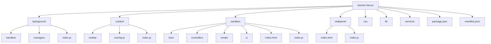
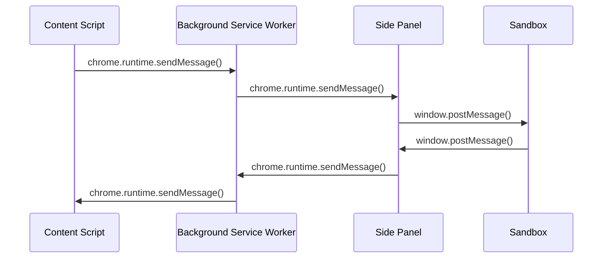

# 开发环境搭建

<cite>
**本文档引用的文件**   
- [package.json](file://package.json)
- [manifest.json](file://manifest.json)
- [README.md](file://README.md)
- [background/index.js](file://background/index.js)
- [content/index.js](file://content/index.js)
- [sandbox/index.js](file://sandbox/index.js)
- [sidepanel/index.js](file://sidepanel/index.js)
- [content/overlay.js](file://content/overlay.js)
- [content/toolbar/controller.js](file://content/toolbar/controller.js)
- [background/messages.js](file://background/messages.js)
- [sandbox/index.html](file://sandbox/index.html)
- [sidepanel/index.html](file://sidepanel/index.html)
- [index.html](file://index.html)
</cite>

## 目录
1. [简介](#简介)
2. [项目结构](#项目结构)
3. [Vite开发环境配置](#vite开发环境配置)
4. [Chrome扩展开发模式](#chrome扩展开发模式)
5. [Manifest V3核心配置](#manifest-v3核心配置)
6. [热重载工作流程](#热重载工作流程)
7. [常见问题排查](#常见问题排查)
8. [调试技巧](#调试技巧)
9. [总结](#总结)

## 简介
本指南详细说明如何为Gemini Nexus Chrome扩展项目配置开发环境。项目采用Vite作为构建工具，支持热重载和快速开发。通过本指南，开发者可以快速搭建开发环境，理解项目架构，并掌握调试技巧。

## 项目结构



**图示来源**
- [manifest.json](file://manifest.json#L1-L93)
- [package.json](file://package.json#L1-L24)

**本节来源**
- [README.md](file://README.md#L50-L66)

## Vite开发环境配置

### package.json脚本说明
项目通过Vite实现现代化的前端开发体验，package.json中定义了三个核心脚本：

- **dev**: 启动开发服务器，支持热重载
- **build**: 构建生产版本
- **preview**: 预览生产构建

```json
{
  "scripts": {
    "dev": "vite",
    "build": "vite build",
    "preview": "vite preview"
  }
}
```

### 开发服务器启动
执行`npm run dev`命令启动开发服务器，该命令会：

1. 启动Vite开发服务器
2. 监听文件变化
3. 自动重新加载浏览器
4. 提供开发调试界面

开发服务器启动后，可以通过访问`http://localhost:5173`查看开发仪表板，该仪表板提供了侧边栏和沙盒UI的快速访问链接。

**本节来源**
- [package.json](file://package.json#L6-L9)
- [index.html](file://index.html#L1-L46)

## Chrome扩展开发模式

### 开发模式启用步骤
1. **克隆仓库**
   ```bash
   git clone https://github.com/SEVENTEEN-TAN/gemini-nexus.git
   cd gemini-nexus
   ```

2. **安装依赖**
   ```bash
   npm install
   ```

3. **启动开发服务器**
   ```bash
   npm run dev
   ```

4. **加载扩展**
   - 打开Chrome，访问`chrome://extensions/`
   - 开启「开发者模式」
   - 点击「加载已解压的扩展程序」
   - 选择项目根目录

5. **登录Gemini**
   - 确保已在[gemini.google.com](https://gemini.google.com)登录Google账号

### 扩展加载机制
Chrome扩展通过manifest.json文件定义加载机制。项目采用Manifest V3标准，关键配置包括：

- **background**: 定义service worker
- **content_scripts**: 定义内容脚本
- **side_panel**: 定义侧边栏
- **sandbox**: 定义沙盒环境

**本节来源**
- [README.md](file://README.md#L28-L49)
- [manifest.json](file://manifest.json#L1-L93)

## Manifest V3核心配置

### service_worker配置
```json
"background": {
  "service_worker": "background/index.js",
  "type": "module"
}
```
service_worker是扩展的后台服务，负责：
- 消息处理
- 会话管理
- API调用
- 定时任务

background/index.js文件初始化了会话管理器、图像管理器、浏览器控制管理器等核心组件。

### side_panel配置
```json
"side_panel": {
  "default_path": "sidepanel/index.html"
}
```
侧边栏是用户与AI交互的主要界面，通过sidepanel/index.html实现。侧边栏通过iframe嵌入sandbox/index.html，实现安全的内容渲染。

### sandbox配置
```json
"sandbox": {
  "pages": ["sandbox/index.html"]
}
```
沙盒环境用于安全地渲染用户生成的内容，如Markdown、数学公式和图表。sandbox/index.html通过动态加载依赖来优化首屏渲染速度。

### content_scripts配置
```json
"content_scripts": [
  {
    "matches": ["<all_urls>"],
    "js": [
      "content/overlay.js",
      "content/toolbar/icons.js",
      "content/toolbar/styles/core.js",
      // ... 其他脚本
      "content/index.js"
    ],
    "run_at": "document_end"
  }
]
```
内容脚本在所有网页上运行，实现：
- 文本选中工具栏
- 截图功能
- 快捷操作
- 页面内容获取

### CSP策略
```json
"content_security_policy": {
  "extension_pages": "script-src 'self'; object-src 'self'",
  "sandbox": "sandbox allow-scripts allow-forms allow-popups allow-modals; script-src 'self' 'unsafe-inline'; img-src https: http: data: blob:; media-src https: http: data: blob:;"
}
```
内容安全策略确保扩展的安全性，防止XSS攻击。

**本节来源**
- [manifest.json](file://manifest.json#L11-L92)
- [background/index.js](file://background/index.js#L1-L30)
- [sidepanel/index.js](file://sidepanel/index.js#L1-L425)
- [sandbox/index.js](file://sandbox/index.js#L1-L12)
- [content/index.js](file://content/index.js#L1-L190)
- [content/overlay.js](file://content/overlay.js#L1-L213)

## 热重载工作流程

### 热重载机制
Vite的热重载机制通过以下方式实现：

1. **文件监听**: Vite监听项目文件的变化
2. **增量更新**: 只重新编译修改的文件
3. **浏览器刷新**: 自动刷新浏览器或局部更新

### 开发工作流程
1. 修改源代码
2. Vite检测到文件变化
3. 重新构建相关模块
4. 浏览器自动更新
5. 开发者即时查看修改效果

这种工作流程大大提高了开发效率，无需手动刷新页面即可看到修改效果。

**本节来源**
- [package.json](file://package.json#L7-L9)
- [README.md](file://README.md#L36-L39)

## 常见问题排查

### CSP策略导致的脚本阻塞
当遇到CSP策略导致的脚本阻塞时，可以：

1. 检查manifest.json中的content_security_policy配置
2. 确保脚本来源符合策略要求
3. 对于沙盒环境，确保使用了正确的script-src指令

### 模块导入错误
模块导入错误通常由以下原因引起：

1. **路径错误**: 检查导入路径是否正确
2. **模块类型**: 确保文件类型与导入方式匹配
3. **循环依赖**: 检查是否存在循环依赖

### 调试建议
- 使用Chrome开发者工具检查控制台错误
- 检查网络请求是否正常
- 验证manifest.json配置是否正确
- 确认文件路径和名称的大小写

**本节来源**
- [manifest.json](file://manifest.json#L89-L92)
- [content/index.js](file://content/index.js#L3-L7)
- [background/messages.js](file://background/messages.js#L1-L82)

## 调试技巧

### background service worker检查
1. 打开Chrome开发者工具
2. 导航到`chrome://extensions/`
3. 找到Gemini Nexus扩展
4. 点击"service worker"链接查看日志

### content script注入时机调试
通过在content/index.js中添加console.log来调试注入时机：

```javascript
console.log("%c Gemini Nexus v4.0.0 Ready ", "background: #333; color: #00ff00; font-size: 16px");
```

### sandbox页面隔离问题处理
sandbox环境通过postMessage与主页面通信。调试时可以：

1. 检查消息格式是否正确
2. 验证消息来源
3. 确保消息处理函数正确注册



**图示来源**
- [content/index.js](file://content/index.js#L19-L190)
- [background/messages.js](file://background/messages.js#L22-L82)
- [sidepanel/index.js](file://sidepanel/index.js#L150-L425)
- [sandbox/index.js](file://sandbox/index.js#L1-L12)

**本节来源**
- [content/index.js](file://content/index.js#L9-L10)
- [background/messages.js](file://background/messages.js#L22-L82)
- [sidepanel/index.js](file://sidepanel/index.js#L150-L425)
- [content/toolbar/controller.js](file://content/toolbar/controller.js#L1-L301)

## 总结
本指南详细介绍了Gemini Nexus Chrome扩展的开发环境搭建过程。通过Vite构建工具链，开发者可以获得高效的开发体验。Manifest V3的配置确保了扩展的安全性和功能性。掌握调试技巧可以帮助开发者快速定位和解决问题，提高开发效率。