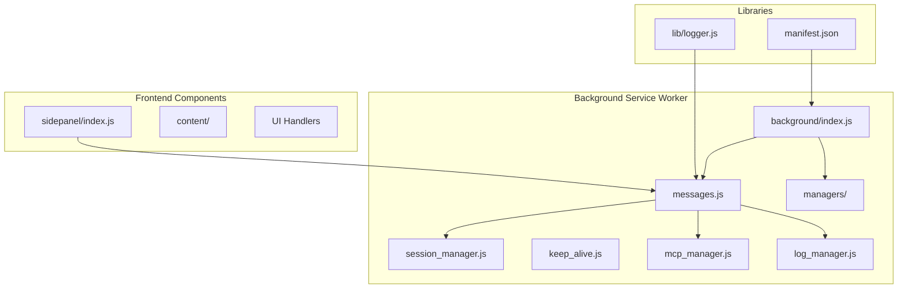
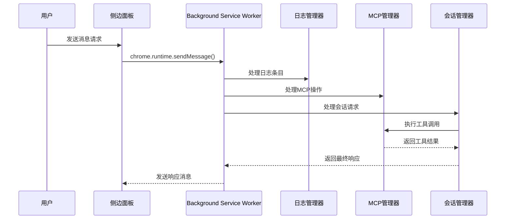
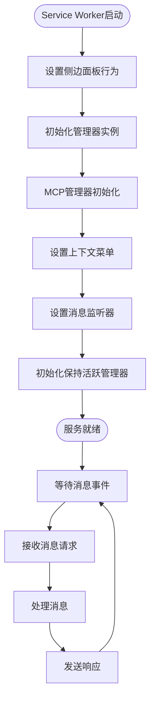
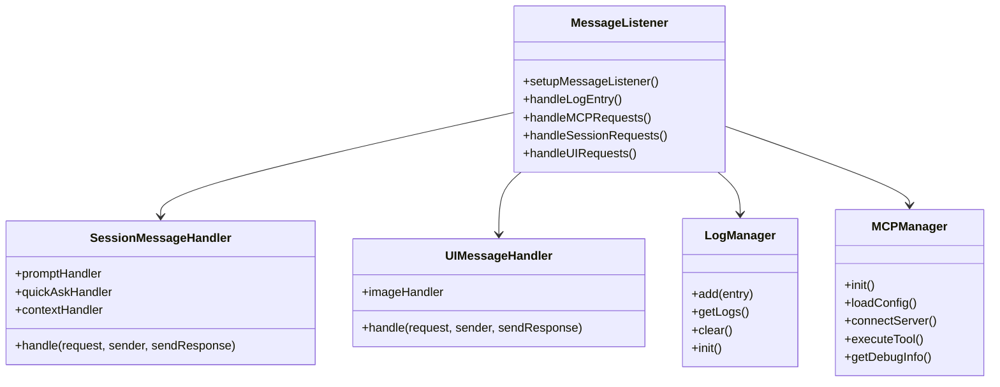
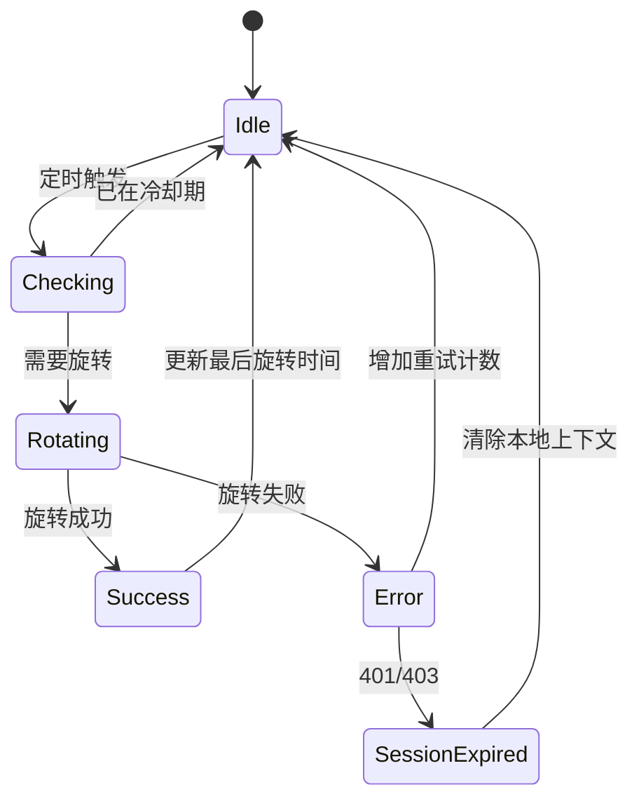
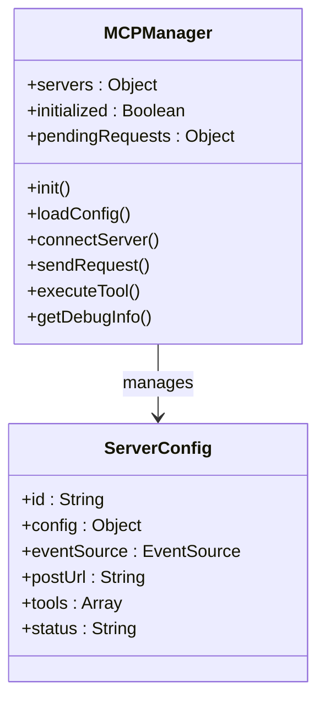
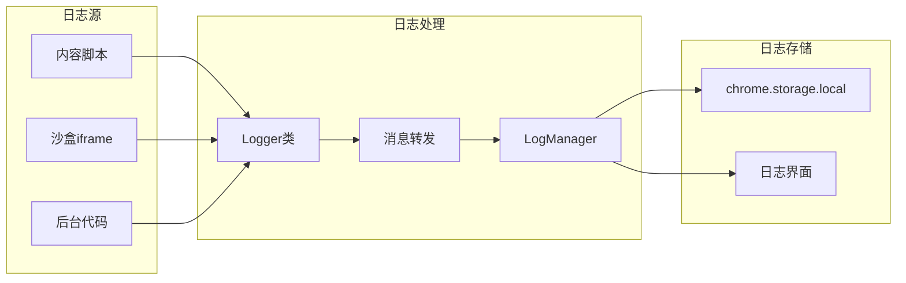
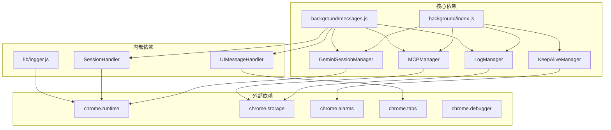
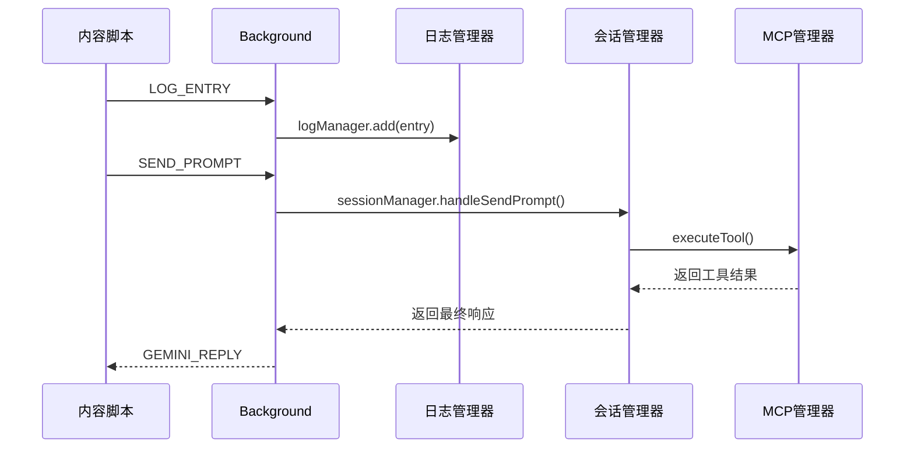

# Background Service Worker 调试

<cite>
**本文档引用的文件**
- [background/index.js](file://background/index.js)
- [background/messages.js](file://background/messages.js)
- [background/managers/log_manager.js](file://background/managers/log_manager.js)
- [background/managers/keep_alive.js](file://background/managers/keep_alive.js)
- [background/managers/mcp_manager.js](file://background/managers/mcp_manager.js)
- [background/managers/session_manager.js](file://background/managers/session_manager.js)
- [lib/logger.js](file://lib/logger.js)
- [manifest.json](file://manifest.json)
- [background/handlers/session.js](file://background/handlers/session.js)
- [background/control/connection.js](file://background/control/connection.js)
- [sidepanel/index.js](file://sidepanel/index.js)
</cite>

## 目录
1. [简介](#简介)
2. [项目结构](#项目结构)
3. [核心组件](#核心组件)
4. [架构概览](#架构概览)
5. [详细组件分析](#详细组件分析)
6. [依赖关系分析](#依赖关系分析)
7. [性能考虑](#性能考虑)
8. [故障排除指南](#故障排除指南)
9. [结论](#结论)

## 简介

本指南专注于调试 Chrome Extension 的 Background Service Worker，特别是 `background/index.js` 中的 Service Worker。该扩展实现了 Gemini AI 对话功能，包含复杂的后台管理器、消息处理系统和集中式日志记录机制。本文将详细说明如何使用 Chrome DevTools 调试 Service Worker，包括重新加载扩展、查看后台日志、设置事件监听断点，以及监控长期运行的管理器组件。

## 项目结构

该项目采用模块化架构，主要组件分布如下：



**图表来源**
- [background/index.js](file://background/index.js#L1-L30)
- [background/messages.js](file://background/messages.js#L1-L82)

**章节来源**
- [background/index.js](file://background/index.js#L1-L30)
- [manifest.json](file://manifest.json#L1-L93)

## 核心组件

### Service Worker 初始化流程

Service Worker 启动时执行以下初始化序列：

1. **侧边面板设置**：启用侧边面板自动打开功能
2. **管理器初始化**：创建并初始化所有核心管理器实例
3. **MCP 连接建立**：启动 MCP（Model Context Protocol）连接
4. **菜单设置**：配置上下文菜单
5. **消息监听器**：设置全局消息处理系统

### 集中式日志管理系统

系统实现了完整的日志收集和管理机制：

- **LogManager**：负责日志存储、检索和清理
- **Logger**：提供统一的日志记录接口
- **跨上下文日志转发**：支持从内容脚本、沙盒 iframe 等环境收集日志

**章节来源**
- [background/index.js](file://background/index.js#L13-L30)
- [background/managers/log_manager.js](file://background/managers/log_manager.js#L1-L62)
- [lib/logger.js](file://lib/logger.js#L1-L53)

## 架构概览



**图表来源**
- [background/messages.js](file://background/messages.js#L22-L80)
- [background/managers/session_manager.js](file://background/managers/session_manager.js#L21-L128)

## 详细组件分析

### Service Worker 主入口分析

#### 初始化流程详解



**图表来源**
- [background/index.js](file://background/index.js#L13-L30)

#### 消息监听器实现分析

消息监听器是整个系统的核心通信枢纽，负责处理来自不同上下文的消息：



**图表来源**
- [background/messages.js](file://background/messages.js#L14-L81)
- [background/handlers/session.js](file://background/handlers/session.js#L7-L55)

**章节来源**
- [background/messages.js](file://background/messages.js#L14-L81)
- [background/handlers/session.js](file://background/handlers/session.js#L7-L55)

### 长期运行管理器监控

#### KeepAliveManager 分析

KeepAliveManager 实现了定期的 Cookie 旋转机制，确保会话持续有效：



**图表来源**
- [background/managers/keep_alive.js](file://background/managers/keep_alive.js#L39-L94)

#### MCPManager 分析

MCPManager 提供了完整的 MCP 协议支持，包括 SSE 和 HTTP 模式的自动切换：



**图表来源**
- [background/managers/mcp_manager.js](file://background/managers/mcp_manager.js#L2-L69)

**章节来源**
- [background/managers/keep_alive.js](file://background/managers/keep_alive.js#L1-L98)
- [background/managers/mcp_manager.js](file://background/managers/mcp_manager.js#L1-L530)

### 日志管理系统

#### 集中式日志收集

系统实现了多层次的日志收集机制：



**图表来源**
- [lib/logger.js](file://lib/logger.js#L28-L51)
- [background/managers/log_manager.js](file://background/managers/log_manager.js#L12-L45)

**章节来源**
- [lib/logger.js](file://lib/logger.js#L1-L53)
- [background/managers/log_manager.js](file://background/managers/log_manager.js#L1-L62)

## 依赖关系分析



**图表来源**
- [background/index.js](file://background/index.js#L4-L11)
- [background/messages.js](file://background/messages.js#L3-L4)

**章节来源**
- [background/index.js](file://background/index.js#L4-L11)
- [manifest.json](file://manifest.json#L6-L14)

## 性能考虑

### 内存管理

- **日志限制**：LogManager 限制最大日志数量为 2000 条，超出时自动裁剪
- **存储优化**：使用 chrome.storage.local 进行持久化存储
- **请求超时**：MCP 请求设置 10 秒超时机制

### 并发控制

- **旋转节流**：KeepAliveManager 实现 60 秒冷却期防止过度请求
- **并发检查**：使用 `isRotating` 标志防止重复执行
- **错误计数**：跟踪连续错误次数用于健康检查

## 故障排除指南

### Chrome DevTools 调试步骤

#### 1. 重新加载扩展

1. 打开 `chrome://extensions/` 页面
2. 启用 "开发者模式"
3. 点击 "重新加载" 按钮
4. 或者点击扩展图标旁的刷新按钮

#### 2. 设置事件监听断点

在 Chrome DevTools 中设置断点的方法：

1. 打开 DevTools (F12)
2. 切换到 "Sources" 标签
3. 在左侧找到 "Event Listener Breakpoints"
4. 展开 "Runtime" 节点
5. 勾选 "onMessage" 以设置断点

#### 3. 监控长期运行管理器

##### KeepAliveManager 监控

```javascript
// 在控制台中检查状态
console.log('KeepAliveManager 状态:', {
    lastRotation: keepAliveManager.lastRotation,
    isRotating: keepAliveManager.isRotating,
    consecutiveErrors: keepAliveManager.consecutiveErrors
});
```

##### MCPManager 监控

```javascript
// 获取 MCP 调试信息
console.log('MCP 状态:', mcpManager.getDebugInfo());

// 检查服务器连接状态
Object.keys(mcpManager.servers).forEach(id => {
    console.log(`服务器 ${id}:`, mcpManager.servers[id].status);
});
```

#### 4. 跨上下文消息流追踪

使用 `setupMessageListener` 的实现来追踪消息流：



**图表来源**
- [background/messages.js](file://background/messages.js#L22-L80)
- [background/managers/session_manager.js](file://background/managers/session_manager.js#L21-L128)

#### 5. 异步错误处理最佳实践

##### 使用 chrome.runtime.lastError

在异步操作中正确处理错误：

```javascript
// 正确的错误处理模式
chrome.debugger.attach({tabId}, "1.3", () => {
    if (chrome.runtime.lastError) {
        console.warn("调试器附加失败:", chrome.runtime.lastError.message);
        // 继续执行回退逻辑
        resolve();
    } else {
        // 成功处理
        console.log("调试器附加成功");
    }
});

// Promise 包装中的错误处理
sendCommand(method, params) {
    return new Promise((resolve, reject) => {
        chrome.debugger.sendCommand({tabId}, method, params, (result) => {
            if (chrome.runtime.lastError) {
                reject(chrome.runtime.lastError);
            } else {
                resolve(result);
            }
        });
    });
}
```

##### 异步操作的错误捕获

```javascript
// 推荐的异步错误处理模式
try {
    const response = await fetch(url);
    if (!response.ok) {
        throw new Error(`HTTP ${response.status}`);
    }
    return await response.json();
} catch (error) {
    console.error("网络请求失败:", error);
    // 记录到日志系统
    Logger.error("网络请求", { url, error: error.message });
    throw error;
}
```

#### 6. 日志收集和分析

##### 获取当前日志

```javascript
// 从侧边面板获取日志
chrome.runtime.sendMessage({
    action: 'GET_LOGS'
}, (response) => {
    console.log('当前日志:', response.logs);
});
```

##### 清理日志

```javascript
// 清理所有日志
chrome.runtime.sendMessage({
    action: 'CLEAR_LOGS'
});
```

**章节来源**
- [background/messages.js](file://background/messages.js#L24-L33)
- [background/control/connection.js](file://background/control/connection.js#L74-L105)
- [background/control/connection.js](file://background/control/connection.js#L121-L132)

### 常见问题诊断

#### 1. Service Worker 不响应消息

**症状**：消息发送后没有响应
**排查步骤**：
1. 检查 Service Worker 是否正常运行
2. 验证 `chrome.runtime.onMessage` 监听器是否正确设置
3. 使用断点调试消息处理流程

#### 2. MCP 连接失败

**症状**：MCP 服务器无法连接
**排查步骤**：
1. 检查 `mcpConfig` 存储状态
2. 验证服务器 URL 可访问性
3. 查看服务器返回的错误状态码

#### 3. 日志不显示

**症状**：日志收集失败
**排查步骤**：
1. 检查 `LogManager` 初始化状态
2. 验证 `chrome.storage.local` 权限
3. 确认消息转发链路正常

## 结论

本指南提供了调试 Gemini Nexus 扩展 Background Service Worker 的完整方法论。通过理解系统的模块化架构、消息处理机制和日志收集系统，开发者可以有效地定位和解决各种问题。

关键要点包括：
- 正确使用 Chrome DevTools 的事件监听断点功能
- 监控长期运行的管理器组件状态
- 利用集中式日志系统进行跨上下文追踪
- 遵循异步错误处理的最佳实践
- 理解消息路由和处理的完整流程

这些调试技巧不仅适用于当前项目，也为其他 Chrome Extension 开发提供了通用的调试框架和方法论。