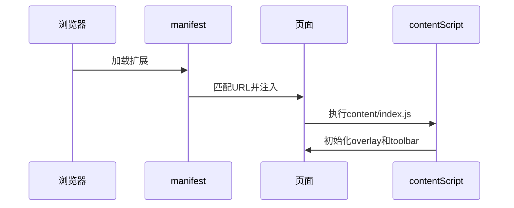
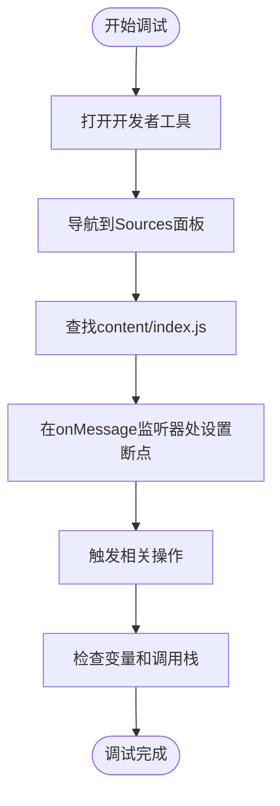
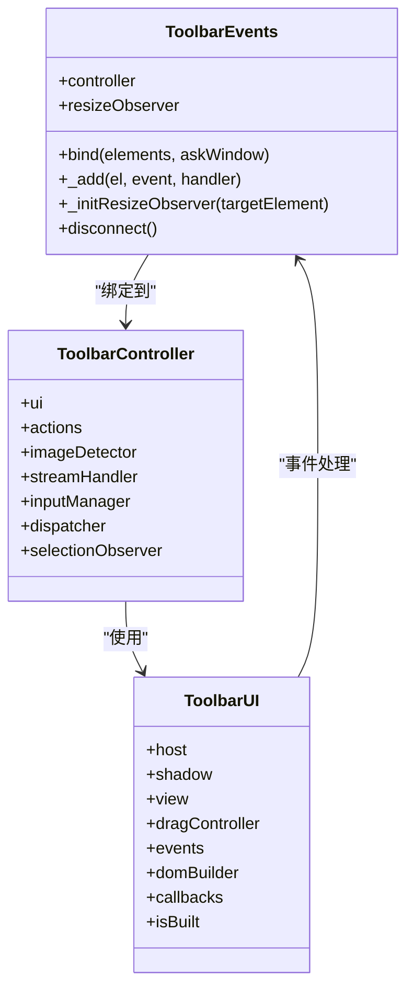
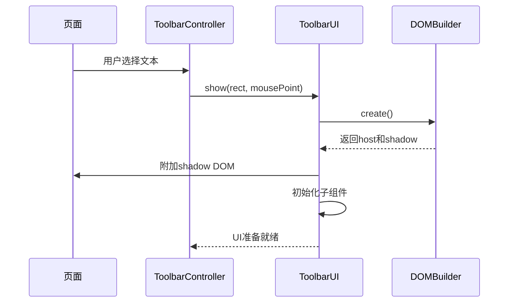
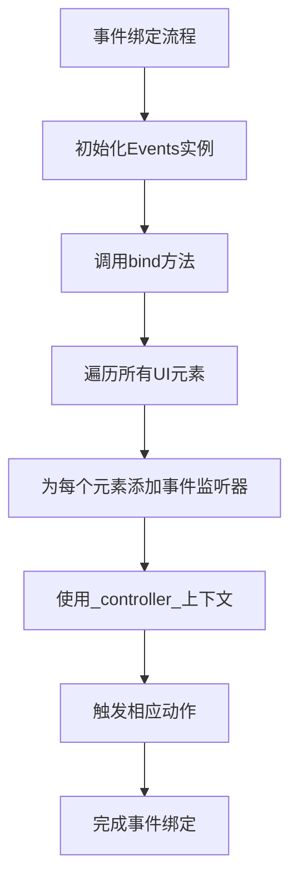
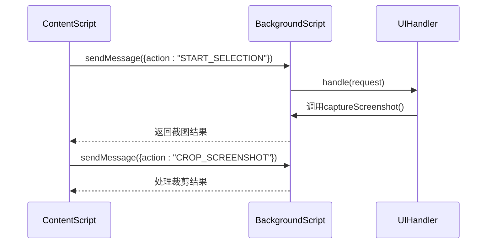
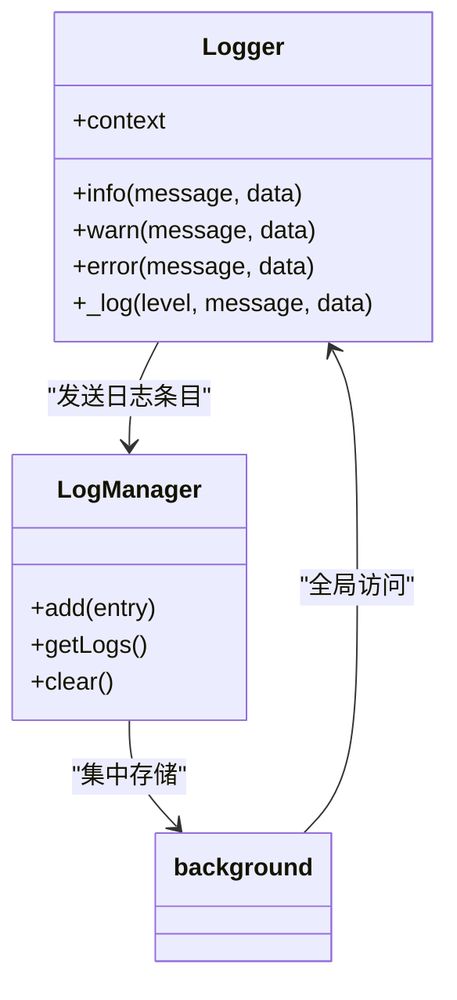
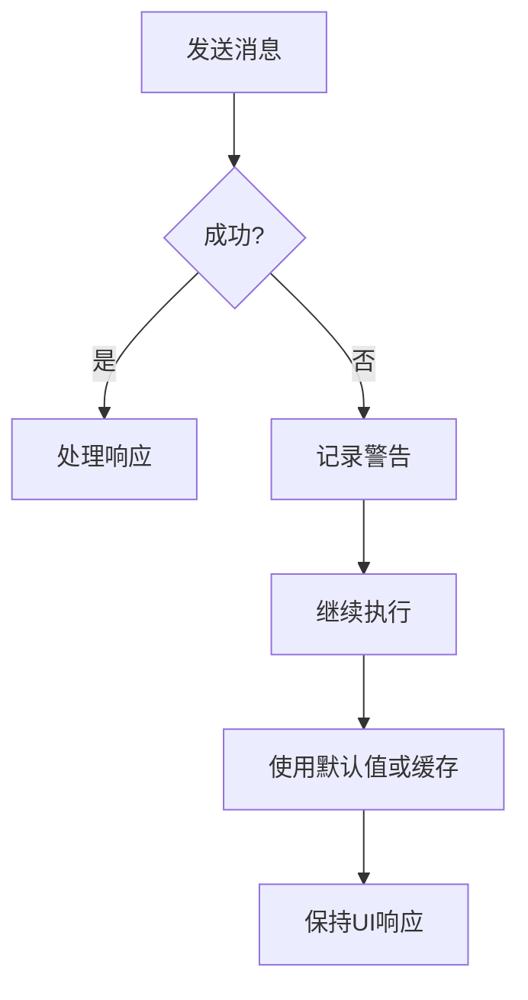
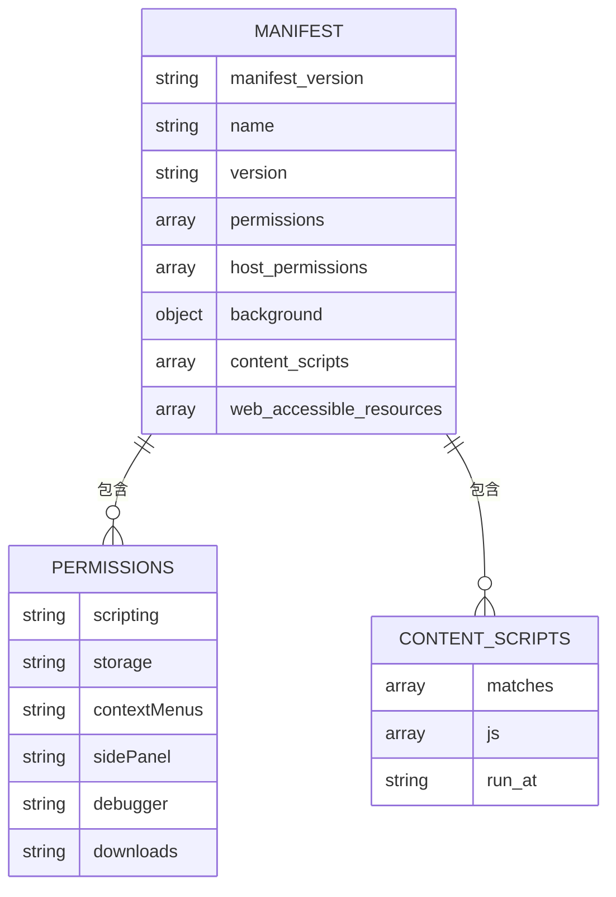
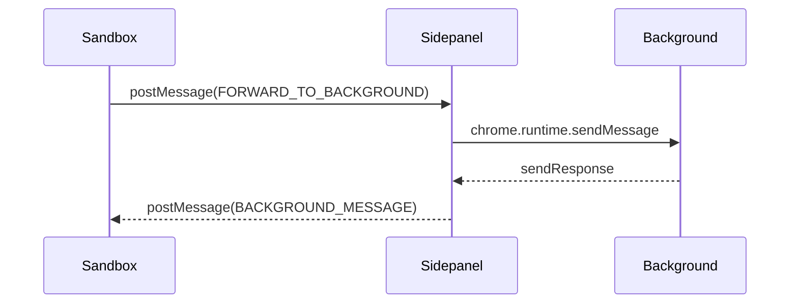

# Content Script 调试

<cite>
**本文档引用的文件**  
- [content/index.js](file://content/index.js)
- [manifest.json](file://manifest.json)
- [background/index.js](file://background/index.js)
- [content/toolbar/controller.js](file://content/toolbar/controller.js)
- [content/toolbar/ui/manager.js](file://content/toolbar/ui/manager.js)
- [content/overlay.js](file://content/overlay.js)
- [content/toolbar/events.js](file://content/toolbar/events.js)
- [lib/logger.js](file://lib/logger.js)
- [background/messages.js](file://background/messages.js)
- [background/handlers/ui.js](file://background/handlers/ui.js)
- [lib/messaging.js](file://lib/messaging.js)
- [sidepanel/index.js](file://sidepanel/index.js)
</cite>

## 目录
1. [简介](#简介)
2. [Content Script 注入机制](#content-script-注入机制)
3. [开发者工具中的调试方法](#开发者工具中的调试方法)
4. [动态注入 UI 组件的调试](#动态注入-ui-组件的调试)
5. [与 Background 通信的错误排查](#与-background-通信的错误排查)
6. [日志与错误监控](#日志与错误监控)
7. [权限与上下文隔离问题](#权限与上下文隔离问题)
8. [结论](#结论)

## 简介
本指南详细阐述了 Chrome 扩展中 `content/index.js` 的注入机制及其调试方法。重点指导开发者如何在目标网页的开发者工具中定位并调试 content script，包括设置断点、检查 DOM 操作效果以及监控事件监听器。结合 toolbar manager 的实现，说明如何调试动态注入的 UI 组件及其事件绑定，并演示通过 `chrome.runtime.sendMessage` 与 background 通信时的错误排查，特别是权限和上下文隔离相关问题。

## Content Script 注入机制

Chrome 扩展的 content script 通过 `manifest.json` 中的 `content_scripts` 字段在页面加载时自动注入。该机制确保脚本在页面 DOM 构建完成后执行，从而能够安全地与页面交互。

**Diagram sources**  
- [manifest.json](file://manifest.json#L40-L81)
- [content/index.js](file://content/index.js#L1-L190)

**Section sources**  
- [manifest.json](file://manifest.json#L40-L81)
- [content/index.js](file://content/index.js#L1-L190)

## 开发者工具中的调试方法

### 定位 Content Script

在 Chrome 开发者工具中，content script 通常显示在 "Sources" 面板的 `chrome-extension://` 域名下。可以通过以下步骤定位：

1. 打开目标网页
2. 按 F12 打开开发者工具
3. 在 "Sources" 标签页中查找 `chrome-extension://[扩展ID]/content/index.js`

### 设置断点

在 `content/index.js` 中的关键函数上设置断点，例如消息监听器：

**Diagram sources**  
- [content/index.js](file://content/index.js#L19-L111)

### 检查 DOM 操作效果

content script 通过创建 shadow DOM 来注入 UI 组件。可以通过以下方式检查其效果：

- 在 Elements 面板中查找 `#gemini-nexus-toolbar-host` 元素
- 展开 shadow root 查看内部结构
- 使用 `getComputedStyle()` 检查样式应用情况

### 监控事件监听器

通过开发者工具的 "Event Listeners" 面板可以监控所有绑定的事件：

**Diagram sources**  
- [content/toolbar/events.js](file://content/toolbar/events.js#L1-L173)
- [content/toolbar/controller.js](file://content/toolbar/controller.js#L1-L301)
- [content/toolbar/ui/manager.js](file://content/toolbar/ui/manager.js#L1-L280)

**Section sources**  
- [content/toolbar/events.js](file://content/toolbar/events.js#L1-L173)
- [content/toolbar/controller.js](file://content/toolbar/controller.js#L1-L301)

## 动态注入 UI 组件的调试

### Toolbar Manager 实现

`ToolbarUI` 类负责管理所有动态注入的 UI 组件，包括工具栏、询问窗口和图像按钮。

**Diagram sources**  
- [content/toolbar/controller.js](file://content/toolbar/controller.js#L52-L55)
- [content/toolbar/ui/manager.js](file://content/toolbar/ui/manager.js#L44-L93)
- [content/toolbar/view/dom.js](file://content/toolbar/view/dom.js#L1-L50)

### 事件绑定调试

事件绑定通过 `ToolbarEvents` 类集中管理，确保所有交互都能被正确捕获和处理。

**Diagram sources**  
- [content/toolbar/events.js](file://content/toolbar/events.js#L10-L133)

## 与 Background 通信的错误排查

### 消息通信机制

content script 通过 `chrome.runtime.sendMessage` 与 background script 通信，实现跨上下文的数据交换。

**Diagram sources**  
- [content/index.js](file://content/index.js#L48-L64)
- [background/messages.js](file://background/messages.js#L74-L76)
- [background/handlers/ui.js](file://background/handlers/ui.js#L65-L76)

### 常见通信错误

| 错误类型 | 原因 | 解决方案 |
|---------|------|---------|
| 消息未送达 | 发送方或接收方上下文错误 | 确认chrome.runtime可用 |
| 异步响应丢失 | 未正确返回true | 在监听器中返回true以保持通道 |
| 数据序列化失败 | 包含不可序列化对象 | 确保消息数据可JSON序列化 |
| 权限不足 | 缺少必要权限 | 检查manifest.json中的permissions |

**Section sources**  
- [content/index.js](file://content/index.js#L19-L111)
- [background/messages.js](file://background/messages.js#L22-L81)

## 日志与错误监控

### 日志系统实现

扩展使用统一的日志系统来记录所有关键操作和错误信息。

**Diagram sources**  
- [lib/logger.js](file://lib/logger.js#L4-L53)
- [background/managers/log_manager.js](file://background/managers/log_manager.js)

### 错误处理策略

当通信失败时，系统采用降级策略确保核心功能不受影响：

**Section sources**  
- [lib/logger.js](file://lib/logger.js#L28-L52)
- [background/messages.js](file://background/messages.js#L35-L37)

## 权限与上下文隔离问题

### 上下文隔离机制

Chrome 扩展的三个主要执行上下文：

1. **Content Script**: 与页面共享 DOM 但不共享 JavaScript 环境
2. **Background Script**: 持久化运行，管理扩展状态
3. **Web Page**: 目标网页的原始 JavaScript 环境

### 权限配置

`manifest.json` 中的权限配置决定了扩展的能力范围：

**Diagram sources**  
- [manifest.json](file://manifest.json#L1-L93)

### 跨上下文通信模式

对于沙箱环境，使用 `postMessage` 进行通信：

**Diagram sources**  
- [lib/messaging.js](file://lib/messaging.js#L4-L96)
- [sidepanel/index.js](file://sidepanel/index.js#L178-L191)

**Section sources**  
- [lib/messaging.js](file://lib/messaging.js#L4-L96)
- [sidepanel/index.js](file://sidepanel/index.js#L178-L191)

## 结论
通过理解 content script 的注入机制、掌握开发者工具的使用方法、熟悉动态 UI 组件的调试技巧以及了解与 background 通信的常见问题，开发者可以高效地调试和维护 Chrome 扩展。重点关注权限配置和上下文隔离问题，确保扩展在各种环境下都能稳定运行。