# Sandbox 沙箱环境调试

<cite>
**本文档引用的文件**
- [sandbox/boot/messaging.js](file://sandbox/boot/messaging.js)
- [lib/logger.js](file://lib/logger.js)
- [lib/messaging.js](file://lib/messaging.js)
- [sandbox/boot/app.js](file://sandbox/boot/app.js)
- [sandbox/controllers/app_controller.js](file://sandbox/controllers/app_controller.js)
- [sandbox/controllers/message_handler.js](file://sandbox/controllers/message_handler.js)
- [sandbox/boot/events.js](file://sandbox/boot/events.js)
- [sandbox/render/pipeline.js](file://sandbox/render/pipeline.js)
- [sandbox/render/math_utils.js](file://sandbox/render/math_utils.js)
- [sandbox/libs/markmap-loader.js](file://sandbox/libs/markmap-loader.js)
- [sandbox/libs/mermaid-loader.js](file://sandbox/libs/mermaid-loader.js)
</cite>

## 目录
1. [简介](#简介)
2. [项目结构](#项目结构)
3. [核心组件](#核心组件)
4. [架构概览](#架构概览)
5. [详细组件分析](#详细组件分析)
6. [依赖关系分析](#依赖关系分析)
7. [性能考虑](#性能考虑)
8. [故障排除指南](#故障排除指南)
9. [结论](#结论)

## 简介

本文档深入解析了 Gemini Nexus 扩展中 sandbox iframe 环境的调试挑战。该扩展采用沙箱隔离设计，通过 postMessage 机制实现跨窗口通信，包括消息队列的刷新机制和跨窗口消息分发。文档重点分析了 `sandbox/boot/messaging.js` 中的 `AppMessageBridge` 实现，展示了如何通过该机制进行间接调试，包括消息队列的刷新机制和跨窗口消息分发。同时结合 `lib/logger.js` 中对 `window.parent.postMessage` 的封装，演示了如何将沙箱内的日志转发至 background 进行集中查看。

## 项目结构

Gemini Nexus 项目采用模块化架构，主要分为以下几个核心部分：

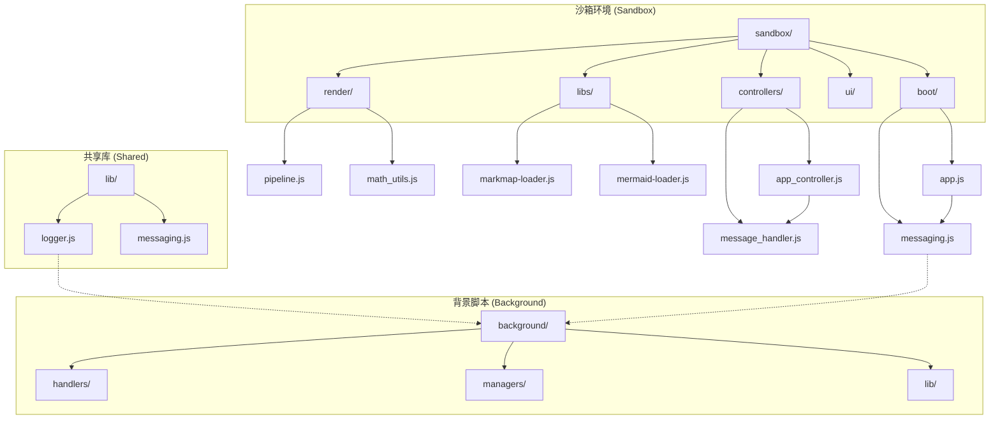

**图表来源**
- [sandbox/boot/app.js](file://sandbox/boot/app.js#L1-L90)
- [sandbox/boot/messaging.js](file://sandbox/boot/messaging.js#L1-L90)
- [lib/logger.js](file://lib/logger.js#L1-L53)

**章节来源**
- [sandbox/boot/app.js](file://sandbox/boot/app.js#L1-L90)
- [sandbox/boot/messaging.js](file://sandbox/boot/messaging.js#L1-L90)
- [lib/messaging.js](file://lib/messaging.js#L1-L96)

## 核心组件

### AppMessageBridge 消息桥接器

`AppMessageBridge` 是沙箱环境中最重要的通信组件，负责处理来自父窗口的消息并分发给相应的控制器。

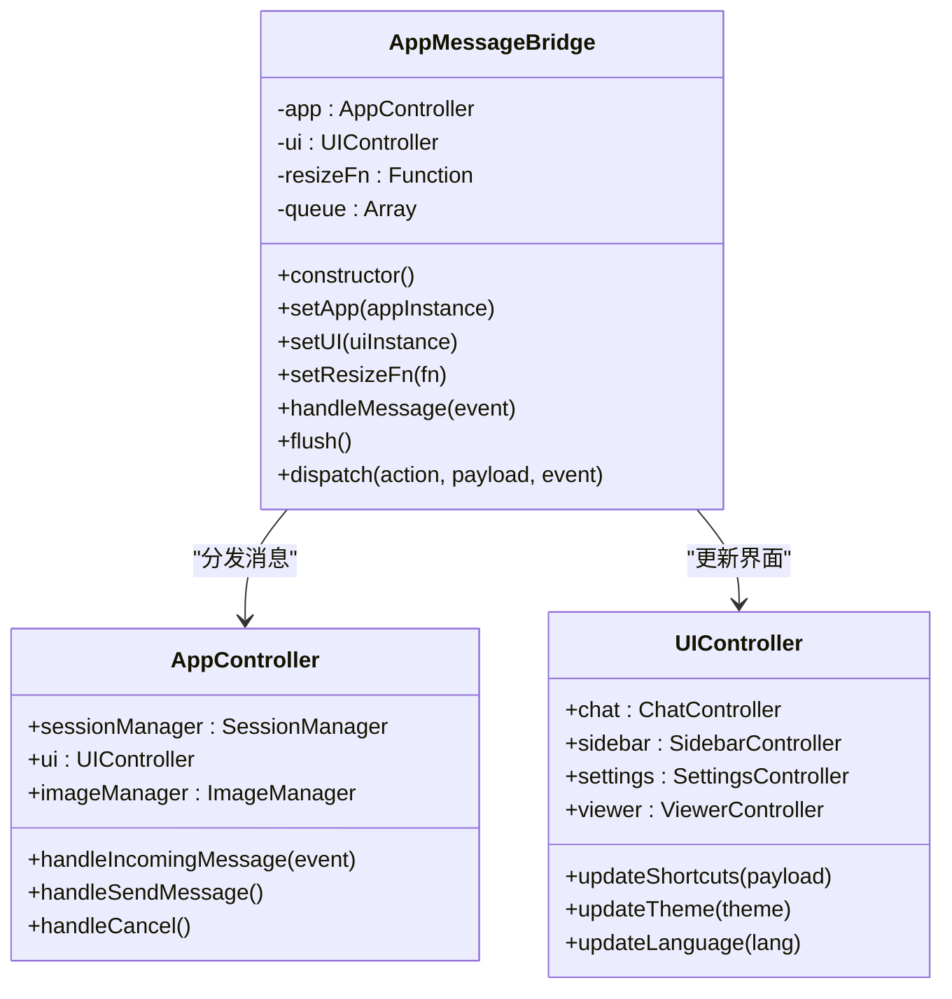

**图表来源**
- [sandbox/boot/messaging.js](file://sandbox/boot/messaging.js#L4-L90)
- [sandbox/controllers/app_controller.js](file://sandbox/controllers/app_controller.js#L10-L36)
- [sandbox/ui/ui_controller.js](file://sandbox/ui/ui_controller.js#L8-L33)

### Logger 日志系统

Logger 类提供了统一的日志记录接口，支持本地控制台输出和跨窗口日志转发。

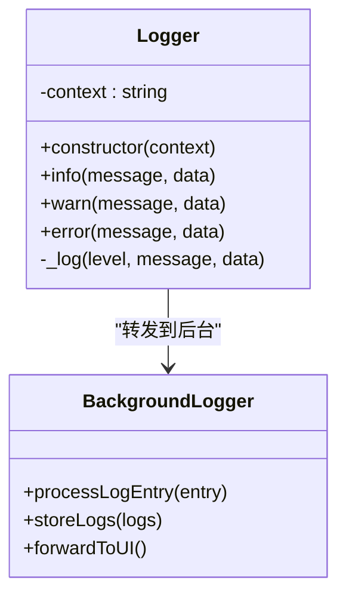

**图表来源**
- [lib/logger.js](file://lib/logger.js#L4-L53)

**章节来源**
- [sandbox/boot/messaging.js](file://sandbox/boot/messaging.js#L4-L90)
- [lib/logger.js](file://lib/logger.js#L4-L53)

## 架构概览

沙箱环境采用双层通信架构，确保消息的可靠传递和处理：

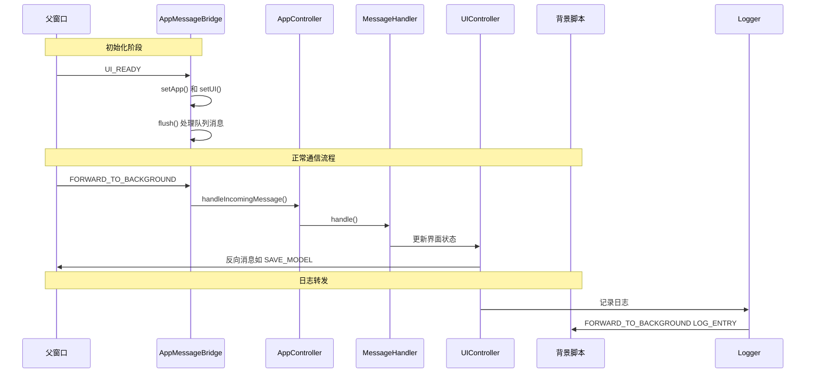

**图表来源**
- [sandbox/boot/app.js](file://sandbox/boot/app.js#L18-L22)
- [sandbox/boot/messaging.js](file://sandbox/boot/messaging.js#L29-L47)
- [sandbox/controllers/app_controller.js](file://sandbox/controllers/app_controller.js#L129-L192)

## 详细组件分析

### 消息队列刷新机制

AppMessageBridge 实现了智能的消息队列管理，确保在应用初始化完成前的所有消息都能正确处理：

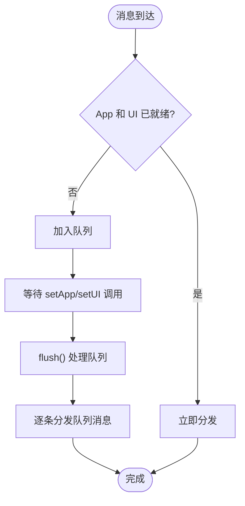

**图表来源**
- [sandbox/boot/messaging.js](file://sandbox/boot/messaging.js#L29-L47)

关键特性包括：
- **延迟初始化**：在 `setApp()` 和 `setUI()` 都调用后才开始处理消息
- **队列管理**：自动缓存未处理的消息直到应用就绪
- **批量处理**：初始化完成后一次性处理所有缓存消息

**章节来源**
- [sandbox/boot/messaging.js](file://sandbox/boot/messaging.js#L15-L47)

### 跨窗口消息分发

消息分发机制支持多种预定义操作和通用消息转发：

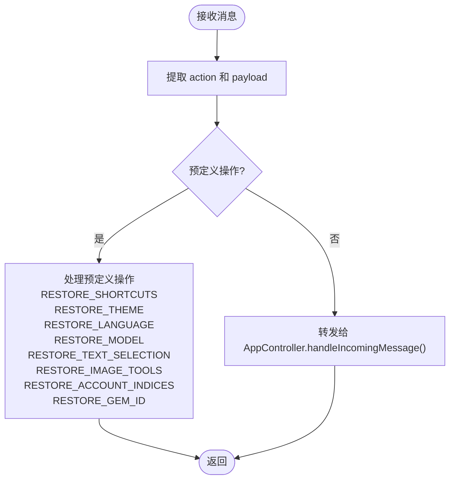

**图表来源**
- [sandbox/boot/messaging.js](file://sandbox/boot/messaging.js#L49-L89)

**章节来源**
- [sandbox/boot/messaging.js](file://sandbox/boot/messaging.js#L49-L89)

### 日志转发机制

Logger 类实现了智能的日志转发策略，优先使用 Chrome Runtime API，回退到 postMessage：

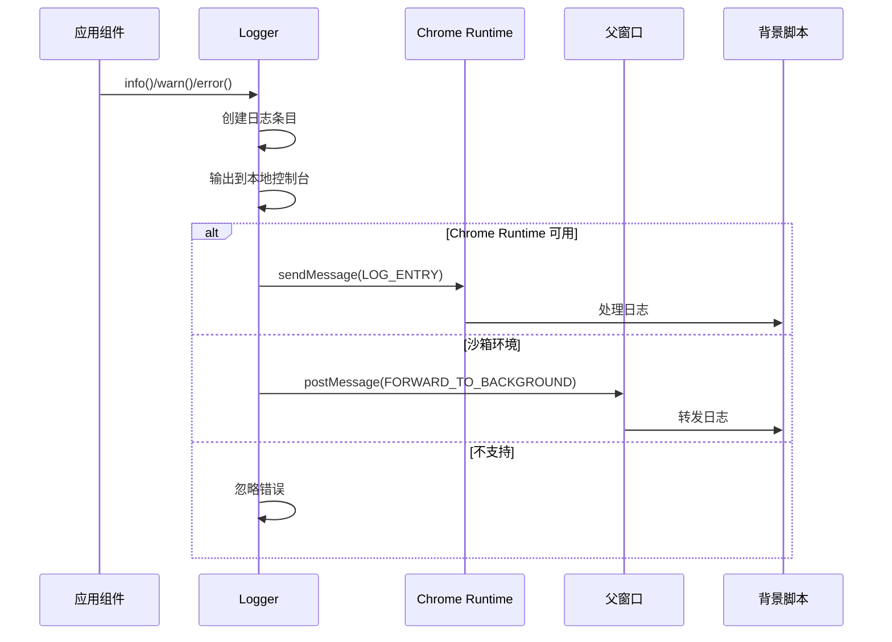

**图表来源**
- [lib/logger.js](file://lib/logger.js#L28-L51)

**章节来源**
- [lib/logger.js](file://lib/logger.js#L13-L51)

### 渲染逻辑调试

沙箱环境中的渲染逻辑涉及多个复杂的组件，特别是数学公式和图表渲染：

#### Markdown 渲染管道

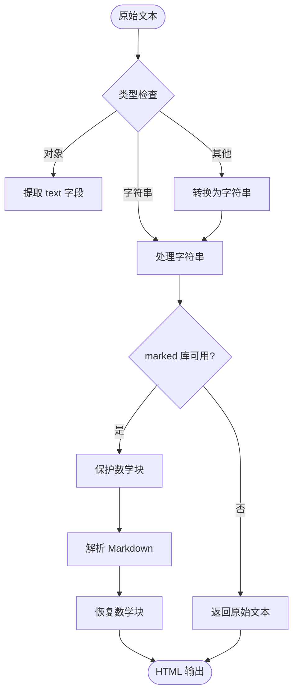

**图表来源**
- [sandbox/render/pipeline.js](file://sandbox/render/pipeline.js#L10-L44)

**章节来源**
- [sandbox/render/pipeline.js](file://sandbox/render/pipeline.js#L10-L44)

#### 数学公式处理

MathHandler 提供了复杂的数学公式保护和恢复机制：

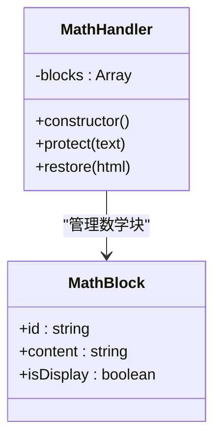

**图表来源**
- [sandbox/render/math_utils.js](file://sandbox/render/math_utils.js#L4-L62)

**章节来源**
- [sandbox/render/math_utils.js](file://sandbox/render/math_utils.js#L9-L62)

### 图表渲染调试

#### Markmap 加载器

```mermaid
flowchart TD
LoadMarkmap[loadMarkmap()] --> CheckLoaded{"已加载?"}
CheckLoaded --> |是| ReturnExisting["返回现有实例"]
CheckLoaded --> |否| CheckGlobal{"全局变量存在?"}
CheckGlobal --> |是| SetLoaded["标记已加载"]
CheckGlobal --> |否| LoadD3["加载 d3.js"]
LoadD3 --> LoadMarkmapLib["加载 markmap-lib.js"]
LoadMarkmapLib --> LoadMarkmapView["加载 markmap-view.js"]
LoadMarkmapView --> SetLoaded
SetLoaded --> ReturnInstances["返回实例"]
```

**图表来源**
- [sandbox/libs/markmap-loader.js](file://sandbox/libs/markmap-loader.js#L16-L49)

#### Mermaid 加载器

```mermaid
flowchart TD
LoadMermaid[loadMermaid()] --> CheckGlobal{"window.mermaid 存在?"}
CheckGlobal --> |是| Resolve["直接返回实例"]
CheckGlobal --> |否| CheckLoading{"脚本正在加载?"}
CheckLoading --> |是| WaitAndResolve["轮询等待加载完成"]
CheckLoading --> |否| CreateScript["创建 script 元素"]
CreateScript --> SetAttributes["设置属性和事件监听器"]
SetAttributes --> AppendToHead["添加到 head"]
AppendToHead --> OnLoad{"加载成功?"}
OnLoad --> |是| Initialize["初始化 mermaid"]
OnLoad --> |否| HandleError["处理加载错误"]
Initialize --> Resolve
WaitAndResolve --> Resolve
```

**图表来源**
- [sandbox/libs/mermaid-loader.js](file://sandbox/libs/mermaid-loader.js#L3-L53)

**章节来源**
- [sandbox/libs/markmap-loader.js](file://sandbox/libs/markmap-loader.js#L16-L49)
- [sandbox/libs/mermaid-loader.js](file://sandbox/libs/mermaid-loader.js#L3-L53)

## 依赖关系分析

沙箱环境的组件间依赖关系复杂但清晰：

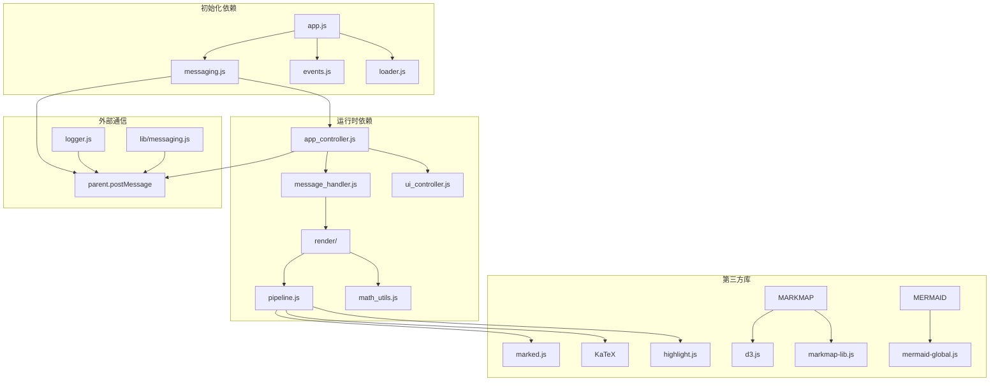

**图表来源**
- [sandbox/boot/app.js](file://sandbox/boot/app.js#L3-L8)
- [sandbox/boot/messaging.js](file://sandbox/boot/messaging.js#L1-L13)
- [sandbox/controllers/app_controller.js](file://sandbox/controllers/app_controller.js#L3-L8)

**章节来源**
- [sandbox/boot/app.js](file://sandbox/boot/app.js#L3-L8)
- [sandbox/boot/messaging.js](file://sandbox/boot/messaging.js#L1-L13)
- [lib/messaging.js](file://lib/messaging.js#L4-L9)

## 性能考虑

### 异步加载优化

沙箱环境采用了多种异步加载策略来优化性能：

1. **并行加载**：依赖库采用 Promise.all 并行加载
2. **延迟加载**：非关键资源在需要时再加载
3. **缓存机制**：已加载的库实例会被缓存避免重复加载

### 内存管理

- **消息队列清理**：应用就绪后及时清空消息队列
- **事件监听器管理**：合理绑定和解绑事件监听器
- **DOM 操作优化**：批量更新 DOM 减少重排重绘

### 调试性能监控

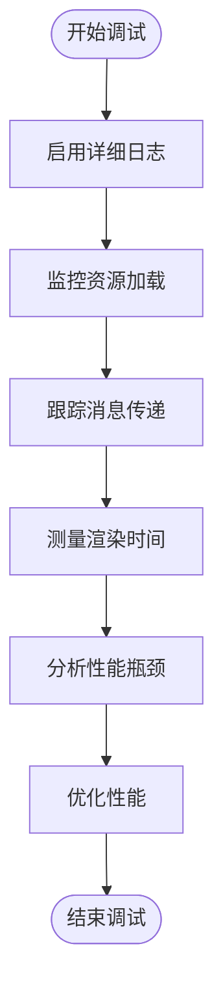

## 故障排除指南

### 通信超时问题

当遇到通信超时问题时，可以采取以下调试步骤：

1. **检查消息桥接器状态**
   - 确认 `setApp()` 和 `setUI()` 是否都已调用
   - 验证消息队列是否正确刷新

2. **验证父窗口连接**
   - 检查 `window.parent.postMessage` 是否正常工作
   - 确认消息格式符合预期

3. **监控消息传递**
   - 使用浏览器开发者工具的网络面板监控 postMessage
   - 检查消息序列化和反序列化过程

### 渲染问题诊断

#### Markdown 渲染问题

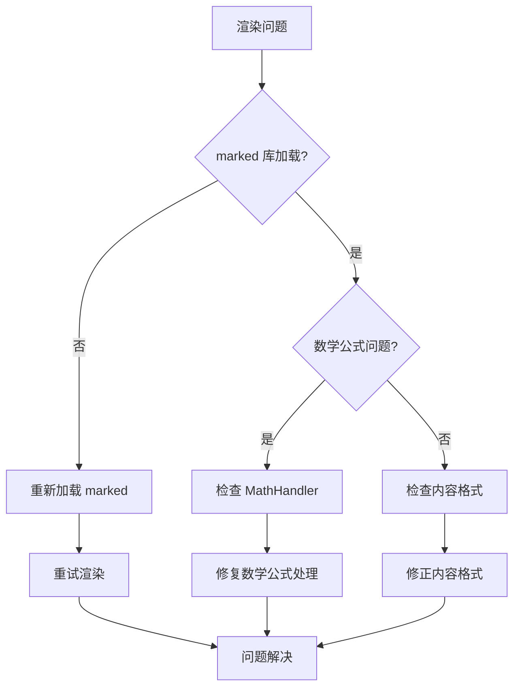

**图表来源**
- [sandbox/render/pipeline.js](file://sandbox/render/pipeline.js#L26-L30)

#### 图表渲染失败

1. **检查第三方库加载**
   - 验证 d3.js 和 markmap 库是否正确加载
   - 确认 mermaid 初始化参数配置正确

2. **调试图表生成**
   - 检查图表数据格式是否正确
   - 验证图表容器是否存在且可见

### 日志调试技巧

1. **启用详细日志**
   ```javascript
   // 在沙箱环境中启用详细日志
   const logger = new Logger('SandboxDebug');
   ```

2. **监控消息流**
   - 在 AppMessageBridge 中添加消息处理日志
   - 跟踪消息从接收、分发到执行的完整流程

3. **性能分析**
   - 使用浏览器性能面板分析渲染性能
   - 监控内存使用情况避免泄漏

**章节来源**
- [sandbox/boot/messaging.js](file://sandbox/boot/messaging.js#L29-L38)
- [lib/logger.js](file://lib/logger.js#L13-L27)

## 结论

Gemini Nexus 的沙箱环境通过精心设计的通信架构和调试机制，为复杂的扩展功能提供了可靠的运行环境。AppMessageBridge 的消息队列刷新机制确保了消息传递的可靠性，而 Logger 类的日志转发机制则为跨窗口调试提供了便利。

关键优势包括：
- **可靠的通信机制**：通过消息队列确保消息不丢失
- **灵活的调试支持**：支持本地和远程日志收集
- **高效的渲染管道**：优化的 Markdown 和数学公式处理
- **健壮的图表支持**：完整的 Markmap 和 Mermaid 集成

对于开发者而言，理解这些机制有助于更好地调试沙箱环境中的问题，优化性能表现，并扩展新的功能特性。