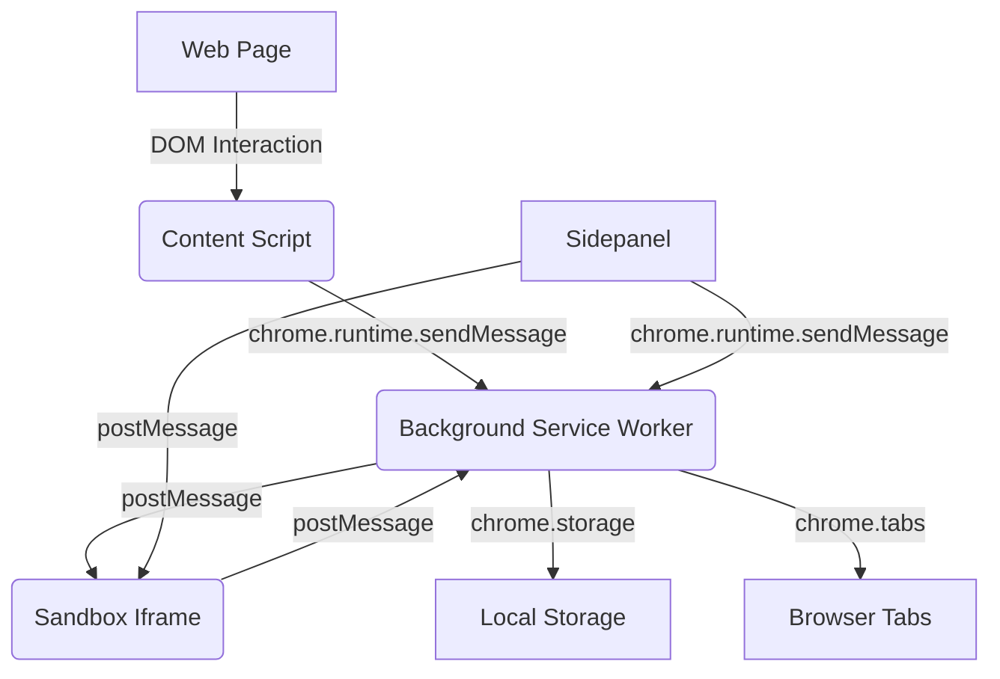
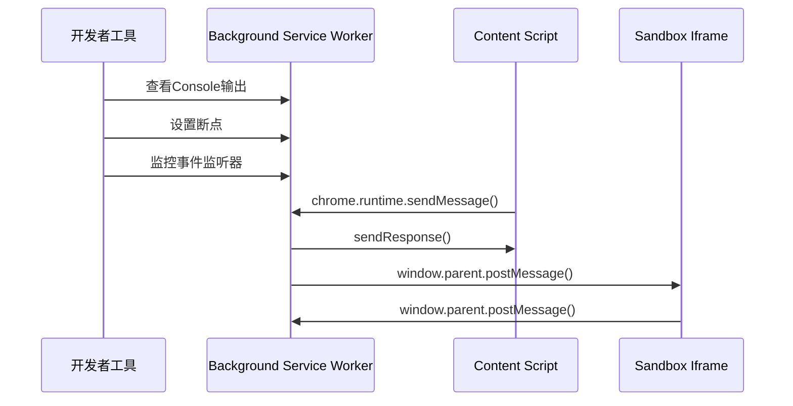
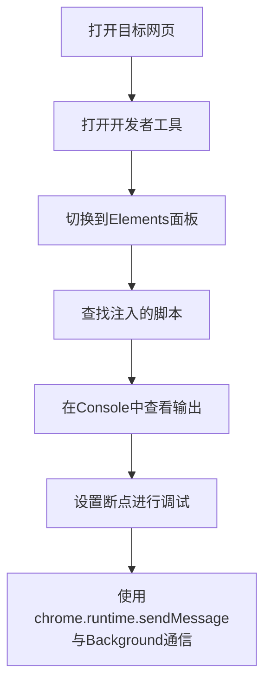
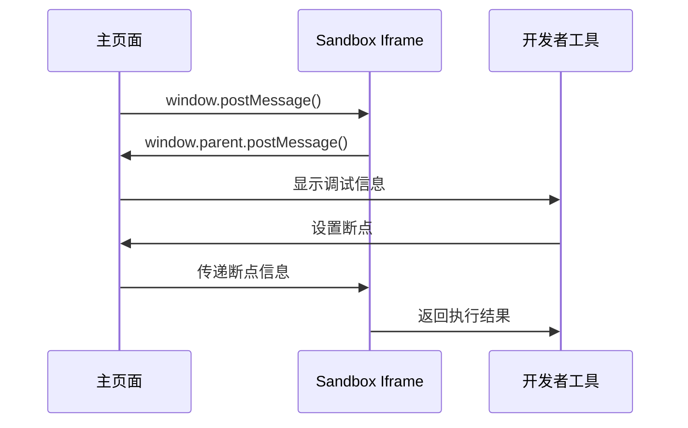
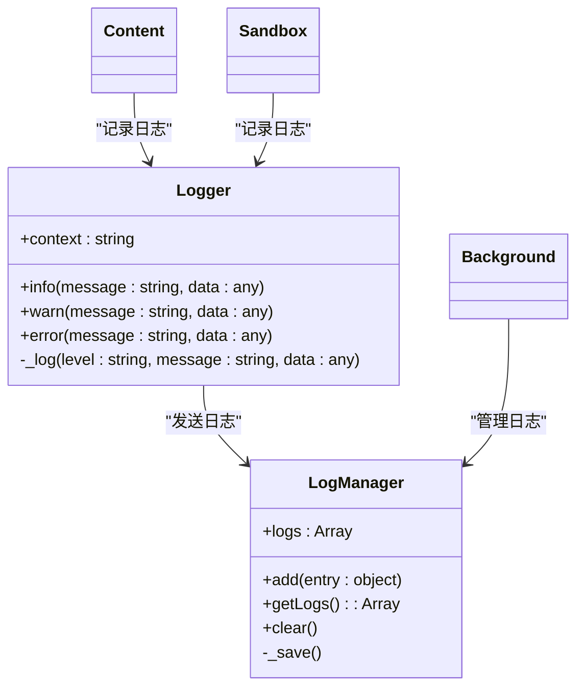

# 多上下文环境调试

<cite>
**本文档引用的文件**  
- [background/index.js](file://background/index.js)
- [content/index.js](file://content/index.js)
- [sandbox/index.js](file://sandbox/index.js)
- [lib/logger.js](file://lib/logger.js)
- [lib/messaging.js](file://lib/messaging.js)
- [background/messages.js](file://background/messages.js)
- [background/managers/log_manager.js](file://background/managers/log_manager.js)
- [sandbox/boot/messaging.js](file://sandbox/boot/messaging.js)
- [manifest.json](file://manifest.json)
- [sandbox/boot/events.js](file://sandbox/boot/events.js)
- [sidepanel/index.js](file://sidepanel/index.js)
- [background/control/actions/observation.js](file://background/control/actions/observation.js)
- [background/handlers/session/utils.js](file://background/handlers/session/utils.js)
- [background/handlers/ui.js](file://background/handlers/ui.js)
- [background/managers/control_manager.js](file://background/managers/control_manager.js)
- [content/toolbar/ui/manager.js](file://content/toolbar/ui/manager.js)
- [sandbox/controllers/app_controller.js](file://sandbox/controllers/app_controller.js)
- [background/control/actions/base.js](file://background/control/actions/base.js)
- [background/control/connection.js](file://background/control/connection.js)
</cite>

## 目录
1. [简介](#简介)
2. [项目结构](#项目结构)
3. [核心组件](#核心组件)
4. [架构概述](#架构概述)
5. [详细组件分析](#详细组件分析)
6. [依赖分析](#依赖分析)
7. [性能考虑](#性能考虑)
8. [故障排除指南](#故障排除指南)
9. [结论](#结论)

## 简介
本文档系统性地介绍了Chrome扩展中background、content script和sandbox三种执行上下文的调试策略。针对background service worker，说明如何通过Chrome扩展管理页面查看console输出、设置断点和监控事件监听器。对于content script，阐述如何在目标网页的开发者工具中定位和调试注入的脚本。针对sandbox iframe环境，解释其与主页面隔离的特性及调试挑战，介绍通过postMessage通信进行间接调试的方法。说明如何利用统一的日志系统（Logger）实现跨上下文的问题追踪。提供在各上下文中处理chrome.runtime.lastError的实践示例，并演示如何诊断消息通信失败、权限错误和DOM操作异常等常见问题。

## 项目结构
本项目采用模块化设计，将不同功能分离到独立的目录中。主要包含background、content、sandbox、lib、services等目录，每个目录负责特定的功能模块。

```mermaid
graph TB
subgraph "Background"
B1[background/index.js]
B2[background/messages.js]
B3[background/managers/]
end
subgraph "Content Script"
C1[content/index.js]
C2[content/toolbar/]
C3[content/overlay.js]
end
subgraph "Sandbox"
S1[sandbox/index.js]
S2[sandbox/controllers/]
S3[sandbox/boot/]
end
subgraph "Shared Libraries"
L1[lib/logger.js]
L2[lib/messaging.js]
end
subgraph "UI"
U1[sidepanel/index.js]
U2[sidepanel/index.html]
end
B1 --> C1 : "消息通信"
B1 --> S1 : "消息通信"
C1 --> U1 : "消息通信"
S1 --> U1 : "消息通信"
L1 --> B1 : "日志记录"
L1 --> C1 : "日志记录"
L1 --> S1 : "日志记录"
```

**Diagram sources**
- [background/index.js](file://background/index.js)
- [content/index.js](file://content/index.js)
- [sandbox/index.js](file://sandbox/index.js)
- [lib/logger.js](file://lib/logger.js)

**Section sources**
- [background/index.js](file://background/index.js)
- [content/index.js](file://content/index.js)
- [sandbox/index.js](file://sandbox/index.js)
- [lib/logger.js](file://lib/logger.js)
- [manifest.json](file://manifest.json)

## 核心组件
本项目的核心组件包括background service worker、content script和sandbox iframe。background service worker负责管理扩展的全局状态和长期运行的任务；content script负责与网页内容交互；sandbox iframe提供了一个安全的执行环境来处理敏感操作。

**Section sources**
- [background/index.js](file://background/index.js#L1-L30)
- [content/index.js](file://content/index.js#L1-L190)
- [sandbox/index.js](file://sandbox/index.js#L1-L12)

## 架构概述
系统采用分层架构，通过消息传递机制实现各组件间的通信。background service worker作为中心枢纽，协调content script和sandbox iframe之间的交互。



**Diagram sources**
- [background/index.js](file://background/index.js)
- [content/index.js](file://content/index.js)
- [sandbox/index.js](file://sandbox/index.js)
- [sidepanel/index.js](file://sidepanel/index.js)

## 详细组件分析
### Background Service Worker 调试
Background service worker作为扩展的后台服务，负责处理长期运行的任务和管理全局状态。在Chrome扩展管理页面中，可以通过"Inspect views"链接查看其console输出和设置断点。



**Diagram sources**
- [background/index.js](file://background/index.js)
- [background/messages.js](file://background/messages.js)

**Section sources**
- [background/index.js](file://background/index.js#L1-L30)
- [background/messages.js](file://background/messages.js#L1-L82)
- [background/managers/log_manager.js](file://background/managers/log_manager.js#L1-L62)

### Content Script 调试
Content script在目标网页的上下文中执行，可以通过目标网页的开发者工具进行调试。在Elements面板中可以找到注入的脚本，在Console中可以查看输出。



**Diagram sources**
- [content/index.js](file://content/index.js)
- [content/toolbar/ui/manager.js](file://content/toolbar/ui/manager.js)

**Section sources**
- [content/index.js](file://content/index.js#L1-L190)
- [content/toolbar/ui/manager.js](file://content/toolbar/ui/manager.js#L1-L280)

### Sandbox Iframe 调试
Sandbox iframe提供了一个隔离的执行环境，通过postMessage与主页面通信。由于其隔离特性，调试需要通过间接方式进行。



**Diagram sources**
- [sandbox/index.js](file://sandbox/index.js)
- [sandbox/boot/messaging.js](file://sandbox/boot/messaging.js)
- [sidepanel/index.js](file://sidepanel/index.js)

**Section sources**
- [sandbox/index.js](file://sandbox/index.js#L1-L12)
- [sandbox/boot/messaging.js](file://sandbox/boot/messaging.js#L1-L90)
- [sidepanel/index.js](file://sidepanel/index.js#L1-L425)

### 统一日志系统
通过Logger类实现跨上下文的日志记录，所有日志最终汇聚到background service worker中进行统一管理。



**Diagram sources**
- [lib/logger.js](file://lib/logger.js)
- [background/managers/log_manager.js](file://background/managers/log_manager.js)

**Section sources**
- [lib/logger.js](file://lib/logger.js#L1-L53)
- [background/managers/log_manager.js](file://background/managers/log_manager.js#L1-L62)

## 依赖分析
系统各组件之间通过明确的接口进行通信，降低了耦合度。background service worker作为中心枢纽，协调各组件间的交互。

```mermaid
graph TD
B[Background] --> C[Content Script]
B --> S[Sandbox]
B --> M[Log Manager]
C --> B
S --> B
M --> B
S --> C : "间接通信"
C --> S : "间接通信"
```

**Diagram sources**
- [manifest.json](file://manifest.json)
- [background/index.js](file://background/index.js)
- [content/index.js](file://content/index.js)
- [sandbox/index.js](file://sandbox/index.js)

**Section sources**
- [manifest.json](file://manifest.json#L1-L93)
- [background/index.js](file://background/index.js#L1-L30)
- [content/index.js](file://content/index.js#L1-L190)
- [sandbox/index.js](file://sandbox/index.js#L1-L12)

## 性能考虑
系统在设计时考虑了性能优化，如使用localStorage进行快速数据读取，通过异步操作避免阻塞主线程。

**Section sources**
- [sidepanel/index.js](file://sidepanel/index.js#L1-L425)
- [background/control/connection.js](file://background/control/connection.js#L40-L146)

## 故障排除指南
### 消息通信失败
检查消息格式是否正确，确保发送方和接收方在同一上下文中。

**Section sources**
- [background/messages.js](file://background/messages.js#L1-L82)
- [sidepanel/index.js](file://sidepanel/index.js#L178-L209)

### 权限错误
检查manifest.json中的权限声明，确保请求了必要的权限。

**Section sources**
- [manifest.json](file://manifest.json#L1-L93)
- [background/control/connection.js](file://background/control/connection.js#L75-L78)

### DOM操作异常
在content script中操作DOM时，确保DOM已完全加载。

**Section sources**
- [content/index.js](file://content/index.js#L19-L190)
- [background/handlers/session/utils.js](file://background/handlers/session/utils.js#L41-L63)

### chrome.runtime.lastError处理
在调用Chrome API时，始终检查chrome.runtime.lastError以处理可能的错误。

**Section sources**
- [background/control/actions/observation.js](file://background/control/actions/observation.js#L2-L28)
- [background/control/connection.js](file://background/control/connection.js#L75-L78)

## 结论
通过系统性的调试策略，可以有效地解决Chrome扩展中多上下文环境带来的调试挑战。统一的日志系统和清晰的通信机制是确保系统稳定运行的关键。