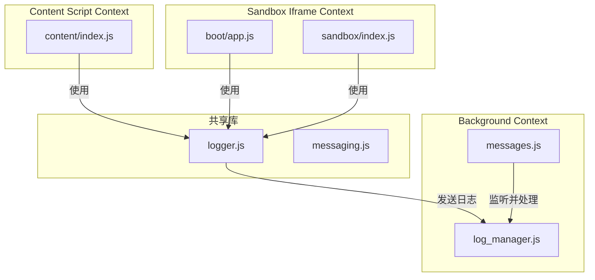
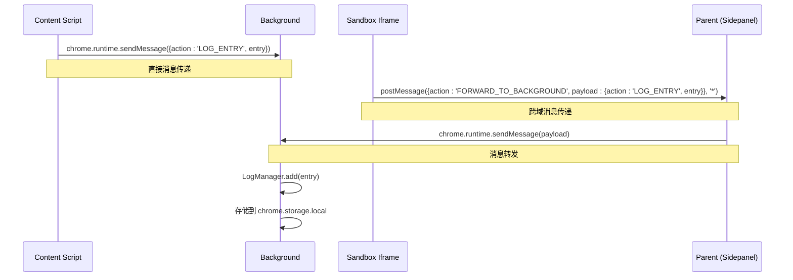
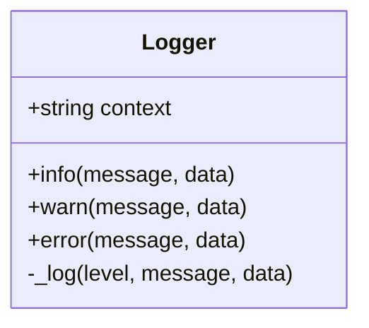
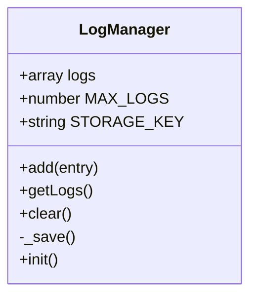
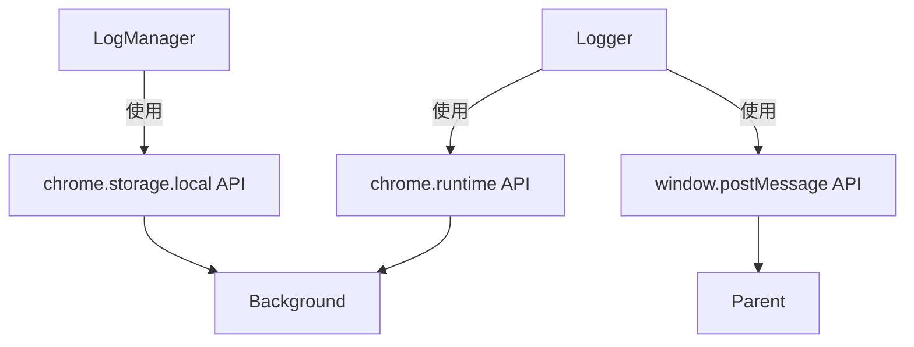

# 跨上下文日志追踪

<cite>
**本文档引用的文件**   
- [logger.js](file://lib/logger.js)
- [log_manager.js](file://background/managers/log_manager.js)
- [messages.js](file://background/messages.js)
- [messaging.js](file://lib/messaging.js)
- [app.js](file://sandbox/boot/app.js)
- [content/index.js](file://content/index.js)
</cite>

## 目录
1. [简介](#简介)
2. [项目结构](#项目结构)
3. [核心组件](#核心组件)
4. [架构概述](#架构概述)
5. [详细组件分析](#详细组件分析)
6. [依赖分析](#依赖分析)
7. [性能考量](#性能考量)
8. [故障排除指南](#故障排除指南)
9. [结论](#结论)

## 简介
本文档系统性地介绍了基于 `lib/logger.js` 构建的统一日志系统。该系统旨在解决浏览器扩展中多执行上下文（background、content script、sandbox iframe）的日志分散问题，通过自动适配的消息传递机制，将所有日志集中到 background 脚本中的 `LogManager` 进行统一管理。文档详细阐述了 `Logger` 类的设计原理、跨上下文通信的实现细节、日志条目的结构化设计，以及在生产环境中的使用建议。

## 项目结构
项目采用模块化分层架构，将核心功能按执行环境分离。`lib` 目录存放跨上下文共享的工具库，其中 `logger.js` 是本日志系统的核心。`background` 目录包含后台服务，`LogManager` 在此运行并持久化日志。`content` 目录为内容脚本，注入到网页中。`sandbox` 目录是一个隔离的 iframe 环境，用于安全地渲染内容。这种结构天然地产生了多个独立的 JavaScript 执行上下文，而统一日志系统正是为了弥合这些上下文之间的信息鸿沟。

**Diagram sources**
- [logger.js](file://lib/logger.js#L1-L53)
- [log_manager.js](file://background/managers/log_manager.js#L1-L62)
- [messages.js](file://background/messages.js#L1-L82)

**Section sources**
- [lib](file://lib)
- [background](file://background)
- [content](file://content)
- [sandbox](file://sandbox)

## 核心组件
本日志系统的核心由两个关键类构成：`Logger` 和 `LogManager`。`Logger` 类位于 `lib/logger.js`，是日志的生产者，被设计为轻量级、无依赖的工具，可在任何上下文中实例化。它负责格式化日志条目，并根据当前执行环境选择正确的通信路径。`LogManager` 类位于 `background/managers/log_manager.js`，是日志的消费者和管理者，它运行在后台进程中，负责接收、存储、查询和管理所有来自不同上下文的日志条目。这两个组件通过 Chrome 扩展的消息系统进行通信，实现了生产者-消费者模式。

**Section sources**
- [logger.js](file://lib/logger.js#L1-L53)
- [log_manager.js](file://background/managers/log_manager.js#L1-L62)

## 架构概述
该日志系统的架构是一个典型的中心化日志收集模式。各个执行上下文作为日志源，通过 `Logger` 实例生成结构化的日志条目。这些条目通过两条主要路径汇聚到中心节点——`LogManager`。对于可以直接访问 `chrome.runtime` API 的上下文（如 background 和 content script），日志通过 `chrome.runtime.sendMessage` 直接发送。对于运行在 iframe 中的 sandbox 环境，由于其无法直接访问扩展 API，日志则通过 `window.parent.postMessage` 发送到其父窗口（即 sidepanel），再由 sidepanel 转发至 background。`LogManager` 接收到日志后，将其存储在 `chrome.storage.local` 中，并维护一个内存中的日志列表，以支持高效的查询。

**Diagram sources**
- [logger.js](file://lib/logger.js#L28-L52)
- [messages.js](file://background/messages.js#L22-L28)
- [sidepanel/index.js](file://sidepanel/index.js#L178-L196)

## 详细组件分析

### Logger 类分析
`Logger` 类是日志系统的基础，其设计体现了简洁性和上下文感知能力。

#### 类结构与方法

**Diagram sources**
- [logger.js](file://lib/logger.js#L4-L52)

**Section sources**
- [logger.js](file://lib/logger.js#L1-L53)

#### 上下文感知与消息传递机制
`Logger` 类的 `_log` 方法是其核心，它实现了自动化的消息传递。该方法首先构建一个包含 `level`、`context`、`message`、`data` 和 `timestamp` 的结构化日志条目。`data` 字段通过 `JSON.parse(JSON.stringify(data))` 进行深度克隆和序列化，确保其可安全传输。随后，方法通过检查 `typeof chrome !== 'undefined'` 来判断当前环境是否支持 `chrome.runtime` API。如果支持，则直接使用 `chrome.runtime.sendMessage` 将日志发送至 background。如果不支持但存在父窗口（`window.parent`），则判定为 sandbox 环境，使用 `postMessage` 将日志包装后发送给父窗口。这种双重检查机制使得 `Logger` 实例可以在不同上下文中无缝工作，无需调用者关心底层通信细节。

### LogManager 类分析
`LogManager` 类是日志系统的中心枢纽，负责日志的生命周期管理。

#### 类结构与方法

**Diagram sources**
- [log_manager.js](file://background/managers/log_manager.js#L4-L62)

**Section sources**
- [log_manager.js](file://background/managers/log_manager.js#L1-L62)

#### 日志存储与管理
`LogManager` 在初始化时会从 `chrome.storage.local` 加载历史日志，实现持久化。`add` 方法是接收日志的入口，它会为日志条目补充时间戳，将其推入内存数组，并调用 `_save` 方法异步保存到本地存储。为了防止日志无限增长，`add` 方法还实现了简单的容量控制，当日志数量超过 `MAX_LOGS` 时，会截取最新的日志条目。`getLogs` 方法提供了一个简单的查询接口，允许其他组件（如 UI）获取所有日志进行展示。

## 依赖分析
该日志系统依赖于 Chrome 扩展的几个核心 API。最主要的依赖是 `chrome.runtime.sendMessage` 和 `chrome.runtime.onMessage`，用于在不同上下文间传递日志消息。其次，`LogManager` 依赖 `chrome.storage.local` 来实现日志的持久化存储。`sandbox` 环境则依赖 `window.postMessage` API 与父窗口通信。这些依赖关系清晰地定义了系统的边界和集成点。值得注意的是，`Logger` 类本身不直接依赖 `chrome` 对象，而是通过运行时检查来决定是否使用它，这使得该类具有很高的可移植性和健壮性。

**Diagram sources**
- [logger.js](file://lib/logger.js#L30-L47)
- [log_manager.js](file://background/managers/log_manager.js#L14-L16)
- [messages.js](file://background/messages.js#L22-L28)

**Section sources**
- [logger.js](file://lib/logger.js#L1-L53)
- [log_manager.js](file://background/managers/log_manager.js#L1-L62)
- [messages.js](file://background/messages.js#L1-L82)

## 性能考量
启用详细的日志记录会对性能产生一定影响。每次调用 `Logger` 的方法都会触发一次消息发送操作，这在高频率日志场景下可能成为性能瓶颈。`LogManager` 的 `_save` 方法虽然异步执行，但频繁的磁盘 I/O 操作仍可能影响后台脚本的响应速度。此外，将 `data` 字段进行 `JSON.stringify` 和 `JSON.parse` 操作，对于大型对象来说开销显著。因此，在生产环境中，建议仅在调试阶段启用 `info` 和 `debug` 级别的日志，而保留 `error` 和 `warn` 级别的日志用于监控。可以通过在 `Logger` 类中添加一个全局的 `enabled` 标志或日志级别阈值来动态控制日志输出，从而在调试信息和性能之间取得平衡。

## 故障排除指南
当发现日志缺失时，首先应检查 `Logger` 实例的 `context` 参数是否正确设置，这有助于在大量日志中快速定位来源。其次，确认目标上下文是否正确地将日志发送了出去，可以在 `logger.js` 的 `_log` 方法中添加 `console.log` 语句来验证。对于 sandbox 环境，需要确保父窗口（sidepanel）正确地监听并转发了 `FORWARD_TO_BACKGROUND` 消息。最后，检查 `LogManager` 是否收到了消息，可以在 `messages.js` 的 `onMessage` 监听器中添加断点。如果日志条目中的 `data` 字段为 `null`，则可能是因为传入的数据包含不可序列化的对象（如函数、DOM 元素），应确保只传递纯 JSON 数据。

**Section sources**
- [logger.js](file://lib/logger.js#L18-L20)
- [messages.js](file://background/messages.js#L25-L27)

## 结论
基于 `lib/logger.js` 构建的统一日志系统，通过巧妙地利用 Chrome 扩展的通信机制，成功地将分散在多个执行上下文中的日志信息集中管理。`Logger` 类的上下文自适应设计和 `LogManager` 的中心化存储，为开发和调试复杂的浏览器扩展提供了强大的支持。通过包含 `context` 和 `timestamp` 的结构化日志条目，开发者可以轻松地追踪问题和分析用户行为。尽管存在一定的性能开销，但通过合理的日志级别控制，该系统能够在生产环境中安全有效地运行，是项目可观测性的重要基石。