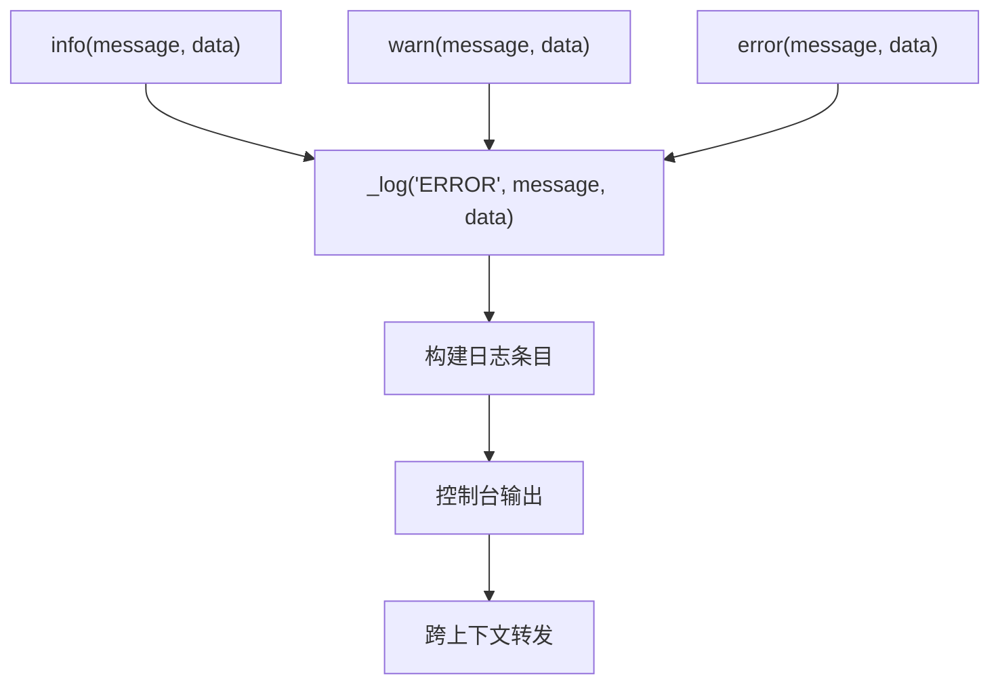
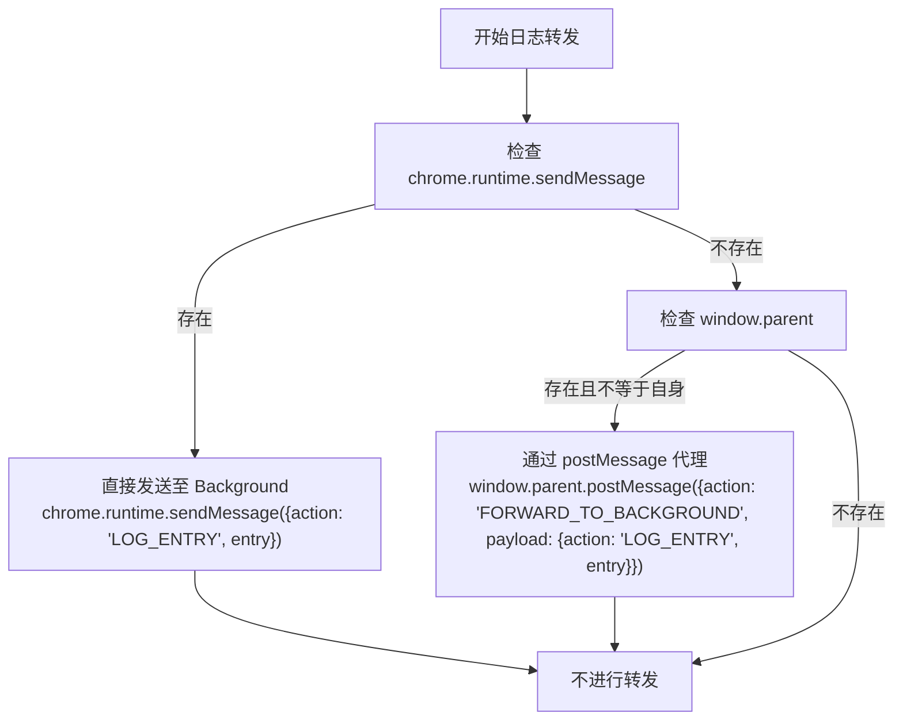

# 日志使用实践

<cite>
**本文档引用的文件**  
- [logger.js](file://lib/logger.js)
- [log_manager.js](file://background/managers/log_manager.js)
- [index.js](file://background/index.js)
- [index.js](file://content/index.js)
- [app.js](file://sandbox/boot/app.js)
- [renderer.js](file://sandbox/boot/renderer.js)
</cite>

## 目录
1. [简介](#简介)
2. [Logger类结构与核心设计](#logger类结构与核心设计)
3. [日志记录方法](#日志记录方法)
4. [日志条目构建与序列化](#日志条目构建与序列化)
5. [跨上下文日志转发机制](#跨上下文日志转发机制)
6. [不同执行环境中的使用示例](#不同执行环境中的使用示例)
7. [总结](#总结)

## 简介
本指南全面阐述Logger类在Chrome扩展不同执行环境（background、content script、sandbox iframe）中的实际使用方法。重点分析其构造函数如何接收context参数以标识日志来源，info()、warn()、error()方法如何统一调用底层_log方法，以及_log方法如何构建标准日志条目、输出彩色控制台日志，并通过条件判断实现跨上下文日志转发。同时，解释data字段深拷贝的设计目的，并提供各环境下的实例化与使用示例。

## Logger类结构与核心设计

Logger类的设计旨在为Chrome扩展的各个模块提供统一、可追溯且具备跨环境通信能力的日志记录功能。其核心在于通过构造函数接收context参数，明确标识日志的来源模块或组件。

**Section sources**
- [logger.js](file://lib/logger.js#L4-L7)

## 日志记录方法

Logger类提供了三个公共方法：info()、warn()和error()。这些方法并非独立实现，而是作为统一的_log(level, message, data)方法的封装器，仅传递不同的日志级别。这种设计确保了日志记录逻辑的集中化和一致性。



**Diagram sources**
- [logger.js](file://lib/logger.js#L9-L11)

## 日志条目构建与序列化

`_log`方法是Logger的核心。它首先构建一个包含以下字段的标准日志条目对象：
- `level`: 日志级别（INFO, WARN, ERROR）
- `context`: 来自构造函数的上下文标识
- `message`: 日志消息
- `timestamp`: 使用`Date.now()`生成的时间戳
- `data`: 附加数据，通过`JSON.parse(JSON.stringify(data))`进行深拷贝和序列化

对`data`字段进行序列化处理至关重要，其主要目的是：
1.  **确保可传输性**：日志条目需要通过`chrome.runtime.sendMessage`或`postMessage`在不同JavaScript上下文间传递，而这些通信机制要求传输的数据必须是可序列化的（即“结构化克隆”算法支持的类型）。深拷贝能移除函数、Symbol、循环引用等不可序列化的内容。
2.  **避免引用问题**：深拷贝创建了数据的独立副本，防止日志记录后原始数据被修改，从而保证日志记录时的数据状态是准确的。

**Section sources**
- [logger.js](file://lib/logger.js#L13-L20)

## 跨上下文日志转发机制

Logger的另一个关键特性是其自适应的跨上下文日志转发能力。所有日志条目在本地控制台输出后，都会被尝试发送到background脚本进行集中管理。



**Diagram sources**
- [logger.js](file://lib/logger.js#L29-L47)
- [sidepanel/index.js](file://sidepanel/index.js#L180-L195)

该机制的实现逻辑如下：
1.  **直接通信环境**：首先检查`chrome.runtime.sendMessage`是否可用。在background脚本、content script和popup等可以直接访问Chrome API的环境中，Logger会直接调用`chrome.runtime.sendMessage`，发送一个包含`action: 'LOG_ENTRY'`和日志条目的消息对象。
2.  **沙箱代理环境**：如果`chrome.runtime.sendMessage`不可用（例如在`"sandbox"`的iframe中），则检查`window.parent`是否存在且不等于`window`自身（即当前脚本运行在iframe中）。如果条件满足，Logger会使用`window.parent.postMessage`将消息发送给父窗口。此时，消息的`action`为`'FORWARD_TO_BACKGROUND'`，其`payload`才是真正的`{action: 'LOG_ENTRY', entry}`。父窗口（通常是sidepanel或content script）接收到`FORWARD_TO_BACKGROUND`消息后，会将其内容再次通过`chrome.runtime.sendMessage`转发至background脚本。

## 不同执行环境中的使用示例

尽管Logger在不同环境中的底层通信机制不同，但其API是统一的。开发者只需在实例化时传入合适的context，即可在任何环境中记录日志。

### 在Background脚本中使用
在background脚本中，Logger可以直接与`LogManager`交互。

```javascript
// background/index.js
import { LogManager } from './managers/log_manager.js';
import { Logger } from '../lib/logger.js';

const logManager = new LogManager();
const bgLogger = new Logger('Background'); // context: 'Background'

// 记录日志
bgLogger.info('Application started');
bgLogger.error('Failed to connect', { error: 'NetworkError' });
```

**Section sources**
- [index.js](file://background/index.js#L17)
- [logger.js](file://lib/logger.js#L4)

### 在Content Script中使用
在content script中，Logger同样可以直接使用`chrome.runtime.sendMessage`。

```javascript
// content/index.js
import { Logger } from '../lib/logger.js';

const contentLogger = new Logger('ContentScript'); // context: 'ContentScript'

console.log("%c Gemini Nexus v4.0.0 Ready ", "background: #333; color: #00ff00; font-size: 16px");
contentLogger.info('Content script injected');

// 在事件处理中记录
document.addEventListener('keydown', (e) => {
    if (matchShortcut(e, appShortcuts.openPanel)) {
        contentLogger.info('Open panel shortcut triggered');
        chrome.runtime.sendMessage({ action: "OPEN_SIDE_PANEL" });
    }
});
```

**Section sources**
- [index.js](file://content/index.js#L9)
- [logger.js](file://lib/logger.js#L4)

### 在Sandbox环境中使用
在sandbox的iframe中，Logger无法直接访问`chrome`对象，因此会通过`postMessage`将日志代理出去。

```javascript
// sandbox/boot/app.js
import { Logger } from '../../lib/logger.js';

export function initAppMode() {
    const sandboxLogger = new Logger('Sandbox'); // context: 'Sandbox'
    
    sandboxLogger.info('Sandbox UI initialized');
    
    // 即使在沙箱中，API调用方式完全相同
    sandboxLogger.warn('This is a warning from sandbox');
    
    // 消息会被自动代理到父窗口，再转发至background
}
```

**Section sources**
- [app.js](file://sandbox/boot/app.js#L2)
- [logger.js](file://lib/logger.js#L4)

## 总结
Logger类通过简洁的API和智能的底层实现，为Chrome扩展的复杂多环境架构提供了强大的日志支持。其核心价值在于：
- **统一API**：无论在哪个环境，日志记录方式一致，降低了开发复杂度。
- **上下文感知**：通过`context`参数，使日志来源清晰可辨，便于问题追踪。
- **数据安全**：对`data`字段进行深拷贝，确保了日志的准确性和可传输性。
- **通信自适应**：能够自动识别执行环境，并选择`chrome.runtime.sendMessage`或`postMessage`进行日志集中化，实现了无缝的跨上下文通信。

这种设计模式是构建大型、可维护Chrome扩展的典范。