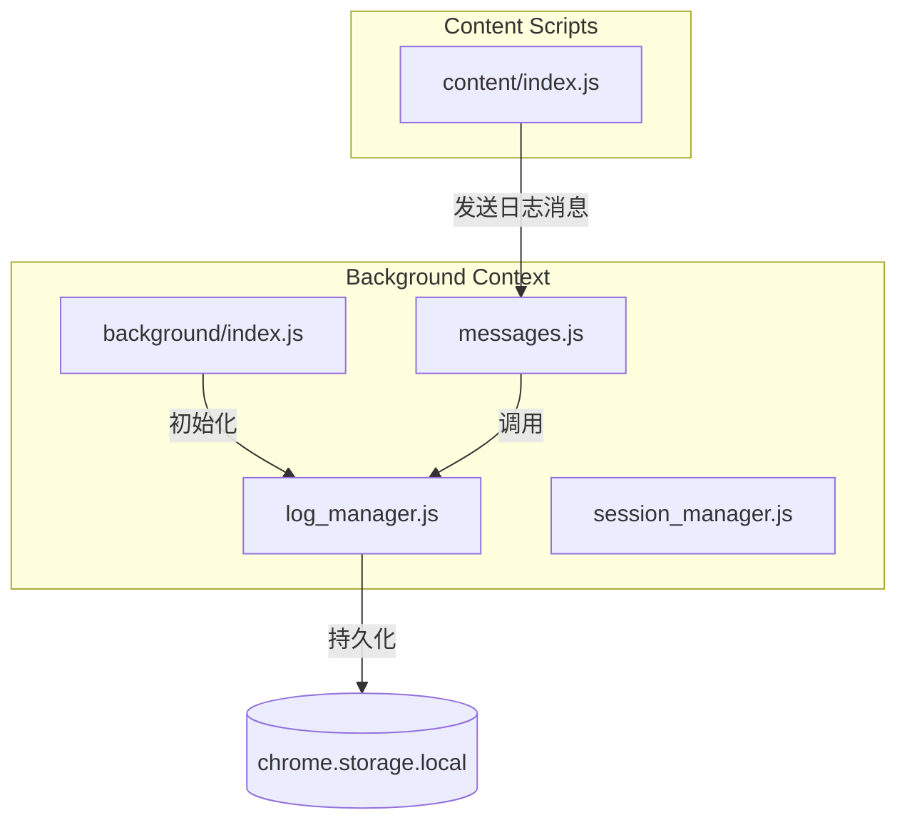
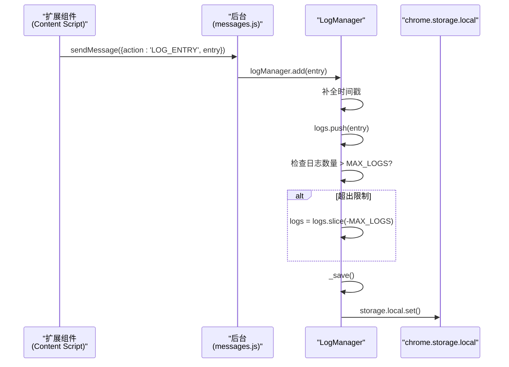
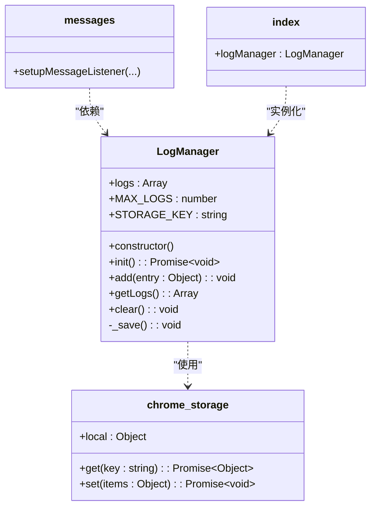

# 日志管理机制

<cite>
**本文档引用的文件**
- [log_manager.js](file://background/managers/log_manager.js)
- [index.js](file://background/index.js)
- [messages.js](file://background/messages.js)
- [manifest.json](file://manifest.json)
</cite>

## 目录
1. [简介](#简介)
2. [项目结构](#项目结构)
3. [核心组件](#核心组件)
4. [架构概述](#架构概述)
5. [详细组件分析](#详细组件分析)
6. [依赖分析](#依赖分析)
7. [性能考虑](#性能考虑)
8. [故障排除指南](#故障排除指南)
9. [结论](#结论)

## 简介
LogManager 类是 Gemini Nexus 扩展中用于集中管理日志的核心组件，运行于 background context 中。该类负责日志的收集、存储、检索和清理，确保所有扩展组件的日志能够被统一记录并持久化。LogManager 通过 Chrome 扩展的 `chrome.storage.local` API 实现日志的异步持久化，并采用先进先出（FIFO）的策略管理日志数量，防止内存溢出。

## 项目结构
Gemini Nexus 扩展的项目结构清晰地分离了不同功能模块。`LogManager` 类位于 `background/managers/` 目录下，属于后台管理模块的一部分。它与 `session_manager`、`image_manager` 等其他管理器并列，共同在 `background/index.js` 中被初始化。日志的添加请求来自扩展的各个部分（如 content scripts），通过 `chrome.runtime.sendMessage` 发送到后台，由 `messages.js` 中的消息监听器路由给 `LogManager` 处理。

**Diagram sources**
- [log_manager.js](file://background/managers/log_manager.js#L1-L62)
- [index.js](file://background/index.js#L1-L30)
- [messages.js](file://background/messages.js#L1-L82)

**Section sources**
- [log_manager.js](file://background/managers/log_manager.js#L1-L62)
- [index.js](file://background/index.js#L1-L30)

## 核心组件
`LogManager` 类是日志系统的核心，其主要职责包括：
- **初始化**：在构造函数中设置日志数组、最大日志数和存储键名，并立即调用 `init()` 方法加载历史日志。
- **日志添加**：通过 `add(entry)` 方法接收日志条目，自动补全时间戳，追加到日志数组，并在超出限制时进行裁剪。
- **持久化**：通过私有方法 `_save()` 将当前日志状态异步保存到 `chrome.storage.local`。
- **日志检索与清理**：提供 `getLogs()` 和 `clear()` 方法供外部查询和清空日志。

**Section sources**
- [log_manager.js](file://background/managers/log_manager.js#L1-L62)

## 架构概述
日志管理系统的架构遵循集中式日志模式。扩展的各个组件（content scripts, popup, sandbox）不直接操作本地存储，而是通过 `chrome.runtime.sendMessage` 发送日志消息。后台的 `messages.js` 文件中的全局消息监听器接收到 `LOG_ENTRY` 消息后，将其转发给 `LogManager` 实例。这种设计实现了日志逻辑的解耦，确保了日志管理的单一入口和数据一致性。

**Diagram sources**
- [log_manager.js](file://background/managers/log_manager.js#L1-L62)
- [messages.js](file://background/messages.js#L1-L82)

## 详细组件分析

### LogManager 类分析

#### 构造函数与初始化
`LogManager` 的构造函数是其生命周期的起点。它首先初始化三个核心属性：`this.logs`（一个空数组，用于在内存中存储日志）、`this.MAX_LOGS`（常量，值为2000，定义了日志的最大数量）和 `this.STORAGE_KEY`（字符串，值为 'gemini_nexus_logs'，作为 `chrome.storage.local` 中的键名）。初始化完成后，构造函数立即调用 `init()` 方法，这是一个异步操作，负责从本地存储中恢复历史日志。

**Section sources**
- [log_manager.js](file://background/managers/log_manager.js#L4-L27)

#### add(entry) 方法
`add(entry)` 方法是日志系统的主要入口。当一个日志条目被传入时，该方法首先检查条目是否包含 `timestamp` 字段。如果缺失，则自动使用 `Date.now()` 进行补全，确保所有日志条目都具有时间戳。随后，该条目被推入 `this.logs` 数组。紧接着，方法会检查日志数组的长度是否超过了 `MAX_LOGS` 的限制。如果超出，它会执行一个高效的裁剪操作：`this.logs = this.logs.slice(-this.MAX_LOGS)`。此操作保留了数组末尾的最后2000条日志（即最新的日志），并丢弃了最旧的日志，实现了先进先出（FIFO）的队列行为。最后，调用 `_save()` 方法将更新后的日志列表持久化。

**Section sources**
- [log_manager.js](file://background/managers/log_manager.js#L29-L40)

#### _save() 私有方法
`_save()` 方法负责将内存中的日志状态同步到持久化存储。它调用 `chrome.storage.local.set()` API，将 `this.logs` 数组以 `this.STORAGE_KEY` 为键名进行存储。值得注意的是，该方法使用了 `.catch(() => {})` 来忽略任何可能发生的异常。这种设计是为了保证系统的稳定性：即使存储操作失败（例如存储空间已满或API暂时不可用），也不会中断日志添加的主流程或导致调用者崩溃。日志的丢失在这种情况下被认为是可接受的降级行为。

**Section sources**
- [log_manager.js](file://background/managers/log_manager.js#L42-L45)

#### getLogs() 和 clear() 方法
`getLogs()` 方法非常简单，它直接返回当前内存中的 `this.logs` 数组的引用，允许外部组件（如侧边栏面板）读取所有日志。
`clear()` 方法用于清空所有日志。它首先将 `this.logs` 数组重置为空数组，然后立即调用 `_save()` 方法将空状态持久化，确保刷新后日志仍然为空。有趣的是，在清空操作之后，`clear()` 方法会调用 `this.add()` 添加一条新的日志条目，内容为 'Logs cleared'。这确保了日志清理这一重要操作本身也被记录下来，为后续的审计和调试提供了依据。

**Section sources**
- [log_manager.js](file://background/managers/log_manager.js#L47-L61)

## 依赖分析
`LogManager` 类的正常运行依赖于 Chrome 扩展平台的特定 API 和项目内的其他模块。

**Diagram sources**
- [log_manager.js](file://background/managers/log_manager.js#L1-L62)
- [messages.js](file://background/messages.js#L1-L82)
- [index.js](file://background/index.js#L1-L30)

**Section sources**
- [log_manager.js](file://background/managers/log_manager.js#L1-L62)
- [messages.js](file://background/messages.js#L1-L82)
- [index.js](file://background/index.js#L1-L30)

## 性能考虑
`LogManager` 的设计在性能和可靠性之间取得了平衡。每次调用 `add()` 都会触发一次 `chrome.storage.local.set()` 操作。虽然 `chrome.storage.local` 是异步的，不会阻塞主线程，但频繁的写入操作仍可能对性能产生影响。目前的实现没有采用防抖（debounce）或节流（throttle）策略，这意味着在短时间内产生大量日志时，会发起大量存储请求。`slice(-MAX_LOGS)` 操作的时间复杂度为 O(n)，但由于 `MAX_LOGS` 被限制为2000，这个开销是可接受的。总体而言，该设计优先保证了日志的实时性和数据的即时持久化，适合日志量不极端的场景。

## 故障排除指南
当遇到日志相关的问题时，可以参考以下步骤进行排查：
1.  **检查日志是否被发送**：确认发送日志的组件是否正确调用了 `chrome.runtime.sendMessage` 并使用了 `LOG_ENTRY` 动作。
2.  **检查消息监听器**：确认 `background/messages.js` 中的 `setupMessageListener` 是否已正确设置，并且 `logManager` 实例已作为参数传入。
3.  **检查存储权限**：在 `manifest.json` 中，确认 `"permissions"` 数组包含了 `"storage"`，这是使用 `chrome.storage.local` 的必要条件。
4.  **检查控制台错误**：查看后台页面（background page）的开发者控制台，是否有来自 `LogManager.init()` 的 `console.error("Failed to load logs", e);` 错误，这可能指示存储读取失败。
5.  **验证日志条目格式**：确保传入 `add()` 方法的日志条目是一个对象，包含 `level`、`context`、`message` 等必要字段。

**Section sources**
- [log_manager.js](file://background/managers/log_manager.js#L14-L25)
- [messages.js](file://background/messages.js#L22-L27)
- [manifest.json](file://manifest.json#L6)

## 结论
`LogManager` 类通过简洁而有效的设计，为 Gemini Nexus 扩展提供了一个健壮的日志管理解决方案。它利用 Chrome 扩展的本地存储 API 实现了日志的持久化，并通过单例模式和消息传递机制实现了日志的集中管理。其构造函数的初始化流程、`add()` 方法的标准化与裁剪策略、`_save()` 方法的异常容忍设计以及 `clear()` 方法的审计日志功能，共同构成了一个可靠、高效且易于维护的日志系统核心。该设计模式为扩展的调试、监控和用户支持提供了坚实的基础。