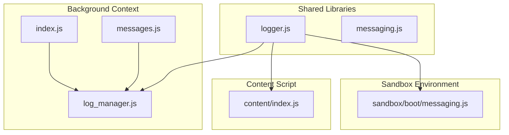
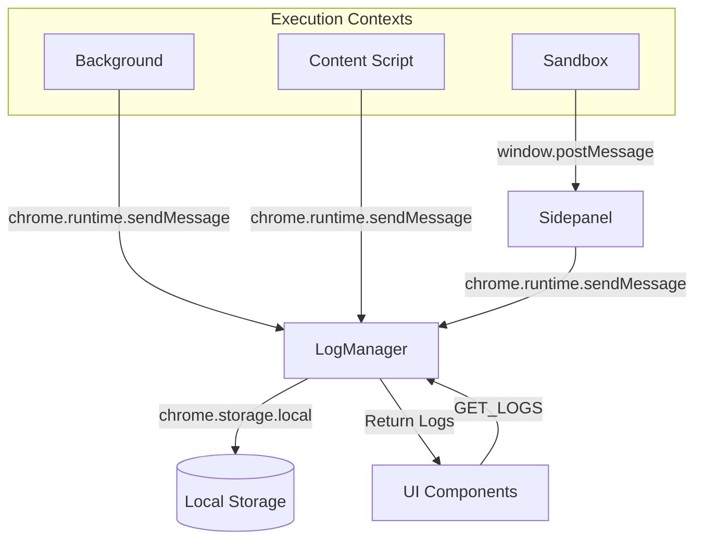
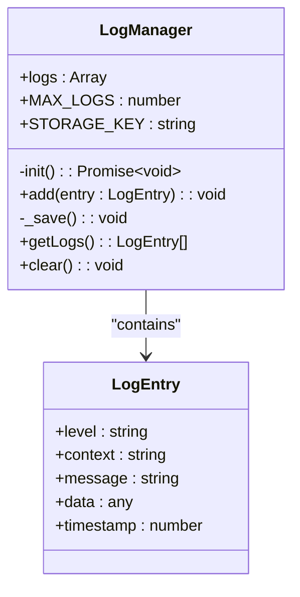
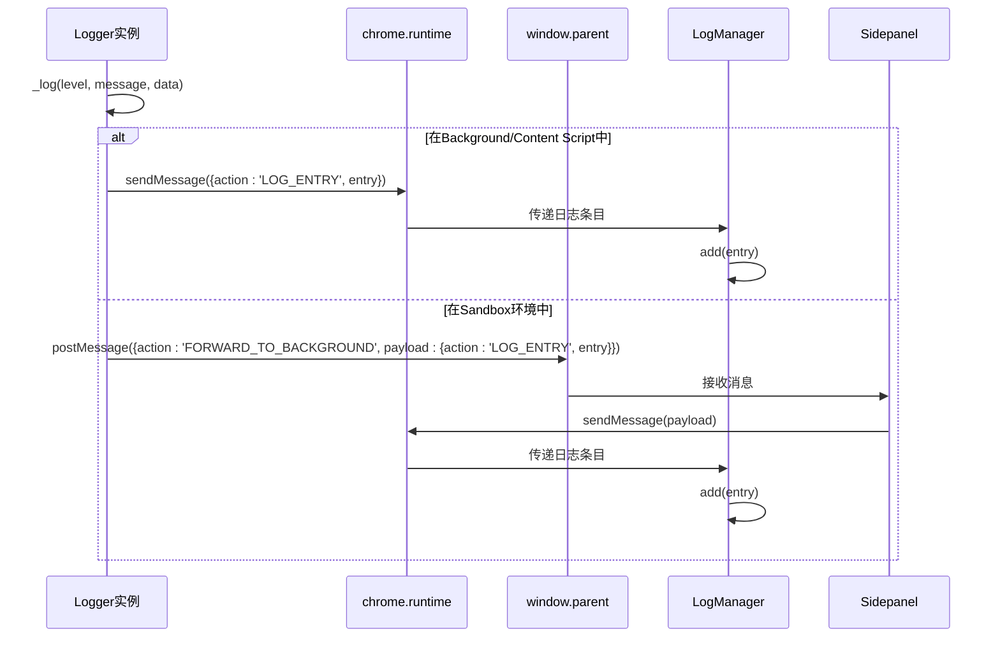
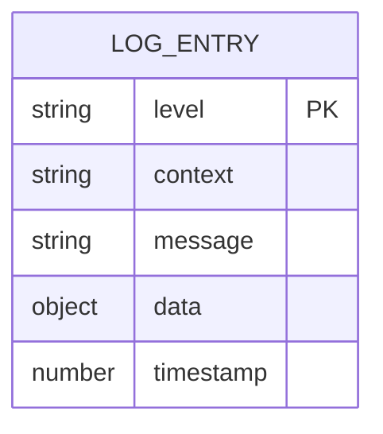
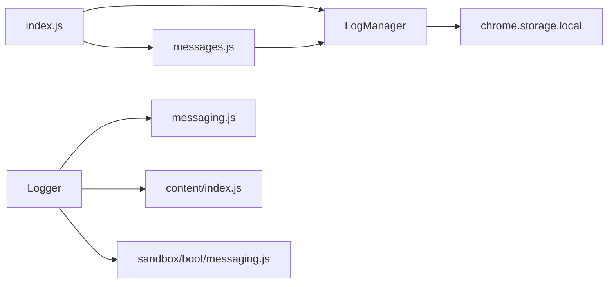

# 日志管理系统

<cite>
**本文档中引用的文件**
- [log_manager.js](file://background/managers/log_manager.js)
- [logger.js](file://lib/logger.js)
- [messages.js](file://background/messages.js)
- [index.js](file://background/index.js)
- [messaging.js](file://lib/messaging.js)
- [sandbox/boot/messaging.js](file://sandbox/boot/messaging.js)
- [content/index.js](file://content/index.js)
</cite>

## 目录
1. [简介](#简介)
2. [项目结构](#项目结构)
3. [核心组件](#核心组件)
4. [架构概述](#架构概述)
5. [详细组件分析](#详细组件分析)
6. [依赖分析](#依赖分析)
7. [性能考虑](#性能考虑)
8. [故障排除指南](#故障排除指南)
9. [结论](#结论)

## 简介
本文档深入解析Gemini Nexus扩展中的日志管理系统，重点分析LogManager和Logger类的实现机制。系统采用集中式日志管理架构，在background context中通过chrome.storage.local实现日志的持久化存储与管理。Logger类设计为跨执行环境（background、content script、sandbox）的日志记录工具，通过不同的消息传递机制将日志聚合到中央管理器。文档详细说明了日志条目结构的设计考量、容量限制策略、消息转发机制以及日志检索与管理方法。

## 项目结构
日志管理系统在项目中分布于多个关键目录，形成了一个分层的架构体系。核心管理逻辑位于background/managers目录，而通用工具类则放置在lib目录供各模块共享。

**Diagram sources**
- [log_manager.js](file://background/managers/log_manager.js)
- [logger.js](file://lib/logger.js)
- [messages.js](file://background/messages.js)
- [index.js](file://background/index.js)

**Section sources**
- [log_manager.js](file://background/managers/log_manager.js)
- [logger.js](file://lib/logger.js)
- [messages.js](file://background/messages.js)
- [index.js](file://background/index.js)
- [messaging.js](file://lib/messaging.js)

## 核心组件
日志管理系统由两个核心组件构成：LogManager负责在background context中集中管理所有日志数据，而Logger则作为各执行环境中的日志记录接口。LogManager通过chrome.storage.local实现日志的持久化存储，并设置了2000条的日志容量上限。Logger类在实例化时接受上下文参数，用于标识日志来源，并通过不同的消息传递机制将日志条目转发到中央管理器。

**Section sources**
- [log_manager.js](file://background/managers/log_manager.js#L4-L61)
- [logger.js](file://lib/logger.js#L4-L52)

## 架构概述
日志管理系统的架构采用中心化设计模式，所有日志最终都汇聚到background context中的LogManager实例进行统一管理。这种设计确保了日志数据的一致性和可追溯性，同时避免了各执行环境间日志数据的碎片化。

**Diagram sources**
- [log_manager.js](file://background/managers/log_manager.js#L4-L61)
- [logger.js](file://lib/logger.js#L28-L52)
- [messages.js](file://background/messages.js#L25-L32)
- [messaging.js](file://lib/messaging.js#L4-L8)

**Section sources**
- [log_manager.js](file://background/managers/log_manager.js#L1-L61)
- [logger.js](file://lib/logger.js#L1-L52)
- [messages.js](file://background/messages.js#L1-L82)

## 详细组件分析

### LogManager分析
LogManager类是日志系统的核心，运行在background context中，负责日志的集中存储、容量管理和持久化。它在构造函数中初始化日志数组和配置参数，并通过init方法从chrome.storage.local恢复先前保存的日志数据。

**Diagram sources**
- [log_manager.js](file://background/managers/log_manager.js#L4-L61)

**Section sources**
- [log_manager.js](file://background/managers/log_manager.js#L4-L61)
- [index.js](file://background/index.js#L17-L18)

### Logger类分析
Logger类是跨环境日志记录的统一接口，能够在不同的执行上下文中实例化并记录日志。它根据运行环境的不同，采用相应的消息传递机制将日志条目转发到background context中的LogManager。

**Diagram sources**
- [logger.js](file://lib/logger.js#L28-L47)
- [messaging.js](file://lib/messaging.js#L4-L8)
- [messages.js](file://background/messages.js#L25-L27)

**Section sources**
- [logger.js](file://lib/logger.js#L4-L52)
- [messaging.js](file://lib/messaging.js#L4-L8)
- [messages.js](file://background/messages.js#L25-L27)

### 日志条目结构
日志条目采用标准化的结构设计，包含多个关键字段，确保日志信息的完整性和可分析性。每个日志条目都包含级别、上下文、消息内容、可选数据和时间戳等信息。

**Diagram sources**
- [logger.js](file://lib/logger.js#L14-L20)
- [log_manager.js](file://background/managers/log_manager.js#L18-L23)

**Section sources**
- [logger.js](file://lib/logger.js#L14-L20)

## 依赖分析
日志管理系统与其他组件存在明确的依赖关系，形成了一个松耦合但高度协同的架构。LogManager作为核心服务被注入到消息处理器中，而Logger作为工具类被各个模块广泛引用。

**Diagram sources**
- [index.js](file://background/index.js#L17-L26)
- [messages.js](file://background/messages.js#L14-L21)
- [logger.js](file://lib/logger.js#L28-L47)

**Section sources**
- [index.js](file://background/index.js#L1-L30)
- [messages.js](file://background/messages.js#L1-L82)
- [logger.js](file://lib/logger.js#L1-L52)

## 性能考虑
日志管理系统在设计时充分考虑了性能影响。LogManager采用直接保存策略而非防抖处理，依赖chrome.storage.local的内部优化机制。为防止内存泄漏，系统设置了2000条的日志容量上限，当超过限制时自动修剪最旧的日志条目。此外，日志序列化时对数据进行深拷贝以确保可序列化性，避免因复杂对象引用导致的存储问题。

## 故障排除指南
当遇到日志系统相关问题时，可参考以下排查步骤：首先检查background context是否正常运行，可通过查看chrome://extensions页面确认。其次验证chrome.storage.local的访问权限是否正确配置。对于跨环境消息传递失败的情况，需确认Sandbox环境中的消息转发链路是否完整，特别是sidepanel的消息代理功能是否正常工作。最后，检查日志条目结构是否符合预期格式，避免因字段缺失或类型错误导致处理异常。

**Section sources**
- [log_manager.js](file://background/managers/log_manager.js#L24-L26)
- [logger.js](file://lib/logger.js#L48-L50)
- [messages.js](file://background/messages.js#L26-L27)

## 结论
Gemini Nexus的日志管理系统通过LogManager和Logger两个核心组件的协同工作，实现了跨执行环境的日志集中管理。系统采用简洁高效的设计，既保证了日志数据的完整性和持久性，又避免了过度复杂的架构带来的维护成本。通过标准化的日志条目结构和灵活的消息传递机制，该系统为扩展的调试和监控提供了可靠的基础支持。