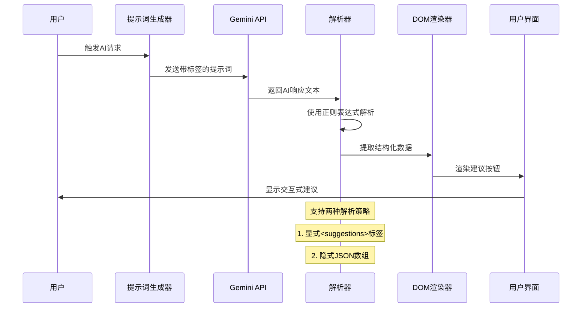
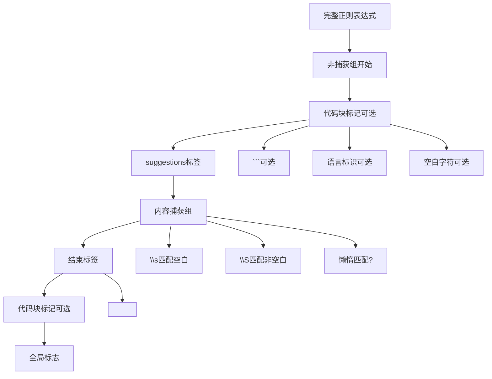
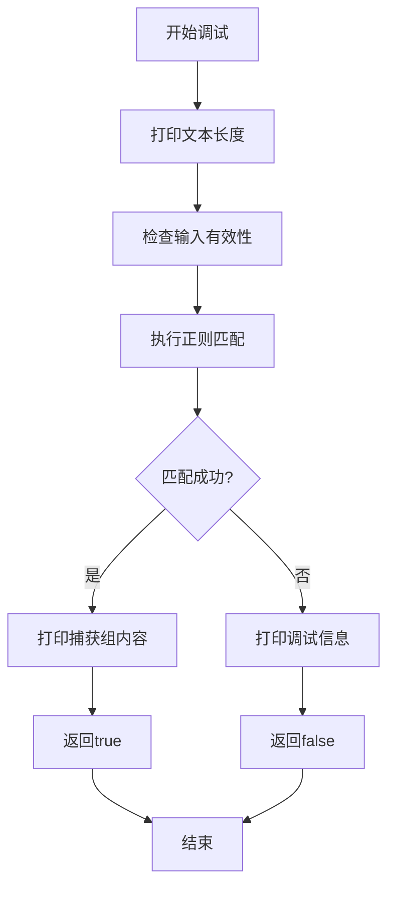
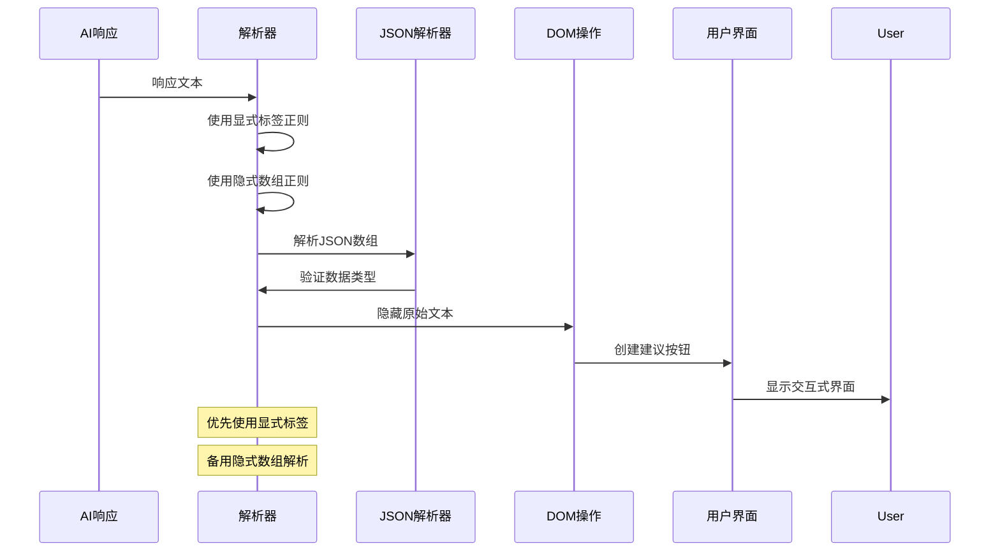
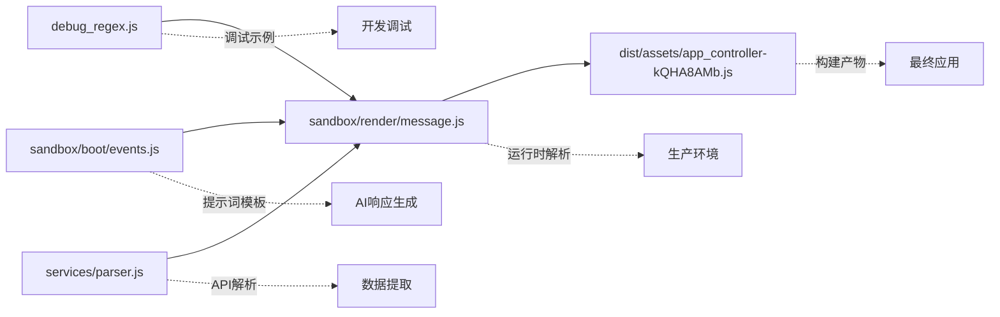

# 正则表达式调试方法

<cite>
**本文档引用的文件**
- [debug_regex.js](file://debug_regex.js)
- [sandbox/render/message.js](file://sandbox/render/message.js)
- [sandbox/boot/events.js](file://sandbox/boot/events.js)
- [dist/assets/app_controller-kQHA8AMb.js](file://dist/assets/app_controller-kQHA8AMb.js)
- [services/parser.js](file://services/parser.js)
- [README.md](file://README.md)
- [package.json](file://package.json)
</cite>

## 目录
1. [简介](#简介)
2. [项目结构](#项目结构)
3. [核心组件](#核心组件)
4. [架构概览](#架构概览)
5. [详细组件分析](#详细组件分析)
6. [依赖分析](#依赖分析)
7. [性能考虑](#性能考虑)
8. [故障排除指南](#故障排除指南)
9. [结论](#结论)

## 简介

本文档基于项目中的实际案例，详细介绍如何调试复杂的文本解析正则表达式，特别是用于提取`suggestions`标签内容的正则表达式。该正则表达式在AI响应解析场景中起着关键作用，能够从Gemini的响应文本中可靠地提取结构化数据。

该项目是一个基于Google Gemini驱动的Chrome扩展，提供了侧边栏对话、智能总结、图像分析等功能。在AI响应解析过程中，正则表达式扮演着重要的数据提取角色。

## 项目结构

项目采用模块化的架构设计，主要包含以下几个核心部分：

```mermaid
graph TB
subgraph "前端层"
A[content/] -- 内容脚本
B[sandbox/] -- 沙盒渲染环境
C[sidepanel/] -- 侧边栏界面
end
subgraph "后台层"
D[background/] -- Service Worker
E[services/] -- API服务
end
subgraph "工具层"
F[lib/] -- 工具函数
G[css/] -- 样式文件
end
subgraph "核心功能"
H[debug_regex.js] -- 正则表达式调试
I[解析器] -- AI响应解析
J[提示词生成] -- 建议问题生成
end
A --> I
B --> I
D --> I
E --> I
H --> I
J --> I
```

**图表来源**
- [README.md](file://README.md#L50-L66)
- [package.json](file://package.json#L1-L24)

**章节来源**
- [README.md](file://README.md#L50-L66)
- [package.json](file://package.json#L1-L24)

## 核心组件

### 正则表达式调试组件

项目中的正则表达式调试主要集中在`debug_regex.js`文件中，该文件展示了如何通过console.log注入调试信息来验证匹配过程。

### AI响应解析组件

在`sandbox/render/message.js`文件中，实现了完整的AI响应解析逻辑，包括两种主要的解析策略：

1. **显式标签解析**：使用`/<?\s*suggestions\s*>?\s*(\[\s*[\s\S]*?\s*\])\s*<?\s*\/\s*suggestions\s*>?/i`正则表达式
2. **隐式数组解析**：使用`/(\[\s*(?:"[^"]*"(?:\s*,\s*"[^"]*")*|'[^']*'(?:\s*,\s*'[^']*')*)\s*\])\s*$/`正则表达式

### 提示词生成组件

在`sandbox/boot/events.js`文件中，定义了完整的提示词模板，要求AI在回答末尾生成结构化的建议问题列表。

**章节来源**
- [debug_regex.js](file://debug_regex.js#L1-L30)
- [sandbox/render/message.js](file://sandbox/render/message.js#L540-L581)
- [sandbox/boot/events.js](file://sandbox/boot/events.js#L80-L100)

## 架构概览

AI响应解析的整体架构如下：



**图表来源**
- [sandbox/boot/events.js](file://sandbox/boot/events.js#L80-L100)
- [sandbox/render/message.js](file://sandbox/render/message.js#L540-L581)
- [dist/assets/app_controller-kQHA8AMb.js](file://dist/assets/app_controller-kQHA8AMb.js#L24-L26)

## 详细组件分析

### 正则表达式设计原理

#### 基础正则表达式分析

原始正则表达式：`/(?:```[\w]*\s*)?<suggestions>\s*([\s\S]*?)\s*<\/suggestions>(?:\s*```)?/i`

该表达式采用了多种高级正则特性：



**图表来源**
- [debug_regex.js](file://debug_regex.js#L16)

#### 关键语法详解

1. **非捕获组 `(?:...)`**：
   - 用于分组但不保存匹配结果
   - 减少内存占用和提升性能
   - 在代码块标记前后使用

2. **字符类 `[\s\S]`**：
   - `\s` 匹配所有空白字符（空格、制表符、换行符等）
   - `\S` 匹配所有非空白字符
   - `[\s\S]` 组合可以匹配任意字符，包括换行符

3. **懒惰匹配 `?`**：
   - 防止贪婪匹配导致的过度捕获
   - 确保只匹配第一个结束标签

4. **可选量词 `\s*`**：
   - 允许标签周围有任意数量的空白字符
   - 提高正则表达式的鲁棒性

**章节来源**
- [debug_regex.js](file://debug_regex.js#L16)

### 调试方法论

#### 控制台调试技术



**图表来源**
- [debug_regex.js](file://debug_regex.js#L11-L27)

#### 调试信息注入策略

1. **文本长度检查**：`console.log("Testing text length:", text.length)`
2. **匹配结果验证**：检查`suggestionsMatch`是否存在
3. **捕获组内容分析**：`console.log("Caught content:", suggestionsMatch[1])`

**章节来源**
- [debug_regex.js](file://debug_regex.js#L11-L27)

### 实际应用场景

#### AI响应解析流程



**图表来源**
- [sandbox/render/message.js](file://sandbox/render/message.js#L540-L581)
- [dist/assets/app_controller-kQHA8AMb.js](file://dist/assets/app_controller-kQHA8AMb.js#L24-L26)

#### 提示词生成机制

提示词模板要求AI在回答末尾生成结构化的建议问题：

```javascript
const promptWithSuggestions = prompt + `
请根据页面内容，在回答末尾额外生成 3 个用户可能感兴趣的追问问题。
要求：
1. 问题应短小精悍（不超过20字），直击用户好奇心或痛点。
2. 侧重于"如何应用"、"底层逻辑"或"反直觉的细节"。
3. 避免宽泛的"主要内容是什么"。

请严格使用以下格式封装建议问题（不要添加标题或任何其他文字，直接输出标签）：
<suggestions>
["问题1", "问题2", "问题3"]
</suggestions>`;
```

**章节来源**
- [sandbox/boot/events.js](file://sandbox/boot/events.js#L80-L100)

### 改进建议

#### 边缘情况处理

1. **嵌套标签处理**：
   - 当`suggestions`标签内包含其他HTML标签时，需要更精确的匹配
   - 建议使用平衡组或递归模式

2. **编码字符处理**：
   - 处理特殊字符转义和Unicode字符
   - 确保JSON字符串的正确解析

3. **大小写敏感性**：
   - 虽然使用了`i`标志，但仍需考虑不同大小写的变体

#### 性能优化建议

1. **预编译正则表达式**：
   ```javascript
   const SUGGESTIONS_REGEX = /<?\s*suggestions\s*>?\s*(\[\s*[\s\S]*?\s*\])\s*<?\s*\/\s*suggestions\s*>?/gi;
   ```

2. **避免回溯灾难**：
   - 使用更精确的字符类减少不必要的回溯
   - 考虑使用前瞻断言

3. **缓存解析结果**：
   - 对于重复的AI响应，缓存解析结果

#### 鲁棒性增强

1. **多重验证机制**：
   ```javascript
   if (match && isValidJSON(match[1])) {
       // 处理有效JSON
   }
   ```

2. **错误处理和降级策略**：
   - 当正则表达式失败时，尝试其他解析方法
   - 提供默认的用户体验

3. **超时机制**：
   - 为正则表达式匹配设置超时时间
   - 防止长时间阻塞UI线程

**章节来源**
- [sandbox/render/message.js](file://sandbox/render/message.js#L540-L581)
- [dist/assets/app_controller-kQHA8AMb.js](file://dist/assets/app_controller-kQHA8AMb.js#L24-L26)

## 依赖分析

### 正则表达式依赖关系



**图表来源**
- [debug_regex.js](file://debug_regex.js#L1-L30)
- [sandbox/render/message.js](file://sandbox/render/message.js#L540-L581)
- [dist/assets/app_controller-kQHA8AMb.js](file://dist/assets/app_controller-kQHA8AMb.js#L24-L26)
- [sandbox/boot/events.js](file://sandbox/boot/events.js#L80-L100)
- [services/parser.js](file://services/parser.js#L1-L157)

### 组件耦合度分析

- **低耦合**：正则表达式独立存在于多个文件中，便于维护
- **高内聚**：每个文件专注于特定的解析任务
- **清晰边界**：提示词生成、响应解析、UI渲染职责分明

**章节来源**
- [debug_regex.js](file://debug_regex.js#L1-L30)
- [sandbox/render/message.js](file://sandbox/render/message.js#L540-L581)
- [dist/assets/app_controller-kQHA8AMb.js](file://dist/assets/app_controller-kQHA8AMb.js#L24-L26)

## 性能考虑

### 正则表达式性能优化

1. **避免回溯**：
   - 使用原子组 `(?>...)` 减少不必要的回溯
   - 限制贪婪匹配的范围

2. **预编译优化**：
   - 将正则表达式存储在模块级别而非函数内部
   - 避免重复创建正则表达式对象

3. **条件匹配**：
   - 先进行简单的字符串检查，再进行复杂正则匹配
   - 使用`indexOf`等简单方法快速过滤

### 内存使用优化

1. **捕获组管理**：
   - 只保存必要的捕获组
   - 及时释放不需要的变量

2. **字符串处理**：
   - 避免创建过多的中间字符串
   - 使用流式处理大数据

## 故障排除指南

### 常见问题诊断

#### 匹配失败排查

1. **检查输入格式**：
   ```javascript
   console.log("原始文本:", text);
   console.log("文本长度:", text.length);
   console.log("首尾字符:", text.substring(0, 50));
   ```

2. **验证正则表达式**：
   ```javascript
   const testRegex = /(?:```[\w]*\s*)?<suggestions>\s*([\s\S]*?)\s*<\/suggestions>(?:\s*```)?/i;
   console.log("正则测试:", testRegex.test(text));
   ```

3. **检查编码问题**：
   ```javascript
   console.log("字符编码:", text.charCodeAt(0));
   ```

#### JSON解析错误处理

```javascript
try {
    const parsed = JSON.parse(jsonString);
    // 处理解析结果
} catch (error) {
    console.error("JSON解析失败:", error);
    console.log("问题字符串:", jsonString);
    // 尝试修复常见的JSON格式问题
}
```

### 调试最佳实践

1. **渐进式调试**：
   - 先测试简单的匹配场景
   - 逐步增加复杂度

2. **边界值测试**：
   - 空字符串、null、undefined
   - 特殊字符、Unicode字符
   - 极端长度的文本

3. **性能监控**：
   - 记录正则表达式执行时间
   - 监控内存使用情况

**章节来源**
- [debug_regex.js](file://debug_regex.js#L11-L27)
- [sandbox/render/message.js](file://sandbox/render/message.js#L573-L576)

## 结论

通过对项目中正则表达式调试方法的深入分析，我们可以得出以下结论：

### 技术要点总结

1. **正则表达式设计原则**：
   - 使用非捕获组提高性能
   - 采用懒惰匹配避免过度捕获
   - 利用可选量词增强鲁棒性

2. **调试方法论**：
   - 通过console.log注入调试信息
   - 分步骤验证匹配过程
   - 多层次的错误处理机制

3. **AI响应解析策略**：
   - 显式标签解析优先
   - 隐式数组解析作为后备
   - 多种验证机制确保数据完整性

### 最佳实践建议

1. **开发阶段**：
   - 在独立文件中进行正则表达式测试
   - 建立完整的测试用例集
   - 使用性能分析工具监控执行效率

2. **生产环境**：
   - 实施监控和告警机制
   - 建立降级和回滚策略
   - 持续收集用户反馈进行优化

3. **团队协作**：
   - 制定正则表达式编写规范
   - 建立代码审查机制
   - 编写详细的文档和注释

这个正则表达式调试案例展示了如何在实际项目中有效地处理复杂的文本解析任务，特别是在AI响应解析这种对准确性要求极高的场景中。通过系统性的调试方法和持续的优化改进，可以确保正则表达式在各种边缘情况下都能可靠地提取结构化数据。