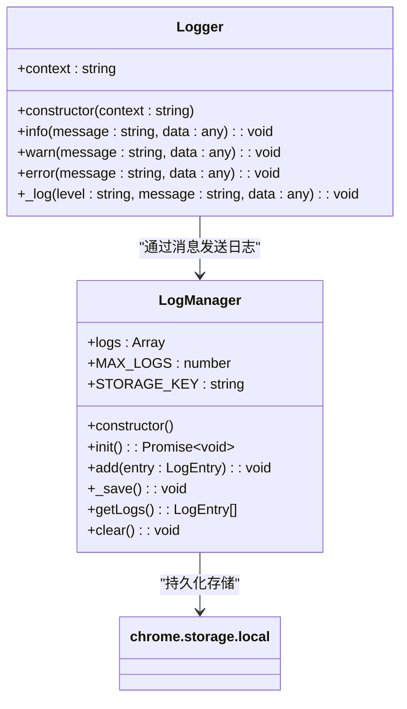
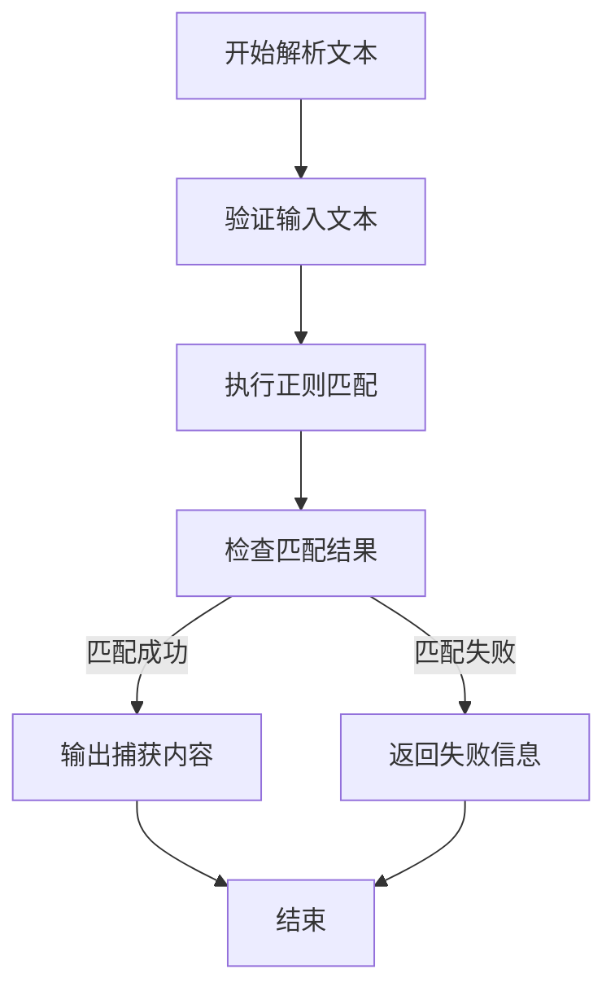
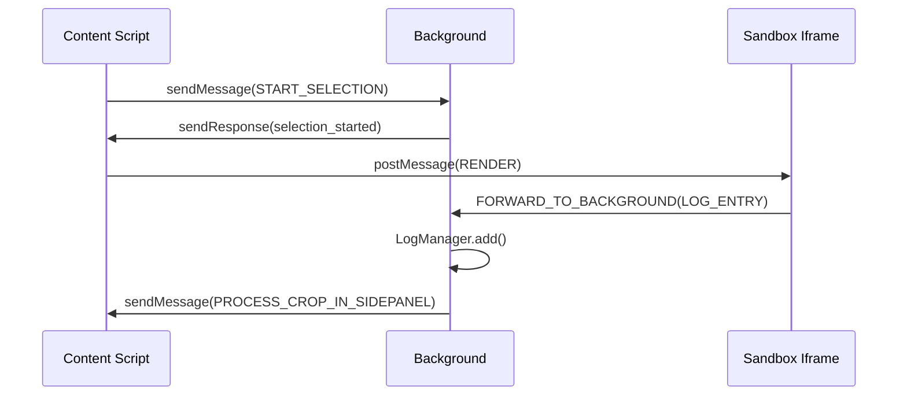
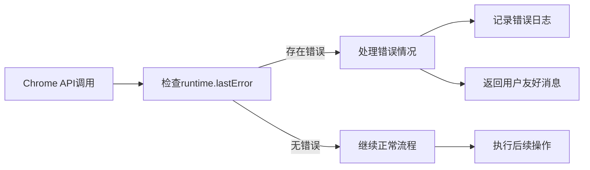

# 调试技巧与日志分析

<cite>
**本文档中引用的文件**  
- [log_manager.js](file://background/managers/log_manager.js)
- [logger.js](file://lib/logger.js)
- [debug_regex.js](file://debug_regex.js)
- [messages.js](file://background/messages.js)
- [messaging.js](file://lib/messaging.js)
- [bridge.js](file://content/toolbar/bridge.js)
- [connection.js](file://background/control/connection.js)
- [observation.js](file://background/control/actions/observation.js)
- [control_manager.js](file://background/managers/control_manager.js)
- [index.js](file://background/index.js)
- [index.js](file://content/index.js)
- [messaging.js](file://sandbox/boot/messaging.js)
- [session/utils.js](file://background/handlers/session/utils.js)
</cite>

## 目录
1. [简介](#简介)
2. [分层日志系统架构](#分层日志系统架构)
3. [核心日志组件分析](#核心日志组件分析)
4. [正则表达式调试方法](#正则表达式调试方法)
5. [多上下文调试策略](#多上下文调试策略)
6. [典型问题诊断路径](#典型问题诊断路径)
7. [运行时异常处理](#运行时异常处理)
8. [结论](#结论)

## 简介
本指南深入解析Gemini Nexus扩展的调试体系，重点介绍基于`log_manager.js`和`logger.js`的分层日志记录机制，以及`debug_regex.js`中的正则表达式测试方法。文档涵盖Chrome开发者工具在不同执行环境（background、content script、sandbox）中的调试策略，并提供消息通信、DOM注入、权限错误等常见问题的诊断路径。

## 分层日志系统架构

```mermaid
graph TD
A["Logger (lib/logger.js)"] --> |发送日志条目| B["chrome.runtime.sendMessage"]
C["Sandbox Iframe"] --> |通过postMessage转发| D["Sidepanel"]
D --> |转发至Background| B
B --> E["LogManager (background/managers/log_manager.js)"]
E --> F["chrome.storage.local"]
G["开发者工具 Console"] <--|本地输出| A
H["日志查看界面"] --> |读取| E
E --> |持久化存储| F
```

**图示来源**
- [logger.js](file://lib/logger.js#L28-L52)
- [messages.js](file://background/messages.js#L25-L32)
- [log_manager.js](file://background/managers/log_manager.js#L29-L45)

**本节来源**
- [logger.js](file://lib/logger.js#L1-L53)
- [log_manager.js](file://background/managers/log_manager.js#L1-L62)
- [messages.js](file://background/messages.js#L25-L32)

## 核心日志组件分析

### LogManager 组件
`LogManager`类负责在background环境中集中管理和持久化存储所有日志条目。它使用`chrome.storage.local`进行数据存储，维护一个最大容量为2000条的循环日志缓冲区。



**图示来源**
- [log_manager.js](file://background/managers/log_manager.js#L4-L61)
- [logger.js](file://lib/logger.js#L4-L52)

### Logger 工具类
`Logger`是一个通用日志工具类，可在不同执行上下文中实例化。它根据运行环境智能选择消息传递路径：在background或content script中直接使用`chrome.runtime.sendMessage`，在sandbox iframe中则通过`postMessage`机制转发。

**本节来源**
- [logger.js](file://lib/logger.js#L1-L53)
- [log_manager.js](file://background/managers/log_manager.js#L1-L62)

## 正则表达式调试方法

### debug_regex.js 分析
`debug_regex.js`文件提供了一个实际的正则表达式调试场景，用于从文本中提取`suggestions`标签内的内容。该文件通过`console.log`注入和文本匹配测试来验证复杂文本解析逻辑。



**图示来源**
- [debug_regex.js](file://debug_regex.js#L11-L27)

### 正则表达式模式
当前使用的正则表达式模式为：
```
/(?:```[\w]*\s*)?<suggestions>\s*([\s\S]*?)\s*<\/suggestions>(?:\s*```)?/i
```
该模式设计用于匹配可选的代码块标记（```）、`<suggestions>`标签及其内容，并忽略首尾空白字符。

**本节来源**
- [debug_regex.js](file://debug_regex.js#L1-L30)

## 多上下文调试策略

### 执行环境概览
Gemini Nexus扩展在三个主要上下文中运行：
- **Background**: 主要业务逻辑和状态管理
- **Content Script**: 页面DOM交互和用户操作
- **Sandbox**: 隔离的渲染环境，防止XSS攻击

### 断点设置与作用域检查
在不同上下文中设置断点时需注意：
- **Background**: 在`background/index.js`中设置断点可捕获全局消息流
- **Content Script**: 在`content/index.js`中监听`chrome.runtime.onMessage`可调试页面交互
- **Sandbox**: 在`sandbox/index.js`中调试渲染逻辑，注意iframe隔离环境

### 异步调用栈分析
由于大量使用Promise和异步操作，建议在Chrome开发者工具中启用"Async"调用栈跟踪，以完整查看跨消息边界的执行流程。



**图示来源**
- [content/index.js](file://content/index.js#L19-L82)
- [messages.js](file://background/messages.js#L22-L81)
- [messaging.js](file://sandbox/boot/messaging.js#L12-L90)

**本节来源**
- [content/index.js](file://content/index.js#L1-L190)
- [messages.js](file://background/messages.js#L1-L82)
- [messaging.js](file://sandbox/boot/messaging.js#L1-L90)

## 典型问题诊断路径

### 消息通信失败
当出现消息通信问题时，应按以下路径诊断：
1. 检查发送方上下文是否正确
2. 验证消息监听器是否已正确注册
3. 查看`LogManager`中的日志记录
4. 确认`chrome.runtime.lastError`状态

### DOM注入异常
DOM注入问题的排查步骤：
1. 检查content script是否已正确注入
2. 验证DOM选择器的准确性
3. 查看页面权限设置
4. 检查CSP（内容安全策略）限制

### 权限错误
权限相关问题的诊断方法：
1. 检查`manifest.json`中的权限声明
2. 验证敏感API调用的条件
3. 查看Chrome扩展管理页面的权限警告
4. 测试受限URL（如chrome://）的行为

**本节来源**
- [content/index.js](file://content/index.js#L19-L190)
- [control_manager.js](file://background/managers/control_manager.js#L20-L31)
- [connection.js](file://background/control/connection.js#L74-L78)

## 运行时异常处理

### chrome.runtime.lastError 使用
`chrome.runtime.lastError`是处理Chrome API异步调用错误的关键机制。在以下文件中均有应用：



**图示来源**
- [observation.js](file://background/control/actions/observation.js#L9-L17)
- [connection.js](file://background/control/connection.js#L74-L78)

### 错误捕获与恢复机制
系统实现了多层次的错误处理：
- **前端捕获**: 在`logger.js`中使用try-catch包裹消息发送
- **后端处理**: 在`control_manager.js`中捕获工具执行异常
- **降级策略**: 当调试器无法附加时，仍允许基本操作继续

**本节来源**
- [observation.js](file://background/control/actions/observation.js#L7-L95)
- [control_manager.js](file://background/managers/control_manager.js#L153-L156)
- [logger.js](file://lib/logger.js#L28-L50)

## 结论
Gemini Nexus扩展通过`log_manager.js`和`logger.js`构建了完善的分层日志系统，结合`debug_regex.js`提供的文本解析调试方法，形成了强大的调试能力。开发者应熟练掌握不同执行上下文的调试策略，善用`chrome.runtime.lastError`机制处理运行时异常，并遵循文档提供的诊断路径解决常见问题。