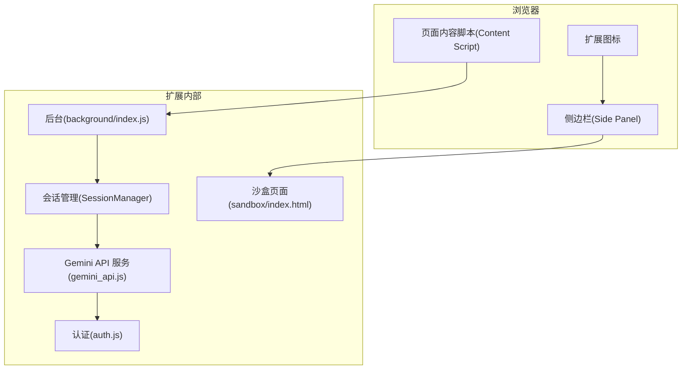
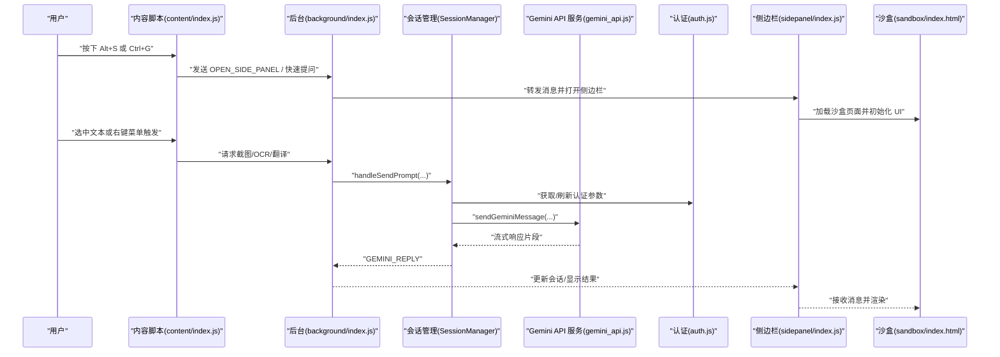
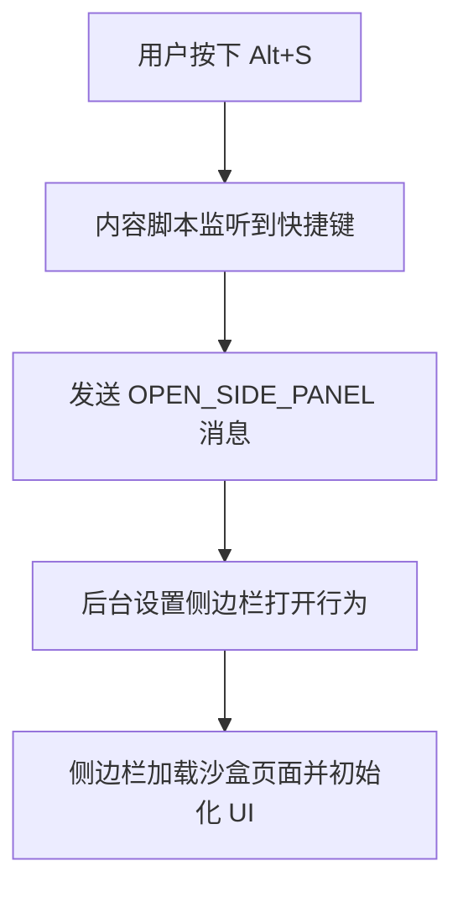
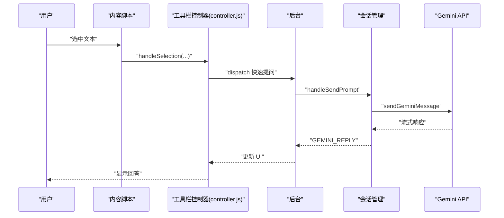
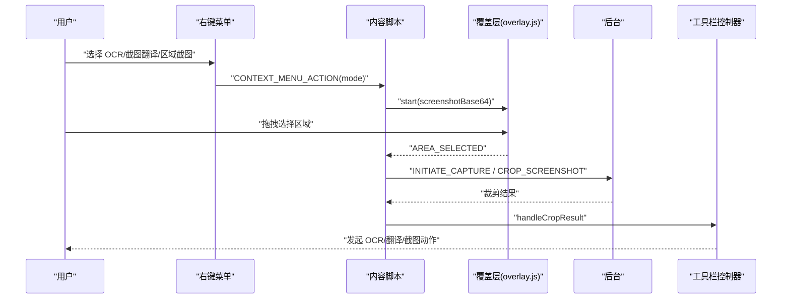
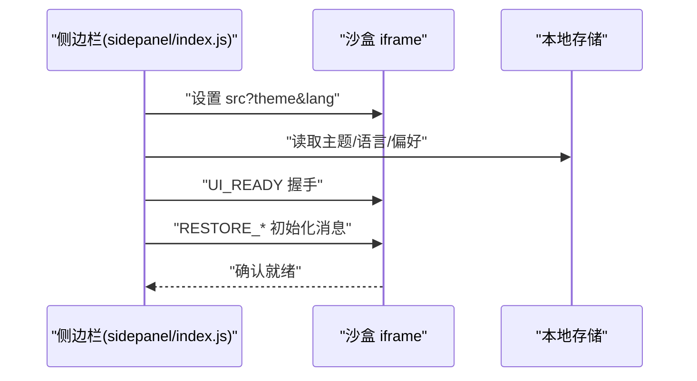
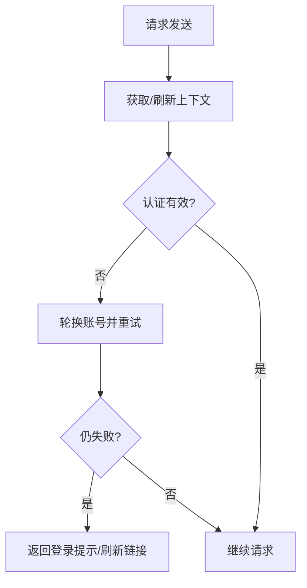
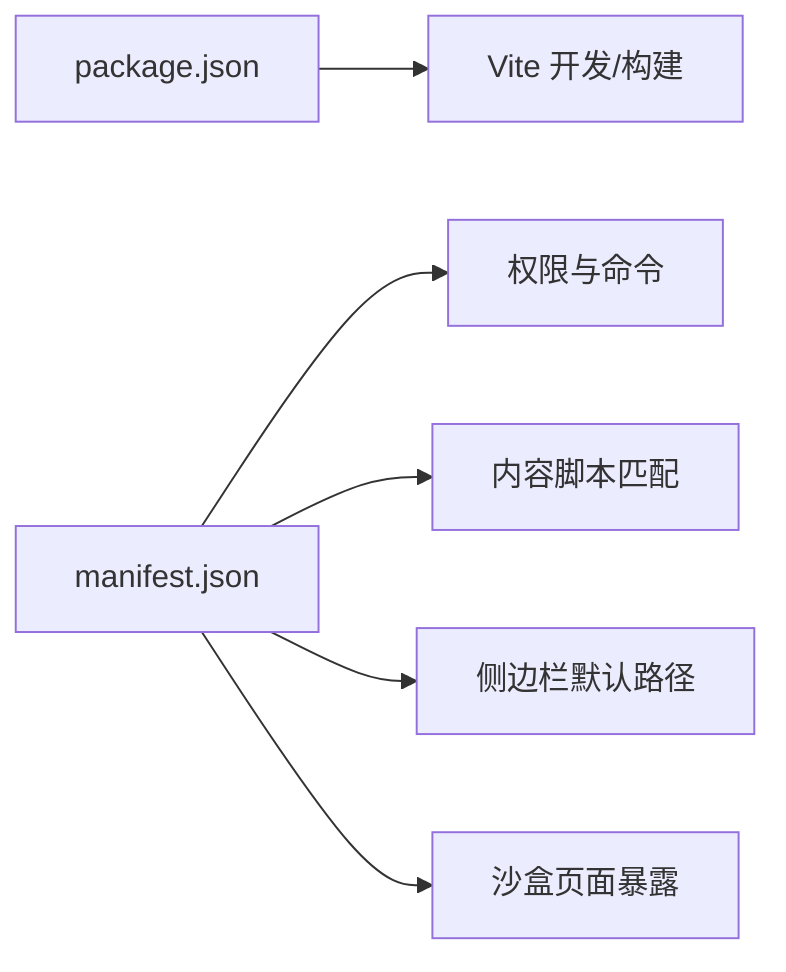

# 快速开始

<cite>
**本文引用的文件**
- [README.md](file://README.md)
- [package.json](file://package.json)
- [manifest.json](file://manifest.json)
- [background/index.js](file://background/index.js)
- [content/index.js](file://content/index.js)
- [services/gemini_api.js](file://services/gemini_api.js)
- [sidepanel/index.js](file://sidepanel/index.js)
- [content/toolbar/controller.js](file://content/toolbar/controller.js)
- [background/managers/session_manager.js](file://background/managers/session_manager.js)
- [services/auth.js](file://services/auth.js)
- [sandbox/index.html](file://sandbox/index.html)
- [content/overlay.js](file://content/overlay.js)
- [background/menus.js](file://background/menus.js)
- [lib/constants.js](file://lib/constants.js)
</cite>

## 目录
1. [简介](#简介)
2. [项目结构](#项目结构)
3. [核心组件](#核心组件)
4. [架构总览](#架构总览)
5. [详细组件分析](#详细组件分析)
6. [依赖关系分析](#依赖关系分析)
7. [性能注意事项](#性能注意事项)
8. [故障排除指南](#故障排除指南)
9. [结论](#结论)
10. [附录](#附录)

## 简介
本指南面向首次接触 Gemini Nexus Chrome 扩展的新用户，目标是在约 10 分钟内完成开发环境搭建、扩展加载、首次登录与核心功能体验。你将学会：
- 克隆仓库与安装依赖
- 在 Chrome 中以开发者模式加载扩展
- 配置 Google 账号登录 Gemini
- 使用 Alt+S 打开侧边栏进行对话
- 选中文本触发“快速提问”
- 使用截图工具进行 OCR/截图翻译/区域截图
- 通过最小可行示例验证安装成功

## 项目结构
该扩展采用 Manifest V3 架构，主要模块包括：
- background：后台服务（消息处理、会话管理、菜单、定时器等）
- content：内容脚本（浮动工具栏、选中事件监听、快捷键、截图覆盖层）
- sandbox：沙盒页面（侧边栏 UI 的承载页，延迟加载第三方库）
- sidepanel：侧边栏入口与数据桥接
- services：与 Gemini API 通信、认证、文件上传、响应解析
- lib：常量、工具函数
- 样式与资源：CSS、图标、模板

图表来源
- [manifest.json](file://manifest.json#L11-L40)
- [background/index.js](file://background/index.js#L1-L30)
- [services/gemini_api.js](file://services/gemini_api.js#L1-L230)
- [services/auth.js](file://services/auth.js#L1-L41)
- [sandbox/index.html](file://sandbox/index.html#L1-L28)

章节来源
- [README.md](file://README.md#L50-L66)
- [manifest.json](file://manifest.json#L1-L93)

## 核心组件
- 后台初始化与侧边栏行为：后台入口负责设置侧边栏行为、初始化各管理器、注册上下文菜单与消息监听。
- 内容脚本与浮动工具栏：监听快捷键、选中事件，显示浮动工具栏，处理截图覆盖层与裁剪结果。
- 会话管理与消息转发：封装 Gemini API 调用，处理多账号轮换、MCP 工具链注入与执行。
- 沙盒与侧边栏桥接：侧边栏通过 iframe 加载沙盒页面，实现主题/语言即时加载与本地存储缓存。
- 认证与请求参数：从 Gemini 页面抓取 AT/BL 等令牌，支持多账号索引。

章节来源
- [background/index.js](file://background/index.js#L1-L30)
- [content/index.js](file://content/index.js#L1-L190)
- [background/managers/session_manager.js](file://background/managers/session_manager.js#L1-L285)
- [sidepanel/index.js](file://sidepanel/index.js#L1-L425)
- [services/auth.js](file://services/auth.js#L1-L41)

## 架构总览
下图展示从用户操作到 Gemini API 响应的端到端流程，包括快捷键、右键菜单、截图、会话管理与沙盒 UI 更新。

图表来源
- [content/index.js](file://content/index.js#L176-L190)
- [background/index.js](file://background/index.js#L24-L29)
- [background/managers/session_manager.js](file://background/managers/session_manager.js#L21-L202)
- [services/gemini_api.js](file://services/gemini_api.js#L26-L230)
- [services/auth.js](file://services/auth.js#L7-L40)
- [sidepanel/index.js](file://sidepanel/index.js#L151-L424)
- [sandbox/index.html](file://sandbox/index.html#L1-L28)

## 详细组件分析

### 组件一：开发环境搭建与扩展加载
- 步骤要点
  - 克隆仓库与安装依赖：使用包管理器安装构建与运行所需依赖。
  - Chrome 加载扩展：开启开发者模式，加载已解压的扩展目录。
  - 登录 Gemini：确保已在 gemini.google.com 登录 Google 账号。
- 关键文件
  - 安装说明与快捷键定义见 README。
  - Manifest V3 权限与命令、侧边栏路径、内容脚本匹配规则见 manifest。
  - 构建脚本与依赖声明见 package。

章节来源
- [README.md](file://README.md#L26-L49)
- [manifest.json](file://manifest.json#L1-L93)
- [package.json](file://package.json#L1-L24)

### 组件二：快捷键与右键菜单
- 快捷键
  - Alt+S：打开侧边栏
  - Ctrl/Cmd+P：聚焦输入框（由内容脚本处理）
  - Ctrl+G：快速提问（浮动工具栏）
- 右键菜单
  - 提供“快速提问”、“与当前网页对话”、“OCR”、“截图翻译”、“区域截图”等选项，对应不同模式的触发。

图表来源
- [content/index.js](file://content/index.js#L176-L190)
- [manifest.json](file://manifest.json#L25-L33)
- [background/index.js](file://background/index.js#L13-L14)

章节来源
- [README.md](file://README.md#L68-L84)
- [content/index.js](file://content/index.js#L114-L152)
- [background/menus.js](file://background/menus.js#L66-L94)

### 组件三：选中文本与快速提问
- 流程
  - 用户选中文本，浮动工具栏出现，支持“快速提问”。
  - 内容脚本将选中文本传递给后台，后台通过会话管理器调用 Gemini API。
  - 结果通过消息回传至侧边栏，沙盒 UI 渲染回复。
- 关键点
  - 选中状态监听与 UI 显示由内容脚本与浮动工具栏控制器协作完成。
  - 会话管理器负责并发控制、多账号轮换与错误处理。

图表来源
- [content/index.js](file://content/index.js#L194-L110)
- [content/toolbar/controller.js](file://content/toolbar/controller.js#L189-L214)
- [background/managers/session_manager.js](file://background/managers/session_manager.js#L21-L202)
- [services/gemini_api.js](file://services/gemini_api.js#L26-L230)

章节来源
- [content/index.js](file://content/index.js#L194-L110)
- [content/toolbar/controller.js](file://content/toolbar/controller.js#L189-L214)

### 组件四：截图工具（OCR/截图翻译/区域截图）
- 流程
  - 右键菜单选择相应模式，内容脚本启动覆盖层，允许用户拖拽选择区域。
  - 选择完成后，内容脚本向后台发送区域信息，后台处理截图与裁剪，再将结果交由工具栏动作处理。
- 关键点
  - 覆盖层使用全屏遮罩与动态矩形绘制，支持 ESC 取消。
  - 侧边栏与沙盒之间通过 postMessage 进行数据同步与 UI 更新。

图表来源
- [background/menus.js](file://background/menus.js#L66-L94)
- [content/overlay.js](file://content/overlay.js#L22-L195)
- [content/index.js](file://content/index.js#L48-L83)
- [content/toolbar/controller.js](file://content/toolbar/controller.js#L119-L153)

章节来源
- [content/overlay.js](file://content/overlay.js#L1-L213)
- [content/index.js](file://content/index.js#L48-L83)
- [content/toolbar/controller.js](file://content/toolbar/controller.js#L119-L153)

### 组件五：侧边栏与沙盒 UI 初始化
- 流程
  - 侧边栏加载时立即设置主题与语言缓存，避免异步延迟。
  - 并行预取本地存储数据，随后一次性向沙盒发送初始化消息，确保 UI 就绪信号与数据同步。
- 关键点
  - 通过 localStorage 缓存主题/语言，提升首屏加载速度。
  - 侧边栏与沙盒通过 postMessage 交换数据，支持“UI_READY”握手。

图表来源
- [sidepanel/index.js](file://sidepanel/index.js#L7-L137)
- [sandbox/index.html](file://sandbox/index.html#L1-L28)

章节来源
- [sidepanel/index.js](file://sidepanel/index.js#L1-L425)
- [sandbox/index.html](file://sandbox/index.html#L1-L28)

### 组件六：认证与多账号轮换
- 流程
  - 从 gemini.google.com 页面抓取 AT/BL 等令牌，支持指定账号索引。
  - 会话管理器在认证失败时尝试轮换账号并重试一次。
- 关键点
  - 当检测到未登录或会话过期时，返回可点击的登录链接提示。
  - 错误分类与本地化提示由后台统一处理。

图表来源
- [services/auth.js](file://services/auth.js#L7-L40)
- [background/managers/session_manager.js](file://background/managers/session_manager.js#L129-L199)

章节来源
- [services/auth.js](file://services/auth.js#L1-L41)
- [background/managers/session_manager.js](file://background/managers/session_manager.js#L1-L285)

## 依赖关系分析
- 构建与运行
  - 使用 Vite 作为开发服务器与打包工具，类型与依赖声明见 package。
- Manifest V3 权限
  - 包含 sidePanel、storage、contextMenus、scripting、alarms、debugger、downloads 等权限，以及对 gemini.google.com 的主机权限。
- 内容脚本与沙盒
  - 通过 web_accessible_resources 暴露 logo 与沙盒页面，content_security_policy 为沙盒启用脚本沙箱能力。

图表来源
- [package.json](file://package.json#L1-L24)
- [manifest.json](file://manifest.json#L1-L93)

章节来源
- [package.json](file://package.json#L1-L24)
- [manifest.json](file://manifest.json#L1-L93)

## 性能注意事项
- 侧边栏加载优化
  - 主题/语言通过 localStorage 缓存，避免等待异步存储读取。
  - 预取本地存储数据并在 UI_READY 后一次性注入，减少多次消息往返。
- 内容脚本与覆盖层
  - 覆盖层使用全屏遮罩与动态矩形绘制，避免 UI 被截图捕获。
  - 选中事件监听与 UI 显示按需触发，降低不必要的 DOM 操作。
- 沙盒懒加载
  - 沙盒页面样式集中加载，脚本延迟加载第三方库，缩短首屏渲染时间。

章节来源
- [sidepanel/index.js](file://sidepanel/index.js#L7-L137)
- [content/overlay.js](file://content/overlay.js#L29-L92)
- [sandbox/index.html](file://sandbox/index.html#L10-L21)

## 故障排除指南
- 开发者模式未开启
  - 症状：无法加载扩展。
  - 解决：在 chrome://extensions/ 中开启“开发者模式”，然后“加载已解压的扩展程序”。
- 权限不足或跨域问题
  - 症状：无法访问某些页面或沙盒资源。
  - 解决：确认 manifest 中 host_permissions 与 web_accessible_resources 配置正确。
- 未登录或会话过期
  - 症状：收到“未登录/会话过期”提示，或返回登录链接。
  - 解决：在 gemini.google.com 登录 Google 账号；若使用多账号，可在设置中切换账号索引。
- 请求过于频繁
  - 症状：提示“请求过于频繁，请稍后再试”。
  - 解决：等待几分钟后重试，或降低请求频率。
- 服务器无响应或响应解析失败
  - 症状：提示“服务器无响应/响应解析失败”。
  - 解决：刷新 gemini.google.com 页面后重试。

章节来源
- [README.md](file://README.md#L26-L49)
- [background/managers/session_manager.js](file://background/managers/session_manager.js#L159-L192)

## 结论
通过本指南，你已完成 Gemini Nexus 的开发环境搭建、扩展加载与首次登录，并掌握了核心功能的使用方式：打开侧边栏、选中文本快速提问、使用截图工具进行 OCR/翻译/截图。建议在首次使用后，进入设置面板调整模型、账号索引与工具开关，以获得更贴合个人需求的体验。

## 附录

### 最小可行示例：验证安装成功
- 打开任意网页，按下 Alt+S 打开侧边栏，确认沙盒页面加载成功。
- 在侧边栏中输入一条简单问题，点击发送，观察是否有回复。
- 选中文本，点击浮动工具栏的“快速提问”，确认内容脚本与后台通信正常。
- 右键菜单选择“OCR/截图翻译/区域截图”，确认覆盖层与裁剪流程可用。

章节来源
- [README.md](file://README.md#L68-L84)
- [content/index.js](file://content/index.js#L176-L190)
- [content/overlay.js](file://content/overlay.js#L22-L195)