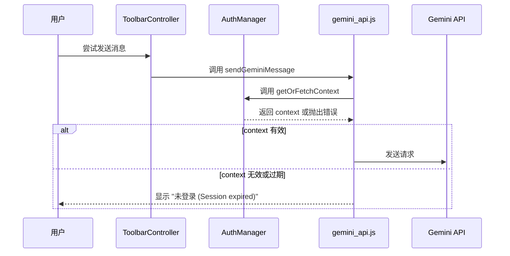
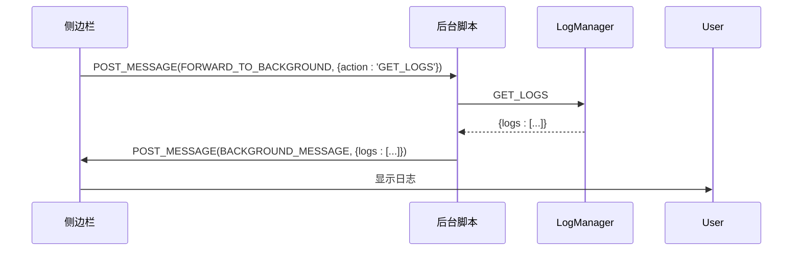

# 故障排除

<cite>
**本文档中引用的文件**  
- [log_manager.js](file://background/managers/log_manager.js)
- [logger.js](file://lib/logger.js)
- [auth_manager.js](file://background/managers/auth_manager.js)
- [gemini_api.js](file://services/gemini_api.js)
- [controller.js](file://content/toolbar/controller.js)
- [ui/manager.js](file://content/toolbar/ui/manager.js)
- [messages.js](file://background/messages.js)
- [manifest.json](file://manifest.json)
- [session.js](file://background/handlers/session.js)
</cite>

## 目录
1. [简介](#简介)
2. [日志系统分析](#日志系统分析)
3. [常见问题及解决方案](#常见问题及解决方案)
4. [诊断步骤](#诊断步骤)
5. [错误代码含义与修复方法](#错误代码含义与修复方法)
6. [联系支持与问题报告](#联系支持与问题报告)
7. [高级调试与性能分析](#高级调试与性能分析)

## 简介
本故障排除指南旨在帮助用户和开发者解决使用 Gemini Nexus 扩展时遇到的常见问题。通过深入分析 `log_manager.js` 和 `logger.js` 构建的日志系统，本文档将指导您如何收集和分析错误日志。我们将列出典型问题（如认证失败、API调用错误、工具栏不显示、截图功能异常等）的解决方案，并提供详细的诊断步骤。此外，还将解释关键错误代码的含义，提供联系支持的渠道和问题报告模板，并为高级用户提供调试模式启用方法和性能分析技巧。

## 日志系统分析

Gemini Nexus 的日志系统由两个核心组件构成：`log_manager.js` 和 `logger.js`，分别负责日志的集中存储与分布式记录。

```mermaid
classDiagram
class LogManager {
+Array logs
+Number MAX_LOGS
+String STORAGE_KEY
+constructor()
+init() Promise~void~
+add(entry) void
+_save() void
+getLogs() Array
+clear() void
}
class Logger {
+String context
+constructor(context)
+info(message, data) void
+warn(message, data) void
+error(message, data) void
+_log(level, message, data) void
}
Logger --> LogManager : "通过 runtime.sendMessage 发送日志条目"
LogManager --> "chrome.storage.local" : "持久化存储日志"
```

**图表来源**
- [log_manager.js](file://background/managers/log_manager.js#L4-L61)
- [logger.js](file://lib/logger.js#L4-L52)

**日志工作流程：**
1.  **记录**：应用的各个模块（如内容脚本、后台脚本）创建 `Logger` 实例，并调用 `info()`、`warn()` 或 `error()` 方法记录事件。
2.  **传输**：`Logger` 实例将日志条目通过 `chrome.runtime.sendMessage` 发送到后台脚本。
3.  **集中化**：后台脚本中的 `LogManager` 接收这些消息（`action: 'LOG_ENTRY'`），并将日志条目添加到其内部数组中。
4.  **持久化**：`LogManager` 使用 `chrome.storage.local` 将日志数据异步保存，确保刷新后日志不丢失。
5.  **检索**：其他组件（如侧边栏）可以通过发送 `GET_LOGS` 消息来获取所有日志进行分析。

**日志条目结构：**
每个日志条目是一个包含以下字段的 JSON 对象：
- **level**: 日志级别 (`INFO`, `WARN`, `ERROR`)
- **context**: 记录日志的上下文或模块名称 (e.g., `Background`, `ContentScript`)
- **message**: 日志消息文本
- **data**: 可选的附加数据对象
- **timestamp**: 时间戳 (毫秒)

**Section sources**
- [log_manager.js](file://background/managers/log_manager.js#L1-L62)
- [logger.js](file://lib/logger.js#L1-L53)

## 常见问题及解决方案

### 认证失败
**问题描述**：用户无法登录或会话频繁过期，导致无法与 Gemini 服务通信。

**根本原因**：
- Chrome 扩展的认证状态与 Google 账户会话不同步。
- `AuthManager` 未能正确获取或刷新认证令牌 (`atValue`, `blValue`)。

**解决方案**：
1.  **手动刷新会话**：在 `auth_manager.js` 中，`resetContext()` 方法会清除当前的认证上下文并触发账户轮换，强制重新获取令牌。
2.  **检查网络和登录状态**：确保您已登录到正确的 Google 账户，并且网络连接正常。
3.  **清除扩展数据**：在 Chrome 扩展设置中，清除 Gemini Nexus 的站点数据和缓存。



**图表来源**
- [auth_manager.js](file://background/managers/auth_manager.js#L75-L91)
- [gemini_api.js](file://services/gemini_api.js#L28-L37)

### API调用错误
**问题描述**：向 Gemini 服务发送请求时失败，返回网络错误或无效响应。

**根本原因**：
- **网络问题**：无法连接到 `gemini.google.com` 或 `content-push.googleapis.com`。
- **速率限制**：请求过于频繁，触发了服务端的限流机制。
- **请求格式错误**：`gemini_api.js` 构造的请求头或有效载荷不符合服务端预期。

**解决方案**：
1.  **检查网络连接**：确保您的网络可以访问 Google 服务。
2.  **降低请求频率**：避免在短时间内发送大量请求。
3.  **查看开发者控制台**：检查是否有具体的网络错误（如 403, 429）。
4.  **验证请求参数**：确认 `MODEL_CONFIGS` 中的模型配置头（`header`）是否正确。

**Section sources**
- [gemini_api.js](file://services/gemini_api.js#L139-L230)
- [upload.js](file://services/upload.js#L19-L28)

### 工具栏不显示
**问题描述**：在网页上选择文本后，Gemini 工具栏没有出现。

**根本原因**：
- 内容脚本 (`content/index.js`) 未能正确注入或初始化。
- `SelectionObserver` 模块未能检测到选择事件。
- UI 模块 (`ui/manager.js`) 的 `build()` 方法执行失败。

**解决方案**：
1.  **检查扩展权限**：确保扩展在当前网站有运行权限。
2.  **重新加载页面**：强制重新注入内容脚本。
3.  **检查控制台错误**：查看是否有 JavaScript 错误阻止了 `ToolbarController` 的初始化。

```mermaid
flowchart TD
A[用户选择文本] --> B{SelectionObserver 检测到选择?}
B --> |是| C[调用 handleSelection]
C --> D[更新 currentSelection 和 lastRect]
D --> E[调用 ui.show()]
E --> F{UI 已构建?}
F --> |是| G[显示工具栏]
F --> |否| H[显示错误]
B --> |否| I[无操作]
```

**图表来源**
- [controller.js](file://content/toolbar/controller.js#L29-L32)
- [ui/manager.js](file://content/toolbar/ui/manager.js#L135-L137)

### 截图功能异常
**问题描述**：使用截图功能时，无法捕获屏幕或上传失败。

**根本原因**：
- `chrome.tabs.captureVisibleTab` API 调用失败。
- 文件上传服务 (`content-push.googleapis.com`) 不可用或返回错误。
- 客户端裁剪逻辑 (`imageCropper`) 出错。

**解决方案**：
1.  **检查调试器权限**：截图功能依赖 `chrome.debugger` API，确保扩展有此权限。
2.  **检查网络**：确认可以访问上传服务。
3.  **查看日志**：在 `LogManager` 中查找与 `takeScreenshot` 或 `uploadFile` 相关的错误日志。

**Section sources**
- [controller.js](file://content/toolbar/controller.js#L119-L149)
- [observation.js](file://background/control/actions/observation.js#L7-L28)
- [upload.js](file://services/upload.js#L7-L40)

## 诊断步骤

当遇到问题时，请按以下步骤进行诊断：

1.  **检查 Chrome 扩展权限**：
    - 确认 Gemini Nexus 扩展已启用。
    - 检查扩展在当前网站的权限设置，确保其可以读取和更改数据。
    - 在 `manifest.json` 中，确认 `host_permissions` 包含了 `<all_urls>` 和 `https://gemini.google.com/*`。

2.  **验证网络连接**：
    - 尝试访问 `gemini.google.com` 和 `content-push.googleapis.com`，确保网络畅通。
    - 检查是否有防火墙或代理阻止了这些请求。

3.  **查看开发者控制台错误**：
    - 打开 Chrome 开发者工具 (F12)。
    - 切换到“控制台”(Console) 标签页。
    - 查找以 `[Gemini Nexus]` 为前缀的红色错误 (`console.error`) 或黄色警告 (`console.warn`)。
    - 这些信息直接来自 `logger.js`，能快速定位问题模块。

4.  **收集和分析错误日志**：
    - 打开扩展的侧边栏 (Sidepanel)。
    - 通过内部消息机制（`FORWARD_TO_BACKGROUND`）向后台脚本发送 `GET_LOGS` 请求。
    - 后台的 `LogManager` 会返回所有存储的日志。
    - 分析日志中的 `ERROR` 级别条目，关注 `context` 和 `message` 字段。



**图表来源**
- [messages.js](file://background/messages.js#L30-L32)
- [sidepanel\index.js](file://sidepanel/index.js#L180-L189)

**Section sources**
- [messages.js](file://background/messages.js#L1-L82)
- [manifest.json](file://manifest.json#L6-L10)

## 错误代码含义与修复方法

| 错误代码/消息 | 含义 | 修复方法 |
| :--- | :--- | :--- |
| **未登录 (Session expired)** | 用户的 Google 会话已过期或认证令牌无效。 | 1. 在新标签页中访问 `gemini.google.com` 并登录。<br>2. 返回原页面重试操作。<br>3. 在扩展设置中清除数据并重启。 |
| **请求过于频繁，请稍后再试 (Rate limited)** | 向 Gemini 服务发送的请求超出了速率限制。 | 1. 等待几分钟后重试。<br>2. 降低请求频率，避免自动化脚本连续调用。<br>3. 检查是否有其他应用或扩展在使用同一账户。 |
| **服务器无响应，请检查网络连接 (Empty response)** | 与 Gemini 服务的连接中断，未收到任何响应。 | 1. 检查您的网络连接。<br>2. 确认 `gemini.google.com` 可以正常访问。<br>3. 尝试重启路由器或切换网络。 |
| **响应解析失败，请刷新 Gemini 页面后重试 (Invalid response)** | 从服务端收到的响应格式无法被 `parseGeminiLine` 函数解析。 | 1. 刷新 `gemini.google.com` 页面以同步会话状态。<br>2. 确保扩展版本与服务端兼容。<br>3. 查看日志中具体的响应内容以进一步分析。 |
| **Upload failed: 403** | 文件上传到 `content-push.googleapis.com` 时被拒绝。 | 1. 检查 `Push-ID` 请求头是否正确。<br>2. 确认网络环境允许访问该服务。<br>3. 可能是服务端临时问题，稍后重试。 |

**Section sources**
- [gemini_api.js](file://services/gemini_api.js#L174-L218)
- [parser.js](file://services/parser.js#L4-L157)
- [upload.js](file://services/upload.js#L30-L31)

## 联系支持与问题报告

当您无法自行解决问题时，请通过以下渠道联系支持团队。

### 问题报告模板
请提供尽可能详细的信息，以便我们快速定位问题。

```
**问题标题**: [简要描述问题，例如 "工具栏在特定网站不显示"]

**问题描述**:
[详细描述问题发生时的操作步骤、频率和具体表现]

**预期行为**:
[您期望发生什么]

**实际行为**:
[实际发生了什么]

**复现步骤**:
1. 
2. 
3. 

**环境信息**:
- 操作系统: [例如 Windows 11]
- Chrome 版本: [例如 125.0.6422.78]
- 扩展版本: [在 chrome://extensions 中查看]
- 问题发生的网站: [例如 https://example.com]

**附加信息**:
- [粘贴相关的错误日志片段]
- [如有，提供截图]
```

## 高级调试与性能分析

### 启用调试模式
对于高级用户，可以通过以下方式启用调试模式以获取更详细的日志：

1.  **使用开发者控制台**：`logger.js` 会将所有日志输出到当前页面的控制台，这是最直接的调试方式。
2.  **检查 MCP 状态**：`MCPManager` 提供了 `getDebugInfo()` 方法，可以获取所有 MCP 服务器的连接状态，用于诊断工具集成问题。

### 性能分析技巧
1.  **分析日志性能**：`LogManager` 使用 `chrome.storage.local.set` 异步保存日志，对性能影响极小。但 `MAX_LOGS` 限制为 2000 条，防止内存溢出。
2.  **监控网络请求**：使用 Chrome 开发者工具的“网络”(Network) 标签页，监控 `StreamGenerate` 和 `upload` 请求的耗时和大小，分析性能瓶颈。
3.  **评估内容脚本开销**：内容脚本注入了大量 JS 文件，可能影响页面加载速度。可通过禁用非必要功能来评估其影响。

**Section sources**
- [mcp_manager.js](file://background/managers/mcp_manager.js#L389-L393)
- [log_manager.js](file://background/managers/log_manager.js#L34-L37)