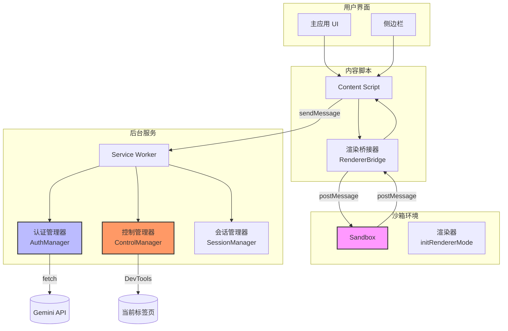

# 安全模型

<cite>
**本文档中引用的文件**   
- [manifest.json](file://manifest.json)
- [auth_manager.js](file://background/managers/auth_manager.js)
- [auth.js](file://services/auth.js)
- [sandbox/index.html](file://sandbox/index.html)
- [sandbox/index.js](file://sandbox/index.js)
- [sandbox/boot/renderer.js](file://sandbox/boot/renderer.js)
- [content/toolbar/bridge.js](file://content/toolbar/bridge.js)
- [content/toolbar/ui/renderer.js](file://content/toolbar/ui/renderer.js)
- [content/index.js](file://content/index.js)
- [background/index.js](file://background/index.js)
- [background/messages.js](file://background/messages.js)
- [lib/utils.js](file://lib/utils.js)
</cite>

## 目录
1. [简介](#简介)
2. [沙箱环境隔离](#沙箱环境隔离)
3. [权限声明与最小权限原则](#权限声明与最小权限原则)
4. [认证凭证安全管理](#认证凭证安全管理)
5. [敏感操作的用户确认机制](#敏感操作的用户确认机制)
6. [内容渲染与核心逻辑分离](#内容渲染与核心逻辑分离)
7. [安全架构图](#安全架构图)

## 简介
Gemini Nexus 通过多层次的安全架构设计，确保用户数据和系统安全。本模型文档详细阐述了其核心安全机制，包括沙箱环境隔离、权限控制、认证管理、用户确认机制以及架构分离原则。这些设计共同构建了一个安全可靠的AI集成环境。

## 沙箱环境隔离
Gemini Nexus 使用 Chrome 扩展的沙箱（sandbox）功能，将潜在不安全的AI生成内容（如HTML、JavaScript）限制在独立的执行环境中，有效防止跨站脚本（XSS）攻击。

### 沙箱配置
在 `manifest.json` 中，通过 `sandbox` 字段明确声明了沙箱页面：
```json
"sandbox": {
  "pages": ["sandbox/index.html"]
}
```
这确保了 `sandbox/index.html` 及其加载的资源将在一个受限制的、无权限的环境中运行。

### 内容安全策略 (CSP)
沙箱环境的 CSP 策略严格限制了可执行的脚本来源：
```json
"sandbox": "sandbox allow-scripts allow-forms allow-popups allow-modals; script-src 'self' 'unsafe-inline'; img-src https: http: data: blob:; media-src https: http: data: blob:;"
```
- `sandbox` 指令创建了一个独立的浏览上下文，阻止了对父页面的直接访问。
- `script-src 'self' 'unsafe-inline'` 允许执行来自扩展自身和内联的脚本，但阻止了外部脚本的加载。
- `img-src` 和 `media-src` 限制了图片和媒体资源的来源。

### 沙箱执行模式
沙箱通过 URL 参数 `mode` 实现多模式运行。`sandbox/index.js` 根据 `?mode=renderer` 参数决定启动渲染模式：
```javascript
const params = new URLSearchParams(window.location.search);
const isRendererMode = params.get('mode') === 'renderer';
if (isRendererMode) {
    initRendererMode();
} else {
    initAppMode();
}
```
`initRendererMode()` 函数在 `sandbox/boot/renderer.js` 中定义，专门用于处理内容渲染任务。

**Section sources**
- [manifest.json](file://manifest.json#L37-L39)
- [manifest.json](file://manifest.json#L89-L92)
- [sandbox/index.js](file://sandbox/index.js#L5-L12)
- [sandbox/boot/renderer.js](file://sandbox/boot/renderer.js#L8-L72)

## 权限声明与最小权限原则
Gemini Nexus 在 `manifest.json` 中声明的权限严格遵循最小权限原则，仅请求完成其功能所必需的权限。

### 权限列表分析
```json
"permissions": ["sidePanel", "storage", "contextMenus", "scripting", "alarms", "debugger", "downloads"]
```
- **`sidePanel`**: 用于在侧边栏中显示主界面。
- **`storage`**: 用于安全地存储用户设置和会话数据。
- **`contextMenus`**: 用于在右键菜单中添加操作选项。
- **`scripting`**: 用于在当前页面注入内容脚本以实现交互功能。
- **`alarms`**: 用于后台定时任务，如会话保活。
- **`debugger`**: 用于与 Chrome DevTools 协议交互，实现页面控制功能。
- **`downloads`**: 用于下载生成的图片。

### 权限使用场景
每个权限都有明确的使用场景，避免过度授权。例如，`debugger` 权限仅在用户明确请求执行页面控制操作（如点击、导航）时才被激活，而非持续监控所有页面。

**Section sources**
- [manifest.json](file://manifest.json#L6)

## 认证凭证安全管理
Gemini Nexus 通过 `AuthManager` 类安全地处理和存储与 Gemini 服务通信所需的会话凭证（`atValue`, `blValue`）。

### 凭证获取
`AuthManager` 通过 `services/auth.js` 中的 `fetchRequestParams` 函数从 `gemini.google.com` 的 HTML 响应中提取 `atValue` 和 `blValue`：
```javascript
export async function fetchRequestParams(userIndex = '0') {
    const resp = await fetch(url, { method: 'GET' });
    const html = await resp.text();
    const atValue = extractFromHTML('SNlM0e', html);
    const blValue = extractFromHTML('cfb2h', html);
    return { atValue, blValue, authUserIndex };
}
```
此过程在后台服务工作线程中进行，避免了在前端暴露凭证。

### 加密存储
获取的凭证通过 `chrome.storage.local` 进行加密存储，确保数据安全：
```javascript
async updateContext(newContext, model) {
    this.currentContext = newContext;
    this.lastModel = model;
    await chrome.storage.local.set({ 
        geminiContext: this.currentContext,
        geminiModel: this.lastModel 
    });
}
```
`chrome.storage.local` API 由浏览器提供，对存储的数据进行加密处理，防止其他应用或恶意脚本访问。

### 初始化与恢复
`AuthManager` 在初始化时会尝试从存储中恢复之前的会话状态，确保用户体验的连续性：
```javascript
async ensureInitialized() {
    if (this.isInitialized) return;
    const stored = await chrome.storage.local.get([
        'geminiContext', 'geminiModel', 'geminiAccountIndices', 'geminiAccountPointer'
    ]);
    // ... 恢复状态
    this.isInitialized = true;
}
```

**Section sources**
- [auth_manager.js](file://background/managers/auth_manager.js#L5-L130)
- [auth.js](file://services/auth.js#L7-L41)
- [auth_manager.js](file://background/managers/auth_manager.js#L14-L48)

## 敏感操作的用户确认机制
对于涉及页面控制的敏感操作，Gemini Nexus 实现了明确的用户确认机制，确保操作的透明性和可控性。

### 消息传递与执行
敏感操作（如 `navigate_page`, `click`, `fill`）通过消息系统从沙箱或内容脚本发送到后台服务工作线程。`background/messages.js` 中的 `setupMessageListener` 函数负责接收和分发这些请求。

### 控制管理器
`BrowserControlManager` 类（位于 `background/managers/control_manager.js`）是执行这些操作的核心。在执行任何操作前，它会进行安全检查：
```javascript
async ensureConnection() {
    const [tab] = await chrome.tabs.query({ active: true, lastFocusedWindow: true });
    if (!tab) return false;
    // 检查受限的 URL
    if (tab.url && (tab.url.startsWith('chrome://') || tab.url.startsWith('edge://') || tab.url.startsWith('about:'))) {
        return false;
    }
    await this.connection.attach(tab.id);
    return true;
}
```
此检查确保不会在浏览器内部页面（如 `chrome://settings`）上执行自动化操作。

### 用户意图明确
所有操作都源于用户的明确指令（如点击侧边栏按钮、使用快捷键），系统不会在未经用户触发的情况下自动执行敏感操作。

**Section sources**
- [messages.js](file://background/messages.js#L22-L82)
- [control_manager.js](file://background/managers/control_manager.js#L20-L37)
- [content/index.js](file://content/index.js#L19-L190)

## 内容渲染与核心逻辑分离
Gemini Nexus 的关键安全设计是将内容渲染与核心业务逻辑分离，通过沙箱环境执行潜在不安全的AI生成内容。

### 架构分离
- **核心逻辑**: 运行在后台服务工作线程（`background/index.js`）和内容脚本（`content/index.js`）中，负责业务逻辑、API 调用和状态管理。
- **内容渲染**: 委托给沙箱环境中的 `renderer.js` 模块，专门处理 Markdown 转换、数学公式渲染等任务。

### 渲染桥接机制
`content/toolbar/bridge.js` 创建了一个 `RendererBridge` 类，它通过创建一个隐藏的 iframe 来连接主应用和沙箱：
```javascript
class RendererBridge {
    constructor(hostElement) {
        this.iframe = document.createElement('iframe');
        this.iframe.src = chrome.runtime.getURL('sandbox/index.html?mode=renderer');
        this.host.appendChild(this.iframe);
        // ... 监听来自沙箱的消息
    }
}
```
当需要渲染内容时，主应用通过 `postMessage` 将文本发送到沙箱：
```javascript
async render(text, images = []) {
    this.iframe.contentWindow.postMessage({ action: 'RENDER', text, images, reqId: id }, '*');
}
```
沙箱处理完成后，将安全的 HTML 结果通过 `postMessage` 发送回主应用。

### 安全优势
这种分离设计确保了：
1. AI 生成的 HTML/JS 代码在沙箱中执行，无法访问主应用的 DOM 或 JavaScript 上下文。
2. 主应用只接收沙箱处理后的纯 HTML 字符串，避免了直接解析不可信内容的风险。
3. 即使沙箱中的渲染逻辑被利用，攻击者也无法突破沙箱限制影响主扩展或用户浏览器。

**Section sources**
- [bridge.js](file://content/toolbar/bridge.js#L4-L66)
- [renderer.js](file://content/toolbar/ui/renderer.js#L8-L87)
- [renderer.js](file://sandbox/boot/renderer.js#L8-L72)

## 安全架构图
以下图表展示了 Gemini Nexus 的核心安全组件及其交互关系。



**Diagram sources**
- [manifest.json](file://manifest.json#L37-L39)
- [bridge.js](file://content/toolbar/bridge.js#L15)
- [auth_manager.js](file://background/managers/auth_manager.js#L5)
- [control_manager.js](file://background/managers/control_manager.js#L11)

**Section sources**
- [manifest.json](file://manifest.json)
- [bridge.js](file://content/toolbar/bridge.js)
- [auth_manager.js](file://background/managers/auth_manager.js)
- [control_manager.js](file://background/managers/control_manager.js)