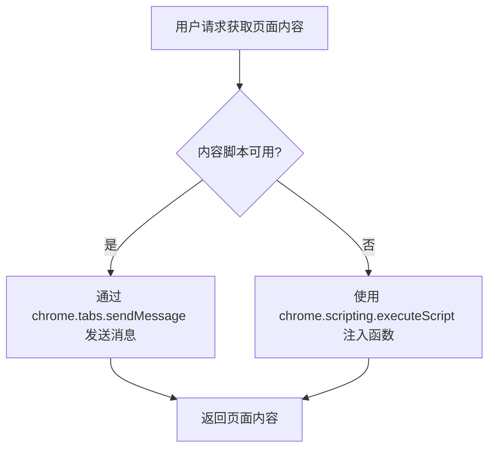
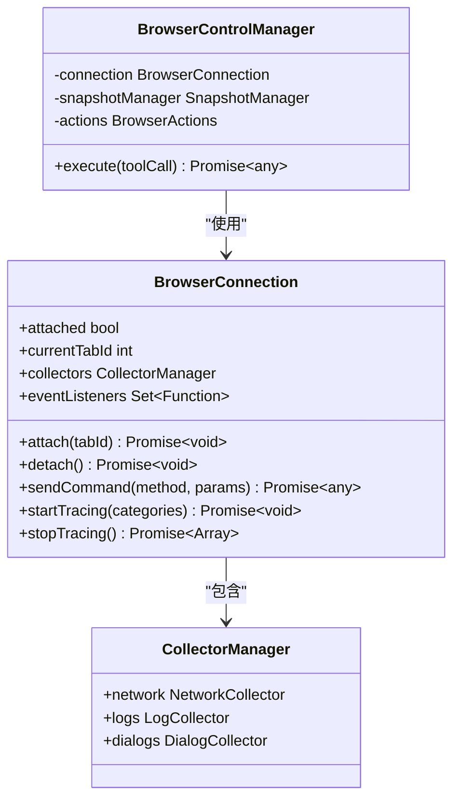

# 权限控制

<cite>
**本文档引用的文件**  
- [manifest.json](file://manifest.json)
- [background/index.js](file://background/index.js)
- [background/managers/control_manager.js](file://background/managers/control_manager.js)
- [background/managers/session_manager.js](file://background/managers/session_manager.js)
- [background/menus.js](file://background/menus.js)
- [content/index.js](file://content/index.js)
- [services/gemini_api.js](file://services/gemini_api.js)
- [background/handlers/session/utils.js](file://background/handlers/session/utils.js)
- [background/control/connection.js](file://background/control/connection.js)
- [background/control/actions/observation.js](file://background/control/actions/observation.js)
- [background/managers/auth_manager.js](file://background/managers/auth_manager.js)
- [sidepanel/index.js](file://sidepanel/index.js)
- [background/handlers/ui.js](file://background/handlers/ui.js)
</cite>

## 目录
1. [引言](#引言)
2. [权限声明与最小权限原则](#权限声明与最小权限原则)
3. [host_permissions 与全站访问](#host_permissions-与全站访问)
4. [Chrome 扩展安全模型与用户授权](#chrome-扩展安全模型与用户授权)
5. [未使用的高风险权限](#未使用的高风险权限)
6. [最佳实践建议](#最佳实践建议)
7. [结论](#结论)

## 引言
Gemini Nexus 是一个功能强大的浏览器扩展，旨在通过集成 Gemini AI 与浏览器自动化能力，为用户提供智能交互体验。其核心功能包括侧边栏对话、网页内容分析、自动化操作（如点击、填写表单）以及性能监控等。这些功能的实现依赖于一系列 Chrome 扩展权限。本文档将详细分析 `manifest.json` 中声明的权限，解释其安全意义，并阐述项目如何遵循最小权限原则，确保用户隐私和系统安全。

## 权限声明与最小权限原则
Gemini Nexus 在 `manifest.json` 的 `permissions` 字段中声明了七项权限：`sidePanel`、`storage`、`contextMenus`、`scripting`、`alarms`、`debugger` 和 `downloads`。每一项权限都严格对应其核心功能，体现了最小权限原则。

### sidePanel 权限
`sidePanel` 权限用于创建和管理扩展的侧边栏界面。这是用户与 Gemini Nexus 交互的主要入口。

**安全意义**：该权限允许扩展在浏览器侧边栏中显示自定义内容，但其访问范围仅限于扩展自身的 HTML 文件（`sidepanel/index.html`），无法直接访问或修改当前网页的 DOM。

**功能实现**：
- 在 `background/index.js` 中，通过 `chrome.sidePanel.setPanelBehavior({ openPanelOnActionClick: true })` 设置了点击扩展图标时自动打开侧边栏的行为。
- 当用户通过快捷键或右键菜单触发操作时，后台脚本会调用 `chrome.sidePanel.open()` 来打开侧边栏。

**Section sources**
- [manifest.json](file://manifest.json#L6)
- [background/index.js](file://background/index.js#L14)
- [background/handlers/ui.js](file://background/handlers/ui.js#L81-L85)

### storage 权限
`storage` 权限用于在本地持久化存储用户配置和应用状态，例如快捷键设置、账户索引和会话上下文。

**安全意义**：`storage` 权限比 `cookies` 或 `localStorage` 更安全，因为它提供了独立的存储空间，且可以设置存储区域（如 `local`、`sync`），避免了跨站脚本（XSS）攻击的风险。

**功能实现**：
- 在 `content/index.js` 中，扩展启动时从 `chrome.storage.local` 读取用户的快捷键和功能开关设置。
- 在 `background/managers/auth_manager.js` 中，用户的认证上下文（`geminiContext`）和模型选择（`geminiModel`）被安全地存储在本地，以便在会话间保持登录状态。

**Section sources**
- [manifest.json](file://manifest.json#L6)
- [content/index.js](file://content/index.js#L117-L132)
- [background/managers/auth_manager.js](file://background/managers/auth_manager.js#L18-L23)

### contextMenus 权限
`contextMenus` 权限用于在浏览器的右键菜单中添加自定义选项，为用户提供便捷的快捷操作。

**安全意义**：该权限仅允许扩展向右键菜单添加条目，当用户选择时，扩展才能获得执行特定操作的权限。这是一种用户主动触发的机制，增强了安全性。

**功能实现**：
- 在 `background/menus.js` 中，`setupContextMenus` 函数创建了多个右键菜单项，如“快速提问”、“OCR (文字提取)”和“截图翻译”。
- 当用户点击菜单项时，`chrome.contextMenus.onClicked` 事件监听器会向当前标签页的内容脚本发送消息，触发相应的功能。

**Section sources**
- [manifest.json](file://manifest.json#L6)
- [background/menus.js](file://background/menus.js#L8-L95)

### scripting 权限
`scripting` 权限允许扩展在匹配的网页上执行 JavaScript 代码，是实现网页内容获取和自动化操作的关键。

**安全意义**：虽然 `scripting` 权限功能强大，但 Gemini Nexus 通过 `content_scripts` 在页面加载完成后注入脚本，并且只执行预定义的安全操作，避免了任意代码执行的风险。

**功能实现**：
- 在 `manifest.json` 中，`content_scripts` 配置指定了脚本在 `<all_urls>` 上运行，确保了功能的通用性。
- 在 `background/handlers/session/utils.js` 中，当直接向内容脚本发送消息失败时，会使用 `chrome.scripting.executeScript` 作为备用方案，通过注入一个简单的函数来获取页面的文本内容。

**Diagram sources**
- [manifest.json](file://manifest.json#L40-L81)
- [background/handlers/session/utils.js](file://background/handlers/session/utils.js#L41-L54)

### alarms 权限
`alarms` 权限用于定期执行后台任务，例如保持会话活跃。

**安全意义**：`alarms` 权限允许扩展在指定时间间隔后执行代码，即使扩展未被主动使用。这比使用 `setTimeout` 或 `setInterval` 更节能，因为它由浏览器统一管理。

**功能实现**：
- 在 `background/managers/keep_alive.js` 中，`KeepAliveManager` 类创建了一个名为 `gemini_cookie_rotate` 的定时器，每 9 分钟触发一次。
- 定时器的回调函数会执行 `performRotation`，通过访问特定 URL 来刷新 Google 账户的 Cookie，从而防止会话过期。

**Section sources**
- [manifest.json](file://manifest.json#L6)
- [background/managers/keep_alive.js](file://background/managers/keep_alive.js#L4-L31)

### debugger 权限
`debugger` 权限是 Chrome 扩展中最强大的权限之一，它允许扩展使用 Chrome DevTools 协议（CDP）来调试和控制网页。

**安全意义**：此权限非常敏感，因为它可以完全控制网页的加载、执行和网络活动。Gemini Nexus 仅在用户明确请求执行自动化任务（如点击、填写）时才使用此权限，并且会检查 URL 是否为受限页面（如 `chrome://`）。

**功能实现**：
- 在 `background/control/connection.js` 中，`BrowserConnection` 类使用 `chrome.debugger.attach()` 方法连接到目标标签页。
- 连接后，会启用 `Network`、`Log`、`Runtime` 等 CDP 域，以收集网络请求、日志和执行 JavaScript。
- `BrowserControlManager` 使用此连接来执行各种工具调用，如 `navigate_page`、`click` 和 `evaluate_script`。

**Diagram sources**
- [background/control/connection.js](file://background/control/connection.js#L60-L132)
- [background/managers/control_manager.js](file://background/managers/control_manager.js#L13-L15)

### downloads 权限
`downloads` 权限允许扩展下载文件并控制其保存位置。

**安全意义**：此权限允许扩展在用户不知情的情况下下载文件，存在潜在风险。Gemini Nexus 仅在用户明确请求保存截图时才使用此权限，并且 `saveAs: false` 参数避免了频繁的保存对话框打扰用户。

**功能实现**：
- 在 `background/control/actions/observation.js` 中，`takeScreenshot` 方法在捕获截图后，如果提供了 `filePath` 参数，会调用 `chrome.downloads.download()` 将 Base64 编码的图片数据下载到用户的设备上。

**Section sources**
- [manifest.json](file://manifest.json#L6)
- [background/control/actions/observation.js](file://background/control/actions/observation.js#L30-L38)

## host_permissions 与全站访问
`host_permissions` 字段声明了扩展需要访问的主机。Gemini Nexus 声明了两个权限：`https://gemini.google.com/*` 和 `<all_urls>`。

### https://gemini.google.com/*
此权限是功能必需的，用于与 Gemini 服务进行 API 通信。

**使用场景**：在 `services/gemini_api.js` 中，`sendGeminiMessage` 函数向 `https://gemini.google.com/u/{index}/_/BardChatUi/data/...` 发送 POST 请求，以获取 AI 的回复。

**安全考量**：该权限精确地限制了对 Gemini 服务的访问，确保了通信的安全性和可靠性。

**Section sources**
- [manifest.json](file://manifest.json#L7-L9)
- [services/gemini_api.js](file://services/gemini_api.js#L141)

### <all_urls>
`<all_urls>` 是一个非常广泛的权限，表示扩展可以访问所有 HTTP 和 HTTPS 网站。

**使用场景与必要性**：
1.  **内容脚本注入**：`content_scripts` 必须在所有网页上运行，以便提供“快速提问”、“OCR”等上下文感知功能。
2.  **自动化操作**：`debugger` 和 `scripting` 权限需要与任何网页进行交互，以执行点击、填写表单等操作。
3.  **信息获取**：获取当前活动标签页的标题和 URL 以提供上下文。

**风险控制措施**：
- **最小化使用**：尽管声明了 `<all_urls>`，但核心的敏感操作（如 `debugger.attach`）会主动检查并拒绝连接到 `chrome://`、`about:` 等受限 URL。
- **用户知情**：在安装时，Chrome 会明确提示用户该扩展将“读取和更改您在所有网站上的数据”，用户可以据此做出知情决策。
- **功能隔离**：与 Gemini 服务的通信严格限定在 `https://gemini.google.com/*`，不会将用户在其他网站上的数据发送到外部服务器。

**Section sources**
- [manifest.json](file://manifest.json#L7-L9)
- [background/control/connection.js](file://background/control/connection.js#L24-L27)
- [background/handlers/session/utils.js](file://background/handlers/session/utils.js#L28-L37)

## Chrome 扩展安全模型与用户授权
Chrome 扩展的安全模型基于权限声明和用户授权。当用户安装 Gemini Nexus 时，Chrome 会根据 `manifest.json` 中的权限请求，向用户展示一个清晰的权限列表。

- **运行时保护**：权限的使用受到严格控制。例如，`debugger` 权限的使用必须通过 `chrome.debugger` API，并且需要先调用 `attach` 方法。浏览器会记录这些操作，用户可以在扩展管理页面查看。
- **用户知情授权**：用户在安装前可以看到扩展需要的所有权限。对于 `host_permissions` 中的 `<all_urls>`，Chrome 会特别强调其广泛性，确保用户充分了解风险。
- **沙箱机制**：扩展的 `sandbox` 页面（`sandbox/index.html`）在独立的、受限制的环境中运行，用于渲染和处理可能不安全的内容（如 AI 生成的 HTML），防止其影响主扩展或浏览器。

## 未使用的高风险权限
Gemini Nexus 谨慎地避免使用一些更危险的权限，以降低安全风险。

- **activeTab**：虽然 `activeTab` 权限在用户点击扩展图标时才授予对当前标签页的访问，但其功能已被更精确的 `scripting` 和 `debugger` 权限覆盖。`scripting` 允许在页面加载时注入，而 `debugger` 提供了更底层的控制。
- **tabs**：`tabs` 权限可以获取所有标签页的信息，但 Gemini Nexus 仅通过 `chrome.tabs.query({ active: true })` 获取当前活动标签页，这通常可以通过其他权限（如 `activeTab`）实现，但为了功能的可靠性，项目选择了更直接的方式。
- **webRequest**：此权限可以拦截和修改网络请求，风险极高。Gemini Nexus 通过 `debugger` 权限中的 `Network` 域来**观察**网络活动，但不会修改任何请求，从而避免了潜在的滥用。

这种克制的设计选择，使得扩展的功能强大但又不越界，体现了对用户隐私的尊重。

## 最佳实践建议
对于开发者，Gemini Nexus 的权限设计提供了以下最佳实践：

1.  **遵循最小权限原则**：只申请功能绝对必需的权限。例如，如果只需要读取数据，就不要申请 `scripting` 的写入能力。
2.  **精确声明 host_permissions**：尽可能使用具体的主机模式（如 `https://*.google.com/*`），而不是 `<all_urls>`。如果必须使用 `<all_urls>`，应在文档中清晰说明原因。
3.  **主动进行风险控制**：即使拥有广泛权限，也应在代码中主动检查和限制操作范围（如避免访问 `chrome://` 页面）。
4.  **利用沙箱**：对于处理用户生成内容或第三方数据的组件，使用 `sandbox` 页面来隔离风险。
5.  **提供清晰的用户文档**：向用户解释每个权限的用途，建立信任。

## 结论
Gemini Nexus 的权限设计是一个平衡功能与安全的典范。它通过精确声明 `permissions` 和 `host_permissions`，实现了强大的自动化和 AI 集成功能，同时通过代码层面的风险控制和对高风险权限的规避，最大限度地保护了用户的安全。其设计严格遵循了最小权限原则，并充分利用了 Chrome 扩展的安全模型，为开发者提供了如何在不牺牲功能的前提下构建安全、可信扩展的优秀范例。