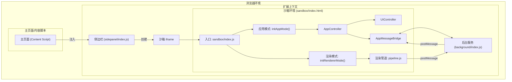
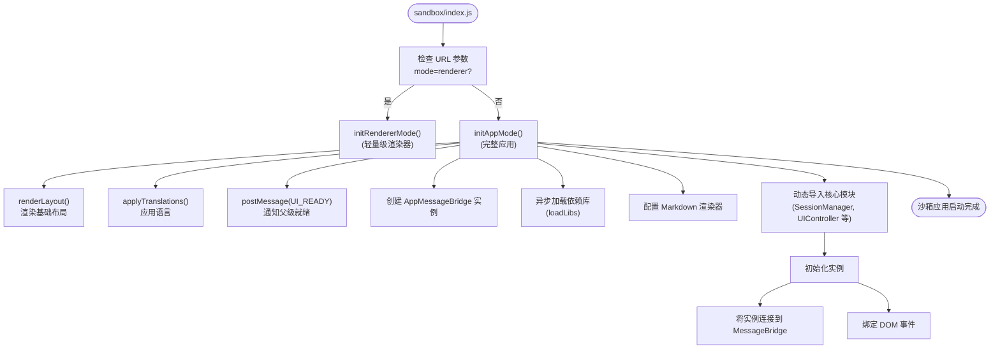
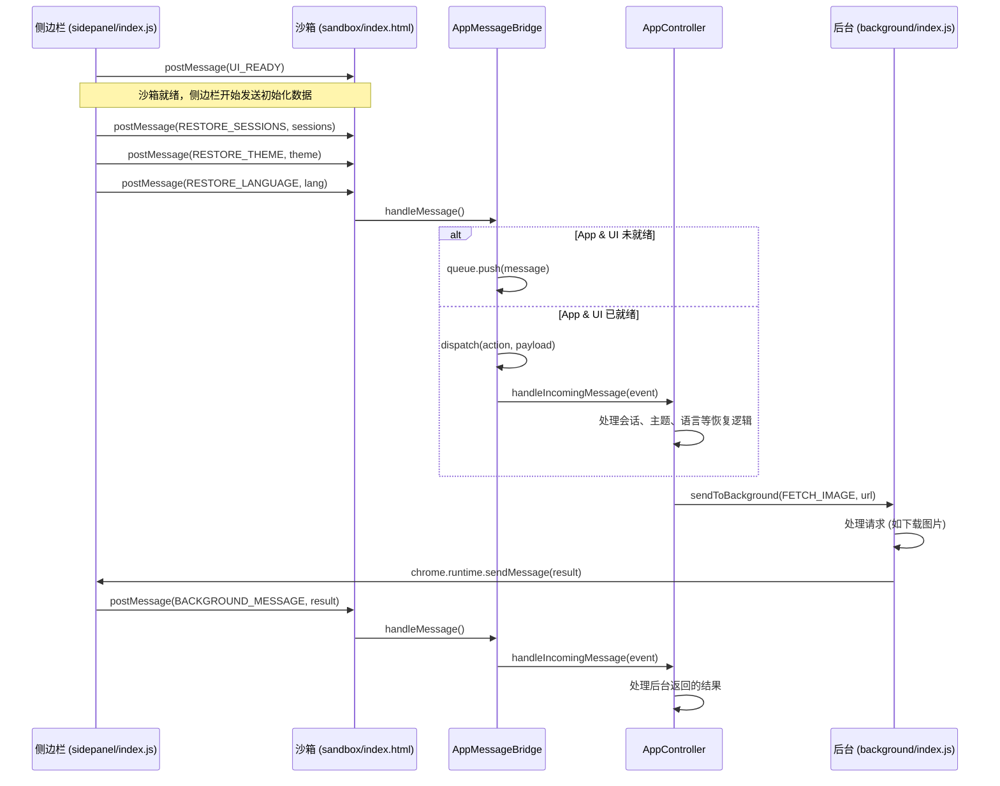
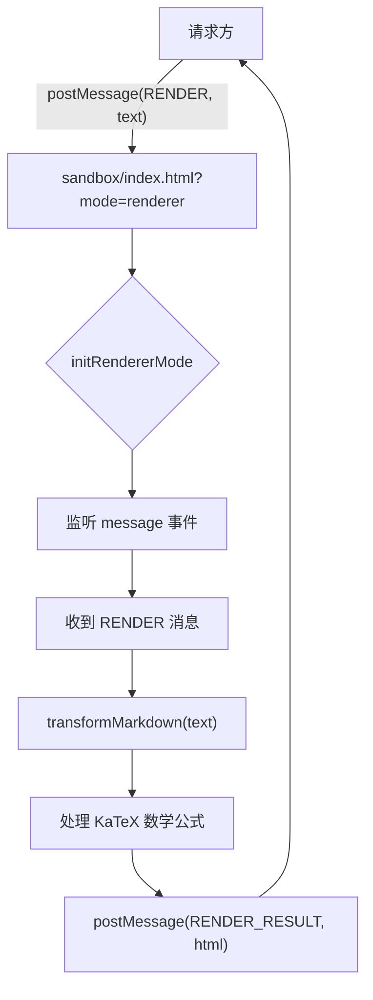

# 沙箱隔离

<cite>
**本文档中引用的文件**  
- [sandbox/index.html](file://sandbox/index.html)
- [sandbox/index.js](file://sandbox/index.js)
- [sandbox/boot/app.js](file://sandbox/boot/app.js)
- [sandbox/boot/messaging.js](file://sandbox/boot/messaging.js)
- [sandbox/boot/renderer.js](file://sandbox/boot/renderer.js)
- [sandbox/controllers/app_controller.js](file://sandbox/controllers/app_controller.js)
- [sandbox/ui/ui_controller.js](file://sandbox/ui/ui_controller.js)
- [sandbox/theme_init.js](file://sandbox/theme_init.js)
- [sandbox/render/pipeline.js](file://sandbox/render/pipeline.js)
- [sandbox/render/content.js](file://sandbox/render/content.js)
- [lib/messaging.js](file://lib/messaging.js)
- [background/index.js](file://background/index.js)
- [background/messages.js](file://background/messages.js)
- [sidepanel/index.js](file://sidepanel/index.js)
- [manifest.json](file://manifest.json)
</cite>

## 目录
1. [简介](#简介)
2. [沙箱架构概览](#沙箱架构概览)
3. [核心安全机制](#核心安全机制)
4. [沙箱初始化流程](#沙箱初始化流程)
5. [消息通信机制](#消息通信机制)
6. [渲染隔离机制](#渲染隔离机制)
7. [安全策略与架构设计](#安全策略与架构设计)

## 简介
Gemini Nexus 扩展通过 Chrome 扩展的沙箱机制，为 AI 生成内容提供了一个安全、隔离的执行环境。该机制的核心目标是防止潜在的恶意脚本（如 XSS 攻击）对主页面、浏览器或用户数据造成危害。通过将动态内容的渲染逻辑与扩展的核心控制逻辑分离，系统实现了功能与安全的平衡。本文件详细阐述了 `sandbox/index.html` 如何在独立的 iframe 中运行，`manifest.json` 中的 CSP 策略如何限制其权限，以及 `sandbox/boot/app.js` 中的 `initAppMode` 函数如何通过 `postMessage` 与后台服务进行安全通信。

## 沙箱架构概览



**Diagram sources**
- [sandbox/index.html](file://sandbox/index.html)
- [sandbox/index.js](file://sandbox/index.js)
- [background/index.js](file://background/index.js)
- [sidepanel/index.js](file://sidepanel/index.js)

**Section sources**
- [sandbox/index.html](file://sandbox/index.html)
- [sandbox/index.js](file://sandbox/index.js)

## 核心安全机制

Chrome 扩展的沙箱机制通过 `manifest.json` 文件中的 `sandbox` 字段和 `content_security_policy` (CSP) 配置来实现。这些配置共同作用，为 `sandbox/index.html` 创建了一个权限受限的独立环境。

### 沙箱策略配置
在 `manifest.json` 中，`"sandbox"` 字段明确指定了哪些页面应被视为沙箱：
```json
"sandbox": {
  "pages": ["sandbox/index.html"]
}
```
这使得 `sandbox/index.html` 在一个独立的、受限制的 iframe 中加载，与主扩展页面和网页内容完全隔离。

### 内容安全策略 (CSP)
`manifest.json` 中的 `content_security_policy.sandbox` 配置是安全的核心，它定义了沙箱环境的权限边界：
```json
"sandbox allow-scripts allow-forms allow-popups allow-modals; script-src 'self' 'unsafe-inline'; img-src https: http: data: blob:; media-src https: http: data: blob:;"
```
此策略的含义如下：
- `sandbox`: 启用沙箱，禁用所有默认权限。
- `allow-scripts`: 允许执行内联和外部脚本，这是运行 JavaScript 的必要条件。
- `allow-forms`: 允许表单提交。
- `allow-popups`: 允许使用 `window.open()` 打开新窗口。
- `allow-modals`: 允许显示 `alert`、`confirm` 等模态对话框。
- `script-src 'self' 'unsafe-inline'`: 允许从扩展自身加载脚本，并允许内联脚本执行（这是 `initAppMode` 能够运行的关键）。
- `img-src` 和 `media-src`: 限制图片和媒体资源只能从安全的来源（HTTPS、HTTP、data URL、blob URL）加载。

**关键安全点**：此策略**禁用了**跨域请求、访问 `localStorage`/`sessionStorage`、访问 `parent`/`top` 等危险操作，从而有效防止了 XSS 攻击和数据泄露。

**Section sources**
- [manifest.json](file://manifest.json#L37-L92)

## 沙箱初始化流程

沙箱的启动由 `sandbox/index.js` 控制，它根据 URL 参数决定进入应用模式还是渲染模式。



`initAppMode` 函数（位于 `sandbox/boot/app.js`）是完整应用模式的入口。它首先渲染布局并立即通过 `window.parent.postMessage({ action: 'UI_READY' }, '*')` 发送就绪信号，然后异步加载所有依赖项（如 Markdown 解析器、图表库等），最后初始化 `SessionManager`、`UIController` 和 `AppController` 等核心实例，并将它们与消息桥接器连接。

**Section sources**
- [sandbox/index.js](file://sandbox/index.js)
- [sandbox/boot/app.js](file://sandbox/boot/app.js#L11-L89)

## 消息通信机制

沙箱环境与后台服务（`background/index.js`）之间的所有通信都通过 `postMessage` API 进行，确保了跨上下文的安全数据交换。

### 消息桥接器 (AppMessageBridge)
`AppMessageBridge` 类（位于 `sandbox/boot/messaging.js`）是沙箱内部通信的核心。它负责：
1.  监听来自父级（侧边栏）的 `message` 事件。
2.  在 `AppController` 和 `UIController` 尚未初始化时，将消息**排队**（`queue`）。
3.  一旦实例就绪，通过 `setApp` 和 `setUI` 方法连接实例，并**刷新**（`flush`）队列中的消息。
4.  根据消息的 `action` 字段，将消息分发给相应的控制器或实例。



**Diagram sources**
- [sandbox/boot/messaging.js](file://sandbox/boot/messaging.js#L4-L90)
- [lib/messaging.js](file://lib/messaging.js)
- [background/messages.js](file://background/messages.js)
- [sidepanel/index.js](file://sidepanel/index.js)

**Section sources**
- [sandbox/boot/messaging.js](file://sandbox/boot/messaging.js)
- [lib/messaging.js](file://lib/messaging.js)
- [background/messages.js](file://background/messages.js)
- [sidepanel/index.js](file://sidepanel/index.js)

## 渲染隔离机制

对于需要在浮动窗口等场景中快速渲染 Markdown 内容的情况，Gemini Nexus 提供了轻量级的 `RendererMode`。

### 渲染器模式 (RendererMode)
当 `sandbox/index.html` 以 `?mode=renderer` 参数加载时，会执行 `initRendererMode` 函数（位于 `sandbox/boot/renderer.js`）。该模式：
1.  清空页面内容。
2.  立即加载必要的库（如 Markdown 解析器）。
3.  监听 `RENDER` 消息。
4.  收到消息后，使用 `transformMarkdown` 函数将文本转换为 HTML，并处理 KaTeX 数学公式。
5.  将渲染结果通过 `postMessage` 发送回请求方。

这种方式避免了加载整个应用的开销，实现了快速、安全的动态内容渲染。



**Section sources**
- [sandbox/boot/renderer.js](file://sandbox/boot/renderer.js)
- [sandbox/render/pipeline.js](file://sandbox/render/pipeline.js)
- [sandbox/render/content.js](file://sandbox/render/content.js)

## 安全策略与架构设计

Gemini Nexus 的沙箱隔离机制体现了“最小权限”和“职责分离”的安全设计原则。

### 安全优势
1.  **攻击面最小化**：沙箱环境无法访问 `chrome.*` API、`localStorage` 或父页面的 DOM，即使 AI 生成的内容包含恶意脚本，其危害也被限制在沙箱 iframe 内。
2.  **数据隔离**：敏感数据（如会话、配置）存储在后台服务中，沙箱仅通过受控的消息通道请求和接收数据。
3.  **功能与安全平衡**：通过 `allow-scripts` 和 `unsafe-inline`，沙箱可以执行必要的 JavaScript 来实现动态 UI，同时通过沙箱策略禁用高风险操作。

### 架构决策
将渲染逻辑（沙箱）与核心控制逻辑（后台）分离是关键的安全决策：
-   **后台服务 (background)**：负责持久化存储、网络请求、与 MCP 服务器通信等高权限操作。
-   **沙箱 (sandbox)**：仅负责用户界面的展示和用户交互，所有需要高权限的操作都通过 `postMessage` 委托给后台。

这种架构确保了即使沙箱环境被攻破，攻击者也无法直接执行危险操作，必须通过后台服务的严格消息验证机制，从而大大提高了整个系统的安全性。

**Section sources**
- [manifest.json](file://manifest.json)
- [sandbox/boot/app.js](file://sandbox/boot/app.js)
- [background/index.js](file://background/index.js)
- [lib/messaging.js](file://lib/messaging.js)