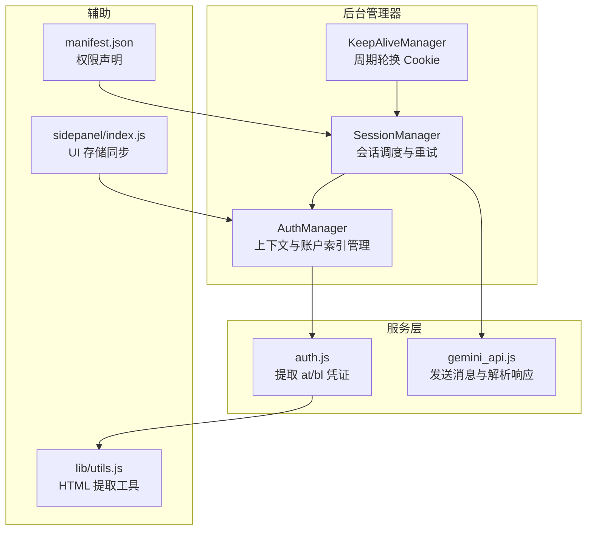
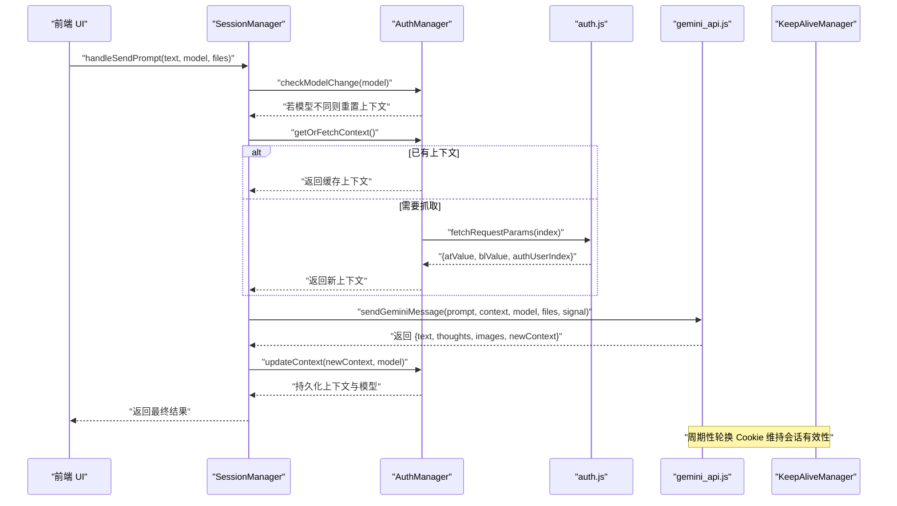
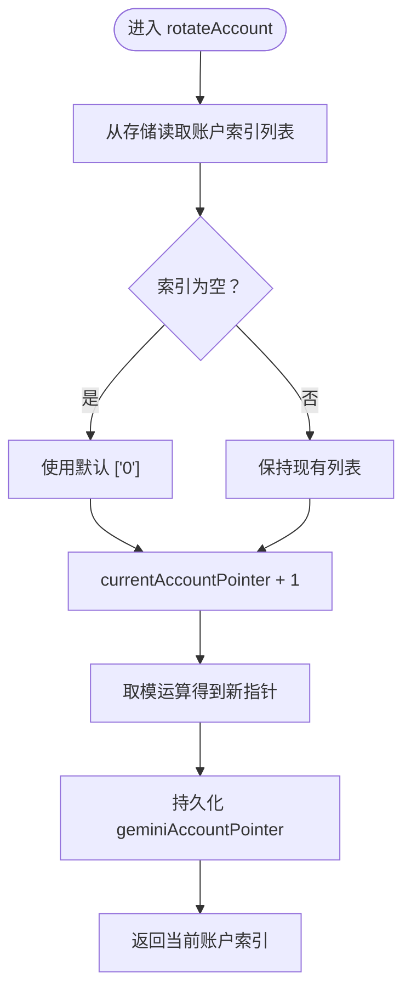
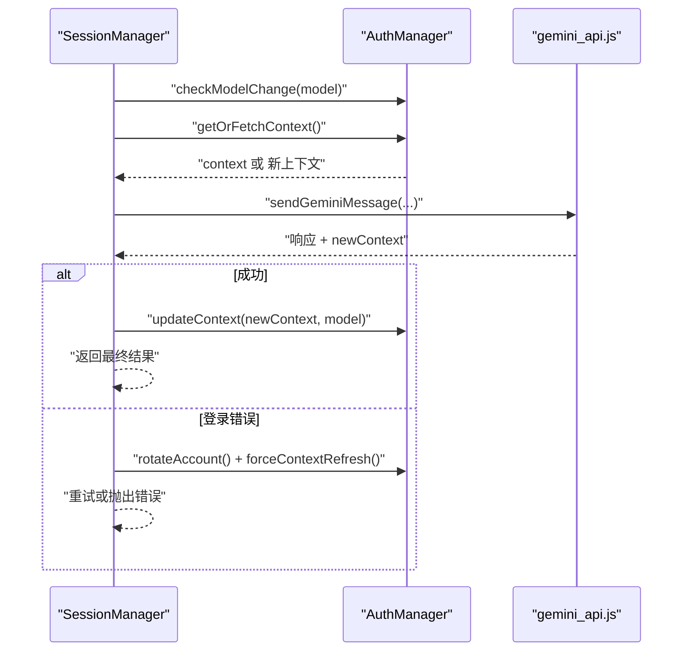
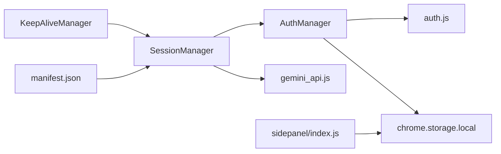

# 认证安全

<cite>
**本文引用的文件**
- [background/managers/auth_manager.js](file://background/managers/auth_manager.js)
- [services/auth.js](file://services/auth.js)
- [background/managers/session_manager.js](file://background/managers/session_manager.js)
- [services/gemini_api.js](file://services/gemini_api.js)
- [background/managers/keep_alive.js](file://background/managers/keep_alive.js)
- [background/handlers/session/context_handler.js](file://background/handlers/session/context_handler.js)
- [background/handlers/session/utils.js](file://background/handagers/session/utils.js)
- [lib/utils.js](file://lib/utils.js)
- [manifest.json](file://manifest.json)
- [background/index.js](file://background/index.js)
- [sidepanel/index.js](file://sidepanel/index.js)
</cite>

## 目录
1. [引言](#引言)
2. [项目结构与认证相关模块](#项目结构与认证相关模块)
3. [核心组件：AuthManager 类](#核心组件authmanager-类)
4. [架构总览](#架构总览)
5. [详细组件分析](#详细组件分析)
6. [依赖关系分析](#依赖关系分析)
7. [性能与安全考量](#性能与安全考量)
8. [故障排查指南](#故障排查指南)
9. [结论](#结论)

## 引言
本文件聚焦于扩展程序的认证安全管理机制，特别是 AuthManager 类如何安全地处理和存储 Gemini API 的会话凭证（atValue、blValue），以及多账户切换（rotateAccount）、上下文管理（getOrFetchContext、updateContext）与模型变更重置（checkModelChange）的设计。我们将从数据持久化、访问控制、错误处理、会话轮换与销毁等维度，系统性剖析该实现，并给出调用流程图、安全风险与缓解建议。

## 项目结构与认证相关模块
认证相关的核心模块集中在后台管理器与服务层：
- 后台管理器：AuthManager（负责上下文与账户索引持久化与切换）、SessionManager（协调发送请求与上下文更新）、KeepAliveManager（周期性轮换 Cookie 以维持会话）
- 服务层：auth.js（从网页中提取 at/bl 凭证）、gemini_api.js（构造请求、发送消息、解析流式响应）
- 辅助工具：lib/utils.js（HTML 提取工具）、sidepanel/index.js（与 UI 的存储同步）

图表来源
- [background/managers/auth_manager.js](file://background/managers/auth_manager.js#L1-L130)
- [background/managers/session_manager.js](file://background/managers/session_manager.js#L1-L285)
- [background/managers/keep_alive.js](file://background/managers/keep_alive.js#L1-L98)
- [services/auth.js](file://services/auth.js#L1-L41)
- [services/gemini_api.js](file://services/gemini_api.js#L1-L230)
- [lib/utils.js](file://lib/utils.js#L1-L59)
- [sidepanel/index.js](file://sidepanel/index.js#L269-L334)
- [manifest.json](file://manifest.json#L1-L93)

章节来源
- [background/managers/auth_manager.js](file://background/managers/auth_manager.js#L1-L130)
- [background/managers/session_manager.js](file://background/managers/session_manager.js#L1-L285)
- [background/managers/keep_alive.js](file://background/managers/keep_alive.js#L1-L98)
- [services/auth.js](file://services/auth.js#L1-L41)
- [services/gemini_api.js](file://services/gemini_api.js#L1-L230)
- [lib/utils.js](file://lib/utils.js#L1-L59)
- [sidepanel/index.js](file://sidepanel/index.js#L269-L334)
- [manifest.json](file://manifest.json#L1-L93)

## 核心组件：AuthManager 类
AuthManager 是认证与上下文管理的核心，负责：
- 初始化与恢复：从 chrome.storage.local 恢复上下文、模型、账户索引与当前指针
- 多账户轮换：根据账户索引列表循环切换当前账户
- 上下文获取与更新：按需抓取新凭证或使用已有上下文；更新后持久化
- 模型变更重置：当模型变化时强制清空上下文，确保后续请求使用正确的上下文
- 上下文销毁：清理本地上下文与模型，必要时触发账户轮换

关键特性与安全设计：
- 使用 chrome.storage.local 进行持久化，避免明文泄露到日志或网络
- 在 getOrFetchContext 中仅在缓存为空时才抓取新凭证，减少暴露面
- checkModelChange 在模型切换时强制重置上下文，防止跨模型状态污染
- resetContext 清理上下文与模型，并在多账户场景下轮换账户，降低被检测概率

章节来源
- [background/managers/auth_manager.js](file://background/managers/auth_manager.js#L1-L130)

## 架构总览
下面的序列图展示了从用户发起请求到最终返回响应的完整调用链，涵盖认证、上下文管理与错误处理的关键节点。

图表来源
- [background/managers/session_manager.js](file://background/managers/session_manager.js#L21-L128)
- [background/managers/auth_manager.js](file://background/managers/auth_manager.js#L75-L113)
- [services/auth.js](file://services/auth.js#L7-L40)
- [services/gemini_api.js](file://services/gemini_api.js#L26-L230)
- [background/managers/keep_alive.js](file://background/managers/keep_alive.js#L39-L93)

## 详细组件分析

### AuthManager：上下文与账户索引管理
- 初始化与恢复
  - 从 chrome.storage.local 恢复 geminiContext、geminiModel、geminiAccountIndices、geminiAccountPointer
  - 若恢复失败，记录错误但不中断流程
- 多账户轮换（rotateAccount）
  - 从存储读取最新账户索引列表，若为空则回退为默认 ['0']
  - 更新 currentAccountPointer 并持久化指针
  - 返回当前账户索引
- 获取与更新上下文
  - getOrFetchContext：若缓存存在直接返回；否则抓取新凭证并填充 contextIds
  - updateContext：保存新上下文与模型至存储
  - resetContext：清空上下文与模型，必要时轮换账户
- 模型变更重置（checkModelChange）
  - 当 lastModel 存在且与新模型不同，清空 currentContext，强制重新初始化

图表来源
- [background/managers/auth_manager.js](file://background/managers/auth_manager.js#L53-L69)

章节来源
- [background/managers/auth_manager.js](file://background/managers/auth_manager.js#L14-L129)

### SessionManager：会话调度与重试
- 发送提示流程
  - 取消上一次请求（若有）
  - 初始化 AbortController，构建文件数组
  - 循环尝试（多账户时最多两次）：checkModelChange -> getOrFetchContext -> sendGeminiMessage
  - 成功后 updateContext，失败时根据错误类型决定是否轮换账户
- 错误处理
  - 登录失效/会话过期：清除上下文并引导用户登录
  - 频率限制：提示稍后再试
  - 空响应/解析失败：建议刷新页面重试
- 工具调用执行
  - 解析响应中的工具调用，执行后将结果反馈给 Gemini，再次更新上下文

图表来源
- [background/managers/session_manager.js](file://background/managers/session_manager.js#L21-L147)
- [background/managers/auth_manager.js](file://background/managers/auth_manager.js#L75-L113)
- [services/gemini_api.js](file://services/gemini_api.js#L26-L230)

章节来源
- [background/managers/session_manager.js](file://background/managers/session_manager.js#L1-L285)

### KeepAliveManager：会话轮换与维护
- 定时轮换（每 9 分钟）
  - 调用 accounts.google.com/RotateCookies，刷新 __Secure-1PSIDTS
  - 成功则记录时间戳与错误计数归零
  - 失败时根据状态码采取不同策略：401/403 清除本地上下文；429 等待下次间隔
- 与 SessionManager 协作
  - 当轮换失败导致会话失效时，SessionManager 将清除上下文并提示用户登录

章节来源
- [background/managers/keep_alive.js](file://background/managers/keep_alive.js#L1-L98)
- [background/managers/session_manager.js](file://background/managers/session_manager.js#L159-L162)

### 凭证获取与存储：auth.js 与 chrome.storage.local
- 凭证获取
  - 根据用户索引选择 URL（默认 /app 或 /u/{index}/app）
  - 通过 fetch 获取页面 HTML，使用正则提取 atValue、blValue
  - 优先从页面 data-index 推断 authUserIndex，确保与请求 URL 匹配
- 存储策略
  - 使用 chrome.storage.local 持久化上下文、模型、账户索引与指针
  - 未见显式加密逻辑，所有敏感字段均以对象形式存储
  - UI 层通过 sidepanel/index.js 同步配置项（如账户索引、Gem ID 等）到本地存储

章节来源
- [services/auth.js](file://services/auth.js#L7-L40)
- [lib/utils.js](file://lib/utils.js#L4-L9)
- [sidepanel/index.js](file://sidepanel/index.js#L269-L334)

### 上下文管理与模型变更重置
- getOrFetchContext：缓存命中直接返回，未命中则抓取新凭证
- updateContext：将新上下文与模型写入存储，供后续请求复用
- checkModelChange：若模型发生变化，清空上下文，强制重新初始化，避免跨模型状态污染
- resetContext：清理上下文与模型，必要时轮换账户，降低被检测概率

章节来源
- [background/managers/auth_manager.js](file://background/managers/auth_manager.js#L75-L124)

### 多账户切换与上下文更新
- 通过 geminiAccountIndices 与 geminiAccountPointer 维护账户索引列表与当前位置
- rotateAccount：轮换当前账户索引并持久化指针
- SessionManager 在登录错误时自动轮换账户并刷新上下文，提升可用性

章节来源
- [background/managers/auth_manager.js](file://background/managers/auth_manager.js#L53-L69)
- [background/managers/session_manager.js](file://background/managers/session_manager.js#L138-L146)

## 依赖关系分析
- AuthManager 依赖 auth.js 提取凭证，依赖 chrome.storage.local 进行持久化
- SessionManager 依赖 AuthManager 管理上下文，依赖 gemini_api.js 发送请求
- KeepAliveManager 与 SessionManager 协同，通过定时轮换维持会话有效性
- sidepanel/index.js 与 UI 交互，同步配置项到本地存储

图表来源
- [background/managers/auth_manager.js](file://background/managers/auth_manager.js#L1-L130)
- [background/managers/session_manager.js](file://background/managers/session_manager.js#L1-L285)
- [background/managers/keep_alive.js](file://background/managers/keep_alive.js#L1-L98)
- [services/auth.js](file://services/auth.js#L1-L41)
- [services/gemini_api.js](file://services/gemini_api.js#L1-L230)
- [sidepanel/index.js](file://sidepanel/index.js#L269-L334)
- [manifest.json](file://manifest.json#L1-L93)

章节来源
- [background/managers/auth_manager.js](file://background/managers/auth_manager.js#L1-L130)
- [background/managers/session_manager.js](file://background/managers/session_manager.js#L1-L285)
- [background/managers/keep_alive.js](file://background/managers/keep_alive.js#L1-L98)
- [services/auth.js](file://services/auth.js#L1-L41)
- [services/gemini_api.js](file://services/gemini_api.js#L1-L230)
- [sidepanel/index.js](file://sidepanel/index.js#L269-L334)
- [manifest.json](file://manifest.json#L1-L93)

## 性能与安全考量
- 数据持久化与访问控制
  - 使用 chrome.storage.local 存储上下文与模型，避免明文泄露到日志或网络
  - 未发现显式加密逻辑；建议在后续版本中对敏感字段进行加密存储（如使用受保护的存储 API 或端到端加密）
- 多账户轮换
  - 通过 geminiAccountIndices 与 geminiAccountPointer 实现账户轮换，降低被检测概率
  - 在 resetContext 中自动轮换，增强鲁棒性
- 模型变更重置
  - checkModelChange 强制重置上下文，防止跨模型状态污染
- 会话轮换与超时处理
  - KeepAliveManager 定时轮换 Cookie，避免长时间会话失效
  - SessionManager 对登录错误、频率限制、空响应等进行分类处理
- 权限与 CSP
  - manifest.json 声明 storage、scripting、host_permissions 等权限，满足功能需求
  - CSP 限制了沙箱页面脚本能力，降低 XSS 风险

[本节为通用指导，无需特定文件引用]

## 故障排查指南
- 登录失效/会话过期
  - 现象：响应包含“未登录”或“Session expired”
  - 处理：SessionManager 清除上下文并提示用户登录对应账户
  - 建议：检查账户索引与 URL 是否匹配，确认 authUserIndex 正确
- 频率限制
  - 现象：提示“请求过于频繁”
  - 处理：等待一段时间再试
  - 建议：合理设置请求间隔，利用 KeepAliveManager 维持会话
- 空响应/解析失败
  - 现象：服务器无响应或响应解析失败
  - 处理：建议刷新 Gemini 页面后重试
  - 建议：检查网络与代理设置，确认页面可正常加载
- 多账户切换无效
  - 现象：切换账户后仍使用旧上下文
  - 处理：确认 geminiAccountIndices 与 geminiAccountPointer 是否正确持久化
  - 建议：在 UI 中重新保存账户索引，或手动清理存储键值

章节来源
- [background/managers/session_manager.js](file://background/managers/session_manager.js#L159-L192)
- [background/managers/keep_alive.js](file://background/managers/keep_alive.js#L82-L93)
- [background/managers/auth_manager.js](file://background/managers/auth_manager.js#L53-L69)

## 结论
该认证安全机制通过 AuthManager 实现了上下文与账户索引的可靠管理，配合 SessionManager 的重试与错误处理、KeepAliveManager 的会话轮换，形成了较为完整的安全闭环。当前实现未对敏感数据进行显式加密，建议在后续版本中引入端到端加密或受保护存储方案，以进一步降低数据泄露风险。同时，模型变更重置与多账户轮换增强了系统的鲁棒性与抗检测能力，适合在复杂使用场景下部署。