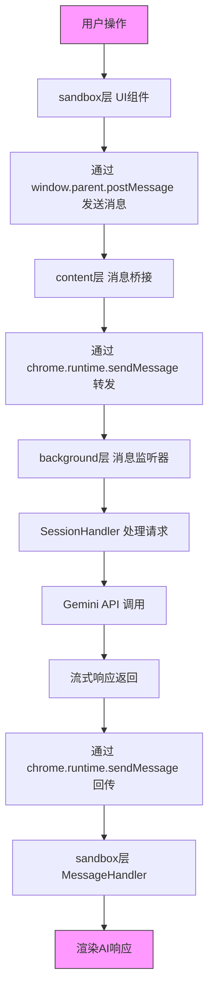
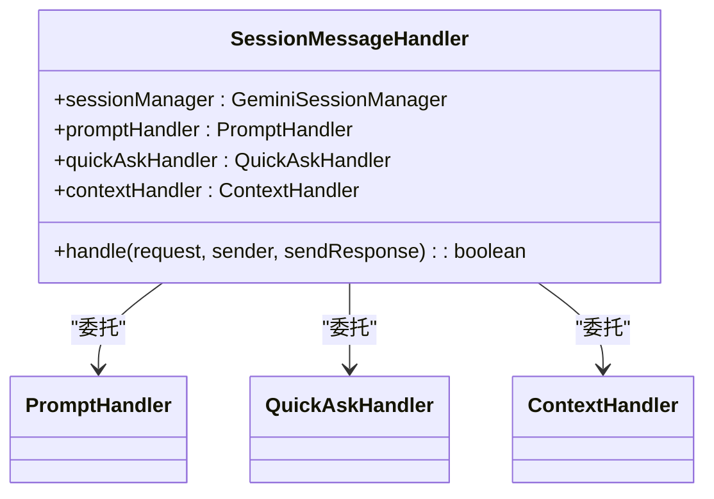
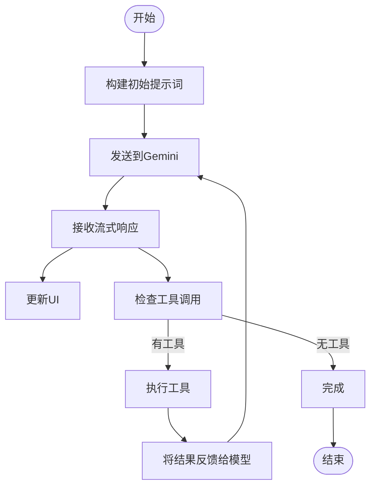
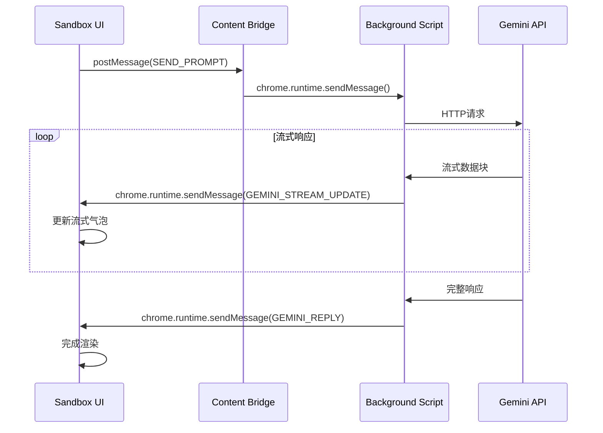

# 数据流

<cite>
**本文档引用的文件**  
- [messaging.js](file://lib/messaging.js)
- [messages.js](file://background/messages.js)
- [app.js](file://sandbox/boot/app.js)
- [messaging.js](file://sandbox/boot/messaging.js)
- [bridge.js](file://content/toolbar/bridge.js)
- [session.js](file://background/handlers/session.js)
- [prompt_handler.js](file://background/handlers/session/prompt_handler.js)
- [gemini_api.js](file://services/gemini_api.js)
- [message_handler.js](file://sandbox/controllers/message_handler.js)
- [app_controller.js](file://sandbox/controllers/app_controller.js)
- [session_manager.js](file://background/managers/session_manager.js)
- [stream.js](file://content/toolbar/stream.js)
</cite>

## 目录
1. [引言](#引言)
2. [整体数据流架构](#整体数据流架构)
3. [消息格式与通信协议](#消息格式与通信协议)
4. [从用户操作到AI响应的完整流程](#从用户操作到ai响应的完整流程)
5. [核心组件分析](#核心组件分析)
6. [事件驱动通信模式](#事件驱动通信模式)
7. [内容脚本的桥梁作用](#内容脚本的桥梁作用)
8. [结论](#结论)

## 引言
本文档详细追踪Gemini Nexus扩展中从用户操作到AI响应的完整数据路径。以“用户在侧边栏发送消息”为例，说明数据如何在不同执行环境（sandbox、content、background）之间流动，通过消息机制实现解耦通信，并最终完成AI响应的渲染。

## 整体数据流架构

**图示来源**
- [app.js](file://sandbox/boot/app.js#L1-L90)
- [messaging.js](file://lib/messaging.js#L1-L96)
- [messages.js](file://background/messages.js#L1-L82)

## 消息格式与通信协议

系统采用基于JSON的标准化消息格式，核心字段包括：
- **action**: 消息类型标识符，如 `SEND_PROMPT`, `GEMINI_STREAM_UPDATE`
- **payload**: 携带的具体数据内容
- **text**: AI流式响应的文本片段
- **thoughts**: AI思考过程
- **sessionId**: 会话唯一标识
- **reqId**: 请求唯一标识，用于异步响应匹配

支持的主要action类型：
- `GEMINI_STREAM_UPDATE`: 流式响应更新
- `GEMINI_REPLY`: 完整响应
- `FETCH_IMAGE_RESULT`: 图像获取结果
- `GENERATED_IMAGE_RESULT`: 生成图像结果
- `CROP_SCREENSHOT`: 截图裁剪结果
- `SELECTION_RESULT`: 文本选中结果
- `SEND_PROMPT`: 发送提示词请求

**Section sources**
- [messaging.js](file://lib/messaging.js#L1-L96)
- [message_handler.js](file://sandbox/controllers/message_handler.js#L1-L365)

## 从用户操作到AI响应的完整流程

### 1. 用户发送消息
用户在侧边栏输入消息并点击发送，触发UI事件。

### 2. Sandbox层消息发送
Sandbox层的UI组件通过`lib/messaging.js`中的`sendToBackground`函数，使用`window.parent.postMessage`将消息发送到content层。

### 3. Content层桥接转发
Content层的`bridge.js`监听到消息后，通过`chrome.runtime.sendMessage`将其转发到background层。

### 4. Background层处理请求
Background层的`messages.js`中的`setupMessageListener`接收到消息，根据action类型分发给相应的处理器。

### 5. SessionHandler处理
`session.js`中的`SessionMessageHandler`处理`SEND_PROMPT`请求，调用`prompt_handler.js`中的`PromptHandler`。

### 6. 调用Gemini API
`PromptHandler`调用`session_manager.js`中的`GeminiSessionManager`，后者通过`gemini_api.js`向Gemini服务发送请求。

### 7. 流式响应回传
API的流式响应通过`onUpdate`回调，使用`chrome.runtime.sendMessage`发送`GEMINI_STREAM_UPDATE`消息。

### 8. Sandbox层接收并渲染
Sandbox层的`message_handler.js`中的`MessageHandler`接收到流式更新，创建或更新流式响应气泡。

### 9. 完整响应处理
当完整响应到达时，发送`GEMINI_REPLY`消息，`MessageHandler`完成最终渲染并清除流式状态。

**Section sources**
- [app_controller.js](file://sandbox/controllers/app_controller.js#L1-L207)
- [prompt_handler.js](file://background/handlers/session/prompt_handler.js#L1-L103)
- [gemini_api.js](file://services/gemini_api.js#L1-L230)
- [message_handler.js](file://sandbox/controllers/message_handler.js#L1-L365)

## 核心组件分析

### SessionMessageHandler
负责处理会话相关的消息，包括发送提示词、快速提问、设置上下文等。

**图示来源**
- [session.js](file://background/handlers/session.js#L1-L56)

### PromptHandler
处理提示词的构建、发送和响应处理，支持工具执行循环。

**图示来源**
- [prompt_handler.js](file://background/handlers/session/prompt_handler.js#L1-L103)

## 事件驱动通信模式

系统采用事件驱动的通信模式，通过消息机制实现各组件的解耦：

**图示来源**
- [messaging.js](file://lib/messaging.js#L1-L96)
- [messages.js](file://background/messages.js#L1-L82)
- [stream.js](file://content/toolbar/stream.js#L1-L49)

## 内容脚本的桥梁作用

Content脚本作为sandbox层和background层之间的桥梁，负责传递页面上下文信息：

- **选中文本**: 通过`selection.js`获取用户选中的文本内容
- **截图区域**: 通过`crop.js`处理截图和裁剪区域
- **页面信息**: 获取当前标签页的标题和URL
- **上下文传递**: 将这些上下文信息作为提示词的一部分发送给AI

**Section sources**
- [bridge.js](file://content/toolbar/bridge.js#L1-L66)
- [stream.js](file://content/toolbar/stream.js#L1-L49)

## 结论
Gemini Nexus通过精心设计的消息通信机制，实现了sandbox、content和background三层之间的高效、解耦通信。系统采用标准化的JSON消息格式和事件驱动模式，确保了数据流的清晰和可维护性。从用户操作到AI响应的完整路径经过多个组件的协同工作，展现了现代浏览器扩展的复杂架构设计。