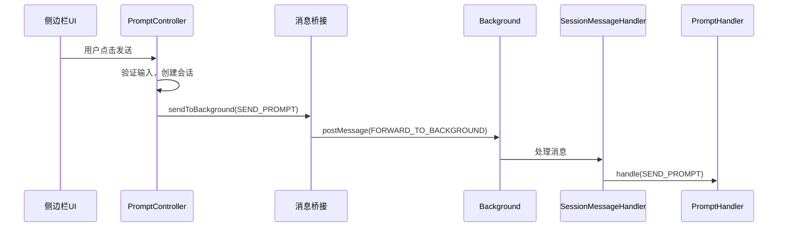
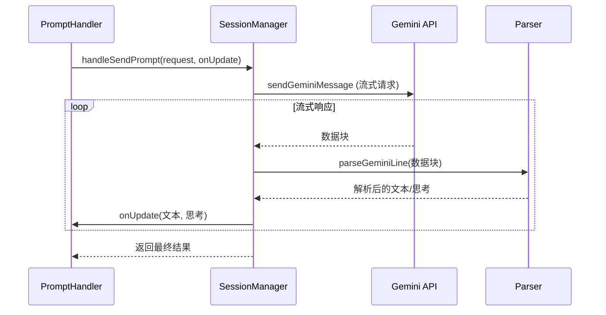
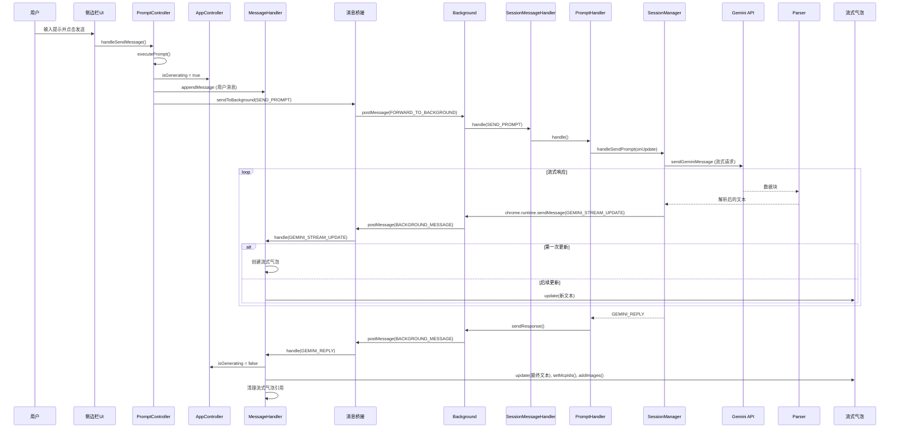

# 核心数据路径

<cite>
**本文档引用的文件**   
- [app_controller.js](file://sandbox/controllers/app_controller.js)
- [prompt.js](file://sandbox/controllers/prompt.js)
- [messaging.js](file://lib/messaging.js)
- [messaging.js](file://sandbox/boot/messaging.js)
- [messages.js](file://background/messages.js)
- [session.js](file://background/handlers/session.js)
- [prompt_handler.js](file://background/handlers/session/prompt_handler.js)
- [session_manager.js](file://background/managers/session_manager.js)
- [gemini_api.js](file://services/gemini_api.js)
- [message.js](file://sandbox/render/message.js)
- [message_handler.js](file://sandbox/controllers/message_handler.js)
</cite>

## 目录
1. [引言](#引言)
2. [核心数据流概览](#核心数据流概览)
3. [UI输入与请求发起](#ui输入与请求发起)
4. [消息桥接与后台通信](#消息桥接与后台通信)
5. [后台请求处理](#后台请求处理)
6. [AI交互与流式响应](#ai交互与流式响应)
7. [会话状态与上下文管理](#会话状态与上下文管理)
8. [请求取消机制](#请求取消机制)
9. [流式数据接收与渲染](#流式数据接收与渲染)
10. [核心数据流序列图](#核心数据流序列图)

## 引言
本文档详细追踪Gemini Nexus扩展中，从用户在侧边栏发送AI请求到AI响应渲染的完整数据路径。以用户在侧边栏输入提示并发送为例，文档将深入分析数据如何在沙箱层（sandbox）和后台层（background）之间流动，涵盖消息传递、会话管理、AI交互、流式响应处理和渐进式渲染等关键环节。

## 核心数据流概览
Gemini Nexus的核心数据流始于用户在侧边栏UI的输入，通过一系列协调的组件和消息传递机制，最终实现AI响应的流式渲染。整个流程可分为四个主要阶段：UI输入与请求发起、消息桥接与后台通信、后台AI交互处理、以及流式数据接收与渲染。该流程确保了用户请求的高效处理和响应的实时展示。

## UI输入与请求发起
当用户在侧边栏输入提示并点击发送按钮时，`PromptController` 负责处理此交互。它首先验证输入内容，然后创建一个新的会话（如果尚未存在），并将用户消息渲染到聊天历史记录中。随后，它通过 `sendToBackground` 函数将包含用户输入、文件附件、模型选择和会话ID的 `SEND_PROMPT` 请求有效载荷发送出去。

**Section sources**
- [prompt.js](file://sandbox/controllers/prompt.js#L15-L104)
- [app_controller.js](file://sandbox/controllers/app_controller.js#L123-L125)

## 消息桥接与后台通信
沙箱层（sandbox）与后台层（background）之间的通信通过一个消息桥接机制实现。`AppMessageBridge` 类负责监听来自后台的消息，并在应用完全初始化前将消息排队。`sendToBackground` 函数将请求包装在 `FORWARD_TO_BACKGROUND` 消息中，并通过 `window.parent.postMessage` 发送到后台。后台的 `messages.js` 文件中的 `setupMessageListener` 函数是全局消息监听器的入口点，它接收来自沙箱的消息并根据其 `action` 进行路由。

**Section sources**
- [messaging.js](file://lib/messaging.js#L4-L8)
- [messaging.js](file://sandbox/boot/messaging.js#L12-L38)
- [messages.js](file://background/messages.js#L22-L81)

## 后台请求处理
后台接收到 `FORWARD_TO_BACKGROUND` 消息后，会提取出原始请求。`messages.js` 中的监听器会检查请求的 `action`，对于 `SEND_PROMPT` 请求，它会将其委托给 `SessionMessageHandler` 实例。`SessionMessageHandler` 根据请求类型，进一步将 `SEND_PROMPT` 请求分发给 `PromptHandler` 进行处理。

**Diagram sources **
- [messages.js](file://background/messages.js#L70-L71)
- [session.js](file://background/handlers/session.js#L17-L18)

## AI交互与流式响应
`PromptHandler` 是处理AI交互的核心。它首先调用 `PromptBuilder` 构建完整的提示（包含预设和上下文），然后调用 `SessionManager` 的 `handleSendPrompt` 方法。`SessionManager` 负责与Gemini API进行实际通信。它使用 `sendGeminiMessage` 函数发起一个流式HTTP请求。该函数会处理身份验证、文件上传，并通过 `onUpdate` 回调函数将接收到的流式数据块逐步发送回沙箱层。

**Diagram sources **
- [prompt_handler.js](file://background/handlers/session/prompt_handler.js#L37-L41)
- [session_manager.js](file://background/managers/session_manager.js#L21-L74)
- [gemini_api.js](file://services/gemini_api.js#L159-L194)

## 会话状态与上下文管理
会话状态在沙箱层和后台层都有维护。沙箱层的 `SessionManager` 负责管理本地会话列表和当前会话ID。当用户开始新对话或切换会话时，会更新此状态。后台层的 `SessionManager` 则负责维护与Gemini API通信所需的上下文ID（conversationId, responseId, choiceId）。在发送 `SEND_PROMPT` 请求前，沙箱层会通过 `SET_CONTEXT` 消息将当前会话的上下文同步到后台。AI响应成功后，后台会更新其上下文，并在最终响应中返回，沙箱层再将其保存回本地会话。

**Section sources**
- [session_manager.js](file://sandbox/core/session_manager.js#L5-L49)
- [session_manager.js](file://background/managers/session_manager.js#L21-L119)
- [prompt.js](file://sandbox/controllers/prompt.js#L79-L83)

## 请求取消机制
当用户点击取消按钮时，`PromptController` 的 `cancel` 方法会被调用。该方法会立即向后台发送一个 `CANCEL_PROMPT` 请求。后台的 `SessionMessageHandler` 接收到此请求后，会调用 `SessionManager` 的 `cancelCurrentRequest` 方法。该方法会触发一个 `AbortController`，从而中断正在进行的与Gemini API的流式HTTP请求。同时，沙箱层会重置其流式渲染状态，停止显示加载动画。

**Section sources**
- [prompt.js](file://sandbox/controllers/prompt.js#L106-L115)
- [session.js](file://background/handlers/session.js#L38-L41)
- [session_manager.js](file://background/managers/session_manager.js#L204-L211)

## 流式数据接收与渲染
后台通过 `onUpdate` 回调函数，使用 `chrome.runtime.sendMessage` 将 `GEMINI_STREAM_UPDATE` 类型的消息发送回沙箱层。沙箱层的 `MessageHandler` 监听此类消息。当收到第一个流式更新时，`MessageHandler` 会创建一个“流式气泡”（streaming bubble），这是一个特殊的AI消息占位符。随后的每个 `GEMINI_STREAM_UPDATE` 消息都会调用该气泡的 `update` 方法，逐步填充其内容，实现文本的渐进式显示。当完整的AI响应到达时，`GEMINI_REPLY` 消息会触发 `handleGeminiReply` 方法，该方法会完成气泡的最终渲染，包括添加思考过程、生成的图像和MCP工具徽章。

**Section sources**
- [prompt_handler.js](file://background/handlers/session/prompt_handler.js#L15-L22)
- [message_handler.js](file://sandbox/controllers/message_handler.js#L19-L223)
- [message.js](file://sandbox/render/message.js#L266-L323)

## 核心数据流序列图
以下序列图综合了从用户输入到AI响应渲染的完整数据流。

**Diagram sources **
- [prompt.js](file://sandbox/controllers/prompt.js#L124)
- [messaging.js](file://lib/messaging.js#L4-L8)
- [messages.js](file://background/messages.js#L70-L71)
- [prompt_handler.js](file://background/handlers/session/prompt_handler.js#L13-L102)
- [gemini_api.js](file://services/gemini_api.js#L159-L194)
- [message_handler.js](file://sandbox/controllers/message_handler.js#L19-L230)