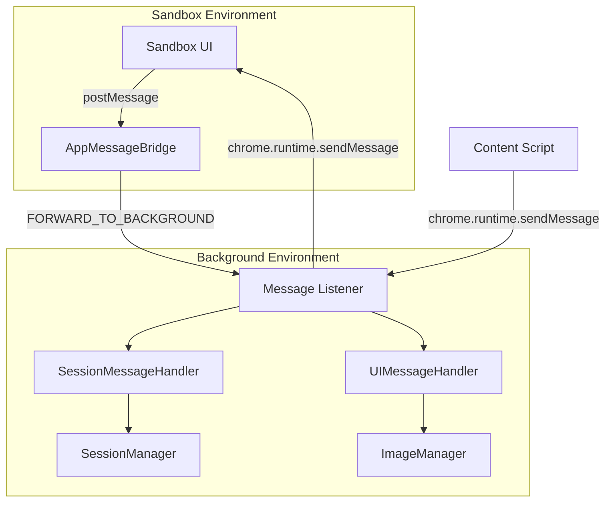
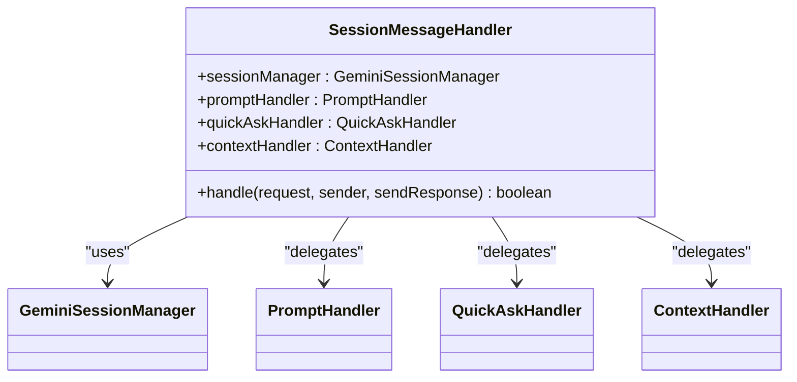
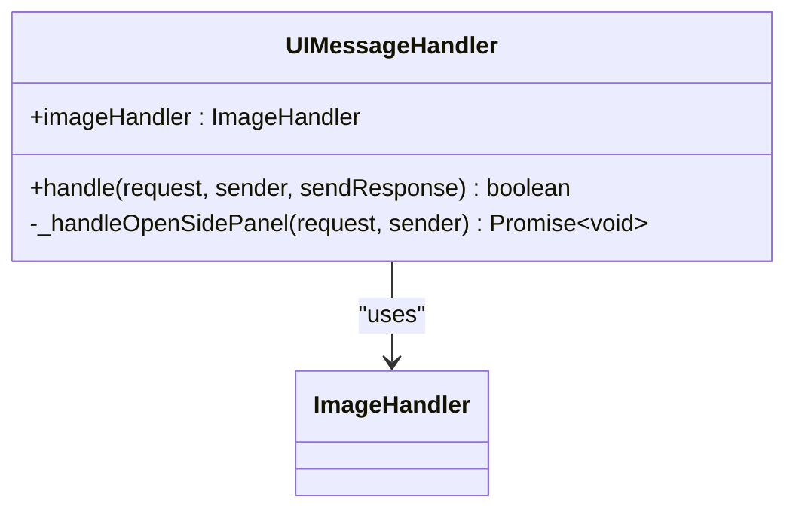
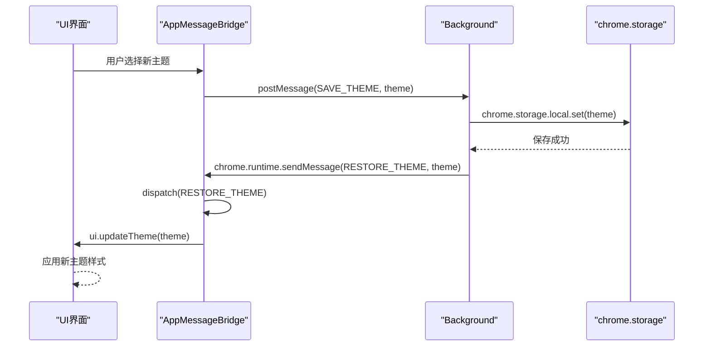

# 消息通信机制

<cite>
**本文档引用的文件**  
- [messaging.js](file://lib/messaging.js)
- [messages.js](file://background/messages.js)
- [messaging.js](file://sandbox/boot/messaging.js)
- [app.js](file://sandbox/boot/app.js)
- [app_controller.js](file://sandbox/controllers/app_controller.js)
- [ui_controller.js](file://sandbox/ui/ui_controller.js)
- [settings/view.js](file://sandbox/ui/settings/view.js)
- [message_handler.js](file://sandbox/controllers/message_handler.js)
- [index.js](file://background/index.js)
- [session.js](file://background/handlers/session.js)
- [ui.js](file://background/handlers/ui.js)
- [manifest.json](file://manifest.json)
</cite>

## 目录
1. [引言](#引言)
2. [双层通信架构概述](#双层通信架构概述)
3. [Sandbox层消息发送机制](#sandbox层消息发送机制)
4. [Background层消息监听与分发](#background层消息监听与分发)
5. [AppMessageBridge消息队列机制](#appmessagebridge消息队列机制)
6. [主题配置变更示例流程](#主题配置变更示例流程)
7. [消息处理器详解](#消息处理器详解)
8. [通信流程时序图](#通信流程时序图)

## 引言
Gemini Nexus采用基于`postMessage`和`chrome.runtime.sendMessage`的双层消息通信架构，实现Sandbox环境与Background服务层之间的安全、高效通信。该架构确保了用户操作、配置变更和会话数据在不同执行上下文间的可靠传递，同时通过消息队列机制解决了组件初始化时序问题。

## 双层通信架构概述
Gemini Nexus的消息通信系统分为两个主要层级：
1. **Sandbox到Background**：使用`window.parent.postMessage`进行跨iframe通信
2. **Background内部通信**：使用`chrome.runtime.sendMessage`进行扩展内部通信

这种分层设计既保证了Sandbox环境的安全隔离，又实现了Background层的集中消息管理。



**图示来源**  
- [manifest.json](file://manifest.json#L37-L39)
- [messaging.js](file://lib/messaging.js#L4-L8)
- [messages.js](file://background/messages.js#L22-L79)

## Sandbox层消息发送机制
Sandbox环境通过`lib/messaging.js`中的工具函数将用户操作封装为标准消息格式并发送至Background层。

### 消息格式
所有消息均采用`{action, payload}`格式，其中：
- **action**: 操作类型标识符
- **payload**: 携带的数据负载

### 发送函数
`sendToBackground`函数是Sandbox层消息发送的核心接口：

```javascript
export function sendToBackground(payload) {
    window.parent.postMessage({
        action: 'FORWARD_TO_BACKGROUND',
        payload: payload
    }, '*');
}
```

该函数被广泛用于各种用户操作，如保存会话、快捷键、主题等配置。

**本节来源**  
- [messaging.js](file://lib/messaging.js#L4-L95)
- [app_controller.js](file://sandbox/controllers/app_controller.js#L8)

## Background层消息监听与分发
Background层通过`messages.js`中的`setupMessageListener`函数注册全局消息监听器，处理来自不同来源的请求。

### 监听器初始化
`setupMessageListener`在Background服务启动时被调用，初始化消息处理器：

```javascript
export function setupMessageListener(sessionManager, imageHandler, controlManager, logManager, mcpManager) {
    const sessionHandler = new SessionMessageHandler(sessionManager, imageHandler, controlManager);
    const uiHandler = new UIMessageHandler(imageHandler);
    
    chrome.runtime.onMessage.addListener((request, sender, sendResponse) => {
        // 日志处理
        if (request.action === 'LOG_ENTRY') {
            logManager.add(request.entry);
            return false;
        }
        
        // MCP管理
        if (request.action === 'MCP_SAVE_CONFIG') {
            mcpManager.saveConfig(request.json).then(result => {
                sendResponse(result);
            });
            return true;
        }
        
        // 会话消息处理
        if (sessionHandler.handle(request, sender, sendResponse)) {
            return true;
        }
        
        // UI消息处理
        if (uiHandler.handle(request, sender, sendResponse)) {
            return true;
        }
        
        return false;
    });
}
```

### 消息分发流程
1. 首先处理特殊系统消息（如日志、MCP配置）
2. 然后委托给`SessionMessageHandler`处理会话相关消息
3. 最后委托给`UIMessageHandler`处理UI相关消息
4. 未处理的消息返回false

**本节来源**  
- [messages.js](file://background/messages.js#L14-L79)
- [index.js](file://background/index.js#L26)

## AppMessageBridge消息队列机制
`sandbox/boot/messaging.js`中的`AppMessageBridge`类实现了消息队列机制，确保在应用初始化完成前消息不丢失。

### 核心功能
- **消息缓冲**: 在应用和UI实例未准备好时，将消息存入队列
- **延迟分发**: 当应用和UI实例准备好后，通过`flush`机制重新分发
- **事件绑定**: 监听`window.message`事件并处理传入消息

### 类结构
```javascript
export class AppMessageBridge {
    constructor() {
        this.app = null;
        this.ui = null;
        this.queue = [];
        
        window.addEventListener('message', this.handleMessage.bind(this));
    }
    
    setApp(appInstance) {
        this.app = appInstance;
        this.flush();
    }
    
    setUI(uiInstance) {
        this.ui = uiInstance;
        this.flush();
    }
    
    handleMessage(event) {
        const { action, payload } = event.data;
        
        if (this.app && this.ui) {
            this.dispatch(action, payload, event);
        } else {
            // 队列消息直到应用准备就绪
            this.queue.push({ action, payload, event });
        }
    }
    
    flush() {
        if (this.app && this.ui) {
            while (this.queue.length > 0) {
                const { action, payload, event } = this.queue.shift();
                this.dispatch(action, payload, event);
            }
        }
    }
    
    dispatch(action, payload, event) {
        // 处理各种RESTORE_*消息
        if (action === 'RESTORE_THEME') {
            this.ui.updateTheme(payload);
            return;
        }
        // ... 其他消息处理
        
        // 转发通用消息到App Controller
        this.app.handleIncomingMessage(event);
    }
}
```

**本节来源**  
- [messaging.js](file://sandbox/boot/messaging.js#L4-L89)
- [app.js](file://sandbox/boot/app.js#L22-L23)

## 主题配置变更示例流程
以用户更改主题为例，说明完整的消息通信流程：

### 流程步骤
1. **用户操作**: 在设置界面选择新主题
2. **Sandbox发送**: 调用`sendToBackground`发送`SAVE_THEME`消息
3. **Background接收**: `setupMessageListener`捕获消息
4. **存储处理**: Background层将主题保存到`chrome.storage`
5. **广播更新**: Background层发送`RESTORE_THEME`消息回Sandbox
6. **UI更新**: `AppMessageBridge`处理消息并更新UI

### 代码路径
- **设置界面**: `sandbox/ui/settings/view.js`中`themeSelect`的change事件
- **发送消息**: `sendToBackground({ action: 'SAVE_THEME', payload: theme })`
- **处理消息**: `background/messages.js`中`setupMessageListener`的逻辑
- **更新UI**: `AppMessageBridge.dispatch`中`RESTORE_THEME`分支

**本节来源**  
- [settings/view.js](file://sandbox/ui/settings/view.js#L73-L75)
- [messaging.js](file://lib/messaging.js#L29-L33)
- [messaging.js](file://sandbox/boot/messaging.js#L54-L56)
- [app_controller.js](file://sandbox/controllers/app_controller.js#L139-L147)

## 消息处理器详解
Background层的消息处理由两个主要处理器类负责：

### SessionMessageHandler
处理与会话管理相关的消息，包括：
- **SEND_PROMPT**: 发送提示词
- **QUICK_ASK**: 快速提问
- **CANCEL_PROMPT**: 取消请求
- **SET_CONTEXT**: 设置上下文



**图示来源**  
- [session.js](file://background/handlers/session.js#L7-L55)

### UIMessageHandler
处理与UI和用户界面相关的消息，包括：
- **FETCH_IMAGE**: 获取图片
- **CAPTURE_SCREENSHOT**: 截取屏幕
- **OPEN_SIDE_PANEL**: 打开侧边栏
- **INITIATE_CAPTURE**: 启动捕获



**图示来源**  
- [ui.js](file://background/handlers/ui.js#L4-L194)

## 通信流程时序图
以下时序图展示了用户更改主题时的完整消息流：



**图示来源**  
- [settings/view.js](file://sandbox/ui/settings/view.js#L73-L75)
- [messaging.js](file://lib/messaging.js#L29-L33)
- [messaging.js](file://sandbox/boot/messaging.js#L54-L56)
- [messages.js](file://background/messages.js#L22-L79)