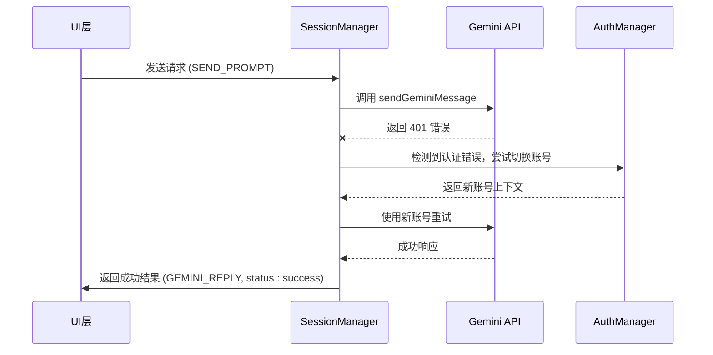
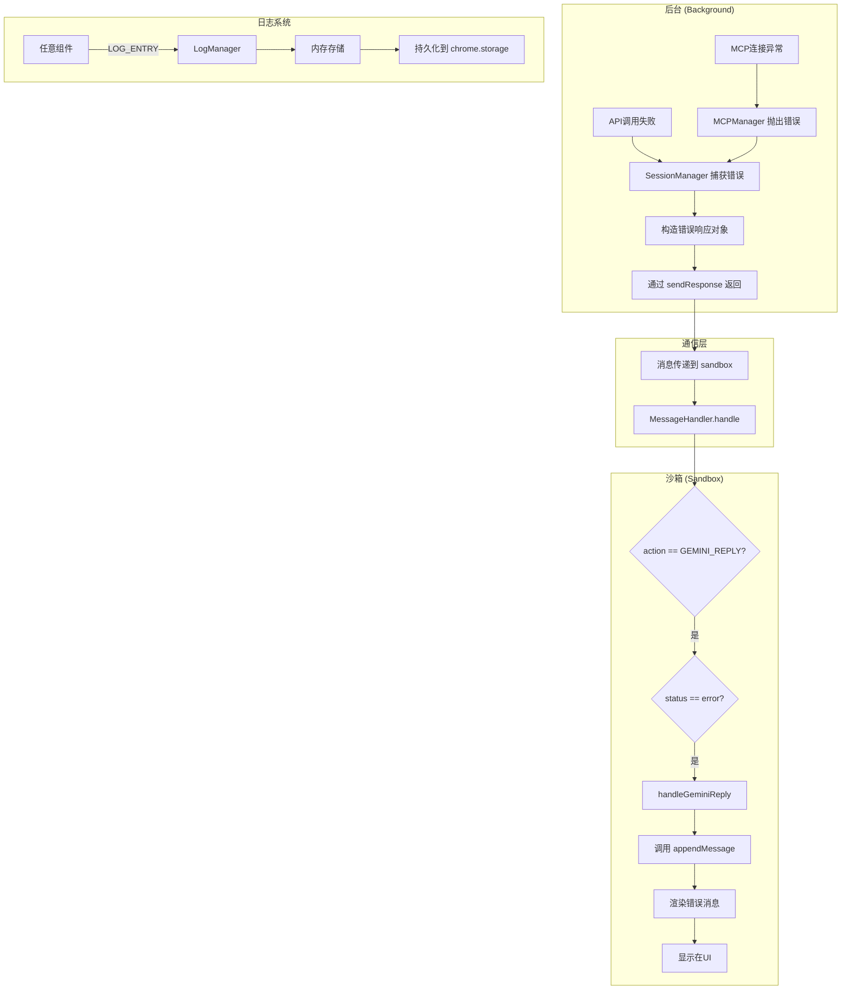

# 错误处理流

<cite>
**本文档引用的文件**   
- [messages.js](file://background/messages.js)
- [log_manager.js](file://background/managers/log_manager.js)
- [session_manager.js](file://background/managers/session_manager.js)
- [mcp_manager.js](file://background/managers/mcp_manager.js)
- [logger.js](file://lib/logger.js)
- [gemini_api.js](file://services/gemini_api.js)
- [message_handler.js](file://sandbox/controllers/message_handler.js)
- [message.js](file://sandbox/render/message.js)
- [keep_alive.js](file://background/managers/keep_alive.js)
- [connection.js](file://background/control/connection.js)
</cite>

## 目录
1. [简介](#简介)
2. [错误日志的捕获与持久化](#错误日志的捕获与持久化)
3. [API与MCP调用的错误处理](#api与mcp调用的错误处理)
4. [UI层的错误展示](#ui层的错误展示)
5. [重试逻辑与降级策略](#重试逻辑与降级策略)
6. [错误处理流程图](#错误处理流程图)

## 简介
Gemini Nexus 的错误处理机制是一个贯穿整个应用栈的系统化流程，从底层的网络请求、API调用，到上层的UI展示，都有一套完整的异常捕获、传递与处理策略。该机制确保了当系统出现故障时，用户能够获得清晰、友好的错误提示，同时开发者也能通过日志系统进行有效的调试和问题追踪。核心组件包括 `LogManager` 用于日志的集中存储，`SessionManager` 和 `MCPManager` 负责业务逻辑中的错误构造与响应，以及 `sandbox` 层的 `MessageHandler` 进行最终的错误渲染。

## 错误日志的捕获与持久化

在 Gemini Nexus 中，所有组件的错误日志都通过一个统一的中央日志系统进行管理。该系统的核心是 `background/messages.js` 文件中定义的全局消息监听器。

### 日志接收机制
任何组件都可以通过发送一个类型为 `LOG_ENTRY` 的消息来记录日志。消息监听器会检查请求的 `action` 字段，一旦匹配到 `LOG_ENTRY`，就会调用 `LogManager` 的 `add` 方法，将日志条目添加到内存中，并异步持久化到 `chrome.storage.local`。

```mermaid
flowchart TD
A[任意组件] --> |发送 LOG_ENTRY 消息| B[background/messages.js]
B --> |调用 logManager.add()| C[LogManager]
C --> |将日志存入内存数组| D[内存日志缓冲区]
C --> |异步保存到| E[chrome.storage.local]
```

**Diagram sources**
- [messages.js](file://background/messages.js#L25-L27)
- [log_manager.js](file://background/managers/log_manager.js#L29-L40)

### 日志管理器 (LogManager)
`LogManager` 类负责日志的生命周期管理。它在构造时初始化一个内存数组 `logs`，并从 `chrome.storage.local` 加载历史日志。为了防止内存溢出，它设置了 `MAX_LOGS` 限制（默认2000条），当日志数量超过此限制时，会自动裁剪最旧的日志。每次添加新日志后，都会触发 `_save` 方法，将整个日志数组保存到本地存储。

**Section sources**
- [log_manager.js](file://background/managers/log_manager.js#L4-L62)

## API与MCP调用的错误处理

当与外部服务（如 Gemini API 或 MCP 服务器）交互时，系统会捕获各种错误，并将其转换为结构化的响应对象返回给调用方。

### SessionManager 的错误处理
`SessionManager` 是处理与 Gemini API 通信的核心。在 `handleSendPrompt` 方法中，它通过 `sendGeminiMessage` 发送请求。如果请求失败，会捕获错误并进行分类处理。

- **认证失效 (401/403)**：当检测到会话过期或未登录时，系统会尝试通过 `AuthManager` 切换到备用账号进行重试。如果所有账号都失败，则构造一个包含登录链接的友好错误消息。
- **速率限制 (Rate Limited)**：当请求过于频繁时，会返回一个提示用户稍后再试的错误。
- **空响应或解析失败**：当服务器无响应或返回的数据无法解析时，会提示用户刷新页面。

错误最终被封装成一个包含 `action: "GEMINI_REPLY"` 和 `status: "error"` 的响应对象，并通过 `sendResponse` 返回。



**Diagram sources**
- [session_manager.js](file://background/managers/session_manager.js#L129-L198)
- [gemini_api.js](file://services/gemini_api.js#L154-L218)

### MCPManager 的错误处理
`MCPManager` 负责与 MCP（Model Context Protocol）服务器的连接和通信。在 `connectServer` 和 `sendRequestHttp` 等方法中，包含了对连接失败、HTTP错误和JSON-RPC错误的处理。

例如，在 `sendRequestHttp` 方法中，如果 `fetch` 请求失败或返回非200状态码，会直接抛出错误。如果服务器返回的JSON-RPC响应中包含 `error` 字段，也会将其转换为JavaScript错误抛出。这些错误最终会传递到 `SessionManager`，并被统一处理。

**Section sources**
- [mcp_manager.js](file://background/managers/mcp_manager.js#L229-L258)

## UI层的错误展示

`sandbox` 层负责将后台返回的错误响应解析并以用户友好的方式展示在界面上。

### MessageHandler 的错误处理
`MessageHandler` 类的 `handle` 方法是处理所有后台消息的入口。当收到 `action: "GEMINI_REPLY"` 且 `status: "error"` 的消息时，它会调用 `handleGeminiReply` 方法。

该方法会检查响应中的 `text` 字段，其中包含了经过 `SessionManager` 格式化后的HTML错误消息（例如包含链接的登录提示）。然后，它会创建或更新一个AI消息气泡，将错误内容渲染进去。由于错误消息中可能包含HTML链接，UI层会正确地解析并使其可点击，引导用户完成登录等操作。

```mermaid
flowchart TD
A[background] --> |GEMINI_REPLY (error)| B[sandbox]
B --> C[MessageHandler.handle]
C --> D{status == error?}
D --> |是| E[handleGeminiReply]
E --> F[创建/更新消息气泡]
F --> G[渲染错误文本 (含HTML)]
G --> H[显示在聊天界面]
```

**Diagram sources**
- [message_handler.js](file://sandbox/controllers/message_handler.js#L25-L281)
- [message.js](file://sandbox/render/message.js#L266-L323)

### 错误消息的渲染
`appendMessage` 函数负责创建消息UI。对于错误消息，它会将 `request.text` 中的内容（如 `Error: 🔑 账号 (Index: 0) 未登录...`）直接传递给 `renderContent` 函数进行渲染。`renderContent` 会处理其中的HTML标签，确保链接等元素正常显示。

**Section sources**
- [message_handler.js](file://sandbox/controllers/message_handler.js#L251-L278)
- [message.js](file://sandbox/render/message.js#L143-L147)

## 重试逻辑与降级策略

系统在面对临时性故障时，具备自动重试和降级的能力，以提高整体的健壮性。

### 认证失效的重试
当 `SessionManager` 首次调用 `sendGeminiMessage` 失败且原因为认证错误时，它会进入一个重试循环。通过 `AuthManager.rotateAccount()` 方法，系统会尝试使用配置中的下一个账号进行请求。这实现了账号间的负载均衡和故障转移。

### Keep-Alive 机制
`keep_alive.js` 中的 `KeepAliveManager` 会定期向一个特定的Google端点发送请求，以“旋转”会话Cookie，防止其过期。如果此请求失败，`_handleError` 方法会根据HTTP状态码进行处理。例如，收到401或403时，会清除本地的 `geminiContext`，强制用户在下次操作时重新登录，这是一种优雅的降级策略。

### 网络中断的处理
在 `connection.js` 中，`BrowserConnection` 类在 `attach` 方法中处理调试器连接。如果 `chrome.debugger.attach` 失败（例如在受限页面上），它会记录警告但不会中断主流程，允许其他非调试功能（如导航）继续执行，这也是一种降级策略。

**Section sources**
- [session_manager.js](file://background/managers/session_manager.js#L138-L143)
- [keep_alive.js](file://background/managers/keep_alive.js#L82-L93)
- [connection.js](file://background/control/connection.js#L74-L78)

## 错误处理流程图

以下流程图总结了从错误发生到最终展示的完整路径。



**Diagram sources**
- [session_manager.js](file://background/managers/session_manager.js#L129-L198)
- [messages.js](file://background/messages.js#L22-L79)
- [message_handler.js](file://sandbox/controllers/message_handler.js#L17-L28)
- [log_manager.js](file://background/managers/log_manager.js#L29-L40)