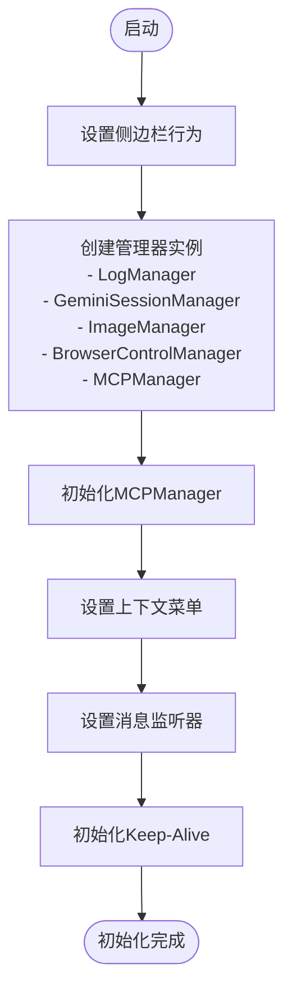
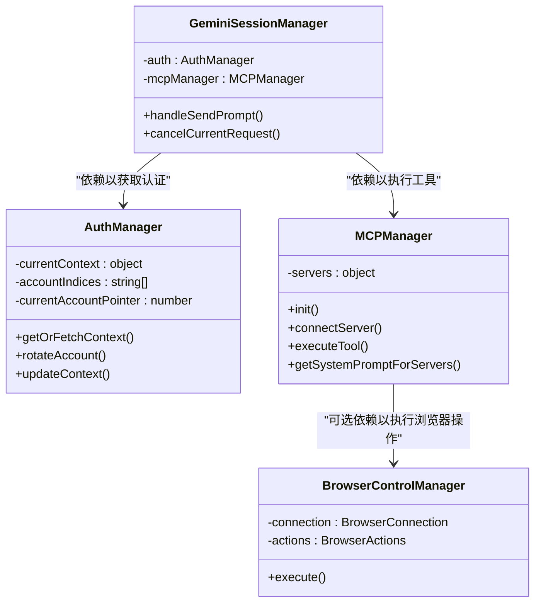
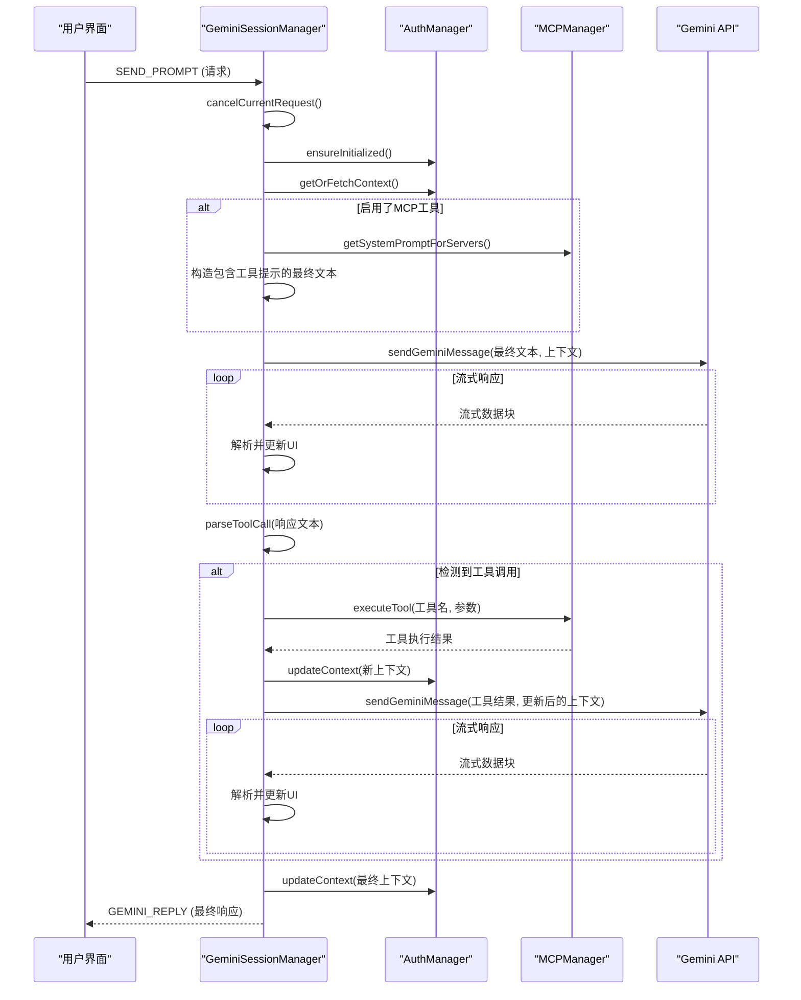
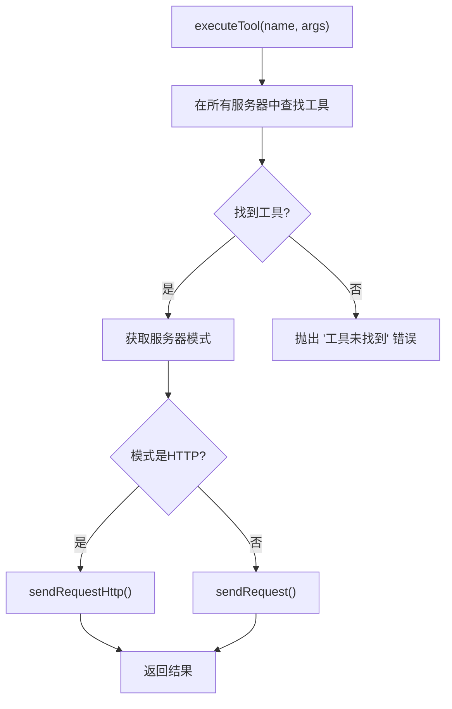
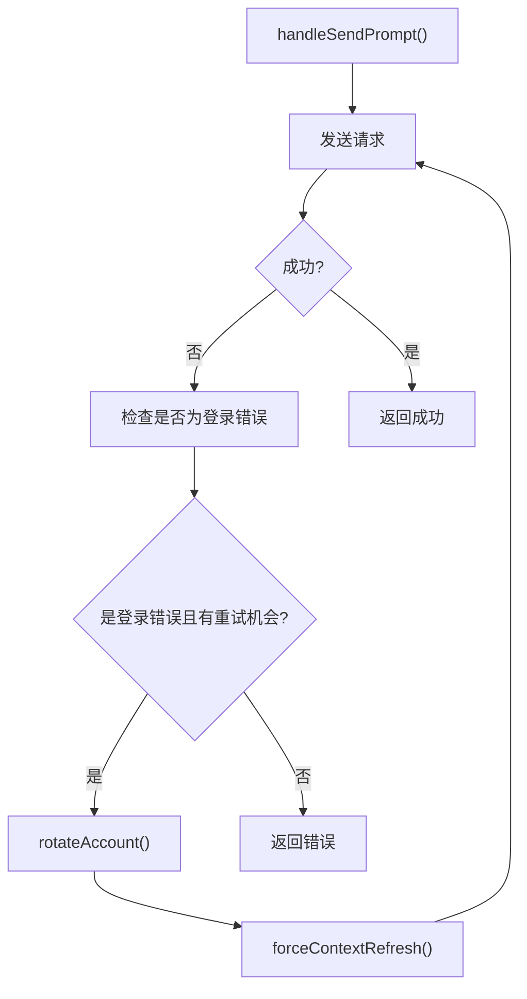
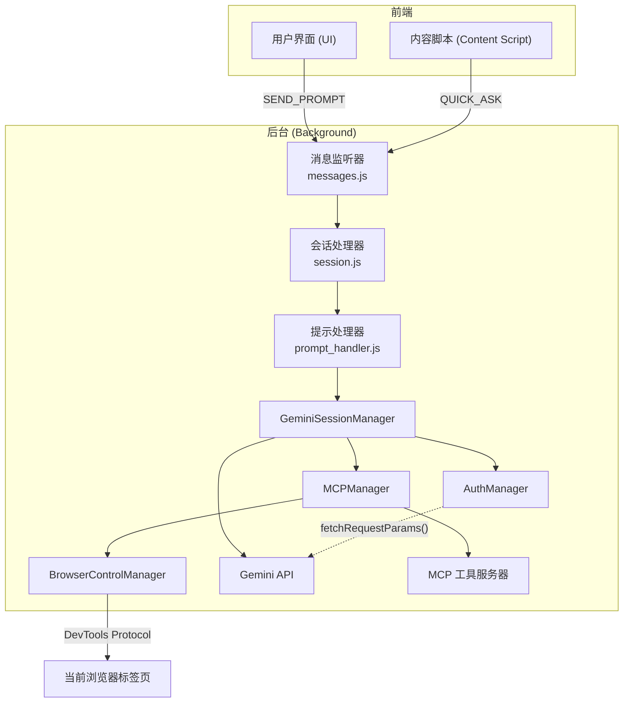

# Background服务层

<cite>
**本文档中引用的文件**  
- [background/index.js](file://background/index.js)
- [background/managers/session_manager.js](file://background/managers/session_manager.js)
- [background/managers/auth_manager.js](file://background/managers/auth_manager.js)
- [background/managers/mcp_manager.js](file://background/managers/mcp_manager.js)
- [background/messages.js](file://background/messages.js)
- [services/gemini_api.js](file://services/gemini_api.js)
- [services/auth.js](file://services/auth.js)
- [services/upload.js](file://services/upload.js)
- [services/parser.js](file://services/parser.js)
- [background/handlers/session/utils.js](file://background/handlers/session/utils.js)
- [background/handlers/session/prompt/tool_executor.js](file://background/handlers/session/prompt/tool_executor.js)
- [background/managers/control_manager.js](file://background/managers/control_manager.js)
</cite>

## 目录
1. [简介](#简介)
2. [系统启动与初始化](#系统启动与初始化)
3. [核心组件分析](#核心组件分析)
4. [组件交互与依赖关系](#组件交互与依赖关系)
5. [会话处理流程](#会话处理流程)
6. [MCP工具调用机制](#mcp工具调用机制)
7. [认证与账户管理](#认证与账户管理)
8. [MCP协议客户端实现](#mcp协议客户端实现)
9. [错误处理与恢复机制](#错误处理与恢复机制)
10. [系统架构图](#系统架构图)

## 简介
本架构文档详细阐述了Gemini Nexus扩展的Background服务层，作为Chrome扩展后台工作线程的核心，负责协调所有核心功能。该服务层初始化并管理`GeminiSessionManager`、`AuthManager`和`MCPManager`等关键组件，处理来自内容脚本和UI的请求，与Gemini API进行通信，并执行MCP（Model Context Protocol）工具调用。文档将深入分析各管理器的职责、交互流程和实现细节。

## 系统启动与初始化
Background服务层的入口点是`background/index.js`。当扩展加载时，该文件负责创建所有核心管理器的实例并建立它们之间的连接。

**Diagram sources**
- [background/index.js](file://background/index.js#L1-L30)

**Section sources**
- [background/index.js](file://background/index.js#L1-L30)

## 核心组件分析
Background服务层由多个职责明确的管理器构成，它们协同工作以提供完整的服务。

### GeminiSessionManager
`GeminiSessionManager`是处理用户会话和AI请求的核心组件。它负责协调会话状态、发送请求到Gemini API以及处理流式响应。

**Section sources**
- [background/managers/session_manager.js](file://background/managers/session_manager.js#L6-L285)

### AuthManager
`AuthManager`负责管理多账户的认证状态，包括获取和刷新认证上下文、处理账户轮换以及维护会话。

**Section sources**
- [background/managers/auth_manager.js](file://background/managers/auth_manager.js#L5-L130)

### MCPManager
`MCPManager`实现了MCP协议客户端，负责连接外部工具服务器，管理工具列表，并执行工具调用。

**Section sources**
- [background/managers/mcp_manager.js](file://background/managers/mcp_manager.js#L2-L530)

## 组件交互与依赖关系
各管理器之间存在明确的依赖关系，形成了一个分层的架构。

**Diagram sources**
- [background/managers/session_manager.js](file://background/managers/session_manager.js#L8-L11)
- [background/managers/auth_manager.js](file://background/managers/auth_manager.js#L7-L10)
- [background/managers/mcp_manager.js](file://background/managers/mcp_manager.js#L4-L5)
- [background/managers/control_manager.js](file://background/managers/control_manager.js#L13-L15)

**Section sources**
- [background/managers/session_manager.js](file://background/managers/session_manager.js#L6-L285)
- [background/managers/auth_manager.js](file://background/managers/auth_manager.js#L5-L130)
- [background/managers/mcp_manager.js](file://background/managers/mcp_manager.js#L2-L530)

## 会话处理流程
当用户发送一个提示时，`GeminiSessionManager`会启动一个复杂的处理流程。

**Diagram sources**
- [background/managers/session_manager.js](file://background/managers/session_manager.js#L21-L202)
- [services/gemini_api.js](file://services/gemini_api.js#L26-L230)

**Section sources**
- [background/managers/session_manager.js](file://background/managers/session_manager.js#L21-L202)

## MCP工具调用机制
MCP工具调用是一个关键的两阶段过程，由`GeminiSessionManager`协调。

### 工具调用循环
1.  **第一阶段 - AI生成工具调用**: `GeminiSessionManager`向Gemini API发送用户请求。如果启用了MCP，它会先注入一个系统提示，告知AI可用的工具。AI的响应可能包含一个JSON格式的工具调用指令。
2.  **第二阶段 - 执行与反馈**: `GeminiSessionManager`解析出工具调用，通过`MCPManager`执行该工具，获取结果，然后将结果作为新的消息发送回Gemini API，以生成最终的自然语言回复。

**Section sources**
- [background/managers/session_manager.js](file://background/managers/session_manager.js#L76-L115)

### 工具执行
`MCPManager`的`executeTool`方法负责查找目标服务器并根据其连接模式（SSE或HTTP）执行调用。

**Diagram sources**
- [background/managers/mcp_manager.js](file://background/managers/mcp_manager.js#L479-L525)

**Section sources**
- [background/managers/mcp_manager.js](file://background/managers/mcp_manager.js#L479-L525)

## 认证与账户管理
`AuthManager`实现了强大的多账户管理和自动恢复机制。

### 认证上下文管理
`AuthManager`通过`chrome.storage.local`持久化存储认证上下文（`atValue`, `blValue`）和当前会话ID。`getOrFetchContext`方法是核心，它会先检查本地缓存，如果不存在则通过`fetchRequestParams`从Gemini网页抓取最新的认证令牌。

**Section sources**
- [background/managers/auth_manager.js](file://background/managers/auth_manager.js#L75-L91)
- [services/auth.js](file://services/auth.js#L7-L40)

### 自动账户轮换
当请求因认证失败（如401错误）而失败时，`GeminiSessionManager`会触发`AuthManager`的`rotateAccount`方法。该方法会循环使用配置的账户索引，尝试用下一个账户重新发送请求，从而提高服务的可用性。

**Diagram sources**
- [background/managers/session_manager.js](file://background/managers/session_manager.js#L138-L143)
- [background/managers/auth_manager.js](file://background/managers/auth_manager.js#L53-L69)

**Section sources**
- [background/managers/session_manager.js](file://background/managers/session_manager.js#L129-L147)
- [background/managers/auth_manager.js](file://background/managers/auth_manager.js#L53-L69)

## MCP协议客户端实现
`MCPManager`是一个功能完整的MCP协议客户端，支持SSE和HTTP两种连接模式。

### 连接初始化
`connectServer`方法首先探测服务器的响应类型。如果服务器返回JSON而非SSE流，则自动切换到HTTP模式。对于SSE模式，它会监听`endpoint`事件以获取用于发送请求的POST URL。

**Section sources**
- [background/managers/mcp_manager.js](file://background/managers/mcp_manager.js#L71-L150)

### 双模式支持
- **SSE模式**: 使用`EventSource`建立长连接，接收服务器推送的事件。请求通过`fetch`发送到`postUrl`，响应通过SSE流返回。
- **HTTP模式**: 直接使用`fetch`进行POST请求，等待同步响应，无需维护长连接。

**Section sources**
- [background/managers/mcp_manager.js](file://background/managers/mcp_manager.js#L88-L96)
- [background/managers/mcp_manager.js](file://background/managers/mcp_manager.js#L107-L112)

## 错误处理与恢复机制
系统实现了多层次的错误处理和用户友好的错误信息。

### 错误分类与处理
`GeminiSessionManager`的`handleSendPrompt`方法捕获所有错误，并根据错误消息的类型（如"未登录"、"请求过于频繁"）生成本地化的、可操作的HTML错误消息，引导用户解决问题。

**Section sources**
- [background/managers/session_manager.js](file://background/managers/session_manager.js#L149-L193)

### 消息传递与解耦
`background/messages.js`中的`setupMessageListener`函数是系统的通信枢纽。它接收来自内容脚本和UI的请求，并将其分发给相应的处理器（如`SessionMessageHandler`），实现了组件间的解耦。

**Section sources**
- [background/messages.js](file://background/messages.js#L14-L82)

## 系统架构图
以下是Gemini Nexus Background服务层的整体架构图。

**Diagram sources**
- [background/index.js](file://background/index.js#L4-L27)
- [background/messages.js](file://background/messages.js#L14-L82)
- [background/managers/session_manager.js](file://background/managers/session_manager.js#L6-L285)
- [background/managers/auth_manager.js](file://background/managers/auth_manager.js#L5-L130)
- [background/managers/mcp_manager.js](file://background/managers/mcp_manager.js#L2-L530)
- [services/gemini_api.js](file://services/gemini_api.js#L26-L230)