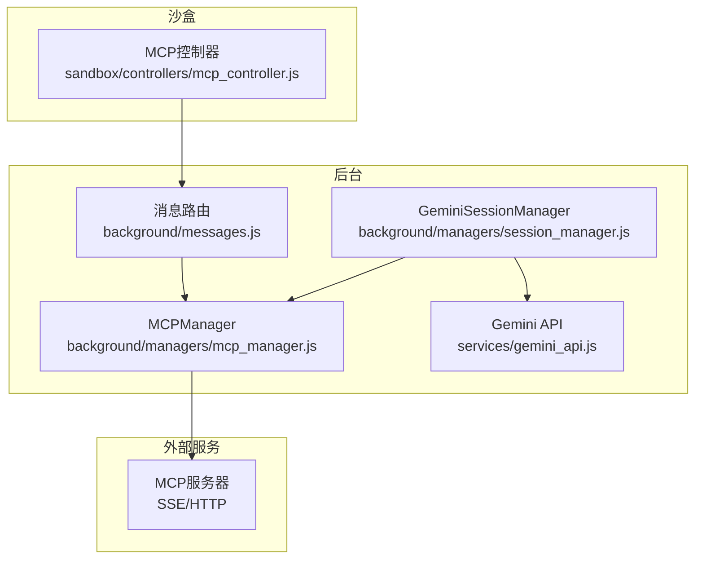
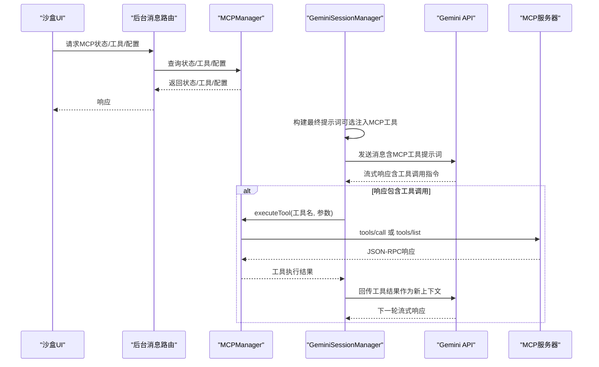
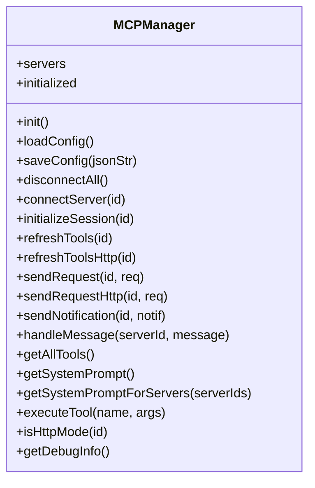
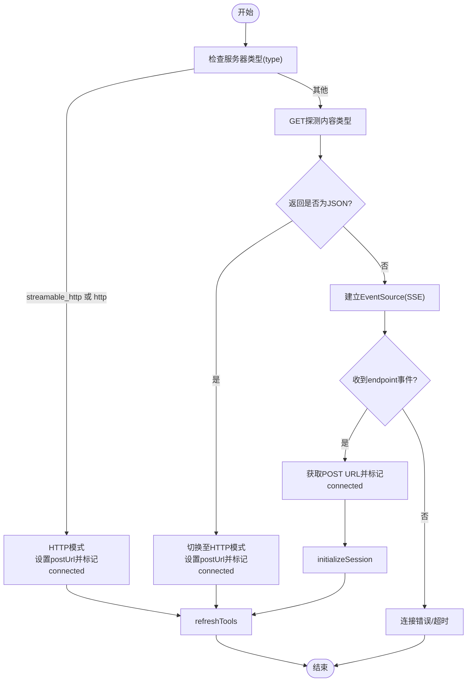
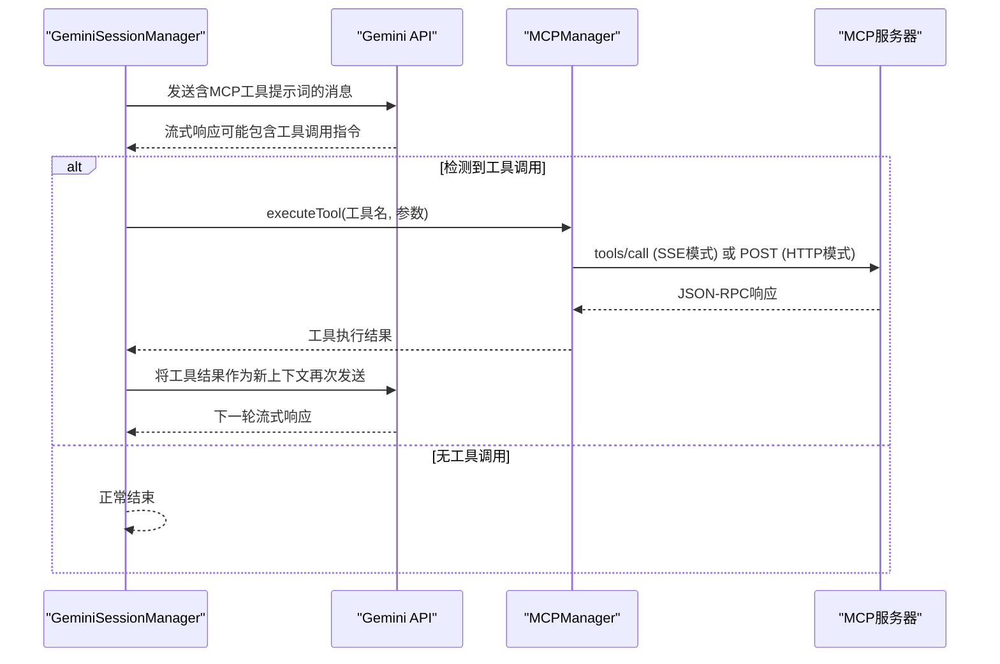
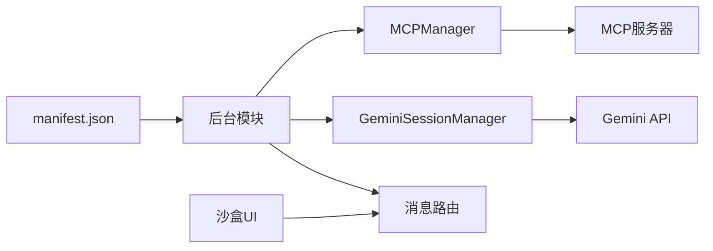

# MCP管理

<cite>
**本文引用的文件列表**
- [mcp_manager.js](file://background/managers/mcp_manager.js)
- [session_manager.js](file://background/managers/session_manager.js)
- [messages.js](file://background/messages.js)
- [gemini_api.js](file://services/gemini_api.js)
- [tool_executor.js](file://background/handlers/session/prompt/tool_executor.js)
- [mcp_controller.js](file://sandbox/controllers/mcp_controller.js)
- [manifest.json](file://manifest.json)
</cite>

## 目录
1. [简介](#简介)
2. [项目结构](#项目结构)
3. [核心组件](#核心组件)
4. [架构总览](#架构总览)
5. [关键组件详解](#关键组件详解)
6. [依赖关系分析](#依赖关系分析)
7. [性能考量](#性能考量)
8. [故障排查指南](#故障排查指南)
9. [结论](#结论)
10. [附录](#附录)

## 简介
本文件面向Gemini Nexus的MCP（Model Context Protocol）管理模块，系统性阐述MCPManager如何作为MCP协议客户端，集成外部AI工具服务。重点覆盖：
- 配置加载与持久化：从chrome.storage.local读取MCP服务器配置，支持保存与重连。
- 连接建立：根据服务器类型(type)自动探测SSE或HTTP模式，兼容streamable_http与http。
- 会话初始化与工具刷新：initializeSession、refreshTools的调用流程。
- 请求-响应关联：sendRequest与handleMessage基于JSON-RPC 2.0的id关联机制。
- 提示词注入与工具执行：getSystemPromptForServers与executeTool，将可用工具注入Gemini提示词并执行工具调用循环。
- 与GeminiSessionManager的集成：在发送提示前注入MCP工具提示词，在Gemini返回工具调用时执行对应工具。
- 异常处理：连接失败、SSE解析错误、HTTP响应错误、工具不存在等场景的处理策略。

## 项目结构
围绕MCP管理的关键文件组织如下：
- background/managers/mcp_manager.js：MCPManager类，负责配置、连接、会话、工具列表、请求发送与响应处理。
- background/managers/session_manager.js：GeminiSessionManager，负责与Gemini交互、上下文管理、工具调用循环。
- background/messages.js：后台消息路由，提供MCP配置读写、工具列表查询、状态查询等接口。
- services/gemini_api.js：与Gemini后端通信，处理流式响应与上下文更新。
- background/handlers/session/prompt/tool_executor.js：本地工具执行器（非MCP），用于演示工具执行模式。
- sandbox/controllers/mcp_controller.js：沙盒侧MCP控制器，负责UI选择与状态展示。
- manifest.json：声明权限与宿主权限，确保MCP服务器访问能力。

图表来源
- [mcp_manager.js](file://background/managers/mcp_manager.js#L1-L530)
- [session_manager.js](file://background/managers/session_manager.js#L1-L285)
- [messages.js](file://background/messages.js#L40-L82)
- [gemini_api.js](file://services/gemini_api.js#L1-L230)
- [mcp_controller.js](file://sandbox/controllers/mcp_controller.js#L1-L221)

章节来源
- [mcp_manager.js](file://background/managers/mcp_manager.js#L1-L530)
- [session_manager.js](file://background/managers/session_manager.js#L1-L285)
- [messages.js](file://background/messages.js#L40-L82)
- [gemini_api.js](file://services/gemini_api.js#L1-L230)
- [mcp_controller.js](file://sandbox/controllers/mcp_controller.js#L1-L221)
- [manifest.json](file://manifest.json#L1-L93)

## 核心组件
- MCPManager：MCP协议客户端，负责配置加载、连接探测、SSE/HTTP模式切换、会话初始化、工具列表获取、JSON-RPC请求与响应处理、工具注入提示词与执行。
- GeminiSessionManager：与Gemini交互的会话管理器，负责构建最终提示词（注入MCP工具）、解析Gemini响应中的工具调用、执行工具并回传结果。
- 消息路由：提供MCP配置读取/保存、工具列表查询、状态查询等后台接口。
- Gemini API：封装与Gemini后端的通信细节，处理流式响应与上下文更新。
- MCP控制器：沙盒侧UI控制器，负责MCP服务器选择与状态展示。

章节来源
- [mcp_manager.js](file://background/managers/mcp_manager.js#L1-L530)
- [session_manager.js](file://background/managers/session_manager.js#L1-L285)
- [messages.js](file://background/messages.js#L40-L82)
- [gemini_api.js](file://services/gemini_api.js#L1-L230)
- [mcp_controller.js](file://sandbox/controllers/mcp_controller.js#L1-L221)

## 架构总览
下图展示了MCPManager与GeminiSessionManager的协作关系，以及与外部MCP服务器的交互路径。

图表来源
- [mcp_manager.js](file://background/managers/mcp_manager.js#L262-L306)
- [session_manager.js](file://background/managers/session_manager.js#L21-L120)
- [gemini_api.js](file://services/gemini_api.js#L26-L200)
- [messages.js](file://background/messages.js#L40-L82)

## 关键组件详解

### MCPManager类与配置管理
- 初始化与配置加载
  - init：首次初始化时加载配置并自动连接所有启用的服务器。
  - loadConfig：从chrome.storage.local读取mcpConfig，若不存在则使用默认空配置；将每个服务器配置映射到内部servers状态。
  - saveConfig：解析传入的JSON字符串，校验包含mcpServers字段，写入chrome.storage.local，断开旧连接，重新加载配置并按需重建连接。
- 连接与模式探测
  - connectServer：根据服务器配置的type决定连接模式：
    - 若type为streamable_http或http：直接使用POST模式，postUrl即为配置URL，立即刷新工具列表。
    - 否则：先以GET探测内容类型，若返回application/json则切换为HTTP模式；否则建立EventSource进行SSE连接，监听endpoint事件以获取POST URL，随后进入initializeSession。
- 会话初始化与工具刷新
  - initializeSession：发送initialize JSON-RPC请求，随后发送notifications/initialized通知，最后调用refreshTools。
  - refreshTools：若处于HTTP模式则调用refreshToolsHttp，否则通过SSE通道发送tools/list请求并更新tools列表。
- 请求-响应关联与消息处理
  - sendRequest：生成随机id，构造JSON-RPC 2.0请求，发起POST；同时在pendingRequests中注册Promise，等待handleMessage收到同id的响应后resolve/reject；超时10秒。
  - handleMessage：当收到消息且存在对应id的pending请求时，清理定时器并根据是否存在error字段resolve或reject。
  - sendNotification：发送无id的通知型JSON-RPC请求。
  - sendRequestHttp：仅用于HTTP模式的直接请求，不依赖SSE响应，直接等待HTTP响应并解析。
- 工具注入提示词与执行
  - getSystemPrompt/getSystemPromptForServers：将可用工具汇总为提示词，包含工具名称、描述与输入Schema摘要，指导模型输出符合规范的工具调用格式。
  - executeTool：查找目标服务器，构造tools/call请求，依据服务器模式选择sendRequest或sendRequestHttp，返回工具执行结果。

图表来源
- [mcp_manager.js](file://background/managers/mcp_manager.js#L1-L530)

章节来源
- [mcp_manager.js](file://background/managers/mcp_manager.js#L1-L530)

### 连接状态与模式切换流程

图表来源
- [mcp_manager.js](file://background/managers/mcp_manager.js#L71-L150)
- [mcp_manager.js](file://background/managers/mcp_manager.js#L287-L306)

章节来源
- [mcp_manager.js](file://background/managers/mcp_manager.js#L71-L150)
- [mcp_manager.js](file://background/managers/mcp_manager.js#L287-L306)

### 工具调用序列（Gemini -> MCP -> Gemini）

图表来源
- [session_manager.js](file://background/managers/session_manager.js#L21-L120)
- [mcp_manager.js](file://background/managers/mcp_manager.js#L479-L525)

章节来源
- [session_manager.js](file://background/managers/session_manager.js#L21-L120)
- [mcp_manager.js](file://background/managers/mcp_manager.js#L479-L525)

### 与GeminiSessionManager的集成
- 注入工具提示词：在handleSendPrompt中，若请求包含mcpIds，则调用getSystemPromptForServers生成针对指定服务器的工具提示词，并拼接到用户问题之前。
- 工具调用循环：parseToolCall解析Gemini响应中的工具调用指令，若存在且存在MCPManager，则执行executeTool并将结果作为新的上下文再次发送给Gemini，完成一次工具调用循环。
- 错误处理：工具执行失败时，将错误信息追加到响应文本中，保证用户可见。

章节来源
- [session_manager.js](file://background/managers/session_manager.js#L54-L114)

### 与沙盒UI的交互
- MCP控制器负责在沙盒侧展示MCP服务器列表、状态与工具数量，支持多选服务器ID并在发送消息时传递给后台。
- 通过postMessage向后台请求MCP状态，后台通过消息路由返回servers状态供UI渲染。

章节来源
- [mcp_controller.js](file://sandbox/controllers/mcp_controller.js#L88-L122)
- [messages.js](file://background/messages.js#L63-L67)

## 依赖关系分析
- 权限与宿主访问
  - manifest.json声明storage、contextMenus、scripting、alarms、debugger、downloads等权限，以及对<all_urls>的host_permissions，确保MCP服务器访问与扩展功能正常运行。
- 模块间耦合
  - MCPManager与GeminiSessionManager通过executeTool与getSystemPromptForServers进行松耦合交互。
  - 消息路由统一暴露MCP相关操作，便于UI与后台交互。
  - GeminiSessionManager依赖Gemini API进行消息发送与流式响应处理。

图表来源
- [manifest.json](file://manifest.json#L6-L10)
- [messages.js](file://background/messages.js#L40-L82)
- [mcp_manager.js](file://background/managers/mcp_manager.js#L1-L530)
- [session_manager.js](file://background/managers/session_manager.js#L1-L285)
- [gemini_api.js](file://services/gemini_api.js#L1-L230)

章节来源
- [manifest.json](file://manifest.json#L6-L10)
- [messages.js](file://background/messages.js#L40-L82)
- [mcp_manager.js](file://background/managers/mcp_manager.js#L1-L530)
- [session_manager.js](file://background/managers/session_manager.js#L1-L285)
- [gemini_api.js](file://services/gemini_api.js#L1-L230)

## 性能考量
- 连接探测：SSE模式下先进行GET探测，若服务器返回JSON则切换HTTP模式，避免不必要的SSE连接开销。
- 工具列表缓存：refreshTools在HTTP模式下直接POST获取工具列表，SSE模式下通过SSE通道获取；工具列表更新后复用内存状态，减少重复网络请求。
- 请求超时：sendRequest设置10秒超时，防止长时间阻塞；超时后清理pendingRequests并拒绝Promise。
- 并发与重试：GeminiSessionManager在多账号场景下支持轮换重试，提升稳定性。

[本节为通用建议，无需特定文件引用]

## 故障排查指南
- 连接失败
  - 症状：服务器状态显示error，无法获取POST URL。
  - 排查要点：确认服务器URL/端点配置正确；检查网络可达性；查看后台日志中的SSE错误信息。
  - 参考位置：connectServer中SSE错误处理与状态设置。
  
  章节来源
  - [mcp_manager.js](file://background/managers/mcp_manager.js#L122-L125)

- SSE消息解析错误
  - 症状：handleMessage中捕获解析异常，记录Failed to parse message。
  - 排查要点：确认服务器返回的SSE数据为合法JSON；检查编码与换行符。
  
  章节来源
  - [mcp_manager.js](file://background/managers/mcp_manager.js#L135-L142)

- HTTP响应错误
  - 症状：sendRequestHttp或refreshToolsHttp抛出HTTP错误或JSON-RPC error。
  - 排查要点：检查POST URL与服务器端点；确认服务器返回标准JSON-RPC格式；核对鉴权与跨域设置。
  
  章节来源
  - [mcp_manager.js](file://background/managers/mcp_manager.js#L229-L260)
  - [mcp_manager.js](file://background/managers/mcp_manager.js#L157-L213)

- 工具不存在
  - 症状：executeTool找不到目标工具，抛出“工具未找到”错误并列出可用工具。
  - 排查要点：确认工具名称与服务器工具列表一致；检查工具是否已在refreshTools中加载。
  
  章节来源
  - [mcp_manager.js](file://background/managers/mcp_manager.js#L479-L506)

- 工具调用循环失败
  - 症状：GeminiSessionManager在执行工具后继续报错。
  - 排查要点：检查工具返回格式是否符合预期；确认上下文更新成功；查看onUpdate回调中追加的错误信息。
  
  章节来源
  - [session_manager.js](file://background/managers/session_manager.js#L104-L114)

## 结论
MCPManager实现了对MCP协议的客户端集成，具备自动探测SSE/HTTP模式、会话初始化、工具列表管理、JSON-RPC请求-响应关联与工具注入提示词的能力。通过与GeminiSessionManager的协作，Gemini可在单轮对话中执行外部工具，形成完整的工具调用闭环。该设计兼顾了兼容性与可维护性，适合在多种MCP服务器环境下稳定运行。

[本节为总结，无需特定文件引用]

## 附录
- 配置结构与存储
  - 配置键：mcpConfig，包含mcpServers对象，每个服务器包含id、url/endpoint、type等字段。
  - 存储位置：chrome.storage.local。
- 兼容模式
  - type为streamable_http或http时采用HTTP直连模式；否则采用SSE模式，必要时自动降级为HTTP模式。
- 工具提示词格式
  - 包含工具名称、描述与输入Schema摘要，指导模型输出符合规范的工具调用格式。

[本节为概要说明，无需特定文件引用]