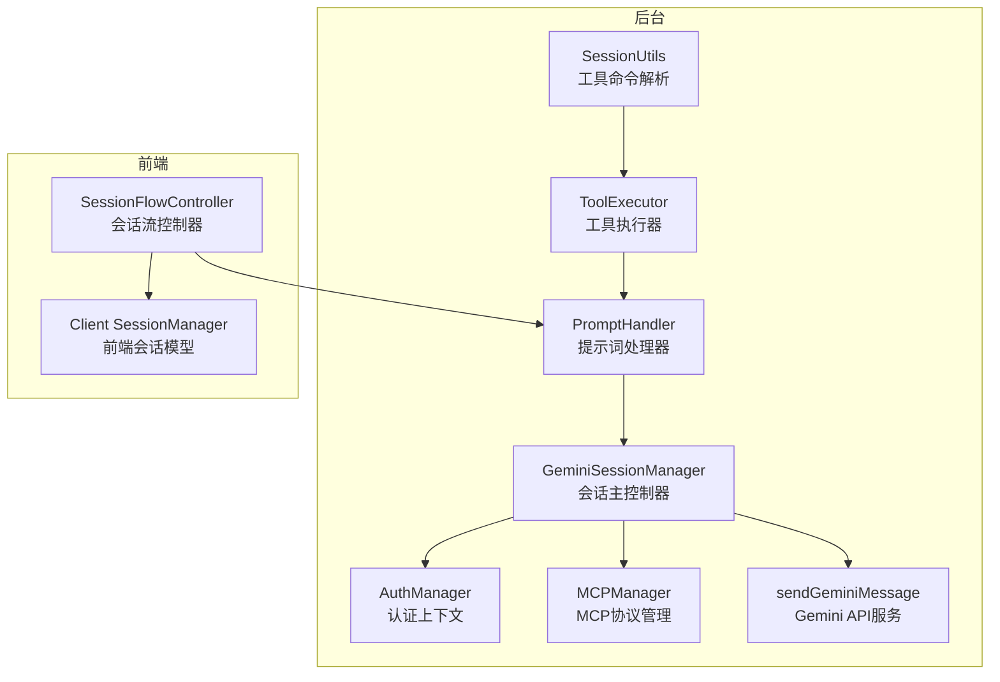
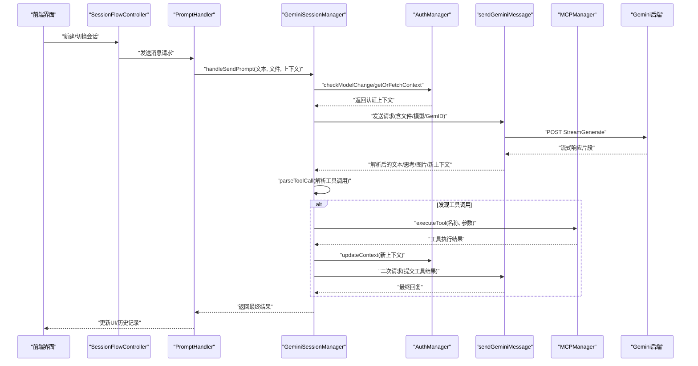
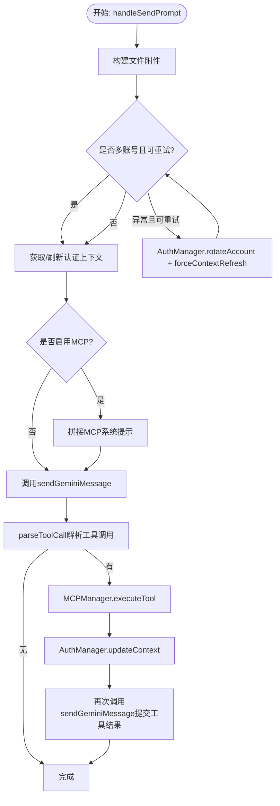
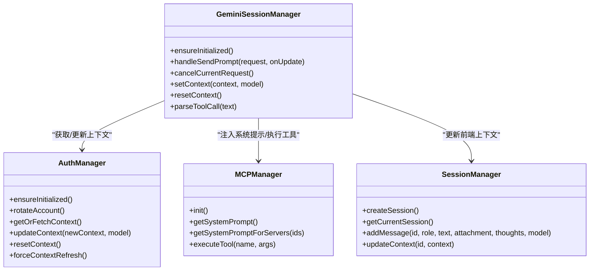

# 会话管理

<cite>
**本文引用的文件列表**
- [background/managers/session_manager.js](file://background/managers/session_manager.js)
- [sandbox/core/session_manager.js](file://sandbox/core/session_manager.js)
- [background/managers/auth_manager.js](file://background/managers/auth_manager.js)
- [background/managers/mcp_manager.js](file://background/managers/mcp_manager.js)
- [services/gemini_api.js](file://services/gemini_api.js)
- [services/auth.js](file://services/auth.js)
- [background/handlers/session.js](file://background/handlers/session.js)
- [background/handlers/session/prompt_handler.js](file://background/handlers/session/prompt_handler.js)
- [background/handlers/session/prompt/tool_executor.js](file://background/handlers/session/prompt/tool_executor.js)
- [background/handlers/session/utils.js](file://background/handlers/session/utils.js)
- [lib/utils.js](file://lib/utils.js)
- [sandbox/controllers/session_flow.js](file://sandbox/controllers/session_flow.js)
</cite>

## 目录
1. [简介](#简介)
2. [项目结构](#项目结构)
3. [核心组件](#核心组件)
4. [架构总览](#架构总览)
5. [详细组件分析](#详细组件分析)
6. [依赖关系分析](#依赖关系分析)
7. [性能考量](#性能考量)
8. [故障排查指南](#故障排查指南)
9. [结论](#结论)

## 简介
本文件聚焦于Gemini Nexus的会话管理模块，系统性阐述后台服务中的GeminiSessionManager如何协调AI对话的全生命周期：从接收用户请求、构建文件附件、多账户认证轮换与重试、与Gemini API通信，到解析并执行MCP工具调用，以及最终将结果回写至前端会话模型。文档同时给出会话状态流转图与时序图，并总结常见错误场景的处理策略。

## 项目结构
围绕会话管理的关键目录与文件：
- 后台管理器
  - background/managers/session_manager.js：会话主控制器，负责请求编排、重试、MCP集成与上下文更新
  - background/managers/auth_manager.js：认证上下文管理，支持多账号轮换与持久化
  - background/managers/mcp_manager.js：MCP协议管理，支持SSE与HTTP模式，工具发现与调用
- 服务层
  - services/gemini_api.js：与Gemini后端交互，处理流式响应与上下文ID更新
  - services/auth.js：抓取AT/BL令牌与用户索引
- 前端会话模型
  - sandbox/core/session_manager.js：前端会话数据结构与消息维护
  - sandbox/controllers/session_flow.js：会话切换、渲染与上下文同步
- 消息与处理器
  - background/handlers/session.js：消息分发入口
  - background/handlers/session/prompt_handler.js：提示词处理与自动化反馈循环
  - background/handlers/session/prompt/tool_executor.js：浏览器控制工具执行
  - background/handlers/session/utils.js：工具命令解析等辅助
  - lib/utils.js：通用工具函数（UUID、数据URL转Blob等）

图表来源
- [background/managers/session_manager.js](file://background/managers/session_manager.js#L6-L285)
- [background/managers/auth_manager.js](file://background/managers/auth_manager.js#L5-L130)
- [background/managers/mcp_manager.js](file://background/managers/mcp_manager.js#L2-L530)
- [services/gemini_api.js](file://services/gemini_api.js#L26-L230)
- [background/handlers/session/prompt_handler.js](file://background/handlers/session/prompt_handler.js#L6-L103)
- [background/handlers/session/prompt/tool_executor.js](file://background/handlers/session/prompt/tool_executor.js#L4-L49)
- [background/handlers/session/utils.js](file://background/handlers/session/utils.js#L4-L21)
- [sandbox/core/session_manager.js](file://sandbox/core/session_manager.js#L5-L105)
- [sandbox/controllers/session_flow.js](file://sandbox/controllers/session_flow.js#L7-L96)

章节来源
- [background/managers/session_manager.js](file://background/managers/session_manager.js#L1-L285)
- [background/managers/auth_manager.js](file://background/managers/auth_manager.js#L1-L130)
- [background/managers/mcp_manager.js](file://background/managers/mcp_manager.js#L1-L530)
- [services/gemini_api.js](file://services/gemini_api.js#L1-L230)
- [background/handlers/session/prompt_handler.js](file://background/handlers/session/prompt_handler.js#L1-L103)
- [background/handlers/session/prompt/tool_executor.js](file://background/handlers/session/prompt/tool_executor.js#L1-L49)
- [background/handlers/session/utils.js](file://background/handlers/session/utils.js#L1-L64)
- [sandbox/core/session_manager.js](file://sandbox/core/session_manager.js#L1-L105)
- [sandbox/controllers/session_flow.js](file://sandbox/controllers/session_flow.js#L1-L96)

## 核心组件
- GeminiSessionManager：后台会话主控制器，负责请求预处理、多账户轮换重试、MCP注入与工具调用循环、上下文更新与错误映射。
- AuthManager：维护当前认证上下文、模型变更检测、多账号索引与指针、上下文持久化与强制刷新。
- MCPManager：MCP协议适配器，支持SSE与HTTP两种模式，自动发现工具、执行工具调用、管理连接状态。
- sendGeminiMessage：与Gemini后端交互，处理文件上传、消息体构造、流式响应解析与上下文ID更新。
- PromptHandler：前端消息入口，驱动自动化反馈循环，将AI输出与工具执行结果拼接为下一轮输入。
- ToolExecutor：解析并执行浏览器控制类工具（如截图），将结果作为附件回传给模型。
- 前端SessionManager：维护会话列表、当前会话、消息历史与上下文ID；与后台保持同步。

章节来源
- [background/managers/session_manager.js](file://background/managers/session_manager.js#L6-L285)
- [background/managers/auth_manager.js](file://background/managers/auth_manager.js#L5-L130)
- [background/managers/mcp_manager.js](file://background/managers/mcp_manager.js#L2-L530)
- [services/gemini_api.js](file://services/gemini_api.js#L26-L230)
- [background/handlers/session/prompt_handler.js](file://background/handlers/session/prompt_handler.js#L6-L103)
- [background/handlers/session/prompt/tool_executor.js](file://background/handlers/session/prompt/tool_executor.js#L4-L49)
- [sandbox/core/session_manager.js](file://sandbox/core/session_manager.js#L5-L105)

## 架构总览
会话管理采用“后台主控制器 + 多管理器协作”的分层设计：
- 前端通过SessionFlowController触发会话切换与上下文同步，PromptHandler接收用户请求并进入自动化反馈循环。
- GeminiSessionManager统一编排：认证上下文获取与轮换、文件附件构建、MCP系统提示注入、与Gemini API通信、解析工具调用并执行。
- MCPManager负责工具发现与调用，支持SSE与HTTP两种传输模式；AuthManager确保上下文一致性与多账号负载均衡。
- sendGeminiMessage负责底层HTTP请求、流式解析与上下文ID回写；前端SessionManager保存消息与上下文，保证前后端一致。

图表来源
- [background/handlers/session/prompt_handler.js](file://background/handlers/session/prompt_handler.js#L13-L101)
- [background/managers/session_manager.js](file://background/managers/session_manager.js#L21-L202)
- [background/managers/auth_manager.js](file://background/managers/auth_manager.js#L75-L92)
- [services/gemini_api.js](file://services/gemini_api.js#L26-L230)
- [background/managers/mcp_manager.js](file://background/managers/mcp_manager.js#L479-L525)

## 详细组件分析

### GeminiSessionManager：会话生命周期编排
- 职责
  - 接收用户请求，构建文件附件（单图或多文件）
  - 多账户轮换与重试：当检测到登录失效或401/403时，自动旋转账号并刷新上下文后重试
  - 注入MCP系统提示：根据选中的MCP服务器生成系统提示，增强模型工具可用性
  - 流式响应处理：通过onUpdate回调实时推送文本与思考内容
  - 工具调用循环：解析模型输出中的工具调用，执行后将结果回喂给模型，形成一次自动化反馈循环
  - 上下文更新与持久化：成功后更新并持久化上下文ID，确保后续请求延续对话
  - 错误映射：对登录失效、频率限制、空响应、无效响应进行本地化友好提示
- 关键方法
  - handleSendPrompt：主流程入口，包含重试、MCP注入与工具调用循环
  - parseToolCall：解析工具调用（支持代码块与裸JSON）
  - cancelCurrentRequest：取消当前请求
  - setContext/resetContext：手动设置/重置上下文
- 与AuthManager/MCPManager的协作
  - 通过AuthManager获取/刷新上下文，必要时轮换账号
  - 通过MCPManager执行外部工具，支持SSE与HTTP两种模式

图表来源
- [background/managers/session_manager.js](file://background/managers/session_manager.js#L21-L202)
- [background/managers/auth_manager.js](file://background/managers/auth_manager.js#L53-L92)
- [background/managers/mcp_manager.js](file://background/managers/mcp_manager.js#L479-L525)
- [services/gemini_api.js](file://services/gemini_api.js#L26-L230)

章节来源
- [background/managers/session_manager.js](file://background/managers/session_manager.js#L6-L285)

### AuthManager：认证上下文与多账号轮换
- 职责
  - 初始化：从存储恢复上下文、模型、账号索引与指针
  - 轮换：按顺序切换账号索引，更新存储指针
  - 获取：若无上下文则抓取对应账号的AT/BL令牌与用户索引
  - 变更检测：模型变化时清空上下文以强制重新初始化
  - 更新/重置：持久化上下文与模型，重置时可轮换以分散负载
- 关键点
  - 通过services/auth.js抓取令牌
  - 使用chrome.storage.local进行持久化
  - 支持多账号配置与动态刷新

章节来源
- [background/managers/auth_manager.js](file://background/managers/auth_manager.js#L5-L130)
- [services/auth.js](file://services/auth.js#L7-L41)

### MCPManager：MCP协议与工具调用
- 职责
  - 配置加载与连接：支持SSE与HTTP两种模式，自动探测并建立连接
  - 工具发现：通过tools/list或HTTP模式直接拉取工具清单
  - 工具执行：根据工具名定位服务器，发送tools/call请求并返回结果
  - 系统提示：生成面向模型的系统提示，指导其输出规范化的工具调用JSON
- 关键点
  - 支持多服务器聚合，按名称查找工具
  - 提供HTTP与SSE两种传输模式，自动降级
  - 统一JSON-RPC封装与响应处理

章节来源
- [background/managers/mcp_manager.js](file://background/managers/mcp_manager.js#L2-L530)

### sendGeminiMessage：与Gemini后端交互
- 职责
  - 文件上传：并发上传多附件，构建消息体
  - 模型选择：根据模型配置注入头部参数
  - 请求发送：构造f.req与查询参数，POST到StreamGenerate端点
  - 流式解析：逐行解析响应，首包校验登录状态，持续推送增量文本与思考
  - 上下文更新：提取并回写新的上下文ID
- 关键点
  - 支持gemini-3.0-pro的富响应结构
  - 对登录失效、频率限制、空响应、无效响应进行明确错误抛出
  - 通过signal支持取消

章节来源
- [services/gemini_api.js](file://services/gemini_api.js#L26-L230)

### PromptHandler：自动化反馈循环
- 职责
  - 构建初始提示（含前言/上下文）
  - 循环执行：发送请求 -> 保存AI回复 -> 解析工具命令 -> 执行工具 -> 将结果作为用户消息回喂
  - 最多循环次数限制，避免无限循环
  - 通过chrome.runtime.sendMessage向UI推送流式更新与最终结果
- 关键点
  - 与ToolExecutor配合，支持浏览器控制类工具
  - 与HistoryManager协作，维护消息历史

章节来源
- [background/handlers/session/prompt_handler.js](file://background/handlers/session/prompt_handler.js#L6-L103)
- [background/handlers/session/prompt/tool_executor.js](file://background/handlers/session/prompt/tool_executor.js#L4-L49)

### ToolExecutor：浏览器控制工具执行
- 职责
  - 解析模型输出中的工具命令（基于代码块JSON）
  - 调用controlManager执行工具（如截图），支持返回图像与文本
  - 将结果格式化为下一轮输入，并可附带截图作为附件
- 关键点
  - 与PromptBuilder/SessionManager协同，形成闭环

章节来源
- [background/handlers/session/prompt/tool_executor.js](file://background/handlers/session/prompt/tool_executor.js#L4-L49)
- [background/handlers/session/utils.js](file://background/handlers/session/utils.js#L4-L21)

### 前端会话模型与同步机制
- 前端SessionManager
  - 创建/删除/重命名会话，维护消息列表与上下文ID
  - 支持标题自动截断与时间戳更新
- 会话流控制器
  - 切换会话时清空流、渲染历史、根据上下文决定SET_CONTEXT或RESET_CONTEXT
  - 将消息附加到UI，支持用户/AI图像与思考内容展示
- 同步机制
  - 前端通过消息通道通知后台设置上下文
  - 后台通过AuthManager更新上下文并持久化，前端在切换时读取并应用

章节来源
- [sandbox/core/session_manager.js](file://sandbox/core/session_manager.js#L5-L105)
- [sandbox/controllers/session_flow.js](file://sandbox/controllers/session_flow.js#L7-L96)

## 依赖关系分析
- GeminiSessionManager依赖
  - AuthManager：获取/刷新上下文、轮换账号、更新/重置上下文
  - MCPManager：注入系统提示、执行工具调用
  - sendGeminiMessage：与后端通信、流式解析、上下文回写
- PromptHandler依赖
  - GeminiSessionManager：发起请求与接收结果
  - ToolExecutor：解析并执行工具命令
  - HistoryManager：保存消息历史
- 前后端同步
  - SessionFlowController与GeminiSessionManager通过消息通道同步上下文
  - 前端SessionManager保存上下文ID，用于后续请求复用

图表来源
- [background/managers/session_manager.js](file://background/managers/session_manager.js#L6-L285)
- [background/managers/auth_manager.js](file://background/managers/auth_manager.js#L5-L130)
- [background/managers/mcp_manager.js](file://background/managers/mcp_manager.js#L2-L530)
- [sandbox/core/session_manager.js](file://sandbox/core/session_manager.js#L5-L105)

章节来源
- [background/managers/session_manager.js](file://background/managers/session_manager.js#L6-L285)
- [background/managers/auth_manager.js](file://background/managers/auth_manager.js#L5-L130)
- [background/managers/mcp_manager.js](file://background/managers/mcp_manager.js#L2-L530)
- [sandbox/core/session_manager.js](file://sandbox/core/session_manager.js#L5-L105)

## 性能考量
- 并发文件上传：sendGeminiMessage对多附件上传使用Promise.all并发，提升吞吐
- 流式解析：逐行解析响应，边解码边推送，降低首屏延迟
- 重试策略：仅在多账号配置存在时进行一次轮换重试，避免无限重试
- 连接模式：MCPManager自动探测SSE或HTTP模式，HTTP模式减少事件开销
- 上下文复用：前后端共享上下文ID，减少重复初始化成本

## 故障排查指南
- 登录失效/会话过期
  - 表现：首次响应包含登录页面特征或401/403
  - 处理：自动轮换账号并刷新上下文，若仍失败则清理本地上下文并引导用户登录
  - 参考路径：[background/managers/session_manager.js](file://background/managers/session_manager.js#L129-L162)
- 频率限制
  - 表现：出现限流提示
  - 处理：本地化提示用户稍后再试
  - 参考路径：[background/managers/session_manager.js](file://background/managers/session_manager.js#L172-L178)
- 服务器无响应/空响应
  - 表现：无响应或空响应
  - 处理：引导用户刷新页面
  - 参考路径：[background/managers/session_manager.js](file://background/managers/session_manager.js#L178-L184)
- 响应解析失败
  - 表现：无法解析后端响应
  - 处理：引导用户刷新后重试
  - 参考路径：[background/managers/session_manager.js](file://background/managers/session_manager.js#L185-L192)
- 工具执行失败
  - 表现：MCP工具调用异常
  - 处理：在流中追加错误信息，继续返回原响应
  - 参考路径：[background/managers/session_manager.js](file://background/managers/session_manager.js#L104-L113)

章节来源
- [background/managers/session_manager.js](file://background/managers/session_manager.js#L129-L192)

## 结论
GeminiSessionManager作为后台会话的核心编排者，通过与AuthManager、MCPManager、Gemini API服务的紧密协作，实现了从请求构建、多账号轮换、MCP工具注入与执行，到上下文更新与错误映射的完整闭环。前端SessionManager与SessionFlowController确保会话数据结构与UI渲染的一致性。整体设计兼顾可靠性与扩展性，为复杂AI对话场景提供了稳健支撑。