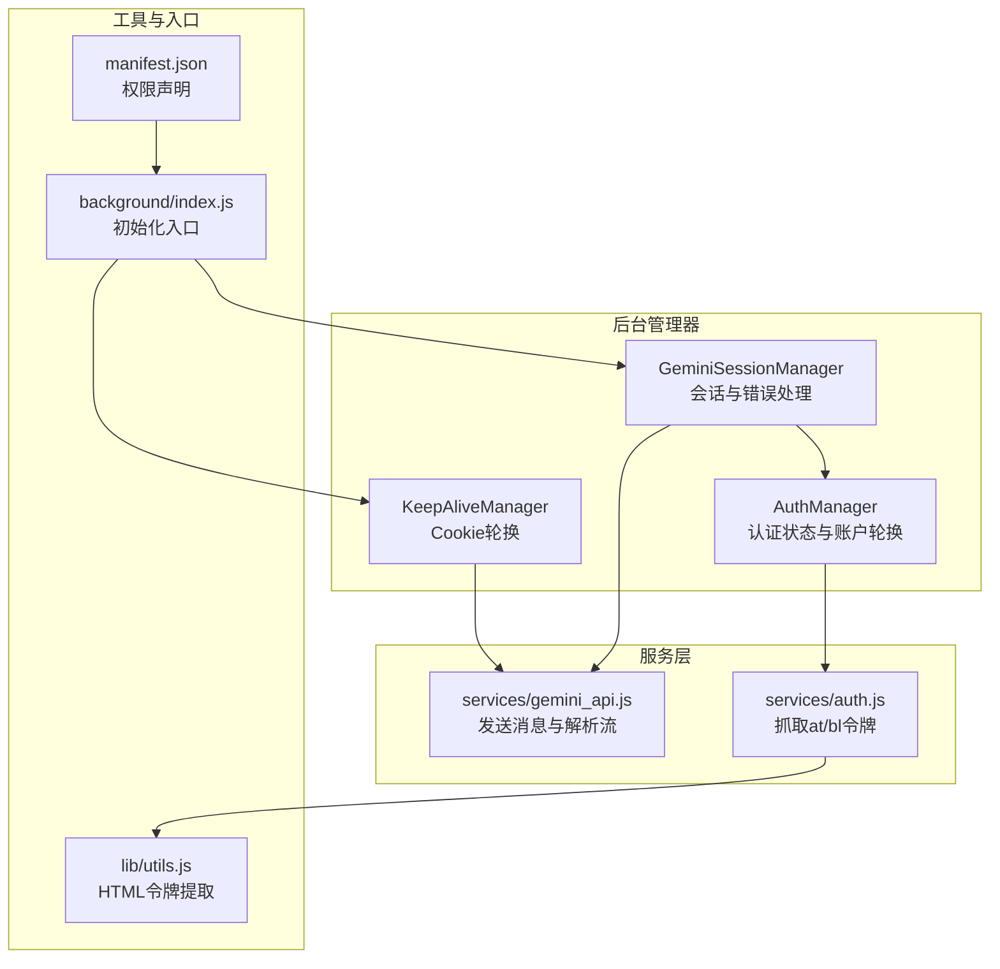
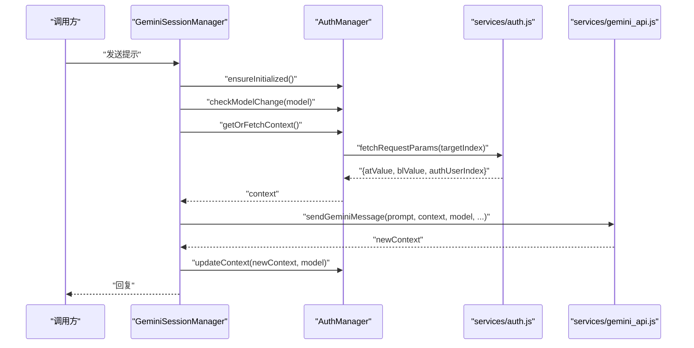
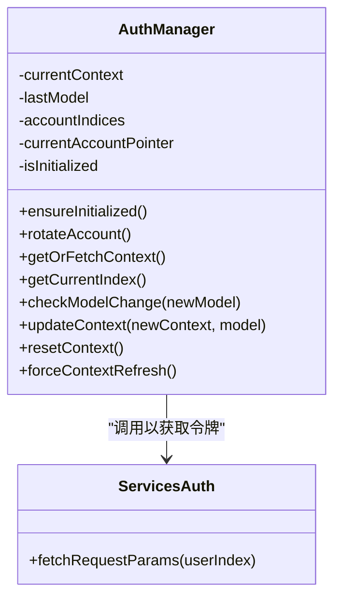
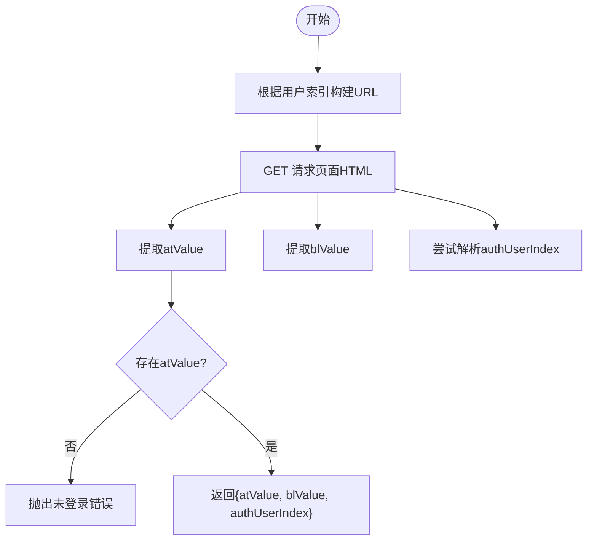
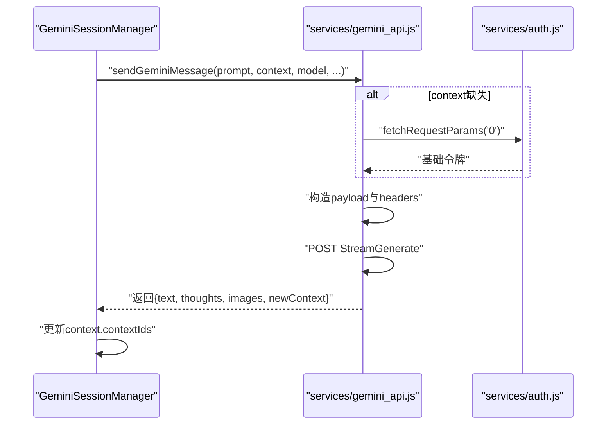
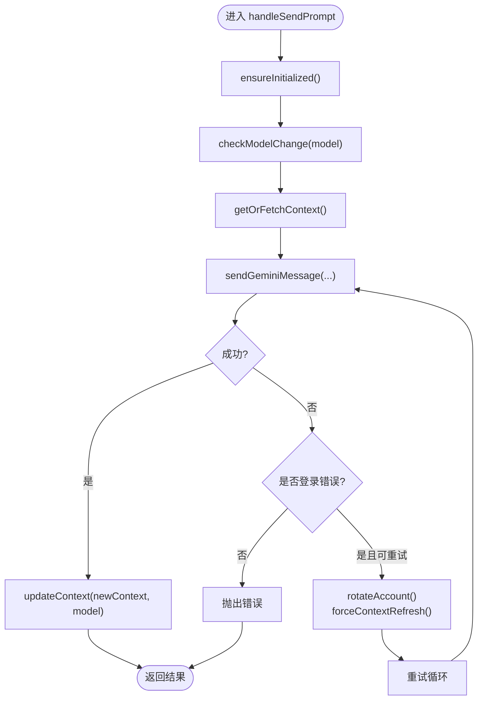
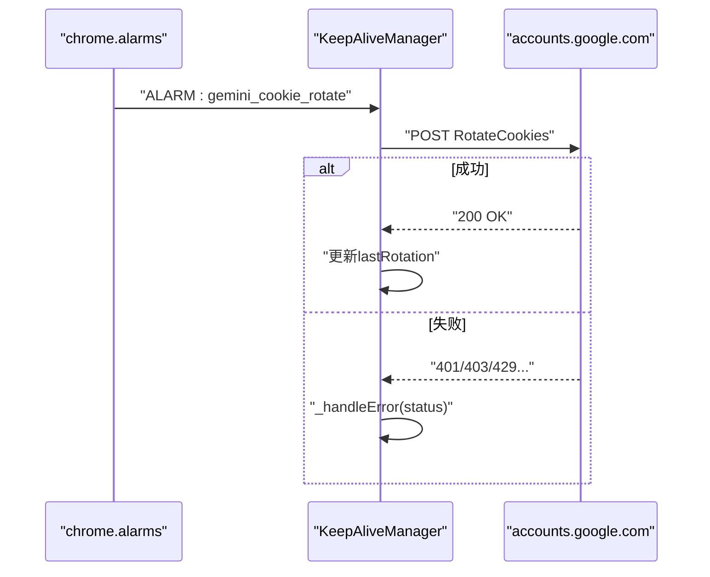
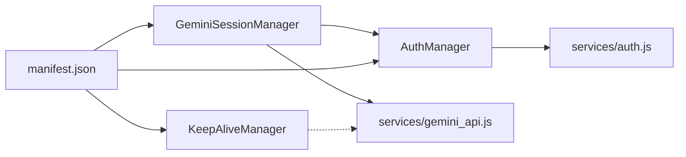

# 认证管理

<cite>
**本文引用的文件**
- [background/managers/auth_manager.js](file://background/managers/auth_manager.js)
- [services/auth.js](file://services/auth.js)
- [services/gemini_api.js](file://services/gemini_api.js)
- [background/managers/session_manager.js](file://background/managers/session_manager.js)
- [background/managers/keep_alive.js](file://background/managers/keep_alive.js)
- [background/index.js](file://background/index.js)
- [lib/utils.js](file://lib/utils.js)
- [manifest.json](file://manifest.json)
</cite>

## 目录
1. [简介](#简介)
2. [项目结构](#项目结构)
3. [核心组件](#核心组件)
4. [架构总览](#架构总览)
5. [详细组件分析](#详细组件分析)
6. [依赖关系分析](#依赖关系分析)
7. [性能考量](#性能考量)
8. [故障排查指南](#故障排查指南)
9. [结论](#结论)

## 简介
本文件聚焦于Gemini Nexus扩展的认证管理模块，系统性阐述AuthManager如何在多账户环境下管理Google Gemini的认证状态，覆盖以下关键点：
- 通过chrome.storage.local持久化存储geminiContext、geminiModel、geminiAccountIndices等关键认证数据
- ensureInitialized初始化流程：从本地存储恢复上下文与账户索引
- getOrFetchContext如何依据当前账户指针(targetIndex)调用fetchRequestParams获取atValue、blValue等认证令牌
- rotateAccount在多账户配置下的自动轮换机制
- checkModelChange与updateContext协同工作，确保模型切换时上下文正确刷新
- 结合服务层services/auth.js对底层认证接口的封装
- 提供认证状态机图与多账户轮换策略说明
- 处理登录失效、会话过期等异常情况的代码路径

## 项目结构
认证相关代码主要分布在后台管理器与服务层：
- 后台管理器：background/managers/auth_manager.js（认证状态与账户轮换）、background/managers/session_manager.js（会话与错误处理）、background/managers/keep_alive.js（Cookie轮换）
- 服务层：services/auth.js（抓取at/bl令牌与用户索引）、services/gemini_api.js（向Gemini发送消息并解析流式响应）
- 工具库：lib/utils.js（HTML中提取令牌）
- 入口：background/index.js（初始化各管理器）
- 权限：manifest.json声明storage、alarms等权限

图表来源
- [background/managers/auth_manager.js](file://background/managers/auth_manager.js#L1-L130)
- [background/managers/session_manager.js](file://background/managers/session_manager.js#L1-L285)
- [background/managers/keep_alive.js](file://background/managers/keep_alive.js#L1-L97)
- [services/auth.js](file://services/auth.js#L1-L41)
- [services/gemini_api.js](file://services/gemini_api.js#L1-L230)
- [lib/utils.js](file://lib/utils.js#L1-L59)
- [background/index.js](file://background/index.js#L1-L30)
- [manifest.json](file://manifest.json#L1-L93)

章节来源
- [background/managers/auth_manager.js](file://background/managers/auth_manager.js#L1-L130)
- [services/auth.js](file://services/auth.js#L1-L41)
- [services/gemini_api.js](file://services/gemini_api.js#L1-L230)
- [background/managers/session_manager.js](file://background/managers/session_manager.js#L1-L285)
- [background/managers/keep_alive.js](file://background/managers/keep_alive.js#L1-L97)
- [background/index.js](file://background/index.js#L1-L30)
- [manifest.json](file://manifest.json#L1-L93)

## 核心组件
- AuthManager：负责认证上下文缓存、账户索引与指针、模型变更检测、上下文更新与重置、账户轮换
- GeminiSessionManager：负责会话生命周期、错误分类与重试、MCP工具链集成、与AuthManager协作
- KeepAliveManager：周期性轮换Cookie，维持会话有效性
- services/auth.js：从gemini.google.com页面抓取at、bl令牌及用户索引
- services/gemini_api.js：构造请求、发送消息、解析流式响应并返回新的上下文
- lib/utils.js：通用工具函数，如从HTML中提取令牌

章节来源
- [background/managers/auth_manager.js](file://background/managers/auth_manager.js#L5-L129)
- [background/managers/session_manager.js](file://background/managers/session_manager.js#L6-L219)
- [background/managers/keep_alive.js](file://background/managers/keep_alive.js#L9-L97)
- [services/auth.js](file://services/auth.js#L7-L40)
- [services/gemini_api.js](file://services/gemini_api.js#L26-L230)
- [lib/utils.js](file://lib/utils.js#L4-L9)

## 架构总览
下图展示认证管理在多账户环境下的整体交互：AuthManager负责上下文与账户轮换；SessionManager在每次请求前检查模型变更并获取上下文；服务层auth.js抓取令牌，gemini_api.js执行实际请求并返回新上下文；KeepAliveManager定期轮换Cookie以延长会话。

图表来源
- [background/managers/session_manager.js](file://background/managers/session_manager.js#L21-L128)
- [background/managers/auth_manager.js](file://background/managers/auth_manager.js#L14-L92)
- [services/auth.js](file://services/auth.js#L7-L40)
- [services/gemini_api.js](file://services/gemini_api.js#L26-L230)

## 详细组件分析

### AuthManager：多账户认证状态管理
- 初始化与持久化
  - ensureInitialized从chrome.storage.local读取geminiContext、geminiModel、geminiAccountIndices、geminiAccountPointer，并恢复到内存状态
  - 若缺失则使用默认值，避免首次运行失败
- 账户轮换
  - rotateAccount从存储刷新账户列表，按currentAccountPointer循环递增，写回geminiAccountPointer
  - 当账户数大于1时，resetContext会触发一次轮换以分散负载
- 上下文获取与刷新
  - getOrFetchContext优先返回缓存上下文；若为空则基于当前账户指针targetIndex调用fetchRequestParams获取atValue、blValue、authUserIndex，并构建context
- 模型变更与上下文更新
  - checkModelChange在模型变化时清空currentContext，强制重新获取
  - updateContext将新上下文与模型写入chrome.storage.local
- 异常与重置
  - resetContext清除上下文与模型，必要时轮换账户
  - forceContextRefresh仅清空缓存，不修改存储

图表来源
- [background/managers/auth_manager.js](file://background/managers/auth_manager.js#L5-L129)
- [services/auth.js](file://services/auth.js#L7-L40)

章节来源
- [background/managers/auth_manager.js](file://background/managers/auth_manager.js#L14-L129)

### services/auth.js：底层认证接口封装
- 功能
  - 根据用户索引拼接URL（默认/u/0/app，其他为/u/{index}/app），发起GET请求获取页面HTML
  - 使用extractFromHTML提取atValue与blValue
  - 尝试从HTML中解析data-index以确定authUserIndex，增强多账户支持
  - 缺少atValue时抛出“未登录”错误
- 关键点
  - 支持多账户URL差异，确保令牌与目标账户匹配
  - 返回值包含atValue、blValue、authUserIndex，供上层构造context

图表来源
- [services/auth.js](file://services/auth.js#L7-L40)
- [lib/utils.js](file://lib/utils.js#L4-L9)

章节来源
- [services/auth.js](file://services/auth.js#L7-L40)
- [lib/utils.js](file://lib/utils.js#L4-L9)

### services/gemini_api.js：消息发送与上下文更新
- 功能
  - 若传入context缺失或无效，回退到fetchRequestParams('0')获取基础上下文
  - 根据模型选择不同header配置，支持多模型差异化请求头
  - 文件上传采用并行上传，构造消息结构体，发送POST请求至StreamGenerate端点
  - 流式读取响应，首块校验登录状态，解析最终结果并返回文本、思考、图片与新上下文
  - 更新context.contextIds为最新响应ID，便于后续对话延续
- 关键点
  - endpoint包含/u/{authUser}/以确保Cookie与目标账户一致
  - 首块响应包含<html>或“Sign in”即判定为未登录或会话过期
  - 对429等限流场景进行明确错误提示

图表来源
- [services/gemini_api.js](file://services/gemini_api.js#L26-L230)
- [services/auth.js](file://services/auth.js#L7-L40)

章节来源
- [services/gemini_api.js](file://services/gemini_api.js#L26-L230)

### GeminiSessionManager：会话与错误处理
- 生命周期
  - ensureInitialized委托AuthManager完成初始化
  - handleSendPrompt中先取消上一次请求，再构造文件数组，依据账户数量决定最大重试次数
- 模型与上下文
  - checkModelChange(model)在模型变化时清空上下文，强制刷新
  - getOrFetchContext获取上下文后调用sendGeminiMessage，成功后updateContext保存新上下文
- 错误处理
  - 识别“未登录/会话过期/401/403”等登录相关错误，触发rotateAccount与forceContextRefresh并重试
  - 对“请求过于频繁”、“服务器无响应”、“响应解析失败”等进行友好提示
  - 会话结束后清理abortController

图表来源
- [background/managers/session_manager.js](file://background/managers/session_manager.js#L21-L147)

章节来源
- [background/managers/session_manager.js](file://background/managers/session_manager.js#L17-L202)

### KeepAliveManager：Cookie轮换与会话保活
- 定时任务
  - 使用chrome.alarms以固定周期触发轮换
  - performRotation调用accounts.google.com/RotateCookies刷新__Secure-1PSIDTS
- 错误处理
  - 成功：更新lastRotation与连续错误计数归零
  - 失败：根据HTTP状态判断是否需要清除本地上下文（如401/403）

图表来源
- [background/managers/keep_alive.js](file://background/managers/keep_alive.js#L16-L93)

章节来源
- [background/managers/keep_alive.js](file://background/managers/keep_alive.js#L9-L97)

## 依赖关系分析
- 组件耦合
  - GeminiSessionManager强依赖AuthManager（初始化、上下文获取、模型变更、上下文更新、重置）
  - AuthManager依赖services/auth.js获取令牌
  - services/gemini_api.js依赖services/auth.js作为回退路径
  - KeepAliveManager独立运行，但与会话稳定性相关
- 存储依赖
  - 所有认证状态均通过chrome.storage.local持久化，包括geminiContext、geminiModel、geminiAccountIndices、geminiAccountPointer
- 权限依赖
  - manifest.json授予storage、alarms等权限，支撑认证与定时轮换

图表来源
- [background/managers/session_manager.js](file://background/managers/session_manager.js#L1-L20)
- [background/managers/auth_manager.js](file://background/managers/auth_manager.js#L1-L12)
- [services/auth.js](file://services/auth.js#L1-L4)
- [services/gemini_api.js](file://services/gemini_api.js#L1-L6)
- [background/managers/keep_alive.js](file://background/managers/keep_alive.js#L1-L9)
- [manifest.json](file://manifest.json#L6-L14)

章节来源
- [background/managers/session_manager.js](file://background/managers/session_manager.js#L1-L20)
- [background/managers/auth_manager.js](file://background/managers/auth_manager.js#L1-L12)
- [services/auth.js](file://services/auth.js#L1-L4)
- [services/gemini_api.js](file://services/gemini_api.js#L1-L6)
- [background/managers/keep_alive.js](file://background/managers/keep_alive.js#L1-L9)
- [manifest.json](file://manifest.json#L6-L14)

## 性能考量
- 并行文件上传：在发送消息前并行上传附件，缩短端到端延迟
- 流式解析：边读边解析，降低首字节延迟
- 轮换频率控制：KeepAliveManager设置固定周期，避免过于频繁导致429
- 账户轮换：多账户配置下，登录错误时自动轮换，提高成功率

## 故障排查指南
- 登录失效/会话过期
  - 现象：响应包含<html>或“Sign in”，或错误消息包含“未登录/Not logged in”
  - 处理：SessionManager检测到登录错误时，调用rotateAccount与forceContextRefresh并重试；若仍失败，清理geminiContext并引导用户打开对应账户登录页
  - 参考路径：[background/managers/session_manager.js](file://background/managers/session_manager.js#L130-L171)
- 请求过于频繁
  - 现象：错误消息包含“请求过于频繁/Rate limited”
  - 处理：提示用户稍后再试，等待轮换周期
  - 参考路径：[background/managers/session_manager.js](file://background/managers/session_manager.js#L172-L177)
- 服务器无响应
  - 现象：空响应或无响应
  - 处理：提示刷新页面后重试
  - 参考路径：[background/managers/session_manager.js](file://background/managers/session_manager.js#L178-L184)
- 响应解析失败
  - 现象：无法解析响应
  - 处理：提示刷新页面后重试
  - 参考路径：[background/managers/session_manager.js](file://background/managers/session_manager.js#L185-L191)
- Cookie轮换失败
  - 现象：401/403时清理本地上下文，等待下次轮换
  - 参考路径：[background/managers/keep_alive.js](file://background/managers/keep_alive.js#L82-L93)

章节来源
- [background/managers/session_manager.js](file://background/managers/session_manager.js#L130-L191)
- [background/managers/keep_alive.js](file://background/managers/keep_alive.js#L82-L93)

## 结论
AuthManager在多账户环境下提供了稳健的认证状态管理：通过chrome.storage.local持久化关键认证数据，结合ensureInitialized、getOrFetchContext、rotateAccount、checkModelChange与updateContext形成闭环；配合SessionManager的错误分类与重试、KeepAliveManager的Cookie轮换，整体实现了高可用的Gemini认证体验。建议在生产环境中持续监控登录错误与轮换频率，确保用户体验与稳定性平衡。