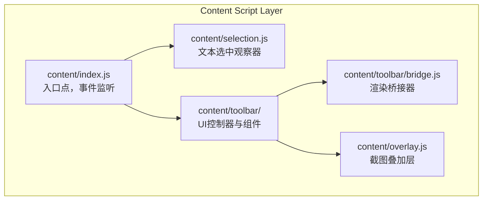
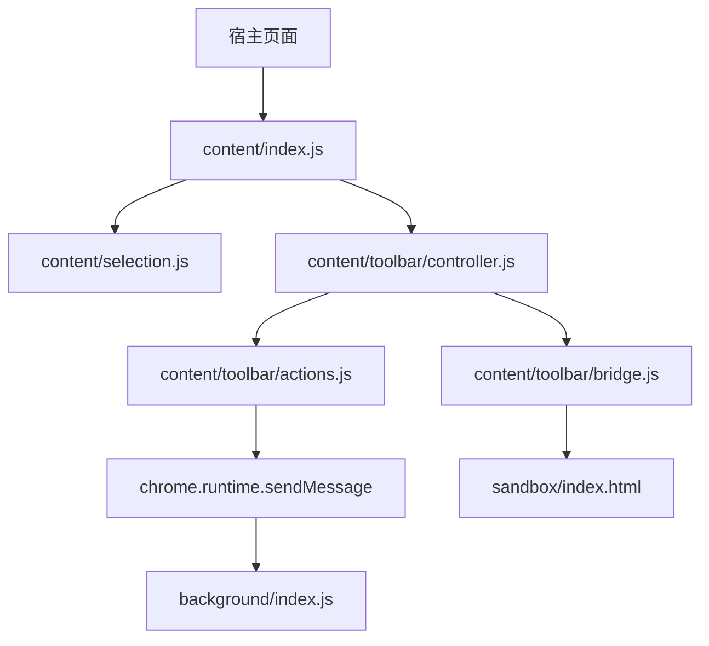
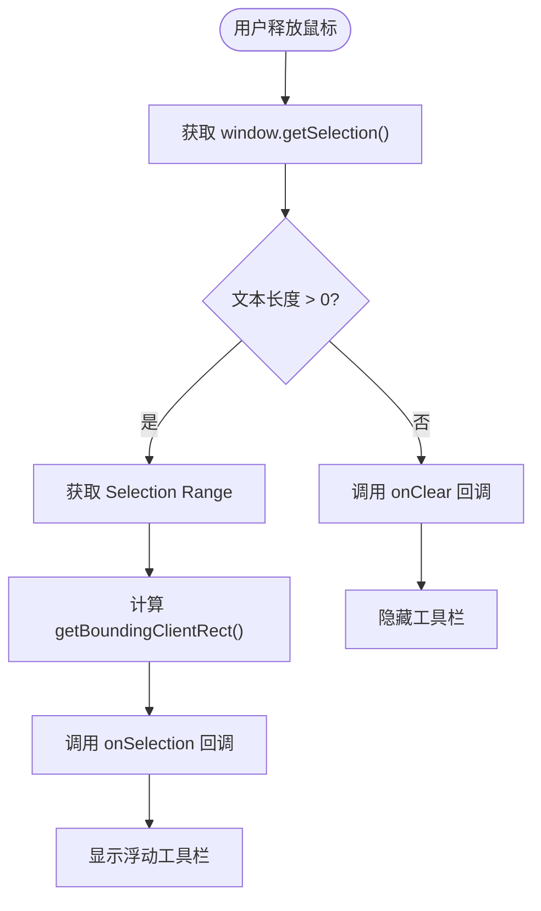
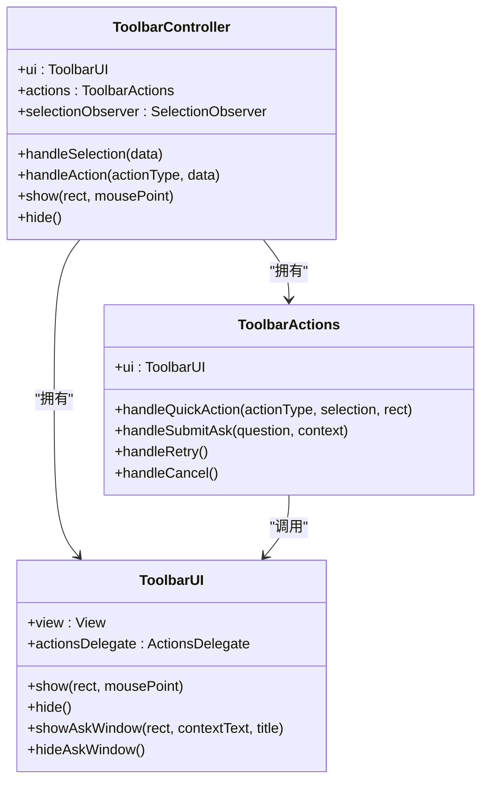
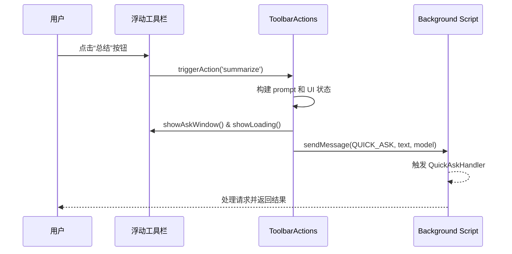
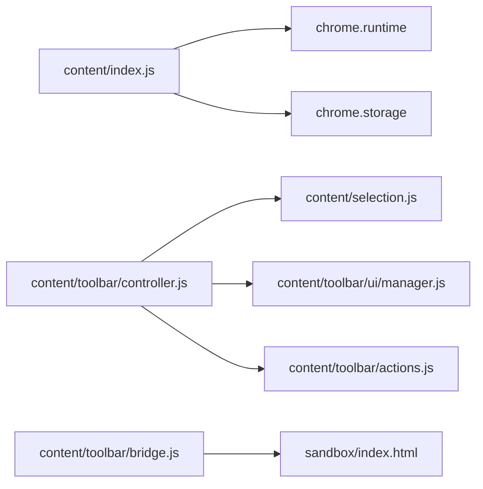

# Content脚本层

<cite>
**本文档中引用的文件**  
- [content/index.js](file://content/index.js)
- [content/selection.js](file://content/selection.js)
- [content/toolbar/controller.js](file://content/toolbar/controller.js)
- [content/toolbar/ui/manager.js](file://content/toolbar/ui/manager.js)
- [content/toolbar/actions.js](file://content/toolbar/actions.js)
- [content/toolbar/bridge.js](file://content/toolbar/bridge.js)
- [content/toolbar/events.js](file://content/toolbar/events.js)
</cite>

## 目录
1. [简介](#简介)
2. [项目结构](#项目结构)
3. [核心组件](#核心组件)
4. [架构概述](#架构概述)
5. [详细组件分析](#详细组件分析)
6. [依赖分析](#依赖分析)
7. [性能考虑](#性能考虑)
8. [故障排除指南](#故障排除指南)
9. [结论](#结论)

## 简介
本架构文档详细阐述了Gemini Nexus扩展中Content脚本层的设计与实现。该层作为扩展与宿主页面之间的桥梁，负责监听用户事件、动态注入UI组件、捕获文本选中内容，并通过安全的消息机制与Background层通信。文档深入分析了从用户选中文本到触发QuickAskHandler的完整流程，解释了浮动工具栏的生命周期管理，以及跨上下文通信的安全机制。

## 项目结构
Content脚本层位于`content/`目录下，采用模块化设计，核心功能由`index.js`启动，并通过`toolbar/`子模块实现UI交互逻辑。`selection.js`负责监听文本选中事件，而`overlay.js`处理截图叠加层。`bridge.js`则通过沙箱iframe实现安全的内容渲染。



**图源**  
- [content/index.js](file://content/index.js#L1-L190)
- [content/selection.js](file://content/selection.js#L1-L63)
- [content/toolbar/controller.js](file://content/toolbar/controller.js#L1-L301)

## 核心组件
Content脚本层的核心组件包括：`index.js`作为主入口点，`selection.js`用于捕获用户选中，`toolbar/controller.js`管理浮动工具栏，`actions.js`处理用户交互，以及`bridge.js`实现与沙箱的安全通信。这些组件协同工作，实现了无缝的用户交互体验。

**节源**  
- [content/index.js](file://content/index.js#L1-L190)
- [content/selection.js](file://content/selection.js#L1-L63)
- [content/toolbar/controller.js](file://content/toolbar/controller.js#L1-L301)

## 架构概述
Content脚本层采用分层架构，分为事件监听、UI控制、动作处理和通信桥接四个主要部分。`index.js`初始化所有组件并监听来自Background层的消息。`selection.js`使用`SelectionObserver`类监听`mouseup`事件来检测文本选中。`ToolbarController`作为中央控制器，协调UI显示与用户动作。`Actions`类封装了所有用户交互的业务逻辑，最终通过`chrome.runtime.sendMessage`与Background层通信。



**图源**  
- [content/index.js](file://content/index.js#L1-L190)
- [content/toolbar/controller.js](file://content/toolbar/controller.js#L1-L301)
- [content/toolbar/actions.js](file://content/toolbar/actions.js#L1-L197)

## 详细组件分析

### 主入口点分析
`content/index.js`是Content脚本的启动文件。它首先创建`GeminiNexusOverlay`和`GeminiToolbarController`实例，然后通过`chrome.runtime.onMessage`监听来自Background层的指令，如`CONTEXT_MENU_ACTION`、`START_SELECTION`等。它还监听键盘快捷键（如Ctrl+G）来触发全局输入框。

**节源**  
- [content/index.js](file://content/index.js#L1-L190)

### 文本选中分析
`selection.js`实现了一个`SelectionObserver`类，通过监听`document`上的`mouseup`和`mousedown`事件来检测用户交互。当用户释放鼠标时，它会获取当前的`window.getSelection()`，并调用回调函数`onSelection`，将选中的文本、范围和位置信息传递给`ToolbarController`。



**图源**  
- [content/selection.js](file://content/selection.js#L1-L63)
- [content/toolbar/controller.js](file://content/toolbar/controller.js#L172-L205)

### 浮动工具栏管理分析
`toolbar/controller.js`是UI的核心控制器。它初始化`ToolbarUI`、`ToolbarActions`和`SelectionObserver`。`handleSelection`方法在收到选中事件后，调用`ui.show()`在指定位置显示工具栏。`handleAction`方法作为分发器，将UI事件（如点击“解释”按钮）转发给`actions.js`。

#### 类图


**图源**  
- [content/toolbar/controller.js](file://content/toolbar/controller.js#L1-L301)
- [content/toolbar/ui/manager.js](file://content/toolbar/ui/manager.js#L1-L280)
- [content/toolbar/actions.js](file://content/toolbar/actions.js#L1-L197)

### 动作处理与通信分析
`actions.js`中的`handleQuickAction`方法是处理用户与工具栏交互的核心。当用户点击“总结”按钮时，该方法会构建一个包含提示词（prompt）、标题和加载信息的消息对象，然后通过`chrome.runtime.sendMessage`发送`QUICK_ASK`消息到Background层。

#### 序列图


**图源**  
- [content/toolbar/actions.js](file://content/toolbar/actions.js#L92-L140)
- [content/toolbar/events.js](file://content/toolbar/events.js#L1-L173)

### 桥接与安全渲染分析
`bridge.js`通过创建一个隐藏的`iframe`指向`sandbox/index.html`来实现安全渲染。`ToolbarUI`调用`bridge.render()`方法时，会向iframe发送`RENDER`消息。沙箱环境处理Markdown或图像后，通过`window.postMessage`将结果发回，`bridge`再解析并返回给调用者，确保了潜在危险内容的隔离。

```mermaid
flowchart LR
A[ToolbarUI] --> |render(text)| B[RendererBridge]
B --> |postMessage(RENDER)| C[sandbox/index.html]
C --> D[安全渲染 Markdown]
D --> |postMessage(RENDER_RESULT)| B
B --> |Promise.resolve(html)| A
```

**图源**  
- [content/toolbar/bridge.js](file://content/toolbar/bridge.js#L1-L66)
- [content/toolbar/ui/manager.js](file://content/toolbar/ui/manager.js#L56-L60)

## 依赖分析
Content脚本层依赖于Chrome扩展的API（如`chrome.runtime`和`chrome.storage`）进行通信和状态管理。它通过全局对象（如`window.GeminiToolbarUI`）暴露内部模块，供`index.js`和其他脚本使用。与Background层的依赖是单向的，仅通过消息传递，保证了安全隔离。



**图源**  
- [content/index.js](file://content/index.js#L19-L152)
- [content/toolbar/controller.js](file://content/toolbar/controller.js#L1-L301)

## 性能考虑
为优化性能，代码采用了延迟执行（如`setTimeout`在`selection.js`中等待选中完成）和事件委托。`ResizeObserver`被用于监听工具栏窗口大小变化并持久化。DOM操作被限制在Shadow DOM内，减少了对宿主页面的影响。`bridge.js`的iframe被复用，避免了重复创建的开销。

## 故障排除指南
常见问题包括工具栏不显示或消息未送达。检查`chrome.runtime.onMessage`监听器是否正确注册，确保`floatingToolbar`实例已初始化。验证`chrome.storage`中的设置（如`geminiTextSelectionEnabled`）是否启用。对于渲染问题，检查沙箱iframe是否成功加载。使用`console.log`在关键路径上添加日志以追踪执行流程。

**节源**  
- [content/index.js](file://content/index.js#L19-L111)
- [content/toolbar/bridge.js](file://content/toolbar/bridge.js#L1-L66)

## 结论
Gemini Nexus的Content脚本层设计精良，通过清晰的模块划分和安全的通信机制，实现了与宿主页面的无缝集成。它有效地扮演了桥梁角色，将用户在页面上的操作转化为结构化的请求发送给Background层处理，同时提供了响应迅速、交互丰富的UI体验。其架构确保了扩展的功能性与宿主页面的安全性。