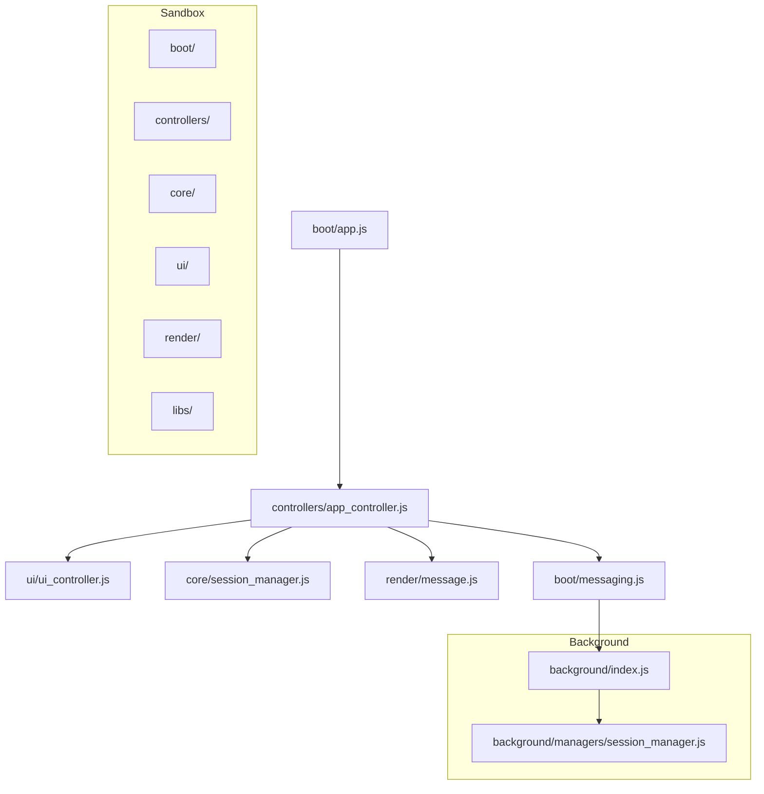
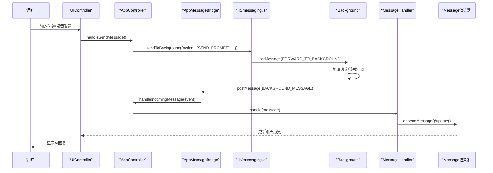
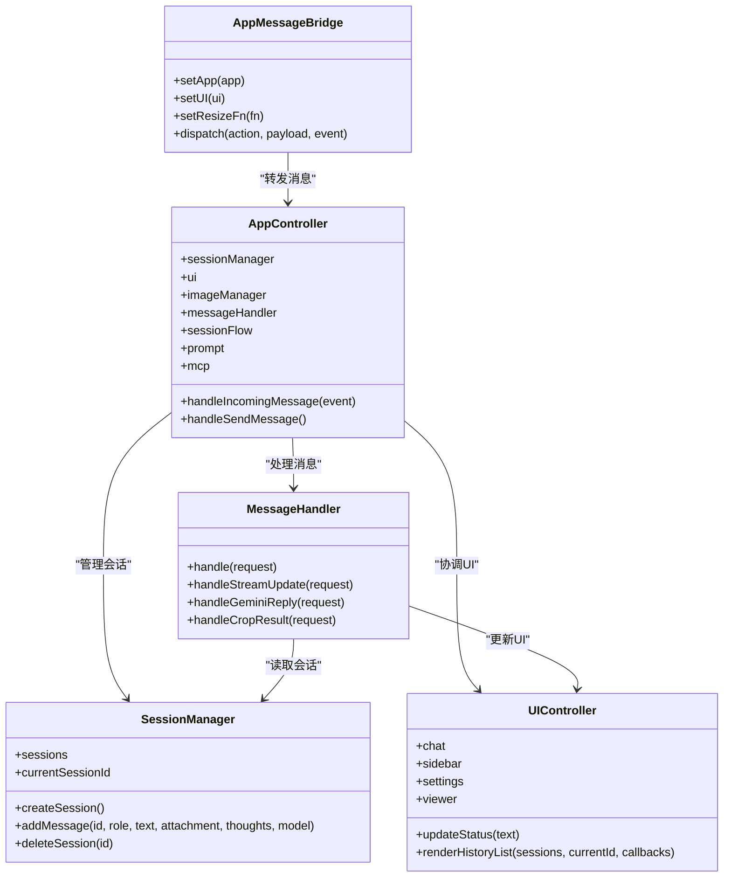

# Sandbox沙箱环境

<cite>
**本文档引用的文件**
- [sandbox/boot/app.js](file://sandbox/boot/app.js)
- [sandbox/core/session_manager.js](file://sandbox/core/session_manager.js)
- [sandbox/controllers/app_controller.js](file://sandbox/controllers/app_controller.js)
- [sandbox/controllers/message_handler.js](file://sandbox/controllers/message_handler.js)
- [sandbox/boot/messaging.js](file://sandbox/boot/messaging.js)
- [sandbox/ui/ui_controller.js](file://sandbox/ui/ui_controller.js)
- [sandbox/render/message.js](file://sandbox/render/message.js)
- [lib/messaging.js](file://lib/messaging.js)
- [background/managers/session_manager.js](file://background/managers/session_manager.js)
- [sandbox/boot/events.js](file://sandbox/boot/events.js)
- [sandbox/ui/chat.js](file://sandbox/ui/chat.js)
- [background/index.js](file://background/index.js)
- [sandbox/index.js](file://sandbox/index.js)
</cite>

## 目录
1. [简介](#简介)
2. [项目结构](#项目结构)
3. [核心组件](#核心组件)
4. [架构总览](#架构总览)
5. [详细组件分析](#详细组件分析)
6. [依赖关系分析](#依赖关系分析)
7. [性能考虑](#性能考虑)
8. [故障排除指南](#故障排除指南)
9. [结论](#结论)

## 简介
本文件为Gemini Nexus的Sandbox沙箱环境提供系统性架构文档，重点阐述其作为安全渲染环境的角色。Sandbox通过postMessage机制与Background层通信，避免直接访问chrome API，从而提升安全性。本文将深入分析：
- sandbox/boot/app.js如何初始化沙箱环境，创建SessionManager实例并建立与Background层的通信管道
- sandbox/core/session_manager.js如何管理本地会话数据结构，包括会话的创建、删除和消息添加
- sandbox/controllers/app_controller.js如何作为沙箱内的主控制器，协调UI、会话和图像管理器
- sandbox/controllers/message_handler.js如何处理来自Background层的流式响应并更新UI
- 从用户在侧边栏输入问题到消息通过沙箱渲染显示的完整流程
- 沙箱环境的组件依赖图和消息流图

## 项目结构
Sandbox位于sandbox目录，采用按功能模块划分的组织方式：
- boot：启动引导层，负责布局渲染、国际化配置、消息桥接等
- controllers：业务控制器层，协调各子系统
- core：核心数据模型与工具
- ui：用户界面控制器与模板
- render：渲染管线与消息渲染
- libs：第三方库加载器

**图表来源**
- [sandbox/boot/app.js](file://sandbox/boot/app.js#L1-L90)
- [sandbox/controllers/app_controller.js](file://sandbox/controllers/app_controller.js#L1-L207)
- [sandbox/ui/ui_controller.js](file://sandbox/ui/ui_controller.js#L1-L66)
- [sandbox/core/session_manager.js](file://sandbox/core/session_manager.js#L1-L105)
- [sandbox/render/message.js](file://sandbox/render/message.js#L1-L657)
- [sandbox/boot/messaging.js](file://sandbox/boot/messaging.js#L1-L90)
- [background/index.js](file://background/index.js#L1-L30)
- [background/managers/session_manager.js](file://background/managers/session_manager.js#L1-L285)

**章节来源**
- [sandbox/boot/app.js](file://sandbox/boot/app.js#L1-L90)
- [sandbox/index.js](file://sandbox/index.js#L1-L12)

## 核心组件
本节概述Sandbox中的关键组件及其职责：
- AppMessageBridge：负责与Background层的消息桥接，队列化未就绪消息，转发通用消息给AppController
- AppController：沙箱主控制器，协调会话、UI、图像管理器，处理来自Background层的广播事件
- SessionManager：维护会话数据结构，支持创建、切换、删除、消息追加等操作
- UIController：统一管理聊天、侧边栏、设置、查看器等子控制器
- MessageHandler：处理来自Background层的各类消息，包括流式更新、AI回复、图片结果等
- Message渲染器：负责将文本、思考过程、图片、MCP标识等渲染到UI

**章节来源**
- [sandbox/boot/messaging.js](file://sandbox/boot/messaging.js#L1-L90)
- [sandbox/controllers/app_controller.js](file://sandbox/controllers/app_controller.js#L1-L207)
- [sandbox/core/session_manager.js](file://sandbox/core/session_manager.js#L1-L105)
- [sandbox/ui/ui_controller.js](file://sandbox/ui/ui_controller.js#L1-L66)
- [sandbox/controllers/message_handler.js](file://sandbox/controllers/message_handler.js#L1-L365)
- [sandbox/render/message.js](file://sandbox/render/message.js#L1-L657)

## 架构总览
Sandbox采用"消息驱动"的架构模式，所有跨层交互均通过postMessage完成。整体流程如下：
1. 初始化阶段：渲染布局、应用国际化、发送UI就绪信号、建立消息桥接
2. 动态加载：异步加载依赖库、配置Markdown、动态导入应用逻辑
3. 实例化：创建SessionManager、UIController、ImageManager、AppController
4. 桥接绑定：将UI与App实例注入消息桥接器，绑定DOM事件
5. 用户交互：通过事件绑定触发消息发送，经由lib/messaging.js转发至Background
6. Background处理：后台管理器处理请求，通过流式回调返回消息
7. 消息分发：AppMessageBridge接收消息，分发给UIController或AppController
8. 渲染更新：MessageHandler根据消息类型更新UI，支持流式渲染

**图表来源**
- [sandbox/boot/events.js](file://sandbox/boot/events.js#L214-L245)
- [lib/messaging.js](file://lib/messaging.js#L1-L96)
- [sandbox/controllers/app_controller.js](file://sandbox/controllers/app_controller.js#L129-L192)
- [sandbox/boot/messaging.js](file://sandbox/boot/messaging.js#L29-L89)
- [sandbox/controllers/message_handler.js](file://sandbox/controllers/message_handler.js#L17-L86)
- [sandbox/render/message.js](file://sandbox/render/message.js#L8-L324)

## 详细组件分析

### 启动与初始化：sandbox/boot/app.js
该文件是Sandbox的入口，负责：
- 渲染应用布局（在DOM查询之前）
- 应用初始翻译
- 发送UI就绪信号给父窗口
- 初始化消息桥接器AppMessageBridge
- 绑定语言变更事件
- 异步加载依赖库并配置Markdown
- 动态导入核心模块：ImageManager、SessionManager、UIController、AppController
- 创建并初始化各实例
- 将UI与App实例注入消息桥接器
- 绑定DOM事件

关键特性：
- 严格按顺序执行：先布局再渲染，确保DOM可用
- 使用Promise.all并行加载核心模块，提升启动效率
- 通过window.parent.postMessage与Background通信，避免直接访问chrome API

**章节来源**
- [sandbox/boot/app.js](file://sandbox/boot/app.js#L1-L90)

### 消息桥接：sandbox/boot/messaging.js
AppMessageBridge是Sandbox与Background之间的唯一通信通道：
- 监听window.message事件
- 维护app、ui、resizeFn引用
- 队列化未就绪消息，待app/ui就绪后flush
- 分发RESTORE_*系列消息到UIController
- 将通用消息转发给AppController.handleIncomingMessage

设计要点：
- 双重保障：app/ui都存在才处理消息，否则入队
- 支持主题、语言、快捷键、模型、文本选择、图像工具、账户索引、GemID等多类恢复消息
- 通用消息统一转发，便于AppController集中处理

**章节来源**
- [sandbox/boot/messaging.js](file://sandbox/boot/messaging.js#L1-L90)

### 主控制器：sandbox/controllers/app_controller.js
AppController是沙箱内的中枢控制器：
- 维护会话管理、UI控制、图像管理三个子系统
- 初始化MessageHandler、SessionFlowController、PromptController、MCPController
- 处理RESTORE_SESSIONS、RESTORE_SIDEBAR_BEHAVIOR等恢复消息
- 协调新会话创建、会话切换、历史刷新
- 提供模型切换、页面上下文开关、浏览器控制开关等能力
- 通过lib/messaging.js与Background通信（如获取活动标签信息）

关键流程：
- handleIncomingMessage集中处理来自Background的消息
- 对RESTORE_SESSIONS进行自动/恢复/新建策略判断
- 对BACKGROUND_MESSAGE进行细分处理（会话切换、活动标签信息、消息转发）

**章节来源**
- [sandbox/controllers/app_controller.js](file://sandbox/controllers/app_controller.js#L1-L207)

### 会话管理：sandbox/core/session_manager.js
SessionManager提供本地会话数据管理：
- 数据结构：sessions数组、currentSessionId
- 会话操作：createSession、deleteSession、setCurrentId、getSortedSessions
- 会话属性：updateTitle、renameSession、updateContext
- 消息操作：addMessage（支持用户附件、AI生成图片、模型信息、思考过程）

设计特点：
- 新建会话默认置顶，当前会话ID同步更新
- 删除当前会话时自动切换到第一个会话或清空
- addMessage对用户和AI消息分别处理附件字段
- 保持时间戳一致性，便于排序与恢复

**章节来源**
- [sandbox/core/session_manager.js](file://sandbox/core/session_manager.js#L1-L105)

### UI控制器：sandbox/ui/ui_controller.js
UIController统一管理UI子系统：
- ChatController：聊天输入、状态显示、滚动、加载状态
- SidebarController：侧边栏渲染、历史列表、遮罩点击关闭
- SettingsController：设置面板管理
- ViewerController：查看器管理

对外暴露：
- inputFn、historyDiv、sendBtn、modelSelect等DOM引用
- 提供updateStatus、clearChatHistory、scrollToBottom、toggleSidebar等方法

**章节来源**
- [sandbox/ui/ui_controller.js](file://sandbox/ui/ui_controller.js#L1-L66)
- [sandbox/ui/chat.js](file://sandbox/ui/chat.js#L1-L120)

### 消息处理器：sandbox/controllers/message_handler.js
MessageHandler负责处理来自Background层的各类消息：
- 流式更新：handleStreamUpdate，创建/更新AI气泡，标记生成中状态
- AI回复：handleGeminiReply，最终化流式气泡，注入图片与MCP标识
- 图片结果：handleImageResult、handleGeneratedImageResult
- 截图/OCR：handleCropResult，裁剪后自动发送或提示
- 选区引用：handleSelectionResult，插入引用到输入框
- MCP工具：showToolPicker、injectTools，工具选择与注入
- 其他：模式同步、页面上下文切换等

流式渲染流程：
- 首次收到GEMINI_STREAM_UPDATE时创建空AI气泡
- 后续增量更新气泡内容与思考过程
- 收到GEMINI_REPLY时完成渲染并清理引用

**章节来源**
- [sandbox/controllers/message_handler.js](file://sandbox/controllers/message_handler.js#L1-L365)

### 渲染器：sandbox/render/message.js
Message渲染器负责将消息内容渲染到UI：
- 支持用户上传图片网格、AI思考过程details、AI生成图片网格
- 支持模型名称与MCP标识徽章显示
- 支持复制按钮、Mindmap加载与下载、建议按钮渲染
- 返回可更新控制器：update、addImages、setMcpIds

渲染特性：
- 流式更新时仅更新内容区域，保持DOM稳定性
- Mindmap加载采用延迟初始化，避免阻塞首屏
- 建议按钮通过隐藏文本块实现，提升兼容性

**章节来源**
- [sandbox/render/message.js](file://sandbox/render/message.js#L1-L657)

### 事件绑定：sandbox/boot/events.js
事件绑定层负责用户交互：
- 新建会话、打开全页、工具栏滚动
- 页面上下文、浏览器控制、OCR/截图/截取按钮
- 模型选择器自动宽度调整
- 文件上传、快捷键处理（Ctrl/Cmd+P聚焦输入）
- 建议点击事件：自动启用页面上下文并发送
- 所有链接点击通过postMessage交由父窗口处理

**章节来源**
- [sandbox/boot/events.js](file://sandbox/boot/events.js#L1-L296)

### 背景管理器：background/managers/session_manager.js
Background层的GeminiSessionManager负责实际的AI交互：
- 认证管理：ensureInitialized、account轮换、上下文更新
- 请求处理：handleSendPrompt，支持文件上传、MCP注入与执行
- 流式回调：onUpdate回调，向Sandbox推送GEMINI_STREAM_UPDATE
- 错误处理：登录失效、限流、无响应、解析失败等错误消息
- 工具调用：parseToolCall解析工具调用，执行后二次请求

**章节来源**
- [background/managers/session_manager.js](file://background/managers/session_manager.js#L1-L285)

## 依赖关系分析

**图表来源**
- [sandbox/boot/messaging.js](file://sandbox/boot/messaging.js#L4-L89)
- [sandbox/controllers/app_controller.js](file://sandbox/controllers/app_controller.js#L10-L36)
- [sandbox/core/session_manager.js](file://sandbox/core/session_manager.js#L5-L104)
- [sandbox/ui/ui_controller.js](file://sandbox/ui/ui_controller.js#L8-L33)
- [sandbox/controllers/message_handler.js](file://sandbox/controllers/message_handler.js#L8-L86)

**章节来源**
- [sandbox/boot/messaging.js](file://sandbox/boot/messaging.js#L1-L90)
- [sandbox/controllers/app_controller.js](file://sandbox/controllers/app_controller.js#L1-L207)
- [sandbox/core/session_manager.js](file://sandbox/core/session_manager.js#L1-L105)
- [sandbox/ui/ui_controller.js](file://sandbox/ui/ui_controller.js#L1-L66)
- [sandbox/controllers/message_handler.js](file://sandbox/controllers/message_handler.js#L1-L365)

## 性能考虑
- 并行初始化：通过Promise.all并行动态导入核心模块，减少启动等待
- 流式渲染：仅更新内容区域，避免重建整个消息DOM
- 延迟加载：Mindmap等第三方库按需加载，降低首屏负担
- 队列化消息：AppMessageBridge在组件未就绪时缓存消息，避免丢失
- 自适应宽度：模型选择器宽度计算仅在需要时执行
- 滚动优化：流式渲染时平滑滚动到消息顶部，提升阅读体验

## 故障排除指南
常见问题与排查步骤：
- UI不显示：检查AppMessageBridge是否正确注入app/ui实例
- 消息不更新：确认handleIncomingMessage是否被调用，MessageHandler是否正确处理消息类型
- 图片加载失败：检查handleGeneratedImageResult中元素查找与WatermarkRemover处理
- 流式渲染中断：确认handleStreamUpdate是否创建气泡，handleGeminiReply是否清理引用
- 会话数据异常：检查SessionManager的addMessage参数与updateContext调用时机

调试建议：
- 在lib/messaging.js中添加日志，追踪消息转发路径
- 在AppMessageBridge.dispatch中添加日志，确认消息类型与payload
- 在MessageHandler中针对不同action添加日志，定位处理分支
- 检查window.parent.postMessage的目标源，确保'*'匹配正确

**章节来源**
- [lib/messaging.js](file://lib/messaging.js#L4-L96)
- [sandbox/boot/messaging.js](file://sandbox/boot/messaging.js#L29-L89)
- [sandbox/controllers/message_handler.js](file://sandbox/controllers/message_handler.js#L212-L280)

## 结论
Gemini Nexus的Sandbox沙箱环境通过严格的边界设计与消息驱动架构，实现了安全、高效、可扩展的AI对话渲染环境。其核心优势包括：
- 安全隔离：完全通过postMessage与Background通信，避免直接访问chrome API
- 模块化设计：清晰的职责分离，便于维护与扩展
- 流式渲染：提供流畅的AI回复体验
- 恢复机制：完善的会话与设置恢复逻辑
- 性能优化：并行加载、延迟初始化、队列化消息等策略

该架构为后续功能扩展（如更多工具集成、更复杂的UI交互）提供了坚实基础。