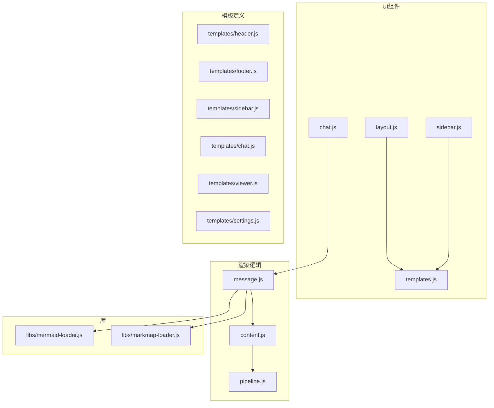
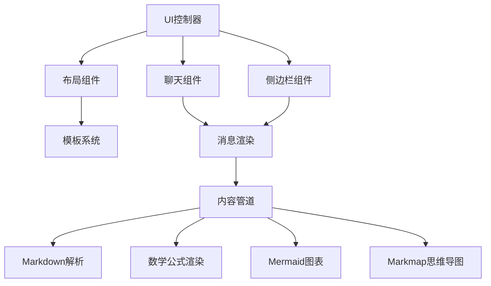
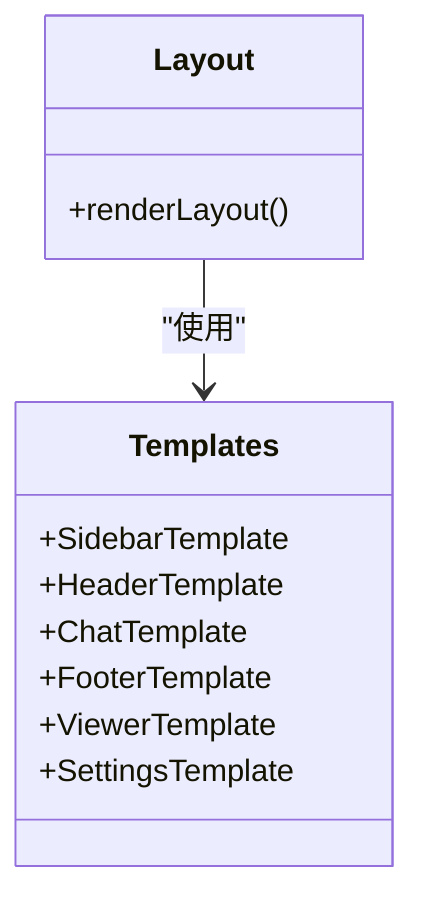
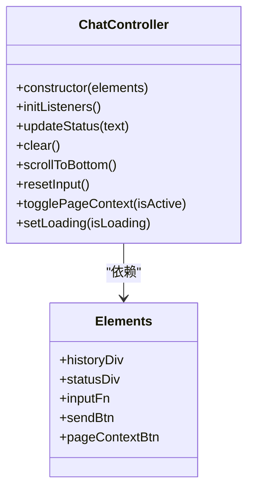
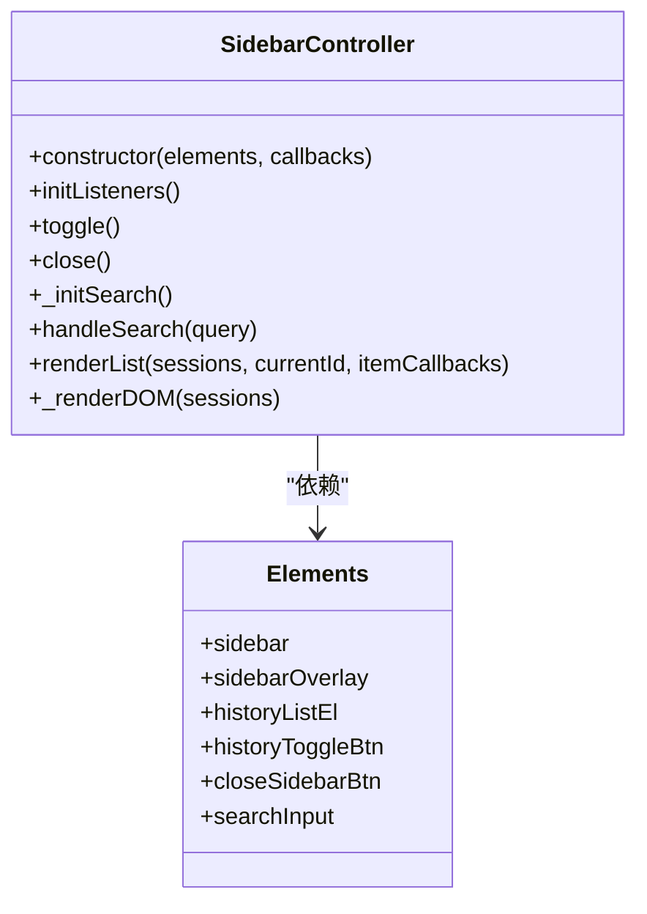
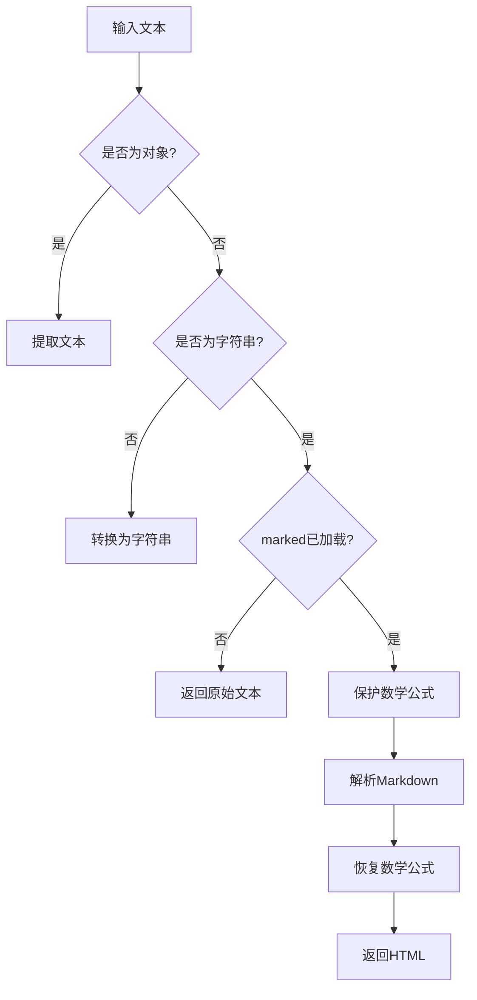
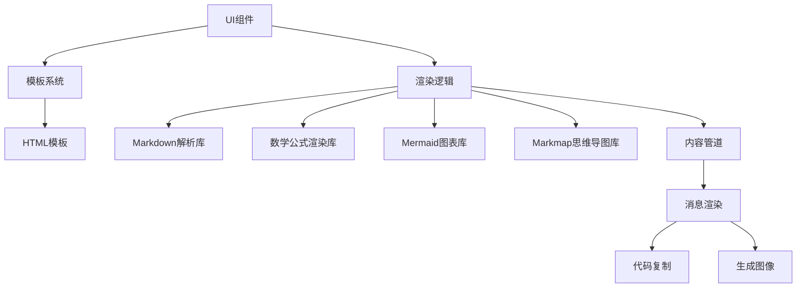

# 沙箱UI渲染

<cite>
**本文档引用的文件**
- [layout.js](file://sandbox/ui/layout.js)
- [chat.js](file://sandbox/ui/chat.js)
- [sidebar.js](file://sandbox/ui/sidebar.js)
- [templates.js](file://sandbox/ui/templates.js)
- [pipeline.js](file://sandbox/render/pipeline.js)
- [message.js](file://sandbox/render/message.js)
- [content.js](file://sandbox/render/content.js)
- [mermaid-loader.js](file://sandbox/libs/mermaid-loader.js)
- [markmap-loader.js](file://sandbox/libs/markmap-loader.js)
- [footer.js](file://sandbox/ui/templates/footer.js)
- [header.js](file://sandbox/ui/templates/header.js)
- [sidebar.js](file://sandbox/ui/templates/sidebar.js)
- [chat.js](file://sandbox/ui/templates/chat.js)
- [viewer.js](file://sandbox/ui/templates/viewer.js)
- [settings.js](file://sandbox/ui/templates/settings.js)
</cite>

## 目录
1. [简介](#简介)
2. [项目结构](#项目结构)
3. [核心组件](#核心组件)
4. [架构概述](#架构概述)
5. [详细组件分析](#详细组件分析)
6. [依赖分析](#依赖分析)
7. [性能考虑](#性能考虑)
8. [故障排除指南](#故障排除指南)
9. [结论](#结论)
10. [附录](#附录)（如有必要）

## 简介
本文档详细阐述了Gemini Nexus沙箱环境的UI渲染系统，重点介绍其基于HTML模板和JavaScript的动态渲染机制。文档深入分析了沙箱主界面布局的构建方式、聊天消息的显示逻辑、会话历史列表的动态更新以及内容渲染流程的协调机制。

## 项目结构
Gemini Nexus沙箱环境的UI渲染系统主要位于`sandbox`目录下，其结构清晰地分离了UI组件、渲染逻辑和模板定义。系统采用模块化设计，通过HTML模板和JavaScript组件协同工作，实现动态的用户界面。

**图源**
- [layout.js](file://sandbox/ui/layout.js#L1-L17)
- [chat.js](file://sandbox/ui/chat.js#L1-L120)
- [sidebar.js](file://sandbox/ui/sidebar.js#L1-L249)
- [templates.js](file://sandbox/ui/templates.js#L1-L10)
- [pipeline.js](file://sandbox/render/pipeline.js#L1-L44)
- [message.js](file://sandbox/render/message.js#L1-L657)
- [content.js](file://sandbox/render/content.js#L1-L34)
- [mermaid-loader.js](file://sandbox/libs/mermaid-loader.js#L1-L54)
- [markmap-loader.js](file://sandbox/libs/markmap-loader.js#L1-L50)

**节源**
- [layout.js](file://sandbox/ui/layout.js#L1-L17)
- [chat.js](file://sandbox/ui/chat.js#L1-L120)
- [sidebar.js](file://sandbox/ui/sidebar.js#L1-L249)
- [templates.js](file://sandbox/ui/templates.js#L1-L10)
- [pipeline.js](file://sandbox/render/pipeline.js#L1-L44)
- [message.js](file://sandbox/render/message.js#L1-L657)
- [content.js](file://sandbox/render/content.js#L1-L34)
- [mermaid-loader.js](file://sandbox/libs/mermaid-loader.js#L1-L54)
- [markmap-loader.js](file://sandbox/libs/markmap-loader.js#L1-L50)

## 核心组件
沙箱UI渲染系统的核心组件包括`layout.js`、`chat.js`、`sidebar.js`和`templates.js`。这些组件协同工作，构建了沙箱的主界面布局，管理聊天消息的显示逻辑，并实现会话历史列表的动态更新。

**节源**
- [layout.js](file://sandbox/ui/layout.js#L1-L17)
- [chat.js](file://sandbox/ui/chat.js#L1-L120)
- [sidebar.js](file://sandbox/ui/sidebar.js#L1-L249)
- [templates.js](file://sandbox/ui/templates.js#L1-L10)

## 架构概述
沙箱UI渲染系统采用分层架构，将UI组件、渲染逻辑和模板定义分离。`layout.js`负责构建主界面布局，`chat.js`和`sidebar.js`分别管理聊天区域和侧边栏的交互逻辑，`templates.js`提供预定义的HTML模板，而`pipeline.js`协调内容渲染流程。

**图源**
- [layout.js](file://sandbox/ui/layout.js#L1-L17)
- [chat.js](file://sandbox/ui/chat.js#L1-L120)
- [sidebar.js](file://sandbox/ui/sidebar.js#L1-L249)
- [templates.js](file://sandbox/ui/templates.js#L1-L10)
- [pipeline.js](file://sandbox/render/pipeline.js#L1-L44)
- [message.js](file://sandbox/render/message.js#L1-L657)
- [content.js](file://sandbox/render/content.js#L1-L34)

## 详细组件分析
本节深入分析沙箱UI渲染系统的关键组件，包括布局构建、聊天消息管理、侧边栏交互和内容渲染流程。

### 布局组件分析
`layout.js`组件负责构建沙箱的主界面布局，通过组合多个预定义的HTML模板来创建完整的用户界面。

#### 布局构建机制
`layout.js`通过导入`templates.js`中定义的各个模板，将它们组合成一个完整的布局字符串，并将其插入到DOM中。

**图源**
- [layout.js](file://sandbox/ui/layout.js#L1-L17)
- [templates.js](file://sandbox/ui/templates.js#L1-L10)

**节源**
- [layout.js](file://sandbox/ui/layout.js#L1-L17)
- [templates.js](file://sandbox/ui/templates.js#L1-L10)

### 聊天组件分析
`chat.js`组件管理聊天消息的显示逻辑，包括用户和AI消息的样式区分、代码块高亮、数学公式渲染和生成图像展示。

#### 聊天消息管理
`chat.js`中的`ChatController`类负责管理聊天区域的交互逻辑，包括输入框的自动调整、代码块的复制功能和消息的滚动行为。

**图源**
- [chat.js](file://sandbox/ui/chat.js#L1-L120)

**节源**
- [chat.js](file://sandbox/ui/chat.js#L1-L120)

### 侧边栏组件分析
`sidebar.js`组件实现会话历史列表的动态更新和交互响应，包括搜索功能和会话管理。

#### 侧边栏交互逻辑
`sidebar.js`中的`SidebarController`类负责管理侧边栏的显示状态、搜索功能和会话列表的渲染。

**图源**
- [sidebar.js](file://sandbox/ui/sidebar.js#L1-L249)

**节源**
- [sidebar.js](file://sandbox/ui/sidebar.js#L1-L249)

### 内容渲染分析
`pipeline.js`组件协调内容渲染流程，包括Markdown解析、Mermaid图表生成和Markmap思维导图渲染。

#### 渲染流程协调
`pipeline.js`中的`transformMarkdown`函数负责将原始文本转换为HTML，同时保护和恢复数学公式块。

**图源**
- [pipeline.js](file://sandbox/render/pipeline.js#L1-L44)

**节源**
- [pipeline.js](file://sandbox/render/pipeline.js#L1-L44)

## 依赖分析
沙箱UI渲染系统依赖于多个外部库和内部模块，这些依赖关系确保了系统的完整功能。

**图源**
- [layout.js](file://sandbox/ui/layout.js#L1-L17)
- [chat.js](file://sandbox/ui/chat.js#L1-L120)
- [sidebar.js](file://sandbox/ui/sidebar.js#L1-L249)
- [templates.js](file://sandbox/ui/templates.js#L1-L10)
- [pipeline.js](file://sandbox/render/pipeline.js#L1-L44)
- [message.js](file://sandbox/render/message.js#L1-L657)
- [content.js](file://sandbox/render/content.js#L1-L34)
- [mermaid-loader.js](file://sandbox/libs/mermaid-loader.js#L1-L54)
- [markmap-loader.js](file://sandbox/libs/markmap-loader.js#L1-L50)

**节源**
- [layout.js](file://sandbox/ui/layout.js#L1-L17)
- [chat.js](file://sandbox/ui/chat.js#L1-L120)
- [sidebar.js](file://sandbox/ui/sidebar.js#L1-L249)
- [templates.js](file://sandbox/ui/templates.js#L1-L10)
- [pipeline.js](file://sandbox/render/pipeline.js#L1-L44)
- [message.js](file://sandbox/render/message.js#L1-L657)
- [content.js](file://sandbox/render/content.js#L1-L34)
- [mermaid-loader.js](file://sandbox/libs/mermaid-loader.js#L1-L54)
- [markmap-loader.js](file://sandbox/libs/markmap-loader.js#L1-L50)

## 性能考虑
沙箱UI渲染系统在设计时考虑了性能优化，例如通过延迟加载外部库来减少初始加载时间，以及通过事件委托来提高交互响应速度。

## 故障排除指南
当遇到UI渲染问题时，可以检查以下方面：
- 确保所有依赖的外部库已正确加载
- 检查HTML模板是否正确导入和组合
- 验证渲染管道是否正确处理Markdown和数学公式

**节源**
- [pipeline.js](file://sandbox/render/pipeline.js#L1-L44)
- [message.js](file://sandbox/render/message.js#L1-L657)
- [content.js](file://sandbox/render/content.js#L1-L34)

## 结论
Gemini Nexus沙箱环境的UI渲染系统通过模块化设计和分层架构，实现了高效、灵活的用户界面。系统利用HTML模板和JavaScript组件的组合，提供了丰富的交互功能和内容渲染能力。

## 附录
### 模板文件说明
- `header.js`: 定义顶部工具栏的HTML结构
- `footer.js`: 定义底部输入区域的HTML结构
- `sidebar.js`: 定义侧边栏的HTML结构
- `chat.js`: 定义聊天区域的HTML结构
- `viewer.js`: 定义图像查看器的HTML结构
- `settings.js`: 定义设置面板的HTML结构

**节源**
- [header.js](file://sandbox/ui/templates/header.js#L1-L30)
- [footer.js](file://sandbox/ui/templates/footer.js#L1-L124)
- [sidebar.js](file://sandbox/ui/templates/sidebar.js#L1-L24)
- [chat.js](file://sandbox/ui/templates/chat.js#L1-L4)
- [viewer.js](file://sandbox/ui/templates/viewer.js#L1-L29)
- [settings.js](file://sandbox/ui/templates/settings.js#L1-L174)