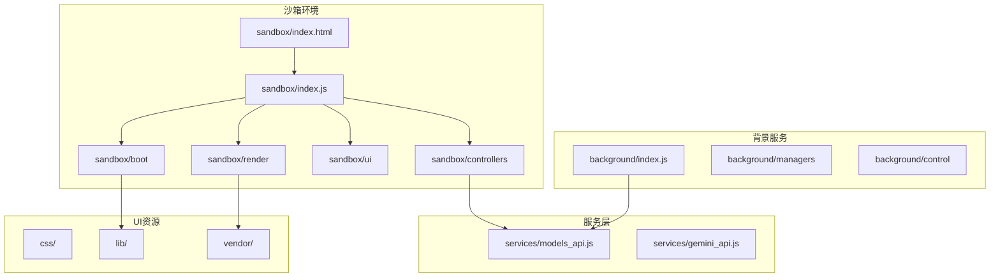
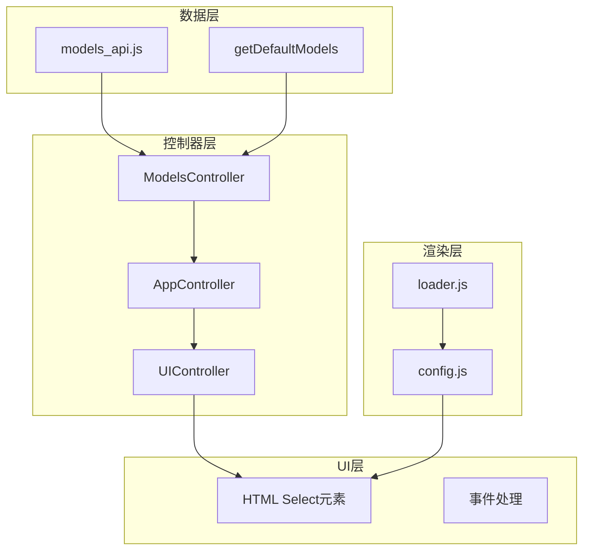
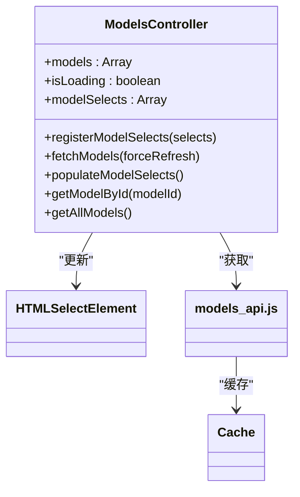
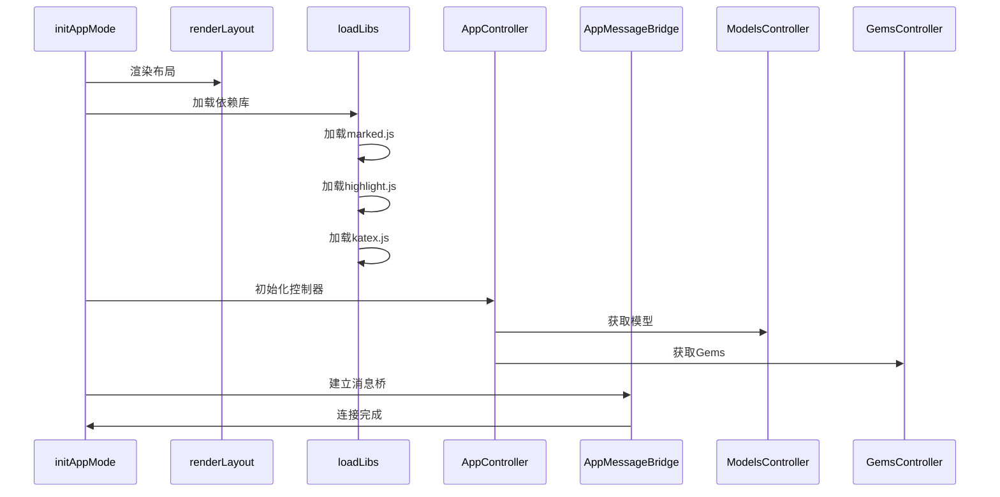
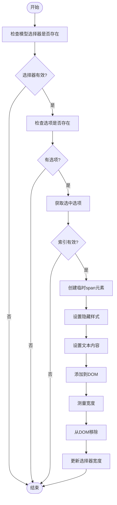
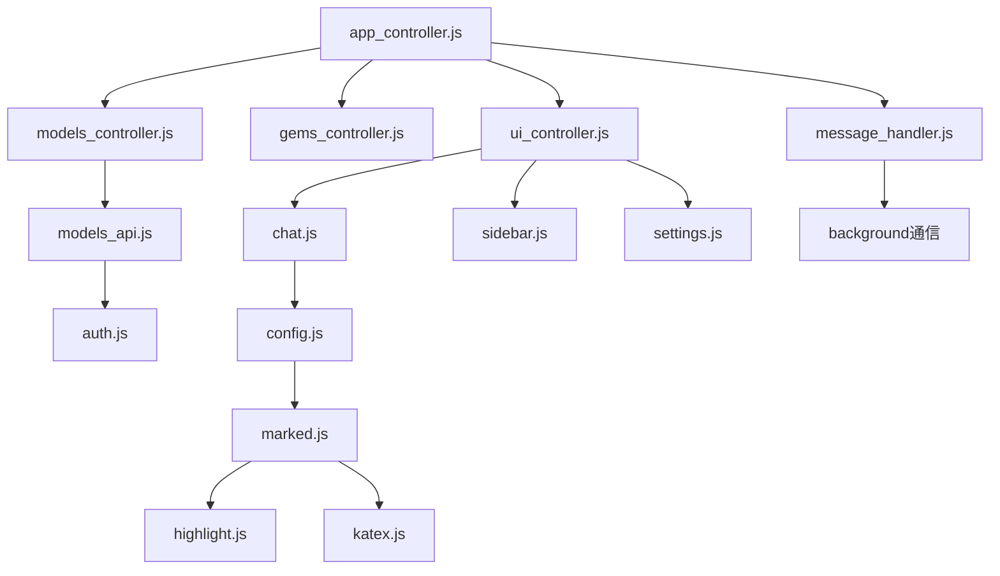

# 沙箱UI动态模型加载

<cite>
**本文档引用的文件**
- [app.js](file://sandbox/boot/app.js)
- [loader.js](file://sandbox/boot/loader.js)
- [models_controller.js](file://sandbox/controllers/models_controller.js)
- [ui_controller.js](file://sandbox/ui/ui_controller.js)
- [app_controller.js](file://sandbox/controllers/app_controller.js)
- [renderer.js](file://sandbox/boot/renderer.js)
- [config.js](file://sandbox/render/config.js)
- [markmap-loader.js](file://sandbox/libs/markmap-loader.js)
- [events.js](file://sandbox/boot/events.js)
- [manifest.json](file://manifest.json)
- [models_api.js](file://services/models_api.js)
- [control_manager.js](file://background/managers/control_manager.js)
- [prompt_handler.js](file://background/handlers/session/prompt_handler.js)
- [context_handler.js](file://background/handlers/session/context_handler.js)
</cite>

## 目录
1. [简介](#简介)
2. [项目结构](#项目结构)
3. [核心组件](#核心组件)
4. [架构概述](#架构概述)
5. [详细组件分析](#详细组件分析)
6. [依赖分析](#依赖分析)
7. [性能考虑](#性能考虑)
8. [故障排除指南](#故障排除指南)
9. [结论](#结论)

## 简介
本文档详细分析了Gemini Nexus扩展中沙箱UI的动态模型加载机制。该系统实现了在浏览器扩展环境中动态加载AI模型列表、渲染UI组件并处理用户交互的完整流程。系统采用模块化架构，通过沙箱环境隔离执行，确保安全性和稳定性。

## 项目结构
Gemini Nexus项目采用分层架构，主要分为背景脚本、内容脚本、沙箱环境、服务层和UI组件等模块。沙箱环境专门用于处理敏感的UI渲染和模型加载操作。

**Diagram sources**
- [manifest.json](file://manifest.json#L37-L39)
- [sandbox/index.js](file://sandbox/index.js#L1-L12)

## 核心组件
沙箱UI的核心组件包括模型控制器、UI控制器、应用控制器和渲染管道。这些组件协同工作，实现动态模型加载和UI更新。

**Section sources**
- [models_controller.js](file://sandbox/controllers/models_controller.js#L1-L153)
- [ui_controller.js](file://sandbox/ui/ui_controller.js#L1-L66)
- [app_controller.js](file://sandbox/controllers/app_controller.js#L1-L265)

## 架构概述
系统采用分层架构，从底层到高层分别为：模型数据层、控制器层、UI层和渲染层。各层之间通过明确的接口进行通信，确保松耦合和高内聚。

**Diagram sources**
- [models_api.js](file://services/models_api.js#L12-L221)
- [models_controller.js](file://sandbox/controllers/models_controller.js#L3-L153)
- [app_controller.js](file://sandbox/controllers/app_controller.js#L12-L265)

## 详细组件分析

### 模型控制器分析
模型控制器负责管理AI模型的获取、缓存和UI更新。它通过异步方式从背景服务获取模型列表，并动态更新UI中的选择器。

**Diagram sources**
- [models_controller.js](file://sandbox/controllers/models_controller.js#L3-L153)
- [models_api.js](file://services/models_api.js#L197-L221)

### 应用启动流程分析
应用启动流程涉及多个异步操作的协调，包括布局渲染、依赖加载、控制器初始化和消息桥接。

**Diagram sources**
- [app.js](file://sandbox/boot/app.js#L11-L93)
- [loader.js](file://sandbox/boot/loader.js#L21-L47)

### 模型选择器自动调整分析
模型选择器根据选中文本内容自动调整宽度，提供更好的用户体验。

**Diagram sources**
- [events.js](file://sandbox/boot/events.js#L162-L197)

## 依赖分析
系统依赖关系复杂，涉及多个内部模块和外部库的交互。核心依赖包括UI框架、渲染库和模型服务。

**Diagram sources**
- [app_controller.js](file://sandbox/controllers/app_controller.js#L1-L265)
- [models_controller.js](file://sandbox/controllers/models_controller.js#L1-L153)
- [ui_controller.js](file://sandbox/ui/ui_controller.js#L1-L66)

## 性能考虑
系统在性能方面进行了多项优化，包括依赖懒加载、模型缓存和异步初始化。

1. **依赖懒加载**：非关键库采用延迟加载策略，优先加载核心渲染库
2. **模型缓存**：模型列表缓存30分钟，减少重复网络请求
3. **异步初始化**：UI渲染与数据获取并行执行，减少用户等待时间
4. **内存管理**：沙箱环境隔离执行，防止内存泄漏影响主页面

## 故障排除指南
常见问题及解决方案：

1. **模型列表未显示**
   - 检查网络连接和认证状态
   - 验证`FETCH_MODELS_LIST`消息是否正确发送
   - 确认背景服务是否正常响应

2. **UI渲染异常**
   - 确保`marked.js`等核心库已正确加载
   - 检查`configureMarkdown`是否已调用
   - 验证CSS样式表是否已应用

3. **选择器宽度问题**
   - 确认`resizeModelSelect`函数已正确绑定
   - 检查DOM元素是否已完全加载
   - 验证字体样式是否一致

**Section sources**
- [loader.js](file://sandbox/boot/loader.js#L21-L47)
- [config.js](file://sandbox/render/config.js#L4-L80)
- [models_controller.js](file://sandbox/controllers/models_controller.js#L23-L77)

## 结论
Gemini Nexus的沙箱UI动态模型加载系统设计精巧，通过模块化架构和异步处理机制，实现了高效、安全的模型管理和UI更新。系统采用多层次的缓存策略和依赖管理，确保了良好的性能表现。未来可进一步优化模型加载的错误处理和用户体验。