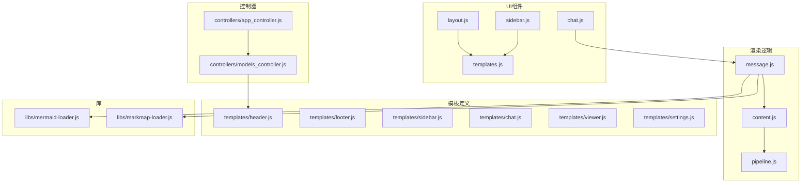
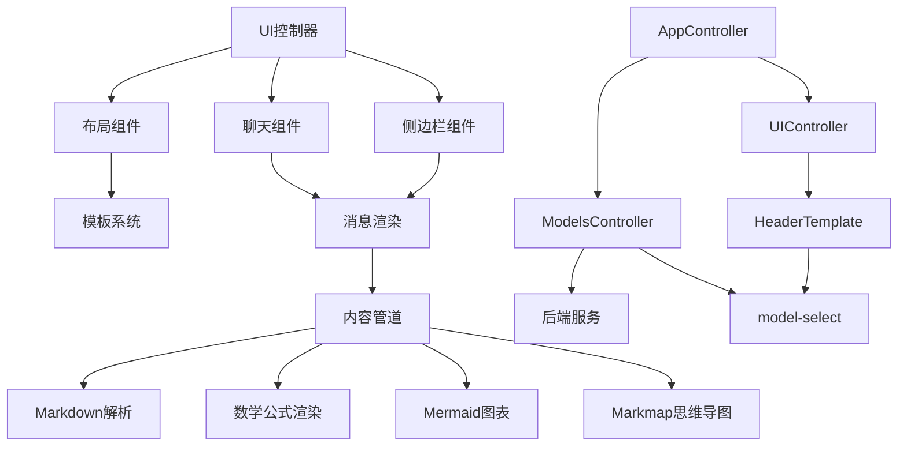
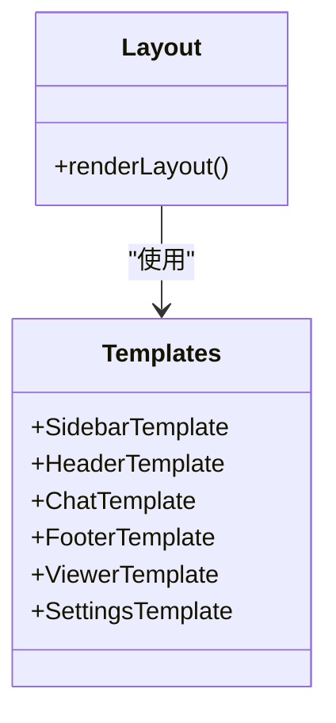
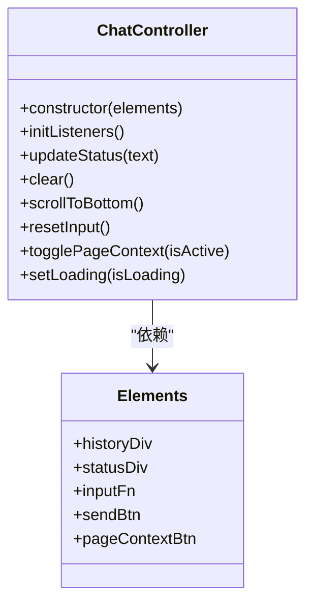
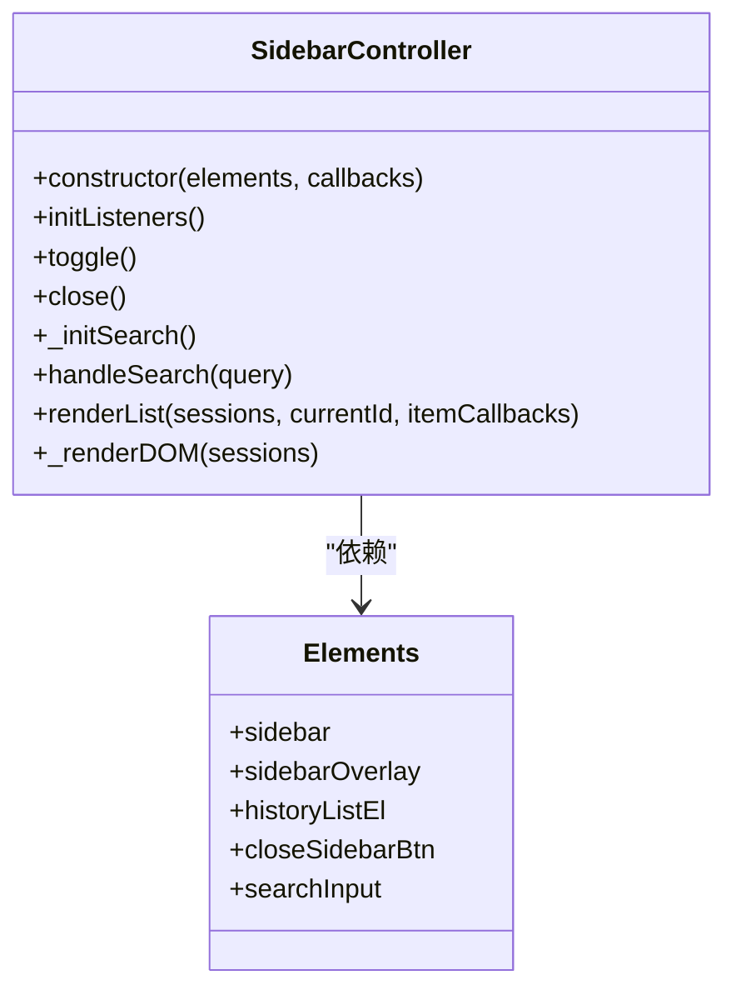
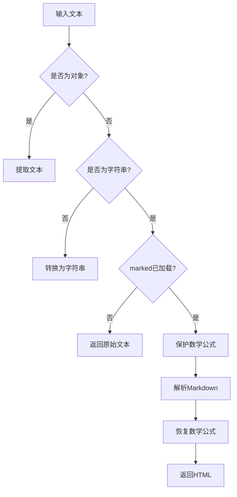
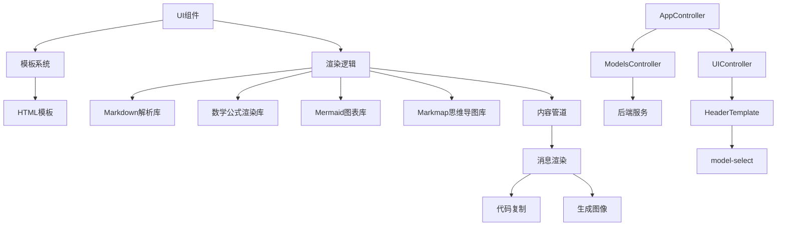
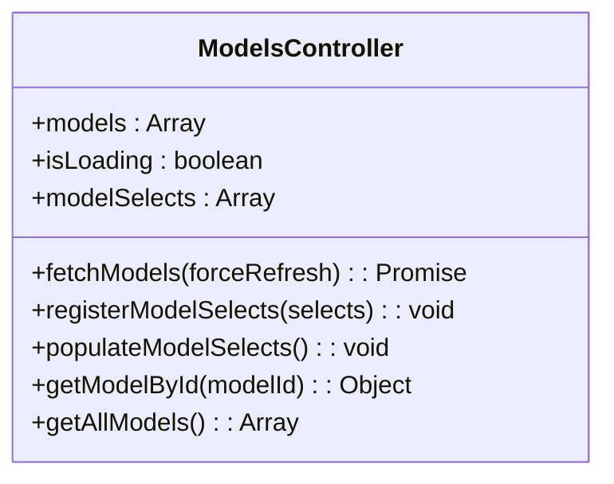
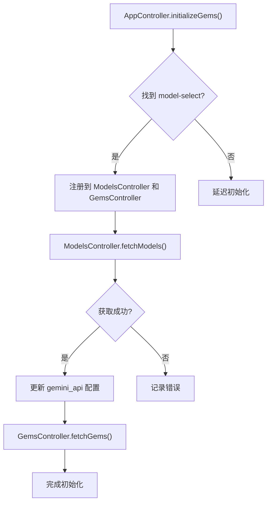

# 沙箱UI渲染

<cite>
**本文档引用的文件**
- [layout.js](file://sandbox/ui/layout.js)
- [chat.js](file://sandbox/ui/chat.js)
- [sidebar.js](file://sandbox/ui/sidebar.js)
- [templates.js](file://sandbox/ui/templates.js)
- [pipeline.js](file://sandbox/render/pipeline.js)
- [message.js](file://sandbox/render/message.js)
- [content.js](file://sandbox/render/content.js)
- [mermaid-loader.js](file://sandbox/libs/mermaid-loader.js)
- [markmap-loader.js](file://sandbox/libs/markmap-loader.js)
- [footer.js](file://sandbox/ui/templates/footer.js)
- [header.js](file://sandbox/ui/templates/header.js)
- [sidebar.js](file://sandbox/ui/templates/sidebar.js)
- [chat.js](file://sandbox/ui/templates/chat.js)
- [viewer.js](file://sandbox/ui/templates/viewer.js)
- [settings.js](file://sandbox/ui/templates/settings.js)
- [models_controller.js](file://sandbox/controllers/models_controller.js)
- [app_controller.js](file://sandbox/controllers/app_controller.js)
</cite>

## 更新摘要
**已做更改**
- 更新了“简介”、“项目结构”、“架构概述”、“详细组件分析”和“附录”部分，以反映模型选择器的动态加载机制。
- 新增了“动态模型加载机制”部分，详细说明模型动态加载的实现方式。
- 移除了关于静态模型预设的过时信息。

## 目录
1. [简介](#简介)
2. [项目结构](#项目结构)
3. [核心组件](#核心组件)
4. [架构概述](#架构概述)
5. [详细组件分析](#详细组件分析)
6. [依赖分析](#依赖分析)
7. [性能考虑](#性能考虑)
8. [故障排除指南](#故障排除指南)
9. [结论](#结论)
10. [附录](#附录)
11. [动态模型加载机制](#动态模型加载机制)

## 简介
本文档详细阐述了Gemini Nexus沙箱环境的UI渲染系统，重点介绍其基于HTML模板和JavaScript的动态渲染机制。文档深入分析了沙箱主界面布局的构建方式、聊天消息的显示逻辑、会话历史列表的动态更新以及内容渲染流程的协调机制。特别说明了模型选择器的动态加载机制，该机制通过`models_controller.js`从后端服务获取模型列表，并动态填充到UI中，取代了原有的静态预设。

**节源**
- [header.js](file://sandbox/ui/templates/header.js#L1-L27)
- [models_controller.js](file://sandbox/controllers/models_controller.js#L1-L153)

## 项目结构
Gemini Nexus沙箱环境的UI渲染系统主要位于`sandbox`目录下，其结构清晰地分离了UI组件、渲染逻辑和模板定义。系统采用模块化设计，通过HTML模板和JavaScript组件协同工作，实现动态的用户界面。



**图源**
- [layout.js](file://sandbox/ui/layout.js#L1-L17)
- [chat.js](file://sandbox/ui/chat.js#L1-L120)
- [sidebar.js](file://sandbox/ui/sidebar.js#L1-L249)
- [templates.js](file://sandbox/ui/templates.js#L1-L10)
- [pipeline.js](file://sandbox/render/pipeline.js#L1-L44)
- [message.js](file://sandbox/render/message.js#L1-L657)
- [content.js](file://sandbox/render/content.js#L1-L34)
- [mermaid-loader.js](file://sandbox/libs/mermaid-loader.js#L1-L54)
- [markmap-loader.js](file://sandbox/libs/markmap-loader.js#L1-L50)
- [header.js](file://sandbox/ui/templates/header.js#L1-L27)
- [models_controller.js](file://sandbox/controllers/models_controller.js#L1-L153)
- [app_controller.js](file://sandbox/controllers/app_controller.js#L1-L249)

**节源**
- [layout.js](file://sandbox/ui/layout.js#L1-L17)
- [chat.js](file://sandbox/ui/chat.js#L1-L120)
- [sidebar.js](file://sandbox/ui/sidebar.js#L1-L249)
- [templates.js](file://sandbox/ui/templates.js#L1-L10)
- [pipeline.js](file://sandbox/render/pipeline.js#L1-L44)
- [message.js](file://sandbox/render/message.js#L1-L657)
- [content.js](file://sandbox/render/content.js#L1-L34)
- [mermaid-loader.js](file://sandbox/libs/mermaid-loader.js#L1-L54)
- [markmap-loader.js](file://sandbox/libs/markmap-loader.js#L1-L50)
- [header.js](file://sandbox/ui/templates/header.js#L1-L27)
- [models_controller.js](file://sandbox/controllers/models_controller.js#L1-L153)
- [app_controller.js](file://sandbox/controllers/app_controller.js#L1-L249)

## 核心组件
沙箱UI渲染系统的核心组件包括`layout.js`、`chat.js`、`sidebar.js`和`templates.js`。这些组件协同工作，构建了沙箱的主界面布局，管理聊天消息的显示逻辑，并实现会话历史列表的动态更新。此外，`models_controller.js`和`app_controller.js`是实现动态模型加载的关键组件。

**节源**
- [layout.js](file://sandbox/ui/layout.js#L1-L17)
- [chat.js](file://sandbox/ui/chat.js#L1-L120)
- [sidebar.js](file://sandbox/ui/sidebar.js#L1-L249)
- [templates.js](file://sandbox/ui/templates.js#L1-L10)
- [models_controller.js](file://sandbox/controllers/models_controller.js#L1-L153)
- [app_controller.js](file://sandbox/controllers/app_controller.js#L1-L249)

## 架构概述
沙箱UI渲染系统采用分层架构，将UI组件、渲染逻辑和模板定义分离。`layout.js`负责构建主界面布局，`chat.js`和`sidebar.js`分别管理聊天区域和侧边栏的交互逻辑，`templates.js`提供预定义的HTML模板，而`pipeline.js`协调内容渲染流程。模型选择器不再使用静态预设，而是由`models_controller.js`从后端获取模型列表，并通过`app_controller.js`在UI初始化时动态填充。



**图源**
- [layout.js](file://sandbox/ui/layout.js#L1-L17)
- [chat.js](file://sandbox/ui/chat.js#L1-L120)
- [sidebar.js](file://sandbox/ui/sidebar.js#L1-L249)
- [templates.js](file://sandbox/ui/templates.js#L1-L10)
- [pipeline.js](file://sandbox/render/pipeline.js#L1-L44)
- [message.js](file://sandbox/render/message.js#L1-L657)
- [content.js](file://sandbox/render/content.js#L1-L34)
- [models_controller.js](file://sandbox/controllers/models_controller.js#L1-L153)
- [app_controller.js](file://sandbox/controllers/app_controller.js#L1-L249)
- [header.js](file://sandbox/ui/templates/header.js#L1-L27)

## 详细组件分析
本节深入分析沙箱UI渲染系统的关键组件，包括布局构建、聊天消息管理、侧边栏交互和内容渲染流程。

### 布局组件分析
`layout.js`组件负责构建沙箱的主界面布局，通过组合多个预定义的HTML模板来创建完整的用户界面。

#### 布局构建机制
`layout.js`通过导入`templates.js`中定义的各个模板，将它们组合成一个完整的布局字符串，并将其插入到DOM中。



**图源**
- [layout.js](file://sandbox/ui/layout.js#L1-L17)
- [templates.js](file://sandbox/ui/templates.js#L1-L10)

**节源**
- [layout.js](file://sandbox/ui/layout.js#L1-L17)
- [templates.js](file://sandbox/ui/templates.js#L1-L10)

### 聊天组件分析
`chat.js`组件管理聊天消息的显示逻辑，包括用户和AI消息的样式区分、代码块高亮、数学公式渲染和生成图像展示。

#### 聊天消息管理
`chat.js`中的`ChatController`类负责管理聊天区域的交互逻辑，包括输入框的自动调整、代码块的复制功能和消息的滚动行为。



**图源**
- [chat.js](file://sandbox/ui/chat.js#L1-L120)

**节源**
- [chat.js](file://sandbox/ui/chat.js#L1-L120)

### 侧边栏组件分析
`sidebar.js`组件实现会话历史列表的动态更新和交互响应，包括搜索功能和会话管理。

#### 侧边栏交互逻辑
`sidebar.js`中的`SidebarController`类负责管理侧边栏的显示状态、搜索功能和会话列表的渲染。



**图源**
- [sidebar.js](file://sandbox/ui/sidebar.js#L1-L249)

**节源**
- [sidebar.js](file://sandbox/ui/sidebar.js#L1-L249)

### 内容渲染分析
`pipeline.js`组件协调内容渲染流程，包括Markdown解析、Mermaid图表生成和Markmap思维导图渲染。

#### 渲染流程协调
`pipeline.js`中的`transformMarkdown`函数负责将原始文本转换为HTML，同时保护和恢复数学公式块。



**图源**
- [pipeline.js](file://sandbox/render/pipeline.js#L1-L44)

**节源**
- [pipeline.js](file://sandbox/render/pipeline.js#L1-L44)

## 依赖分析
沙箱UI渲染系统依赖于多个外部库和内部模块，这些依赖关系确保了系统的完整功能。



**图源**
- [layout.js](file://sandbox/ui/layout.js#L1-L17)
- [chat.js](file://sandbox/ui/chat.js#L1-L120)
- [sidebar.js](file://sandbox/ui/sidebar.js#L1-L249)
- [templates.js](file://sandbox/ui/templates.js#L1-L10)
- [pipeline.js](file://sandbox/render/pipeline.js#L1-L44)
- [message.js](file://sandbox/render/message.js#L1-L657)
- [content.js](file://sandbox/render/content.js#L1-L34)
- [mermaid-loader.js](file://sandbox/libs/mermaid-loader.js#L1-L54)
- [markmap-loader.js](file://sandbox/libs/markmap-loader.js#L1-L50)
- [models_controller.js](file://sandbox/controllers/models_controller.js#L1-L153)
- [app_controller.js](file://sandbox/controllers/app_controller.js#L1-L249)
- [header.js](file://sandbox/ui/templates/header.js#L1-L27)

**节源**
- [layout.js](file://sandbox/ui/layout.js#L1-L17)
- [chat.js](file://sandbox/ui/chat.js#L1-L120)
- [sidebar.js](file://sandbox/ui/sidebar.js#L1-L249)
- [templates.js](file://sandbox/ui/templates.js#L1-L10)
- [pipeline.js](file://sandbox/render/pipeline.js#L1-L44)
- [message.js](file://sandbox/render/message.js#L1-L657)
- [content.js](file://sandbox/render/content.js#L1-L34)
- [mermaid-loader.js](file://sandbox/libs/mermaid-loader.js#L1-L54)
- [markmap-loader.js](file://sandbox/libs/markmap-loader.js#L1-L50)
- [models_controller.js](file://sandbox/controllers/models_controller.js#L1-L153)
- [app_controller.js](file://sandbox/controllers/app_controller.js#L1-L249)
- [header.js](file://sandbox/ui/templates/header.js#L1-L27)

## 性能考虑
沙箱UI渲染系统在设计时考虑了性能优化，例如通过延迟加载外部库来减少初始加载时间，以及通过事件委托来提高交互响应速度。动态模型加载机制通过缓存和异步加载避免了UI阻塞。

## 故障排除指南
当遇到UI渲染问题时，可以检查以下方面：
- 确保所有依赖的外部库已正确加载
- 检查HTML模板是否正确导入和组合
- 验证渲染管道是否正确处理Markdown和数学公式
- 检查`models_controller.js`是否成功从后端获取模型列表
- 确认`app_controller.js`的`initializeGems`方法已正确执行

**节源**
- [pipeline.js](file://sandbox/render/pipeline.js#L1-L44)
- [message.js](file://sandbox/render/message.js#L1-L657)
- [content.js](file://sandbox/render/content.js#L1-L34)
- [models_controller.js](file://sandbox/controllers/models_controller.js#L1-L153)
- [app_controller.js](file://sandbox/controllers/app_controller.js#L1-L249)

## 结论
Gemini Nexus沙箱环境的UI渲染系统通过模块化设计和分层架构，实现了高效、灵活的用户界面。系统利用HTML模板和JavaScript组件的组合，提供了丰富的交互功能和内容渲染能力。动态模型加载机制的引入，使得UI能够灵活适应Gemini服务的模型变化，无需进行代码更新，提高了系统的可维护性和扩展性。

## 附录
### 模板文件说明
- `header.js`: 定义顶部工具栏的HTML结构，包含动态模型选择器
- `footer.js`: 定义底部输入区域的HTML结构
- `sidebar.js`: 定义侧边栏的HTML结构
- `chat.js`: 定义聊天区域的HTML结构
- `viewer.js`: 定义图像查看器的HTML结构
- `settings.js`: 定义设置面板的HTML结构

**节源**
- [header.js](file://sandbox/ui/templates/header.js#L1-L27)
- [footer.js](file://sandbox/ui/templates/footer.js#L1-L124)
- [sidebar.js](file://sandbox/ui/templates/sidebar.js#L1-L24)
- [chat.js](file://sandbox/ui/templates/chat.js#L1-L4)
- [viewer.js](file://sandbox/ui/templates/viewer.js#L1-L29)
- [settings.js](file://sandbox/ui/templates/settings.js#L1-L174)

## 动态模型加载机制
本节详细说明沙箱UI中模型选择器的动态加载机制，该机制取代了原有的静态预设。

### 实现原理
模型选择器的动态加载由`models_controller.js`和`app_controller.js`协同完成。`models_controller.js`负责从后端服务获取模型列表，并提供`populateModelSelects`方法将模型填充到指定的下拉框中。`app_controller.js`在UI初始化时调用`initializeGems`方法，注册模型选择器并触发模型列表的获取和填充。

**节源**
- [models_controller.js](file://sandbox/controllers/models_controller.js#L1-L153)
- [app_controller.js](file://sandbox/controllers/app_controller.js#L42-L73)

### 核心组件
#### ModelsController
`ModelsController`是前端模型数据的管理器，其核心功能包括：
- `fetchModels(forceRefresh)`: 从后端服务获取模型列表
- `registerModelSelects(selects)`: 注册需要填充模型的下拉框元素
- `populateModelSelects()`: 将获取到的模型列表填充到已注册的下拉框中
- `getModelById(modelId)`: 根据ID获取模型信息



**图源**
- [models_controller.js](file://sandbox/controllers/models_controller.js#L3-L153)

**节源**
- [models_controller.js](file://sandbox/controllers/models_controller.js#L3-L153)

#### AppController
`AppController`在`initializeGems`方法中协调模型加载流程：
1. 查找ID为`model-select`的下拉框元素
2. 将该元素注册到`models_controller`和`gems_controller`
3. 调用`models_controller.fetchModels`获取模型列表
4. 获取成功后，更新`gemini_api`的配置
5. 同时调用`gems_controller.fetchGems`获取Gems列表



**图源**
- [app_controller.js](file://sandbox/controllers/app_controller.js#L42-L73)

**节源**
- [app_controller.js](file://sandbox/controllers/app_controller.js#L42-L73)

### 模板更新
`header.js`模板中的模型选择器已移除所有静态`<option>`标签，仅保留一个空的`<select>`元素，其内容将由`ModelsController`动态填充。

```javascript
export const HeaderTemplate = `
    <!-- HEADER -->
    <div class="header">
        <div class="header-left">
            <button id="history-toggle" class="icon-btn" data-i18n-title="toggleHistory" title="Chat History">
                <svg xmlns="http://www.w3.org/2000/svg" width="24" height="24" viewBox="0 0 24 24" fill="none" stroke="currentColor" stroke-width="2" stroke-linecap="round" stroke-linejoin="round"><line x1="3" y1="12" x2="21" y2="12"></line><line x1="3" y1="6" x2="21" y2="6"></line><line x1="3" y1="18" x2="21" y2="18"></line></svg>
            </button>
            
            <div class="model-select-wrapper">
                <select id="model-select" data-i18n-title="modelSelectTooltip" title="Select Model (Tab to cycle)">
                    <!-- Models and Gems will be dynamically loaded -->
                </select>
            </div>
        </div>
        ...
    </div>
    ...
`;
```

**节源**
- [header.js](file://sandbox/ui/templates/header.js#L9-L13)