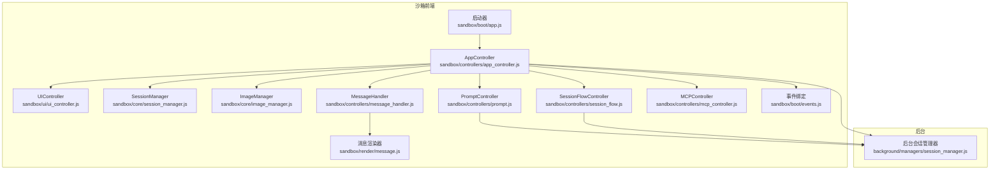
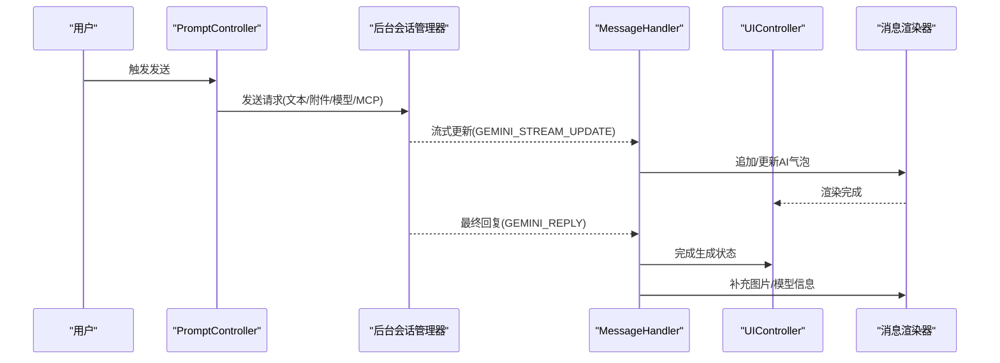
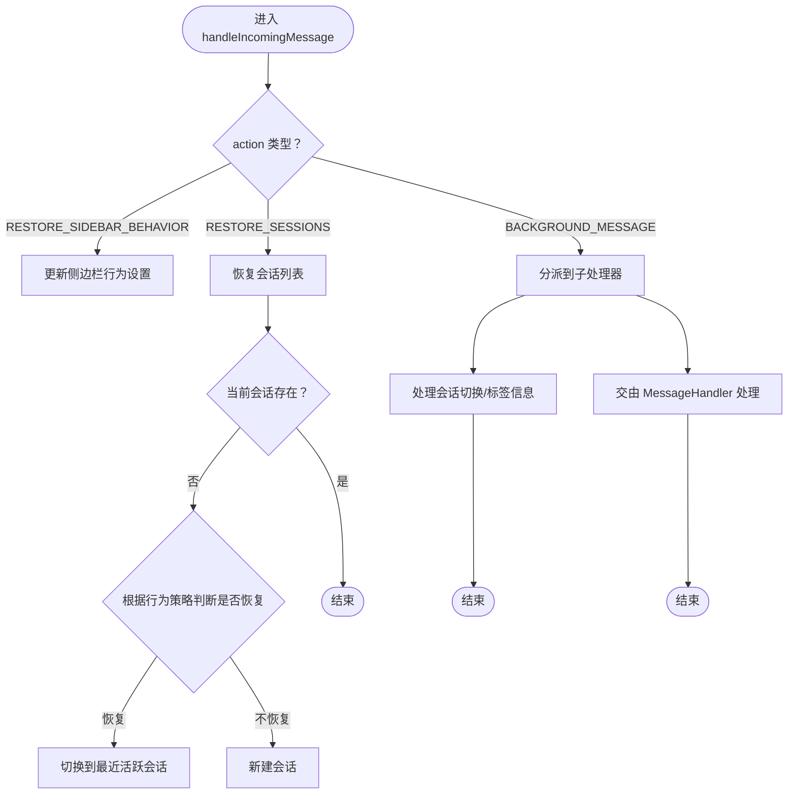
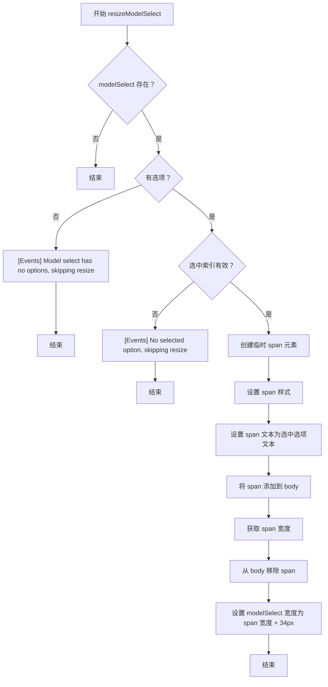
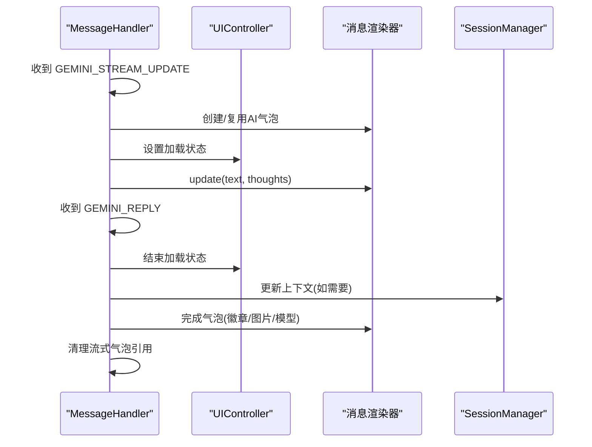
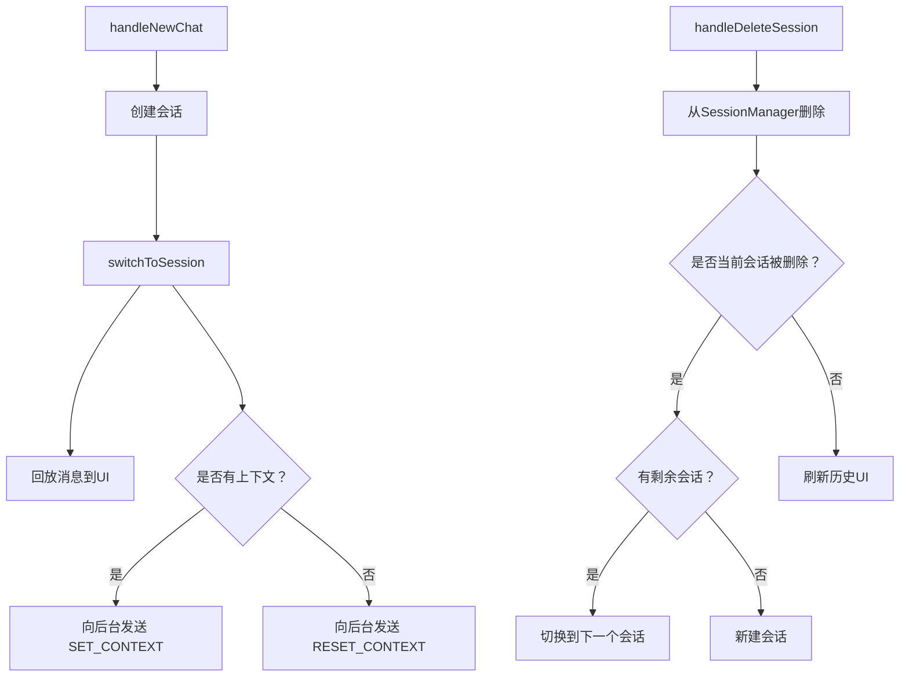
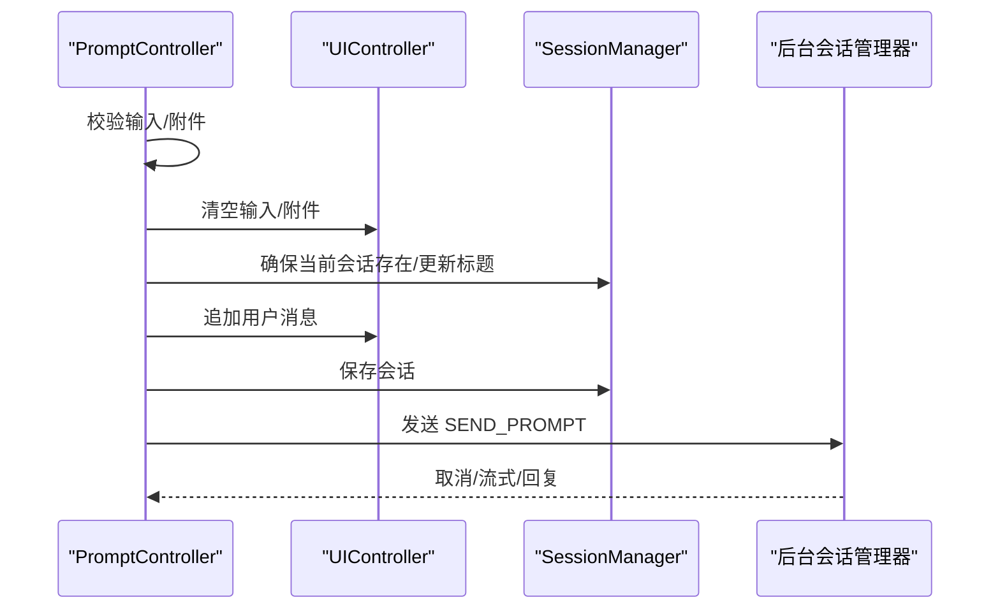
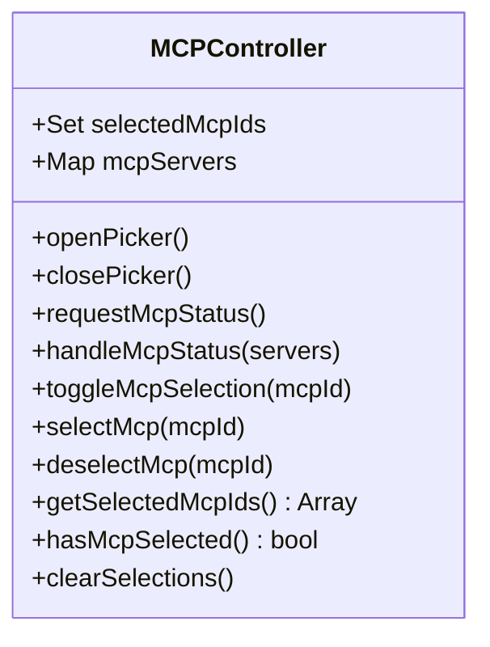
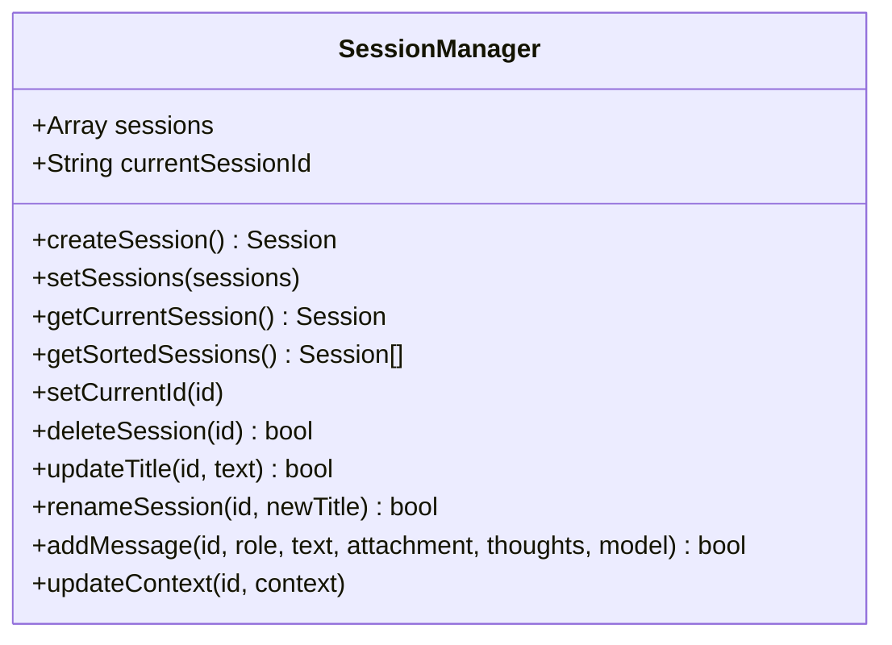
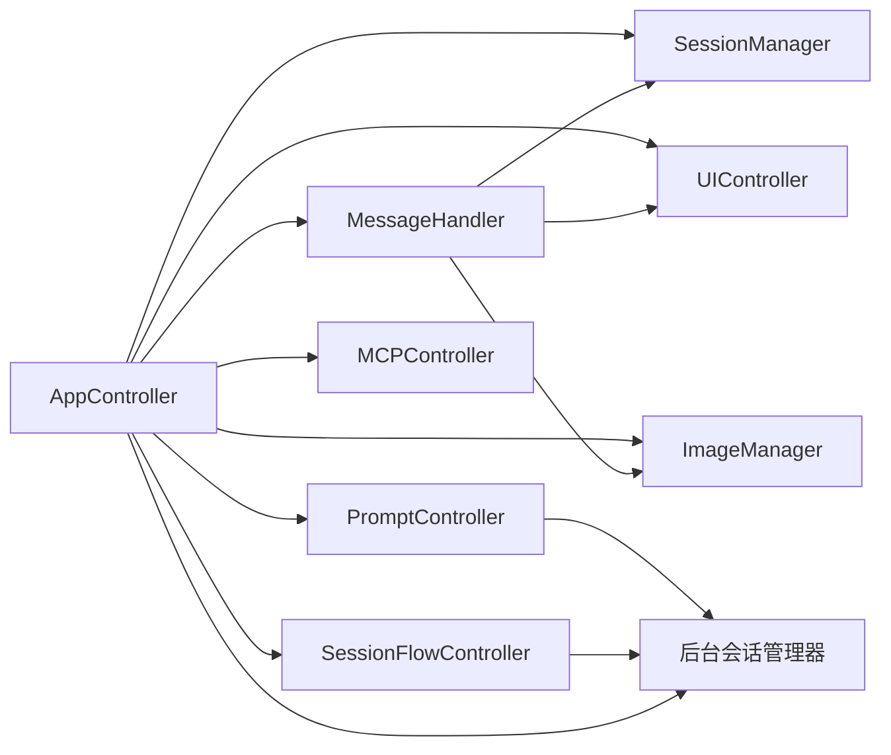

# 沙箱核心控制器

<cite>
**本文引用的文件**
- [sandbox/controllers/app_controller.js](file://sandbox/controllers/app_controller.js)
- [sandbox/controllers/message_handler.js](file://sandbox/controllers/message_handler.js)
- [sandbox/controllers/session_flow.js](file://sandbox/controllers/session_flow.js)
- [sandbox/controllers/prompt.js](file://sandbox/controllers/prompt.js)
- [sandbox/controllers/mcp_controller.js](file://sandbox/controllers/mcp_controller.js)
- [sandbox/core/session_manager.js](file://sandbox/core/session_manager.js)
- [sandbox/core/image_manager.js](file://sandbox/core/image_manager.js)
- [sandbox/ui/ui_controller.js](file://sandbox/ui/ui_controller.js)
- [sandbox/render/message.js](file://sandbox/render/message.js)
- [lib/messaging.js](file://lib/messaging.js)
- [background/managers/session_manager.js](file://background/managers/session_manager.js)
- [sandbox/boot/app.js](file://sandbox/boot/app.js)
- [sandbox/boot/events.js](file://sandbox/boot/events.js)
</cite>

## 更新摘要
**变更内容**
- 在“AppController：沙箱主控制器”章节中，更新了`handleModelChange`方法的描述，以反映其在`sandbox/boot/events.js`中的调用方式。
- 在“项目结构”章节中，更新了架构图以包含模型选择器的自动调整大小逻辑。
- 新增了“模型选择器自动调整大小逻辑”章节，详细说明了在`sandbox/boot/events.js`中为模型选择器添加的空值检查和健壮性增强。
- 更新了“组件详细分析”章节中的流程图，以反映模型选择器调整大小的完整流程。

## 目录
1. [简介](#简介)
2. [项目结构](#项目结构)
3. [核心组件](#核心组件)
4. [架构总览](#架构总览)
5. [组件详细分析](#组件详细分析)
6. [依赖关系分析](#依赖关系分析)
7. [性能考量](#性能考量)
8. [故障排查指南](#故障排查指南)
9. [结论](#结论)

## 简介
本文件面向Gemini Nexus沙箱环境，聚焦于核心控制器模块，尤其是AppController作为沙箱主控制器的职责与协作机制。文档将系统阐述：
- AppController如何在构造函数中注入并初始化SessionManager、UIController、ImageManager三大核心依赖；
- 如何协调MessageHandler、SessionFlowController、PromptController、MCPController等子控制器的工作流程；
- 用户消息发送流程（handleSendMessage）与后台异步消息处理（handleIncomingMessage）的完整链路；
- 会话切换、删除与页面上下文状态管理；
- MessageHandler对流式响应的处理与UI实时更新策略；
- SessionManager对会话列表、当前会话ID与消息历史的维护；
- 依赖注入模式下各组件的协同方式与状态一致性保障。

## 项目结构
沙箱环境采用“控制器-渲染-管理器”分层设计，核心入口在沙箱侧引导动态加载控制器与管理器，随后通过消息桥接与后台通信。

**图表来源**
- [sandbox/boot/app.js](file://sandbox/boot/app.js#L35-L88)
- [sandbox/controllers/app_controller.js](file://sandbox/controllers/app_controller.js#L10-L36)
- [sandbox/controllers/message_handler.js](file://sandbox/controllers/message_handler.js#L1-L15)
- [sandbox/controllers/session_flow.js](file://sandbox/controllers/session_flow.js#L7-L12)
- [sandbox/controllers/prompt.js](file://sandbox/controllers/prompt.js#L7-L13)
- [sandbox/controllers/mcp_controller.js](file://sandbox/controllers/mcp_controller.js#L5-L13)
- [sandbox/render/message.js](file://sandbox/render/message.js#L8-L14)
- [background/managers/session_manager.js](file://background/managers/session_manager.js#L6-L11)
- [sandbox/boot/events.js](file://sandbox/boot/events.js#L142-L187)

**章节来源**
- [sandbox/boot/app.js](file://sandbox/boot/app.js#L11-L88)

## 核心组件
- AppController：沙箱主控制器，负责依赖注入、事件分发、会话与页面上下文状态管理、与后台的消息桥接。
- MessageHandler：处理后台返回的各类消息（流式更新、最终回复、图像结果、截图裁剪、工具选择等），驱动UI渲染与状态更新。
- SessionFlowController：负责新会话创建、会话切换、历史UI刷新、会话删除与重命名。
- PromptController：封装用户输入与附件，构建请求负载，调用后台并管理生成状态。
- MCPController：管理MCP服务器选择与标签展示，向消息传递选中的服务器ID。
- SessionManager：维护会话列表、当前会话ID、消息历史、上下文ID与时间戳。
- UIController：统一管理聊天、侧边栏、设置、查看器等子控制器，暴露关键DOM元素供外部使用。
- ImageManager：处理图片拖拽、粘贴、URL拖放、预览与附件上传。
- 消息渲染器：提供appendMessage接口，返回可更新的控制器，支持文本、思考过程、MCP徽章、复制按钮等。

**章节来源**
- [sandbox/controllers/app_controller.js](file://sandbox/controllers/app_controller.js#L10-L36)
- [sandbox/controllers/message_handler.js](file://sandbox/controllers/message_handler.js#L8-L15)
- [sandbox/controllers/session_flow.js](file://sandbox/controllers/session_flow.js#L7-L12)
- [sandbox/controllers/prompt.js](file://sandbox/controllers/prompt.js#L7-L13)
- [sandbox/controllers/mcp_controller.js](file://sandbox/controllers/mcp_controller.js#L5-L13)
- [sandbox/core/session_manager.js](file://sandbox/core/session_manager.js#L5-L9)
- [sandbox/ui/ui_controller.js](file://sandbox/ui/ui_controller.js#L8-L33)
- [sandbox/core/image_manager.js](file://sandbox/core/image_manager.js#L4-L17)
- [sandbox/render/message.js](file://sandbox/render/message.js#L8-L14)

## 架构总览
AppController作为中枢，通过依赖注入持有SessionManager、UIController、ImageManager；同时实例化MessageHandler、SessionFlowController、PromptController、MCPController以协调不同职责。消息流经lib/messaging.js转发至后台，后台由GeminiSessionManager处理请求与MCP工具执行，再通过AppController的消息桥接回调到前台，由MessageHandler驱动UI更新。

**图表来源**
- [sandbox/controllers/prompt.js](file://sandbox/controllers/prompt.js#L15-L104)
- [background/managers/session_manager.js](file://background/managers/session_manager.js#L21-L202)
- [sandbox/controllers/message_handler.js](file://sandbox/controllers/message_handler.js#L17-L86)
- [sandbox/render/message.js](file://sandbox/render/message.js#L8-L324)

## 组件详细分析

### AppController：沙箱主控制器
职责概览
- 依赖注入：接收SessionManager、UIController、ImageManager，构造MessageHandler、SessionFlowController、PromptController、MCPController。
- 页面上下文与浏览器控制开关：togglePageContext、setPageContext、toggleBrowserControl。
- 会话管理：handleNewChat、switchToSession、rerender、handleDeleteSession。
- 模型选择与持久化：getSelectedModel、handleModelChange。
- 文件上传：handleFileUpload委托给ImageManager。
- 消息入口：handleSendMessage委托PromptController；handleIncomingMessage处理后台广播与恢复逻辑。

关键流程
- handleSendMessage：委托PromptController.send()，后者负责清空输入、渲染用户消息、保存会话、向后台发送请求。
- handleIncomingMessage：
  - RESTORE_SIDEBAR_BEHAVIOR：更新UI设置面板。
  - RESTORE_SESSIONS：恢复会话列表，按行为策略决定是否自动切换到最近活跃会话或新建会话。
  - BACKGROUND_MESSAGE：分派到MessageHandler或SessionFlowController处理会话切换、活动标签信息、MCP状态等。

**图表来源**
- [sandbox/controllers/app_controller.js](file://sandbox/controllers/app_controller.js#L129-L192)

**章节来源**
- [sandbox/controllers/app_controller.js](file://sandbox/controllers/app_controller.js#L10-L36)
- [sandbox/controllers/app_controller.js](file://sandbox/controllers/app_controller.js#L123-L192)

### 模型选择器自动调整大小逻辑
在`sandbox/boot/events.js`中，为模型选择器（model-select）实现了自动调整大小功能，以确保下拉框宽度能适应所选模型的文本长度。此功能通过`resizeModelSelect`函数实现，并在模型选择改变时触发。

该逻辑包含以下健壮性增强措施：
1. **空选择器检查**：首先检查`modelSelect`元素是否存在，若不存在则直接返回。
2. **选项存在性检查**：检查`modelSelect.options`是否存在且长度大于0，若无选项则记录警告并返回。
3. **选中索引有效性检查**：检查`modelSelect.selectedIndex`是否有效，若无效则记录警告并返回。

**图表来源**
- [sandbox/boot/events.js](file://sandbox/boot/events.js#L145-L176)

**章节来源**
- [sandbox/boot/events.js](file://sandbox/boot/events.js#L142-L187)

### MessageHandler：消息处理与UI更新
职责概览
- 接收后台消息，按action类型分派处理：
  - GEMINI_STREAM_UPDATE：创建或复用AI气泡，增量更新文本与思考过程，标记生成中。
  - GEMINI_REPLY：结束生成状态，补全AI气泡（MCP徽章、图片、模型信息），确保UI视觉一致。
  - FETCH_IMAGE_RESULT / GENERATED_IMAGE_RESULT：处理用户上传或生成图片的加载与水印移除。
  - CROP_SCREENSHOT：裁剪截图并根据捕获模式（OCR/翻译/截图）自动填充提示并发送。
  - SET_SIDEBAR_CAPTURE_MODE / TOGGLE_PAGE_CONTEXT：同步UI状态。
  - MCP工具选择：展示工具选择弹窗并更新MCP选择。
- 提供resetStream用于取消/重置流式状态。

流式响应处理流程
- 首次收到GEMINI_STREAM_UPDATE时创建AI气泡，后续更新仅调用气泡控制器的update方法，避免重复DOM操作。
- 收到GEMINI_REPLY时，若存在流式气泡则完成更新，否则直接追加消息。

**图表来源**
- [sandbox/controllers/message_handler.js](file://sandbox/controllers/message_handler.js#L17-L86)
- [sandbox/controllers/message_handler.js](file://sandbox/controllers/message_handler.js#L212-L280)
- [sandbox/render/message.js](file://sandbox/render/message.js#L266-L324)

**章节来源**
- [sandbox/controllers/message_handler.js](file://sandbox/controllers/message_handler.js#L8-L86)
- [sandbox/controllers/message_handler.js](file://sandbox/controllers/message_handler.js#L212-L280)
- [sandbox/render/message.js](file://sandbox/render/message.js#L8-L324)

### SessionFlowController：会话生命周期管理
职责概览
- 新建会话：创建SessionManager会话、设置标题、切换到该会话。
- 切换会话：重置流式状态、设置当前会话ID、清空并回放消息、必要时向后台发送上下文或重置上下文。
- 删除会话：从SessionManager删除，必要时自动切换到下一个会话或新建会话。
- 历史UI刷新：将排序后的会话列表与回调传入UI侧渲染。

**图表来源**
- [sandbox/controllers/session_flow.js](file://sandbox/controllers/session_flow.js#L14-L94)

**章节来源**
- [sandbox/controllers/session_flow.js](file://sandbox/controllers/session_flow.js#L7-L94)

### PromptController：用户输入与请求构建
职责概览
- send：校验输入与附件，清空输入与图片，调用executePrompt。
- executePrompt：确保当前会话存在，必要时更新标题；渲染用户消息；保存会话；准备上下文与模型；标记生成中并向后台发送请求。
- cancel：向后台发送取消请求，重置流式状态与UI状态。

**图表来源**
- [sandbox/controllers/prompt.js](file://sandbox/controllers/prompt.js#L15-L104)

**章节来源**
- [sandbox/controllers/prompt.js](file://sandbox/controllers/prompt.js#L7-L117)

### MCPController：MCP服务器选择与状态
职责概览
- 打开/关闭MCP选择器，请求后台MCP状态，渲染服务器列表与工具数量。
- 维护选中服务器集合，更新标签UI，提供获取选中ID数组的方法。
- 与MessageHandler配合，在AI回复中显示MCP徽章。

**图表来源**
- [sandbox/controllers/mcp_controller.js](file://sandbox/controllers/mcp_controller.js#L5-L221)

**章节来源**
- [sandbox/controllers/mcp_controller.js](file://sandbox/controllers/mcp_controller.js#L5-L221)

### SessionManager：会话数据模型
职责概览
- createSession：生成唯一ID，初始化标题、时间戳与空消息列表。
- setSessions/getCurrentSession/getSortedSessions：批量设置、查询当前会话、按时间倒序排序。
- setCurrentId/deleteSession：设置当前会话ID、删除指定会话并处理当前会话切换。
- updateTitle/renameSession：首次标题更新与重命名。
- addMessage：添加用户/AI消息，处理附件（用户单张base64、AI多张生成图），更新时间戳。
- updateContext：更新会话上下文ID。

**图表来源**
- [sandbox/core/session_manager.js](file://sandbox/core/session_manager.js#L5-L104)

**章节来源**
- [sandbox/core/session_manager.js](file://sandbox/core/session_manager.js#L5-L104)

### UIController：界面统一管理
职责概览
- 初始化ChatController、SidebarController、SettingsController、ViewerController。
- 暴露输入框、历史容器、发送按钮、模型选择等DOM元素供外部使用。
- 提供布局检测与状态更新、滚动、历史列表渲染等便捷方法。

**章节来源**
- [sandbox/ui/ui_controller.js](file://sandbox/ui/ui_controller.js#L8-L66)

### ImageManager：图片输入与预览
职责概览
- 监听文件选择、粘贴、拖拽/放置事件，解析HTML图片与远程URL，支持插入文本。
- 维护文件数组，渲染预览，支持移除与清空。
- 提供setFile/addFile接口供后台结果或直接输入使用。

**章节来源**
- [sandbox/core/image_manager.js](file://sandbox/core/image_manager.js#L4-L281)

## 依赖关系分析
- AppController通过构造函数注入SessionManager、UIController、ImageManager，并实例化MessageHandler、SessionFlowController、PromptController、MCPController，形成强内聚弱耦合的控制层。
- MessageHandler依赖UIController与ImageManager进行UI更新与图片处理，依赖SessionManager读取上下文，依赖AppController获取捕获模式与模型。
- SessionFlowController与PromptController均通过lib/messaging.js向后台发送请求，后台由GeminiSessionManager处理并回调。
- 消息渲染器appendMessage返回可更新控制器，降低多次DOM操作成本，提升流式渲染性能。

**图表来源**
- [sandbox/controllers/app_controller.js](file://sandbox/controllers/app_controller.js#L10-L36)
- [sandbox/controllers/message_handler.js](file://sandbox/controllers/message_handler.js#L8-L15)
- [sandbox/controllers/session_flow.js](file://sandbox/controllers/session_flow.js#L7-L12)
- [sandbox/controllers/prompt.js](file://sandbox/controllers/prompt.js#L7-L13)
- [background/managers/session_manager.js](file://background/managers/session_manager.js#L6-L11)

**章节来源**
- [sandbox/controllers/app_controller.js](file://sandbox/controllers/app_controller.js#L10-L36)
- [sandbox/controllers/message_handler.js](file://sandbox/controllers/message_handler.js#L8-L15)
- [sandbox/controllers/session_flow.js](file://sandbox/controllers/session_flow.js#L7-L12)
- [sandbox/controllers/prompt.js](file://sandbox/controllers/prompt.js#L7-L13)
- [background/managers/session_manager.js](file://background/managers/session_manager.js#L6-L11)

## 性能考量
- 流式渲染优化：MessageHandler仅在首次创建AI气泡，后续通过update增量更新，避免重复DOM操作与重排。
- 延迟滚动：appendMessage在消息追加后延迟滚动，减少布局抖动。
- 图片处理：生成图片采用水印移除异步处理，失败回退原图，保证UI稳定性。
- 会话持久化：通过lib/messaging.js批量保存会话，减少频繁存储写入。
- MCP工具选择：通过弹窗一次性选择，避免多次注入文本造成的UI闪烁。

## 故障排查指南
常见问题与定位
- 生成卡住：检查AppController.isGenerating与UI.loading状态是否正确切换；确认MessageHandler在GEMINI_REPLY中重置生成状态。
- 流式内容不更新：确认MessageHandler.handleStreamUpdate是否创建气泡并调用update；检查appendMessage返回的控制器是否被复用。
- 会话切换异常：检查SessionFlowController.switchToSession是否正确设置当前会话ID并回放消息；确认后台上下文同步。
- 图片加载失败：检查GENERATED_IMAGE_RESULT路径与水印移除异常分支；确认错误状态提示。
- MCP工具未生效：确认MCPController是否正确记录选中ID并在PromptController中透传；MessageHandler是否在AI回复中设置徽章。

**章节来源**
- [sandbox/controllers/message_handler.js](file://sandbox/controllers/message_handler.js#L212-L280)
- [sandbox/controllers/session_flow.js](file://sandbox/controllers/session_flow.js#L24-L58)
- [sandbox/render/message.js](file://sandbox/render/message.js#L289-L323)

## 结论
AppController通过清晰的依赖注入与职责划分，将沙箱环境的复杂交互抽象为可维护的控制层。MessageHandler专注于消息分派与UI增量更新，SessionFlowController与PromptController分别承担会话生命周期与用户输入构建，MCPController提供灵活的工具选择能力。SessionManager与UIController分别负责数据模型与界面管理，配合lib/messaging.js实现前后端解耦。整体架构在保证响应性的同时，确保状态一致性与可扩展性。