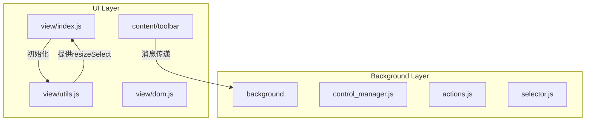
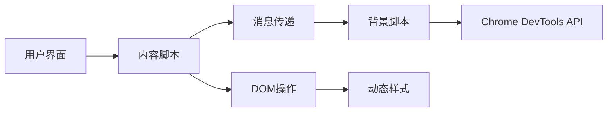
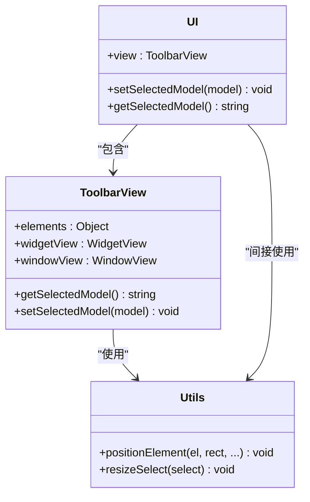
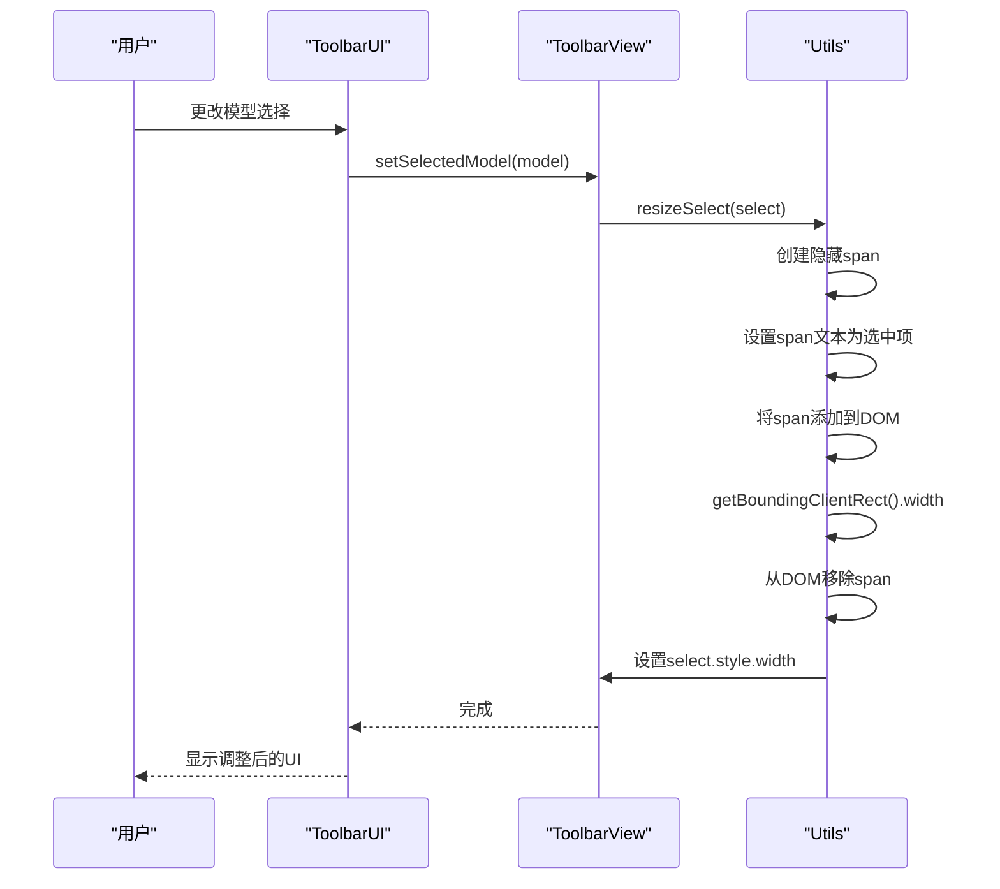
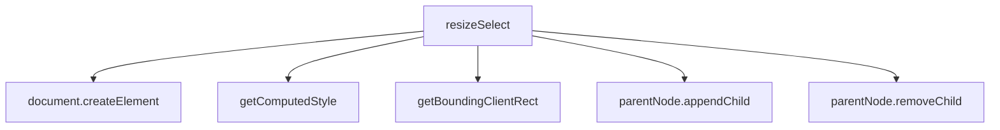

# 模型选择器自动宽度调整

<cite>
**本文档引用的文件**   
- [selector.js](file://background/control/selector.js)
- [selection.js](file://content/selection.js)
- [mouse.js](file://background/control/actions/input/mouse.js)
- [widget.js](file://content/toolbar/view/widget.js)
- [dom.js](file://content/toolbar/view/dom.js)
- [control_manager.js](file://background/managers/control_manager.js)
- [index.js](file://content/toolbar/view/index.js)
- [utils.js](file://content/toolbar/view/utils.js)
- [actions.js](file://background/control/actions.js)
- [manager.js](file://content/toolbar/ui/manager.js)
</cite>

## 目录
1. [简介](#简介)
2. [项目结构](#项目结构)
3. [核心组件](#核心组件)
4. [架构概述](#架构概述)
5. [详细组件分析](#详细组件分析)
6. [依赖分析](#依赖分析)
7. [性能考虑](#性能考虑)
8. [故障排除指南](#故障排除指南)
9. [结论](#结论)
10. [附录](#附录)（如有必要）

## 简介
本文档详细说明了“模型选择器自动宽度调整”功能的实现机制。该功能属于一个浏览器扩展的核心UI组件，旨在根据下拉选项的文本内容动态调整选择器的宽度，以提供更佳的用户体验。系统通过结合DOM操作、事件监听和样式计算来实现这一目标，确保选择器始终能够完整显示当前选中的模型名称。

## 项目结构
该项目采用模块化设计，将功能划分为背景脚本（background）、内容脚本（content）、服务（services）和UI组件（toolbar）等独立模块。`content/toolbar` 目录包含了浮动工具栏和询问窗口的全部UI逻辑，其中 `view` 子目录负责视图的渲染和布局，`utils.js` 文件则提供了关键的自动宽度调整功能。

**Diagram sources**
- [manager.js](file://content/toolbar/ui/manager.js)
- [index.js](file://content/toolbar/view/index.js)
- [utils.js](file://content/toolbar/view/utils.js)

**Section sources**
- [manager.js](file://content/toolbar/ui/manager.js)
- [index.js](file://content/toolbar/view/index.js)
- [utils.js](file://content/toolbar/view/utils.js)

## 核心组件
核心功能围绕 `window.GeminiViewUtils.resizeSelect` 函数展开，该函数通过创建一个隐藏的`span`元素来精确测量文本的渲染宽度，并据此动态设置`select`元素的CSS宽度。此过程在模型选择发生改变时被触发，确保了UI的即时响应。

**Section sources**
- [utils.js](file://content/toolbar/view/utils.js#L105-L123)
- [index.js](file://content/toolbar/view/index.js#L113-L123)

## 架构概述
系统的架构分为三层：UI层负责用户交互和视觉呈现，控制层（background）处理浏览器自动化和状态管理，通信层则通过Chrome扩展的消息机制连接前后端。模型选择器作为UI层的一部分，其宽度调整逻辑完全在内容脚本中执行，不依赖于后台进程。

**Diagram sources**
- [manager.js](file://content/toolbar/ui/manager.js)
- [control_manager.js](file://background/managers/control_manager.js)

## 详细组件分析

### 模型选择器分析
该组件负责管理用户对AI模型的选择，并通过自动宽度调整提升可用性。

#### 对于UI组件：

**Diagram sources**
- [index.js](file://content/toolbar/view/index.js#L8-L132)
- [utils.js](file://content/toolbar/view/utils.js#L10-L125)
- [manager.js](file://content/toolbar/ui/manager.js#L21-L277)

#### 对于事件流组件：

**Diagram sources**
- [manager.js](file://content/toolbar/ui/manager.js#L211-L220)
- [index.js](file://content/toolbar/view/index.js#L113-L123)
- [utils.js](file://content/toolbar/view/utils.js#L105-L123)

### 概念概述
该功能的核心思想是利用浏览器的排版引擎来精确测量文本尺寸。由于直接测量`select`元素内部文本的宽度在CSS中非常困难，因此采用了一个常见的前端技巧：创建一个与目标文本具有相同样式的`span`元素，将其插入DOM（但设置为不可见），然后读取其`offsetWidth`或`getBoundingClientRect()`的值。

**Section sources**
- [utils.js](file://content/toolbar/view/utils.js#L105-L123)

## 依赖分析
`resizeSelect` 功能依赖于 `window.getComputedStyle` 来获取`select`元素的字体样式，以确保测量的`span`与原始文本的渲染效果完全一致。此外，该功能是独立的，不依赖于任何外部库或后台服务，所有计算都在前端完成。

**Diagram sources**
- [utils.js](file://content/toolbar/view/utils.js#L105-L123)

**Section sources**
- [utils.js](file://content/toolbar/view/utils.js#L105-L123)

## 性能考虑
该功能的性能开销极低。每次调用`resizeSelect`时，只会创建和销毁一个DOM元素，并进行一次布局测量。由于这些操作是同步的且只在用户交互后发生，因此不会对主线程造成显著负担。测量过程被优化为只在必要时执行（即模型选择改变时），避免了不必要的重复计算。

## 故障排除指南
如果模型选择器未能正确调整宽度，可能的原因包括：
1.  **元素未找到**：`select`元素的ID可能已更改，导致`cacheElements`失败。
2.  **样式未继承**：`span`的`fontFamily`可能未能正确获取，导致测量不准确。
3.  **DOM未就绪**：在DOM完全加载前调用了`resizeSelect`。

**Section sources**
- [index.js](file://content/toolbar/view/index.js#L20-L22)
- [utils.js](file://content/toolbar/view/utils.js#L106-L107)

## 结论
“模型选择器自动宽度调整”功能通过一个简洁而高效的前端技术实现，显著提升了用户界面的美观度和可用性。该实现展示了如何利用浏览器的原生API来解决复杂的UI布局问题，代码结构清晰，模块化程度高，易于维护和扩展。