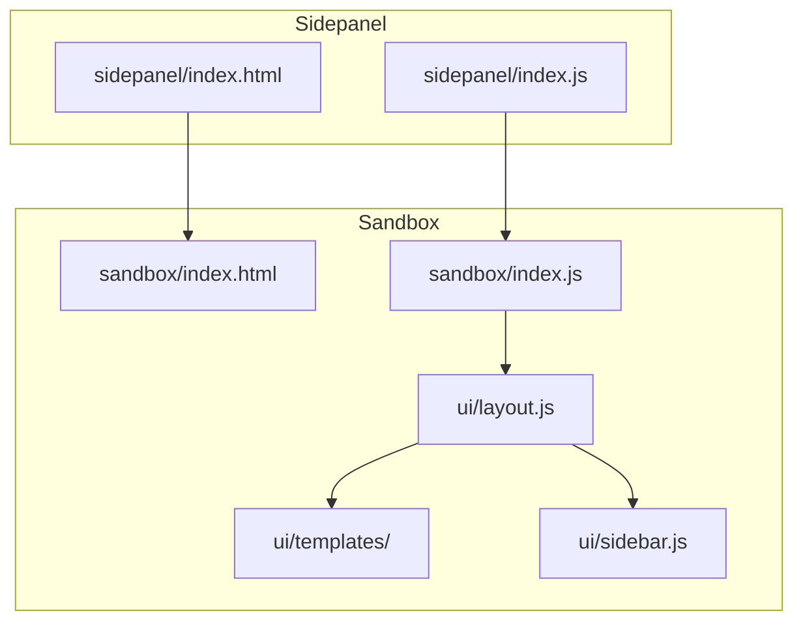
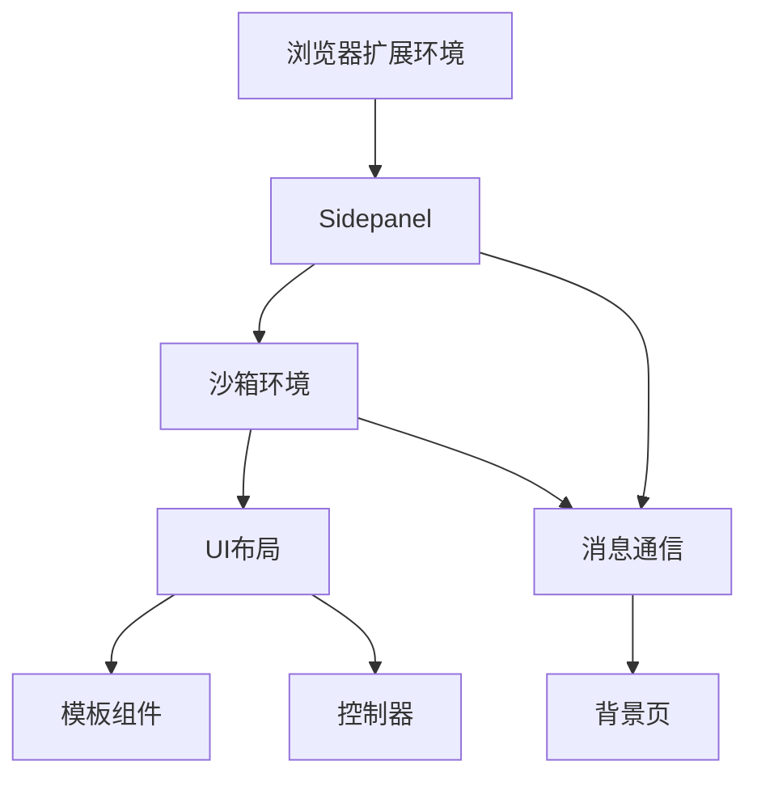
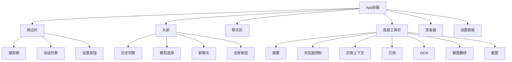
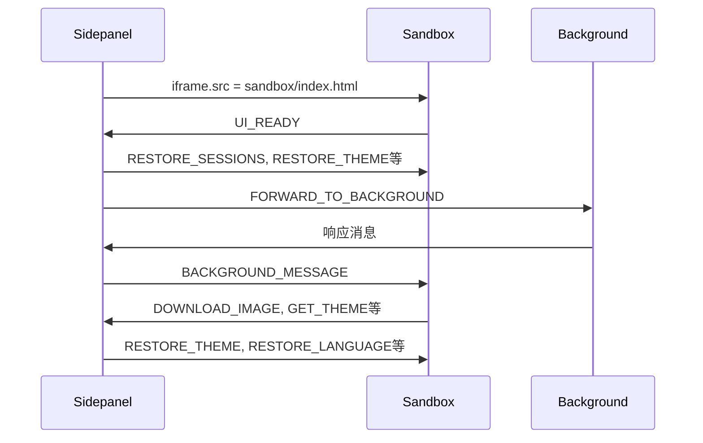
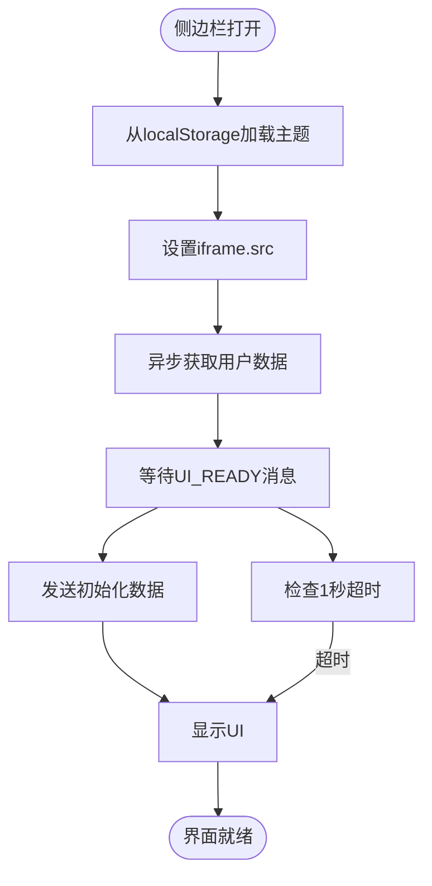
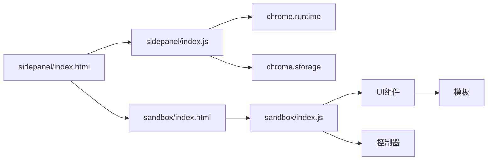

# Sidepanel侧边栏界面

<cite>
**本文档中引用的文件**  
- [sidepanel/index.html](file://sidepanel/index.html)
- [sidepanel/index.js](file://sidepanel/index.js)
- [sandbox/index.html](file://sandbox/index.html)
- [sandbox/index.js](file://sandbox/index.js)
- [sandbox/ui/templates/chat.js](file://sandbox/ui/templates/chat.js)
- [sandbox/ui/templates/sidebar.js](file://sandbox/ui/templates/sidebar.js)
- [sandbox/ui/templates/header.js](file://sandbox/ui/templates/header.js)
- [sandbox/ui/templates/footer.js](file://sandbox/ui/templates/footer.js)
- [sandbox/ui/templates/settings.js](file://sandbox/ui/templates/settings.js)
- [sandbox/ui/templates/viewer.js](file://sandbox/ui/templates/viewer.js)
- [sandbox/ui/layout.js](file://sandbox/ui/layout.js)
- [sandbox/ui/sidebar.js](file://sandbox/ui/sidebar.js)
- [sandbox/boot/messaging.js](file://sandbox/boot/messaging.js)
- [sandbox/theme_init.js](file://sandbox/theme_init.js)
- [manifest.json](file://manifest.json)
</cite>

## 目录
1. [简介](#简介)
2. [项目结构](#项目结构)
3. [核心组件](#核心组件)
4. [架构概述](#架构概述)
5. [详细组件分析](#详细组件分析)
6. [依赖分析](#依赖分析)
7. [性能考虑](#性能考虑)
8. [故障排除指南](#故障排除指南)
9. [结论](#结论)

## 简介
Sidepanel侧边栏是Gemini Nexus扩展的主要用户交互界面，通过Chrome扩展的sidePanel API实现。该界面通过iframe嵌入一个沙箱环境，实现安全的UI渲染和用户交互。侧边栏负责管理沙箱环境的生命周期，包括初始化、通信和状态恢复。它采用优化的加载策略，通过localStorage实现主题和语言的即时加载，确保快速启动体验。侧边栏通过postMessage API与沙箱环境建立双向通信桥梁，转发用户操作并同步状态信息。

## 项目结构
Sidepanel侧边栏的项目结构清晰地分离了界面展示层和业务逻辑层。主入口文件位于sidepanel目录下，而沙箱环境的UI组件则集中在sandbox目录中。这种架构设计实现了安全隔离和模块化开发。

**图示来源**
- [sidepanel/index.html](file://sidepanel/index.html#L1-L129)
- [sidepanel/index.js](file://sidepanel/index.js#L1-L425)
- [sandbox/index.html](file://sandbox/index.html#L1-L28)
- [sandbox/ui/layout.js](file://sandbox/ui/layout.js#L1-L17)

**本节来源**
- [sidepanel/index.html](file://sidepanel/index.html#L1-L129)
- [sidepanel/index.js](file://sidepanel/index.js#L1-L425)
- [sandbox/index.html](file://sandbox/index.html#L1-L28)
- [manifest.json](file://manifest.json#L34-L36)

## 核心组件
Sidepanel侧边栏的核心组件包括HTML骨架、JavaScript通信桥和沙箱环境。index.html文件定义了侧边栏的基本结构，包含一个用于加载沙箱环境的iframe和一个骨架加载器。index.js文件作为通信桥梁，负责初始化沙箱环境、管理消息传递和同步状态。沙箱环境通过sandbox/index.html加载，实现了安全的UI渲染和用户交互。整个系统通过postMessage API实现跨上下文通信，确保了扩展的安全性和稳定性。

**本节来源**
- [sidepanel/index.html](file://sidepanel/index.html#L1-L129)
- [sidepanel/index.js](file://sidepanel/index.js#L1-L425)
- [sandbox/index.html](file://sandbox/index.html#L1-L28)

## 架构概述
Sidepanel侧边栏采用分层架构设计，将界面展示、业务逻辑和数据管理分离。顶层是sidepanel，负责与浏览器扩展环境交互；中间层是沙箱环境，提供安全的UI渲染；底层是各种UI组件和模板。这种架构确保了系统的可维护性和可扩展性。

**图示来源**
- [sidepanel/index.js](file://sidepanel/index.js#L150-L425)
- [sandbox/boot/messaging.js](file://sandbox/boot/messaging.js#L1-L90)
- [manifest.json](file://manifest.json#L6-L14)

## 详细组件分析

### 侧边栏界面结构分析
Sidepanel侧边栏的UI结构由多个模板组件组合而成，包括侧边栏、头部、聊天区、底部工具栏、查看器和设置面板。这些组件通过layout.js统一渲染，形成完整的用户界面。

**图示来源**
- [sandbox/ui/layout.js](file://sandbox/ui/layout.js#L12-L16)
- [sandbox/ui/templates/sidebar.js](file://sandbox/ui/templates/sidebar.js#L1-L24)
- [sandbox/ui/templates/header.js](file://sandbox/ui/templates/header.js#L1-L30)
- [sandbox/ui/templates/chat.js](file://sandbox/ui/templates/chat.js#L1-L4)
- [sandbox/ui/templates/footer.js](file://sandbox/ui/templates/footer.js#L1-L124)

**本节来源**
- [sandbox/ui/layout.js](file://sandbox/ui/layout.js#L1-L17)
- [sandbox/ui/templates/*.js](file://sandbox/ui/templates/)

### 通信机制分析
Sidepanel与沙箱环境之间的通信通过postMessage API实现。sidepanel/index.js监听来自沙箱的消息，并转发到背景页；同时监听来自背景页的消息，并转发到沙箱环境。这种双向通信机制确保了数据的实时同步。

**图示来源**
- [sidepanel/index.js](file://sidepanel/index.js#L150-L425)
- [sandbox/boot/messaging.js](file://sandbox/boot/messaging.js#L1-L90)

**本节来源**
- [sidepanel/index.js](file://sidepanel/index.js#L1-L425)
- [sandbox/boot/messaging.js](file://sandbox/boot/messaging.js#L1-L90)

### 生命周期管理分析
Sidepanel侧边栏的生命周期管理包括打开、关闭和状态恢复。当侧边栏打开时，立即通过localStorage获取缓存的主题和语言设置，实现即时渲染。然后异步获取完整的用户数据并发送到沙箱环境。系统还设置了安全超时机制，确保在通信失败时仍能正常显示界面。

**图示来源**
- [sidepanel/index.js](file://sidepanel/index.js#L7-L147)
- [sandbox/theme_init.js](file://sandbox/theme_init.js#L1-L22)

**本节来源**
- [sidepanel/index.js](file://sidepanel/index.js#L1-L147)
- [sandbox/theme_init.js](file://sandbox/theme_init.js#L1-L22)

## 依赖分析
Sidepanel侧边栏的依赖关系清晰，主要依赖Chrome扩展API和沙箱环境。通过manifest.json配置，sidepanel被指定为默认的侧边栏页面，沙箱环境被正确配置以确保安全执行。

**图示来源**
- [manifest.json](file://manifest.json#L34-L39)
- [sidepanel/index.js](file://sidepanel/index.js#L4-L425)
- [sandbox/index.html](file://sandbox/index.html#L1-L28)

**本节来源**
- [manifest.json](file://manifest.json#L1-L93)
- [sidepanel/index.js](file://sidepanel/index.js#L1-L425)

## 性能考虑
Sidepanel侧边栏在性能方面进行了多项优化。首先，通过localStorage实现主题和语言的同步加载，避免了异步存储查询的延迟。其次，采用骨架屏技术，在内容加载时提供即时的视觉反馈。再者，沙箱环境的资源被并行加载，最大化利用网络带宽。最后，消息队列机制确保了在组件未就绪时消息不会丢失。

## 故障排除指南
当Sidepanel侧边栏出现问题时，可以检查以下几个方面：首先确认manifest.json中的side_panel配置是否正确；其次检查沙箱环境的CSP策略是否允许必要的资源加载；然后验证postMessage通信是否正常；最后检查localStorage和chrome.storage中的数据是否完整。对于加载问题，可以查看控制台是否有跨域或安全策略错误。

**本节来源**
- [sidepanel/index.js](file://sidepanel/index.js#L140-L147)
- [manifest.json](file://manifest.json#L90-L92)
- [sandbox/theme_init.js](file://sandbox/theme_init.js#L1-L22)

## 结论
Sidepanel侧边栏作为Gemini Nexus的核心用户界面，采用了先进的架构设计和优化策略。通过iframe嵌入沙箱环境实现了安全的UI渲染，利用postMessage API建立了可靠的通信桥梁。系统的分层架构和模块化设计确保了良好的可维护性和可扩展性。性能优化措施，如即时主题加载和骨架屏技术，提供了流畅的用户体验。整体设计充分考虑了安全性、性能和用户体验，是一个成熟的浏览器扩展界面实现。