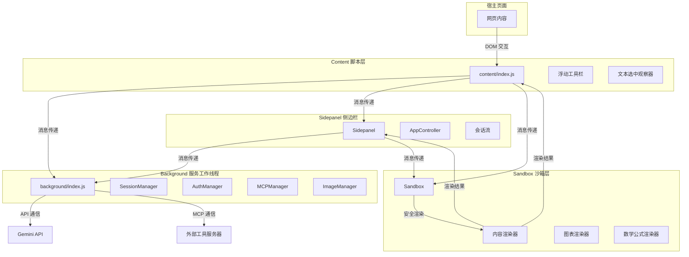
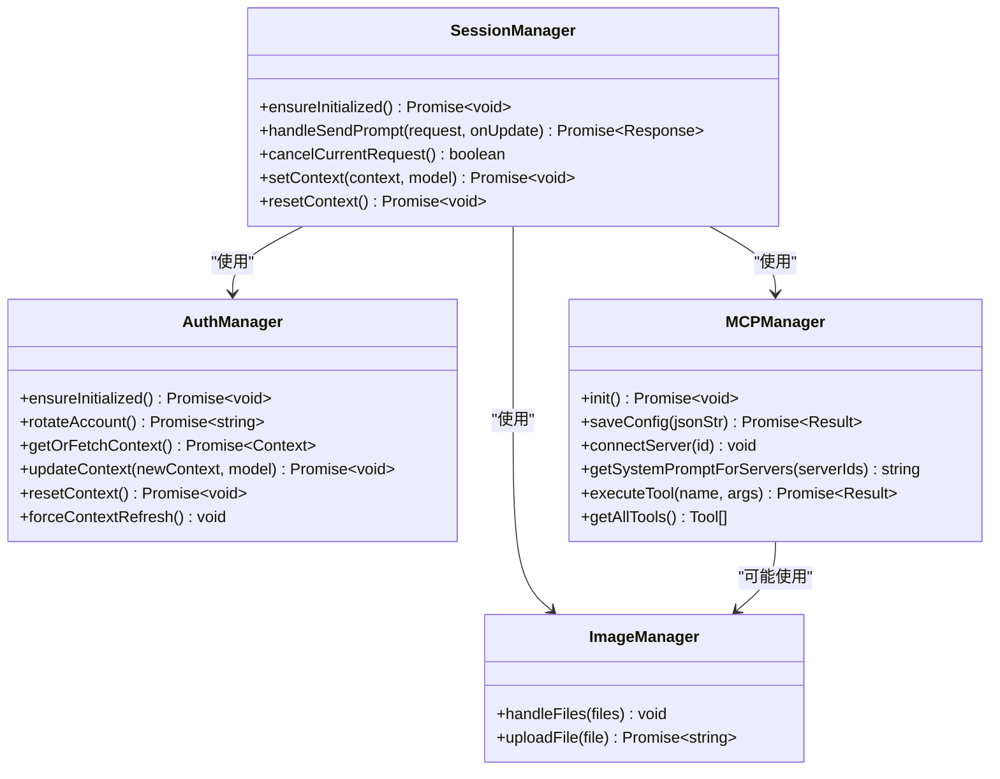
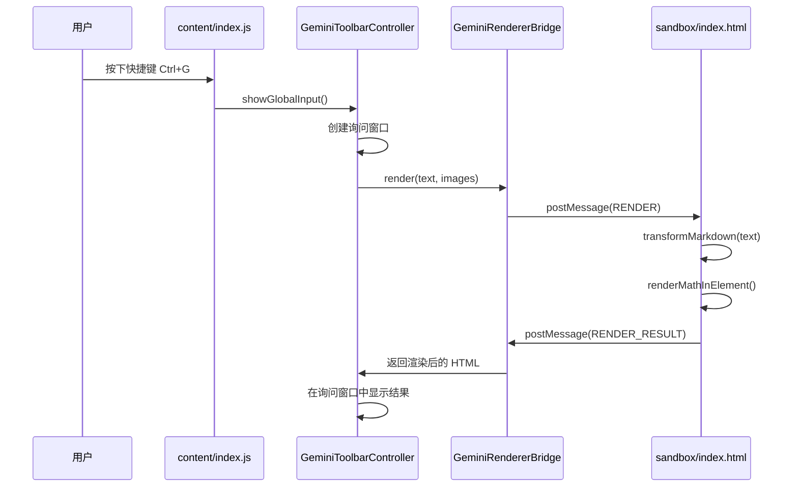
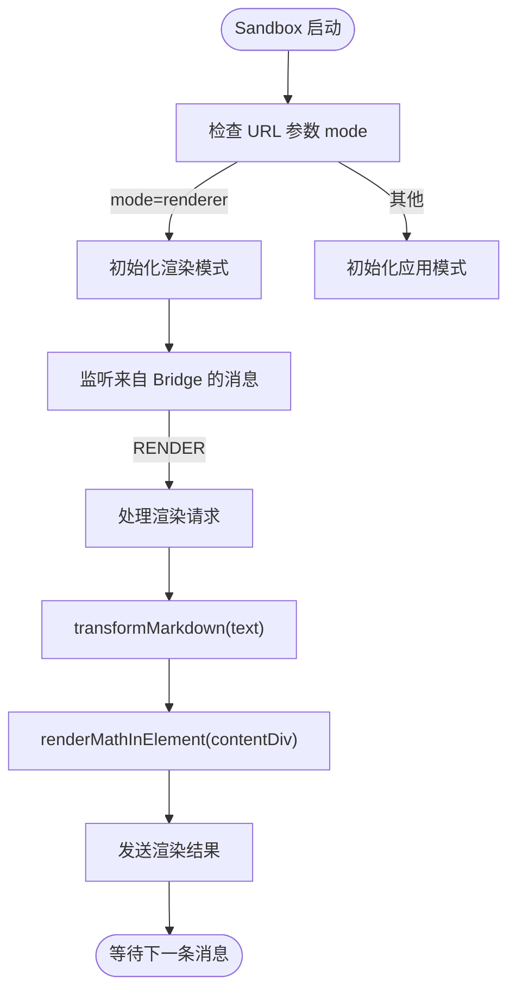
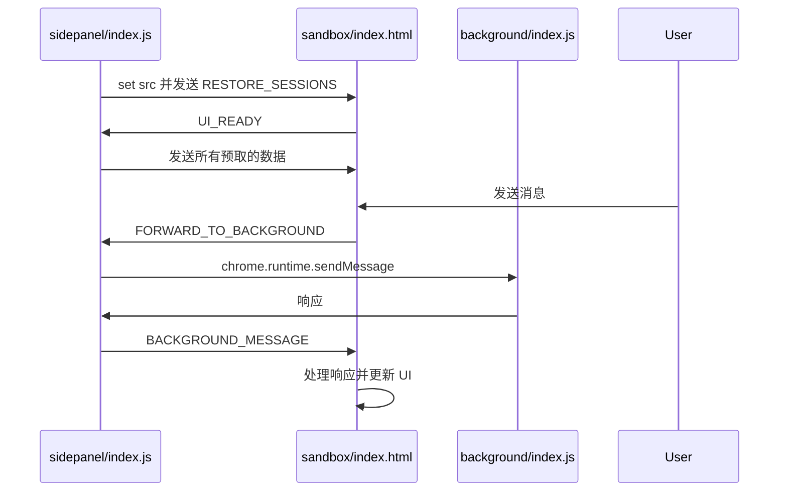
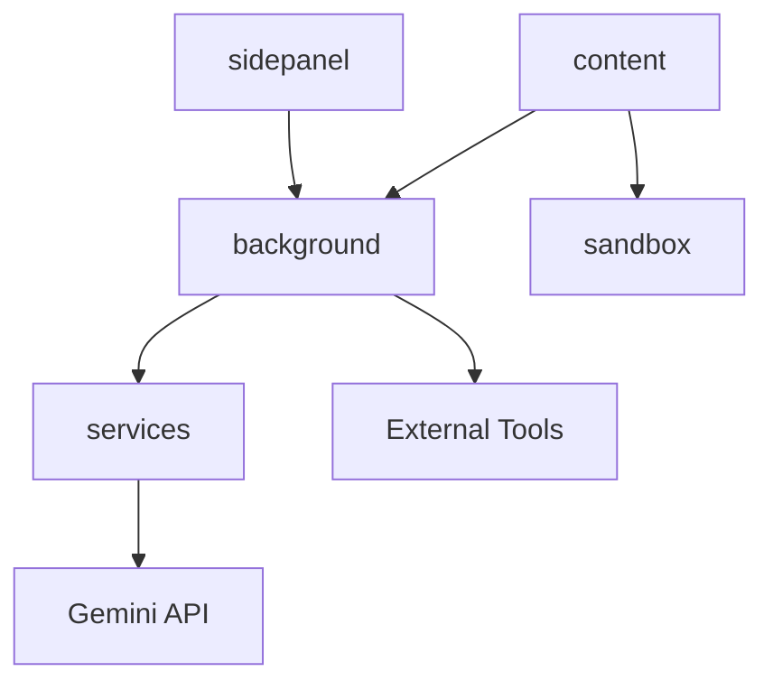

# 整体架构

<cite>
**本文档引用的文件**
- [manifest.json](file://manifest.json)
- [background/index.js](file://background/index.js)
- [background/managers/session_manager.js](file://background/managers/session_manager.js)
- [background/managers/auth_manager.js](file://background/managers/auth_manager.js)
- [background/managers/mcp_manager.js](file://background/managers/mcp_manager.js)
- [background/messages.js](file://background/messages.js)
- [content/index.js](file://content/index.js)
- [content/toolbar/controller.js](file://content/toolbar/controller.js)
- [content/toolbar/ui/manager.js](file://content/toolbar/ui/manager.js)
- [content/toolbar/bridge.js](file://content/toolbar/bridge.js)
- [sandbox/index.js](file://sandbox/index.js)
- [sandbox/controllers/app_controller.js](file://sandbox/controllers/app_controller.js)
- [sandbox/render/content.js](file://sandbox/render/content.js)
- [services/gemini_api.js](file://services/gemini_api.js)
</cite>

## 目录
1. [简介](#简介)
2. [项目结构](#项目结构)
3. [核心组件](#核心组件)
4. [架构概览](#架构概览)
5. [详细组件分析](#详细组件分析)
6. [依赖分析](#依赖分析)
7. [性能考虑](#性能考虑)
8. [故障排除指南](#故障排除指南)
9. [结论](#结论)

## 简介
Gemini Nexus 是一个基于 Chrome 扩展的复杂应用程序，采用分层架构设计，将核心逻辑、用户界面和安全渲染分离到不同的执行环境中。该架构的核心是 background 服务工作线程，它负责管理全局状态、认证、与外部工具（MCP）的集成以及与 Gemini API 的通信。content 脚本层负责与宿主页面进行交互，实现文本选中、DOM 操作和浮动工具栏。sandbox 沙箱环境提供了一个安全的上下文来渲染 AI 生成的内容，包括 Markdown、数学公式和图表。sidepanel 侧边栏则作为主要的用户交互界面。各层之间通过消息传递进行通信，实现了清晰的职责划分和依赖管理。

## 项目结构
Gemini Nexus 的项目结构清晰地反映了其分层架构。主要分为 `background`、`content`、`sandbox` 和 `sidepanel` 四个核心目录，每个目录负责不同的功能。

```mermaid
graph TD
A[项目根目录] --> B[background]
A --> C[content]
A --> D[sandbox]
A --> E[sidepanel]
A --> F[css]
A --> G[lib]
A --> H[services]
A --> I[manifest.json]
B --> B1[managers]
B --> B2[handlers]
B --> B3[control]
B --> B4[index.js]
C --> C1[toolbar]
C --> C2[overlay.js]
C --> C3[selection.js]
C --> C4[index.js]
D --> D1[boot]
D --> D2[controllers]
D --> D3[core]
D --> D4[libs]
D --> D5[render]
D --> D6[ui]
D --> D7[index.html]
D --> D8[index.js]
E --> E1[index.html]
E --> E2[index.js]
F --> F1[base.css]
F --> F2[chat.css]
F --> F3[components.css]
G --> G1[constants.js]
G --> G2[messaging.js]
G --> G3[utils.js]
H --> H1[auth.js]
H --> H2[gemini_api.js]
H --> H3[parser.js]
H --> H4[upload.js]
```

**Diagram sources**
- [manifest.json](file://manifest.json)

**Section sources**
- [manifest.json](file://manifest.json)

## 核心组件
Gemini Nexus 的核心功能由 `background` 目录下的多个管理器（Manager）类实现。`SessionManager` 是系统的核心，负责处理与 Gemini API 的所有通信，管理会话上下文，并协调认证和外部工具集成。`AuthManager` 负责处理用户认证状态，包括多账户管理和会话刷新。`MCPManager` 负责管理与外部工具服务器的连接，支持 Model Context Protocol (MCP)，允许 Gemini 调用外部工具。`ImageManager` 处理图像上传和生成。这些管理器在 `background/index.js` 中被实例化并初始化，构成了整个系统的后端逻辑。

**Section sources**
- [background/index.js](file://background/index.js)
- [background/managers/session_manager.js](file://background/managers/session_manager.js)
- [background/managers/auth_manager.js](file://background/managers/auth_manager.js)
- [background/managers/mcp_manager.js](file://background/managers/mcp_manager.js)

## 架构概览
Gemini Nexus 的架构是一个典型的分层客户端-服务端模型，其中 Chrome 扩展的各个部分扮演着不同的角色。

**Diagram sources**
- [manifest.json](file://manifest.json)
- [background/index.js](file://background/index.js)
- [content/index.js](file://content/index.js)
- [sandbox/index.js](file://sandbox/index.js)
- [sidepanel/index.js](file://sidepanel/index.js)

## 详细组件分析

### Background 服务工作线程分析
`background/index.js` 是整个系统的入口点。它首先设置侧边栏行为，然后导入并实例化所有核心管理器，包括 `SessionManager`、`AuthManager`、`MCPManager` 等。初始化完成后，它调用 `mcpManager.init()` 来建立与外部工具的连接，并通过 `setupMessageListener` 设置全局消息监听器，使 background 层能够接收来自 content 脚本和 sidepanel 的请求。

**Diagram sources**
- [background/index.js](file://background/index.js#L1-L30)
- [background/managers/session_manager.js](file://background/managers/session_manager.js)
- [background/managers/auth_manager.js](file://background/managers/auth_manager.js)
- [background/managers/mcp_manager.js](file://background/managers/mcp_manager.js)

**Section sources**
- [background/index.js](file://background/index.js#L1-L30)
- [background/managers/session_manager.js](file://background/managers/session_manager.js)
- [background/managers/auth_manager.js](file://background/managers/auth_manager.js)
- [background/managers/mcp_manager.js](file://background/managers/mcp_manager.js)

### Content 脚本层分析
`content/index.js` 是 content 脚本的主入口。它负责监听来自 background 和用户操作的消息。例如，当收到 `START_SELECTION` 消息时，它会启动选中模式并隐藏浮动 UI 以防止被截取。`content/toolbar/controller.js` 是浮动工具栏的控制器，它协调 UI、动作和消息传递。`content/toolbar/bridge.js` 是一个关键组件，它创建一个指向 sandbox 的 iframe，用于在安全的沙箱环境中渲染内容或处理图像。

**Diagram sources**
- [content/index.js](file://content/index.js)
- [content/toolbar/controller.js](file://content/toolbar/controller.js)
- [content/toolbar/bridge.js](file://content/toolbar/bridge.js)
- [sandbox/index.js](file://sandbox/index.js)

**Section sources**
- [content/index.js](file://content/index.js)
- [content/toolbar/controller.js](file://content/toolbar/controller.js)
- [content/toolbar/bridge.js](file://content/toolbar/bridge.js)

### Sandbox 沙箱环境分析
`sandbox/index.js` 根据 URL 参数决定启动模式。如果 `mode=renderer`，则初始化为渲染模式，用于处理来自 content 脚本的渲染请求。否则，启动为应用模式，作为 sidepanel 的 iframe 内容。`sandbox/render/content.js` 中的 `renderContent` 函数是渲染的核心，它使用 `transformMarkdown` 函数处理 Markdown，并调用 `renderMathInElement` 来渲染数学公式。

**Diagram sources**
- [sandbox/index.js](file://sandbox/index.js)
- [sandbox/render/content.js](file://sandbox/render/content.js)

**Section sources**
- [sandbox/index.js](file://sandbox/index.js)
- [sandbox/render/content.js](file://sandbox/render/content.js)

### Sidepanel 侧边栏分析
`sidepanel/index.js` 充当了 sidepanel UI 和 background 逻辑之间的桥梁。它通过 `postMessage` 将预取的会话数据、快捷键等配置信息发送给 sandbox 中的 iframe。它还监听来自 background 的消息，并将其转发给 sandbox，反之亦然。`sandbox/controllers/app_controller.js` 是 sidepanel 应用的主要控制器，它管理会话流、处理用户输入，并与 background 层通信。

**Diagram sources**
- [sidepanel/index.js](file://sidepanel/index.js)
- [sandbox/controllers/app_controller.js](file://sandbox/controllers/app_controller.js)

**Section sources**
- [sidepanel/index.js](file://sidepanel/index.js)
- [sandbox/controllers/app_controller.js](file://sandbox/controllers/app_controller.js)

## 依赖分析
Gemini Nexus 的依赖关系清晰地体现了其分层设计。`background` 层是核心，`content` 和 `sidepanel` 层都依赖于它来处理核心逻辑。`content` 层通过 `bridge.js` 依赖 `sandbox` 层进行安全渲染。`sandbox` 层本身不直接依赖 `background`，而是通过 `sidepanel` 或 `content` 作为中介进行通信。`services` 目录下的模块（如 `gemini_api.js`）被 `background` 层的管理器所依赖，用于与外部 API 交互。

**Diagram sources**
- [manifest.json](file://manifest.json)
- [background/index.js](file://background/index.js)
- [content/index.js](file://content/index.js)
- [sidepanel/index.js](file://sidepanel/index.js)

**Section sources**
- [manifest.json](file://manifest.json)
- [background/index.js](file://background/index.js)
- [content/index.js](file://content/index.js)
- [sidepanel/index.js](file://sidepanel/index.js)

## 性能考虑
Gemini Nexus 在性能方面进行了多项优化。`sidepanel/index.js` 使用 `localStorage` 进行主题和语言的同步加载，避免了异步 `chrome.storage` 调用造成的延迟。`content/index.js` 中的快捷键匹配逻辑是同步的，确保了快速响应。`services/gemini_api.js` 中的文件上传是并行处理的，提高了效率。`sandbox` 的渲染模式允许在不加载完整应用的情况下进行轻量级渲染，减少了资源消耗。

## 故障排除指南
当遇到问题时，可以检查以下方面：
1.  **认证失败**：检查 `AuthManager` 的日志，确认是否因会话过期而触发了账户轮换。
2.  **消息传递失败**：确保 `content`、`sidepanel` 和 `background` 之间的消息格式正确，特别是 `action` 字段。
3.  **渲染问题**：检查 `sandbox` 的 iframe 是否正确加载，以及 `postMessage` 通信是否正常。
4.  **MCP 连接问题**：使用 `MCPManager` 的调试信息来检查服务器连接状态和工具列表。

**Section sources**
- [background/managers/auth_manager.js](file://background/managers/auth_manager.js)
- [background/messages.js](file://background/messages.js)
- [content/toolbar/bridge.js](file://content/toolbar/bridge.js)
- [background/managers/mcp_manager.js](file://background/managers/mcp_manager.js)

## 结论
Gemini Nexus 通过精心设计的分层架构，成功地将一个复杂的 AI 助手功能集成到了 Chrome 扩展中。`background` 服务工作线程作为系统的心脏，`content` 脚本桥接了扩展与网页，`sandbox` 提供了安全的渲染环境，而 `sidepanel` 则提供了丰富的用户界面。这种架构不仅保证了安全性，也使得代码结构清晰，易于维护和扩展。