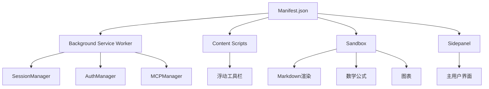
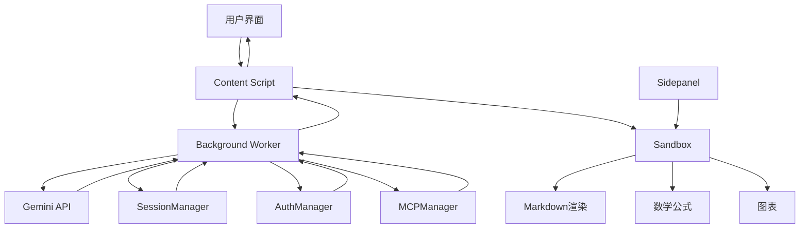
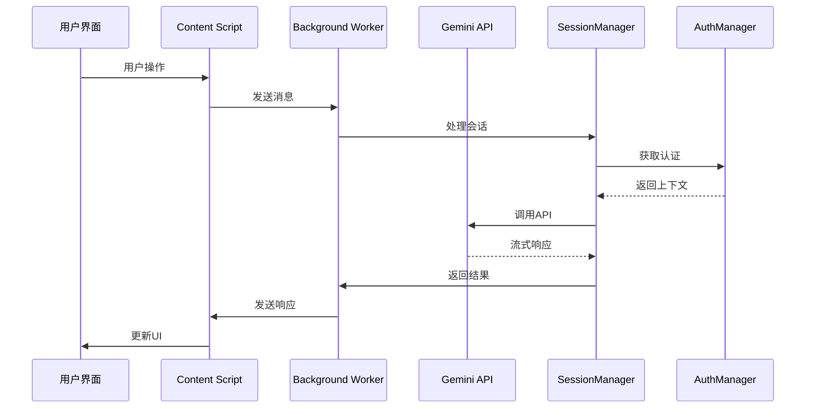

# 架构设计

<cite>
**本文档引用的文件**  
- [manifest.json](file://manifest.json)
- [README.md](file://README.md)
- [background/index.js](file://background/index.js)
- [content/index.js](file://content/index.js)
- [sandbox/index.js](file://sandbox/index.js)
- [sidepanel/index.js](file://sidepanel/index.js)
- [background/managers/session_manager.js](file://background/managers/session_manager.js)
- [background/managers/auth_manager.js](file://background/managers/auth_manager.js)
- [background/messages.js](file://background/messages.js)
- [lib/messaging.js](file://lib/messaging.js)
- [content/toolbar/bridge.js](file://content/toolbar/bridge.js)
- [sandbox/boot/messaging.js](file://sandbox/boot/messaging.js)
- [sandbox/controllers/session_flow.js](file://sandbox/controllers/session_flow.js)
- [services/gemini_api.js](file://services/gemini_api.js)
- [content/toolbar/controller.js](file://content/toolbar/controller.js)
- [sandbox/render/pipeline.js](file://sandbox/render/pipeline.js)
- [background/managers/mcp_manager.js](file://background/managers/mcp_manager.js)
</cite>

## 目录
1. [分层架构概览](#分层架构概览)
2. [核心组件分析](#核心组件分析)
3. [消息传递机制](#消息传递机制)
4. [数据流与用户交互路径](#数据流与用户交互路径)
5. [管理器模式设计](#管理器模式设计)
6. [安全模型](#安全模型)
7. [组件关系图](#组件关系图)
8. [数据流图](#数据流图)

## 分层架构概览

Gemini Nexus 采用典型的 Chrome 扩展分层架构，由四个核心部分组成：background 服务工作线程、content 脚本、sandbox 沙箱环境和 sidepanel 侧边栏。该架构通过 manifest.json 文件定义，其中 background 作为 service worker 管理全局状态和 API 通信，content 脚本注入页面实现 DOM 交互，sandbox 提供安全的渲染环境，sidepanel 作为主用户界面。

**图源**  
- [manifest.json](file://manifest.json#L1-L93)
- [README.md](file://README.md#L50-L66)

## 核心组件分析

### Background 服务工作线程

background 服务工作线程是系统的“大脑”，负责管理会话、认证和全局状态。它通过 service worker 实现，确保在浏览器后台持续运行。index.js 文件初始化了多个管理器，包括 SessionManager、AuthManager 和 MCPManager，这些管理器协同工作以处理 AI 通信和状态管理。

**组件源**  
- [background/index.js](file://background/index.js#L1-L30)

### Content 脚本

content 脚本负责注入页面并实现 DOM 交互。它通过 content_scripts 配置在所有 URL 上运行，主要功能包括显示浮动工具栏、处理用户选择和与 background 通信。index.js 文件监听消息并响应来自右键菜单、快捷键等的指令。

**组件源**  
- [content/index.js](file://content/index.js#L1-L190)

### Sandbox 沙箱环境

sandbox 沙箱环境用于安全地渲染 Markdown、数学公式和图表。它通过 manifest.json 中的 sandbox 配置隔离运行，防止潜在的安全风险。index.js 文件根据查询参数初始化渲染模式或应用模式。

**组件源**  
- [sandbox/index.js](file://sandbox/index.js#L1-L12)

### Sidepanel 侧边栏

sidepanel 侧边栏提供主用户界面，允许用户与 Gemini 进行对话。它通过 manifest.json 中的 side_panel 配置定义，默认路径为 sidepanel/index.html。该组件通过 postMessage 与 sandbox 通信，实现数据同步和 UI 更新。

**组件源**  
- [sidepanel/index.js](file://sidepanel/index.js#L1-L425)

## 消息传递机制

Gemini Nexus 采用基于 chrome.runtime.sendMessage 的事件驱动消息传递机制，实现跨上下文通信。该机制包括消息格式、通道管理和通信流程。

### 消息格式

消息格式遵循 {action: string, payload: any} 的结构，其中 action 定义操作类型，payload 携带数据。例如，content 脚本发送 "OPEN_SIDE_PANEL" 消息以打开侧边栏。

### 通道管理

系统使用多种通信通道：
- chrome.runtime.sendMessage：用于 content 脚本与 background 之间的通信
- window.postMessage：用于 sidepanel 与 sandbox 之间的通信
- iframe.postMessage：用于 content 脚本与 sandbox 之间的通信

### 跨上下文通信流程

通信流程从用户操作开始，经过 content 脚本转发到 background，再由 background 处理并返回结果。例如，用户点击浮动工具栏按钮，content 脚本发送消息到 background，background 调用 Gemini API 并将结果返回给 content 脚本。

**组件源**  
- [background/messages.js](file://background/messages.js#L1-L82)
- [lib/messaging.js](file://lib/messaging.js#L1-L96)
- [content/toolbar/bridge.js](file://content/toolbar/bridge.js#L1-L66)

## 数据流与用户交互路径

从用户操作到 AI 响应的完整路径如下：用户界面 → content script → background worker → Gemini API → 返回处理 → UI 更新。

### 用户界面

用户通过浮动工具栏或侧边栏发起请求。content 脚本监听用户操作，如文本选择或按钮点击。

### Content Script

content 脚本捕获用户操作，构造消息并通过 chrome.runtime.sendMessage 发送到 background。

### Background Worker

background worker 接收消息，由 SessionManager 处理会话逻辑，AuthManager 管理认证，最终调用 Gemini API。

### Gemini API

Gemini API 服务发送请求到 Google Gemini，接收流式响应并解析结果。

### 返回处理

background worker 将 AI 响应通过消息传递机制返回给 content 脚本或 sidepanel。

### UI 更新

content 脚本或 sidepanel 接收响应，更新 UI 显示 AI 生成的内容。

**组件源**  
- [services/gemini_api.js](file://services/gemini_api.js#L1-L230)
- [background/managers/session_manager.js](file://background/managers/session_manager.js#L1-L285)

## 管理器模式设计

系统采用 Manager 模式进行模块化组织，包括 SessionManager、AuthManager 和 MCPManager。这种设计决策提高了代码的可维护性和可扩展性。

### SessionManager

SessionManager 管理会话状态，处理发送提示、更新上下文和重置会话。它与 AuthManager 协同工作，确保会话的连续性。

### AuthManager

AuthManager 管理用户认证，包括获取和刷新认证上下文、旋转账户和检查模型变更。它确保系统始终使用有效的认证信息。

### MCPManager

MCPManager 管理 Model Context Protocol 服务器，支持工具调用和扩展功能。它允许系统与外部服务集成，增强 AI 的能力。

**组件源**  
- [background/managers/session_manager.js](file://background/managers/session_manager.js#L1-L285)
- [background/managers/auth_manager.js](file://background/managers/auth_manager.js#L1-L130)
- [background/managers/mcp_manager.js](file://background/managers/mcp_manager.js#L1-L530)

## 安全模型

系统采用多层次安全模型，包括沙箱隔离、权限控制和敏感数据处理策略。

### 沙箱隔离

sandbox 环境通过 manifest.json 中的 sandbox 配置隔离运行，限制脚本执行和资源访问，防止恶意代码注入。

### 权限控制

manifest.json 中的 permissions 和 host_permissions 字段定义了扩展所需的权限，确保最小权限原则。

### 敏感数据处理

敏感数据如认证令牌存储在 chrome.storage.local 中，并通过加密保护。系统在不需要时清除上下文，减少数据泄露风险。

**组件源**  
- [manifest.json](file://manifest.json#L6-L9)
- [background/managers/auth_manager.js](file://background/managers/auth_manager.js#L1-L130)

## 组件关系图

**图源**  
- [background/index.js](file://background/index.js#L4-L21)
- [content/index.js](file://content/index.js#L19-L111)
- [sidepanel/index.js](file://sidepanel/index.js#L150-L425)

## 数据流图

**图源**  
- [background/messages.js](file://background/messages.js#L22-L82)
- [services/gemini_api.js](file://services/gemini_api.js#L1-L230)
- [content/index.js](file://content/index.js#L19-L111)