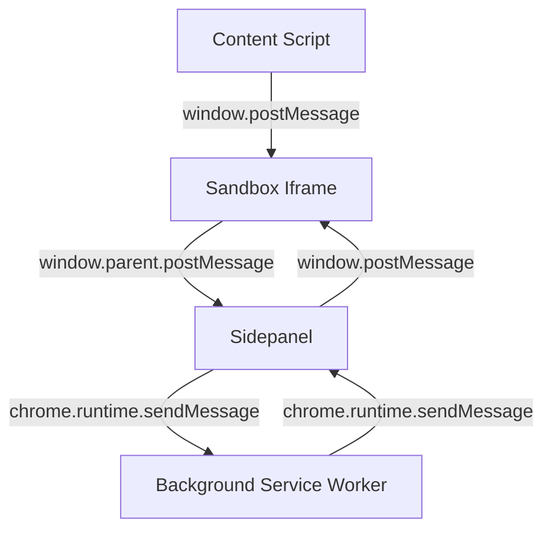
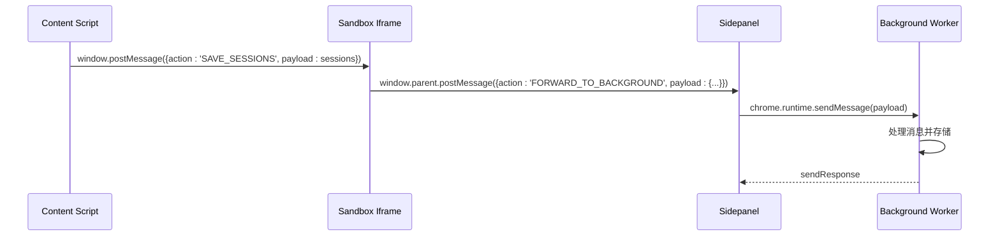
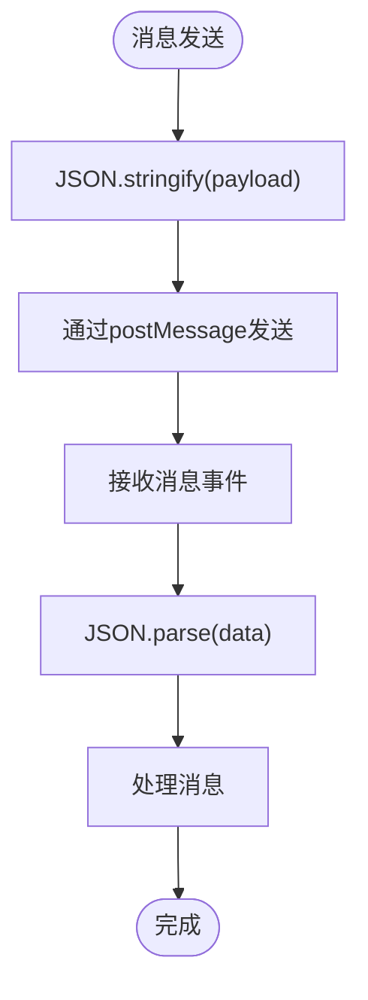
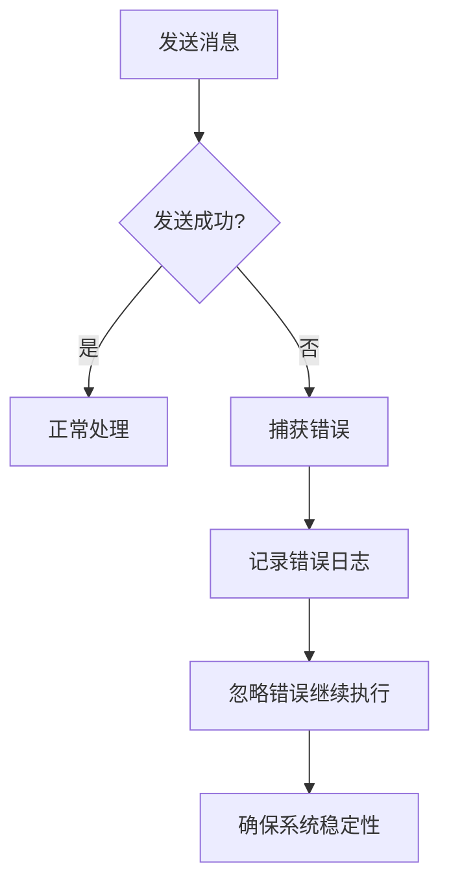
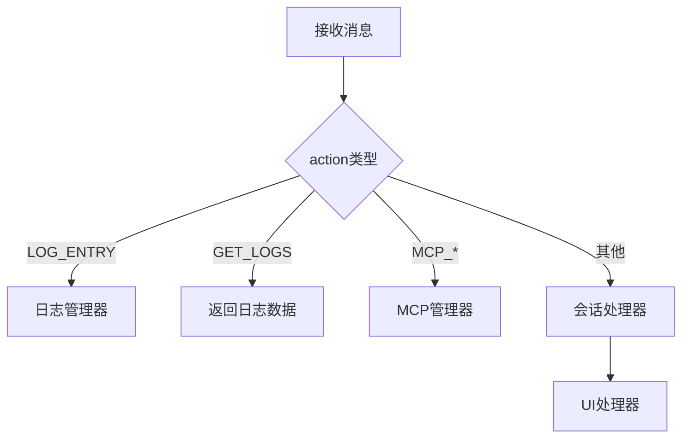

# 消息格式规范

<cite>
**本文档引用的文件**
- [messaging.js](file://lib/messaging.js)
- [messages.js](file://background/messages.js)
- [bridge.js](file://content/toolbar/bridge.js)
- [app_controller.js](file://sandbox/controllers/app_controller.js)
- [sidepanel/index.js](file://sidepanel/index.js)
- [logger.js](file://lib/logger.js)
</cite>

## 目录
1. [简介](#简介)
2. [消息结构定义](#消息结构定义)
3. [消息传递机制](#消息传递机制)
4. [核心消息流程示例](#核心消息流程示例)
5. [消息序列化与反序列化](#消息序列化与反序列化)
6. [错误处理策略](#错误处理策略)
7. [消息路由机制](#消息路由机制)

## 简介
Gemini Nexus 扩展采用分层消息传递架构，实现 content script、sandbox iframe 和 background service worker 之间的通信。本规范详细说明了通用消息结构、双层传递机制和错误处理策略。

**Section sources**
- [messaging.js](file://lib/messaging.js#L1-L96)
- [messages.js](file://background/messages.js#L1-L82)

## 消息结构定义
所有组件间通信的消息遵循统一的结构，包含三个核心字段：

- **action**: 字符串类型，标识消息类型和处理逻辑
- **payload**: 任意类型，携带具体数据内容
- **tabId**: 可选字段，标识消息来源标签页

消息结构示例：
```json
{
  "action": "SAVE_SESSIONS",
  "payload": [...],
  "tabId": "tab_123"
}
```

**Section sources**
- [messaging.js](file://lib/messaging.js#L4-L96)
- [messages.js](file://background/messages.js#L22-L79)

## 消息传递机制
系统采用双层消息传递机制，结合 `window.postMessage` 和 `chrome.runtime.sendMessage` 实现跨上下文通信。



**Diagram sources**
- [bridge.js](file://content/toolbar/bridge.js#L20-L37)
- [sidepanel/index.js](file://sidepanel/index.js#L180-L195)

## 核心消息流程示例
以 `saveSessionsToStorage` 为例，说明消息从封装到处理的完整流程。



**Diagram sources**
- [messaging.js](file://lib/messaging.js#L11-L16)
- [sidepanel/index.js](file://sidepanel/index.js#L180-L195)
- [messages.js](file://background/messages.js#L22-L79)

**Section sources**
- [messaging.js](file://lib/messaging.js#L11-L16)
- [sidepanel/index.js](file://sidepanel/index.js#L180-L195)

## 消息序列化与反序列化
消息在传递过程中需要进行序列化处理，确保数据完整性。



**Diagram sources**
- [logger.js](file://lib/logger.js#L18-L19)
- [messaging.js](file://lib/messaging.js#L5-L8)

## 错误处理策略
系统采用多层次错误处理机制，确保消息传递的可靠性。



**Diagram sources**
- [messages.js](file://background/messages.js#L34-L37)
- [logger.js](file://lib/logger.js#L35-L37)

**Section sources**
- [messages.js](file://background/messages.js#L34-L37)
- [logger.js](file://lib/logger.js#L35-L37)

## 消息路由机制
Background Service Worker 中的消息监听器根据 action 字段进行路由分发。



**Diagram sources**
- [messages.js](file://background/messages.js#L25-L78)
- [session.js](file://background/handlers/session.js#L15-L53)

**Section sources**
- [messages.js](file://background/messages.js#L25-L78)
- [session.js](file://background/handlers/session.js#L15-L53)