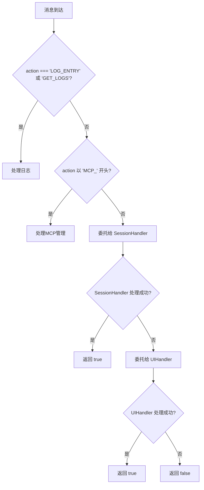

# 消息类型参考

<cite>
**本文档中引用的文件**
- [messages.js](file://background/messages.js)
- [messaging.js](file://lib/messaging.js)
- [session.js](file://background/handlers/session.js)
- [ui.js](file://background/handlers/ui.js)
- [mcp_manager.js](file://background/managers/mcp_manager.js)
- [stream.js](file://content/toolbar/stream.js)
- [prompt_handler.js](file://background/handlers/session/prompt_handler.js)
- [quick_ask_handler.js](file://background/handlers/session/quick_ask_handler.js)
- [session_manager.js](file://background/managers/session_manager.js)
- [sandbox/boot/messaging.js](file://sandbox/boot/messaging.js)
</cite>

## 目录
1. [介绍](#介绍)
2. [存储操作](#存储操作)
3. [MCP管理](#mcp管理)
4. [会话与UI控制](#会话与ui控制)
5. [消息处理流程](#消息处理流程)

## 介绍
本参考文档系统化地分类并列出Gemini Nexus扩展中所有支持的消息action类型。消息系统是扩展的核心通信机制，连接内容脚本、沙箱环境和后台服务。消息分为三类：存储操作、MCP管理以及会话与UI控制。每类消息都有明确的发送方、接收方、payload结构和响应要求。本文档基于`background/messages.js`中的`setupMessageListener`逻辑，详细说明每个action的处理流程和业务含义。

**Section sources**
- [messages.js](file://background/messages.js#L1-L82)

## 存储操作
存储操作类消息用于在扩展的持久化存储（chrome.storage.local）中保存和读取用户配置与状态数据。这些消息由前端界面（如沙箱中的UI）发起，通过`lib/messaging.js`中的工具函数发送到后台，由后台的`messages.js`监听器处理。

### SAVE_SESSIONS
- **发送方**: 沙箱环境 (Sandbox)
- **接收方**: 后台脚本 (Background)
- **Payload结构**: 包含会话数据的JavaScript对象数组
- **需要响应**: 否
- **业务含义**: 将当前的会话列表保存到本地存储中，实现会话状态的持久化。

### SAVE_SHORTCUTS
- **发送方**: 沙箱环境 (Sandbox)
- **接收方**: 后台脚本 (Background)
- **Payload结构**: 包含快捷键配置的JavaScript对象
- **需要响应**: 否
- **业务含义**: 保存用户自定义的快捷键设置。

### GET_THEME
- **发送方**: 沙箱环境 (Sandbox)
- **接收方**: 后台脚本 (Background)
- **Payload结构**: 无
- **需要响应**: 是
- **响应格式**: 无直接响应，后台通过`RESTORE_THEME`消息将主题数据发送回沙箱。
- **业务含义**: 请求当前的主题设置。

### SAVE_THEME
- **发送方**: 沙箱环境 (Sandbox)
- **接收方**: 后台脚本 (Background)
- **Payload结构**: 字符串，表示主题名称（如 "dark", "light"）
- **需要响应**: 否
- **业务含义**: 保存用户选择的主题。

### GET_LANGUAGE
- **发送方**: 沙箱环境 (Sandbox)
- **接收方**: 后台脚本 (Background)
- **Payload结构**: 无
- **需要响应**: 是
- **响应格式**: 无直接响应，后台通过`RESTORE_LANGUAGE`消息将语言设置发送回沙箱。
- **业务含义**: 请求当前的界面语言设置。

### SAVE_LANGUAGE
- **发送方**: 沙箱环境 (Sandbox)
- **接收方**: 后台脚本 (Background)
- **Payload结构**: 字符串，表示语言代码（如 "zh", "en"）
- **需要响应**: 否
- **业务含义**: 保存用户选择的界面语言。

### 其他存储操作
还包括`SAVE_TEXT_SELECTION`, `GET_TEXT_SELECTION`, `SAVE_IMAGE_TOOLS`, `GET_IMAGE_TOOLS`, `SAVE_SIDEBAR_BEHAVIOR`, `GET_ACCOUNT_INDICES`, `SAVE_ACCOUNT_INDICES`, `GET_GEM_ID`, `SAVE_GEM_ID`等，它们的模式与上述类似，用于管理各种用户偏好设置。

**Section sources**
- [messaging.js](file://lib/messaging.js#L11-L96)
- [sandbox/boot/messaging.js](file://sandbox/boot/messaging.js#L49-L85)

## MCP管理
MCP（Model Context Protocol）管理类消息用于配置、查询和监控外部MCP服务器。这些消息直接由后台脚本处理，不经过会话或UI处理器。

### MCP_SAVE_CONFIG
- **发送方**: 任何组件（通常为沙箱UI）
- **接收方**: 后台脚本 (Background)
- **Payload结构**: 包含MCP服务器配置的JSON字符串
- **需要响应**: 是
- **响应格式**: `{ success: boolean, error?: string }`
- **业务含义**: 保存MCP服务器的配置。成功后会重新加载配置并连接服务器。

### MCP_GET_CONFIG
- **发送方**: 任何组件（通常为沙箱UI）
- **接收方**: 后台脚本 (Background)
- **Payload结构**: 无
- **需要响应**: 是
- **响应格式**: 一个包含`mcpConfig`的JSON字符串
- **业务含义**: 获取当前保存的MCP服务器配置。

### MCP_GET_TOOLS
- **发送方**: 任何组件（通常为沙箱UI）
- **接收方**: 后台脚本 (Background)
- **Payload结构**: 无
- **需要响应**: 是
- **响应格式**: `{ tools: Array }`，包含所有已连接服务器的工具列表
- **业务含义**: 获取所有已连接MCP服务器上可用的工具列表。

### MCP_GET_STATUS
- **发送方**: 任何组件（通常为沙箱UI）
- **接收方**: 后台脚本 (Background)
- **Payload结构**: 无
- **需要响应**: 是
- **响应格式**: `{ servers: Object }`，对象的键为服务器ID，值为包含状态、类型、URL、工具数量等信息的对象。
- **业务含义**: 获取所有MCP服务器的连接状态和调试信息。

**Section sources**
- [messages.js](file://background/messages.js#L42-L67)
- [mcp_manager.js](file://background/managers/mcp_manager.js#L39-L403)

## 会话与UI控制
会话与UI控制类消息用于驱动核心的AI交互流程和用户界面行为。这些消息由`SessionMessageHandler`和`UIMessageHandler`处理。

### SEND_PROMPT
- **发送方**: 内容脚本 (Content Script) 或沙箱
- **接收方**: 后台脚本 (Background)
- **Payload结构**: 包含`prompt`（用户输入）、`context`（上下文ID）、`model`（模型选择）等字段的对象
- **需要响应**: 是（异步）
- **响应格式**: 无直接响应，处理结果通过`GEMINI_REPLY`或`GEMINI_STREAM_UPDATE`等消息返回。
- **业务含义**: 发送一个用户查询给Gemini API进行处理。

### GEMINI_REPLY
- **发送方**: 后台脚本 (Background)
- **接收方**: 内容脚本 (Content Script) 或沙箱
- **Payload结构**: 包含`text`（回复文本）、`thoughts`（思考过程）、`images`（生成的图片）、`status`（状态）等字段的对象
- **需要响应**: 否
- **业务含义**: 在流式响应完成后，发送最终的回复结果。

### GEMINI_STREAM_UPDATE
- **发送方**: 后台脚本 (Background)
- **接收方**: 内容脚本 (Content Script) 或沙箱
- **Payload结构**: 包含`text`（增量文本）的字符串
- **需要响应**: 否
- **业务含义**: 流式传输Gemini的回复，实现逐字输出效果。

### GEMINI_STREAM_DONE
- **发送方**: 后台脚本 (Background)
- **接收方**: 内容脚本 (Content Script) 或沙箱
- **Payload结构**: 包含`result`（最终结果对象）和`sessionId`（会话ID）的对象
- **需要响应**: 否
- **业务含义**: 标志流式响应的结束，并传递最终结果和会话ID。

### CANCEL_PROMPT
- **发送方**: 内容脚本 (Content Script)
- **接收方**: 后台脚本 (Background)
- **Payload结构**: 无
- **需要响应**: 是
- **响应格式**: `{ status: "cancelled" | "no_active_request" }`
- **业务含义**: 取消当前正在进行的API请求。

### QUICK_ASK
- **发送方**: 内容脚本 (Content Script)
- **接收方**: 后台脚本 (Background)
- **Payload结构**: 包含`selection`（选中文本）的对象
- **需要响应**: 是（异步）
- **响应格式**: `{ status: "completed" }`
- **业务含义**: 对页面上的选中文本执行快速提问。

### OPEN_SIDE_PANEL
- **发送方**: 内容脚本 (Content Script)
- **接收方**: 后台脚本 (Background)
- **Payload结构**: 可选的`sessionId`（会话ID）
- **需要响应**: 是（异步）
- **响应格式**: `{ status: "opened" }`
- **业务含义**: 打开浏览器侧边栏面板。

### INITIATE_CAPTURE
- **发送方**: 内容脚本 (Content Script)
- **接收方**: 后台脚本 (Background)
- **Payload结构**: 包含`mode`（捕获模式，如ocr, snip）和`source`（来源）的对象
- **需要响应**: 否
- **业务含义**: 初始化一个屏幕捕获操作，通常用于OCR或截图。

**Section sources**
- [session.js](file://background/handlers/session.js#L17-L53)
- [ui.js](file://background/handlers/ui.js#L81-L128)
- [stream.js](file://content/toolbar/stream.js#L17-L43)
- [prompt_handler.js](file://background/handlers/session/prompt_handler.js#L17-L91)
- [quick_ask_handler.js](file://background/handlers/session/quick_ask_handler.js#L22-L91)
- [session_manager.js](file://background/managers/session_manager.js#L117-L127)

## 消息处理流程
消息处理流程始于`background/messages.js`中的`setupMessageListener`函数，它设置了全局的`chrome.runtime.onMessage`监听器。处理流程如下：

1.  **日志与基础操作**: 首先检查`LOG_ENTRY`和`GET_LOGS`等日志相关消息，以及`OPEN_TAB_BACKGROUND`等基础操作。
2.  **MCP管理**: 接着处理所有以`MCP_`开头的管理消息，如`MCP_SAVE_CONFIG`和`MCP_GET_TOOLS`。
3.  **会话处理**: 如果消息未被上述处理，则交给`SessionMessageHandler`。该处理器处理`SEND_PROMPT`, `CANCEL_PROMPT`, `QUICK_ASK`等与会话和AI交互相关的消息。
4.  **UI处理**: 如果仍未被处理，则交给`UIMessageHandler`。该处理器处理`OPEN_SIDE_PANEL`, `INITIATE_CAPTURE`, `FETCH_IMAGE`等与用户界面和图像处理相关的消息。
5.  **恢复状态**: 沙箱环境通过`AppMessageBridge`接收来自后台的`RESTORE_*`消息（如`RESTORE_THEME`, `RESTORE_LANGUAGE`），用以初始化其UI状态。

**Diagram sources**
- [messages.js](file://background/messages.js#L22-L79)

**Section sources**
- [messages.js](file://background/messages.js#L22-L79)
- [session.js](file://background/handlers/session.js#L15-L54)
- [ui.js](file://background/handlers/ui.js#L9-L169)
- [sandbox/boot/messaging.js](file://sandbox/boot/messaging.js#L29-L88)