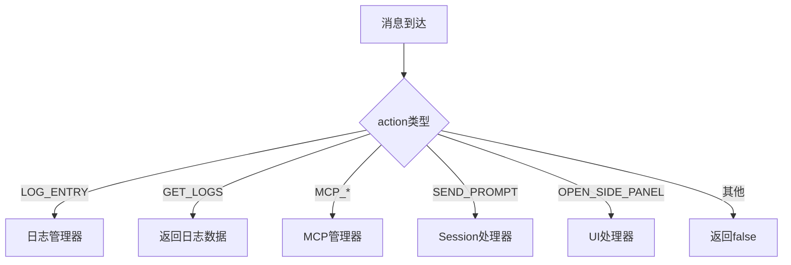

# 消息通信机制

<cite>
**本文档引用的文件**
- [messages.js](file://background/messages.js)
- [messaging.js](file://lib/messaging.js)
- [session.js](file://background/handlers/session.js)
- [prompt_handler.js](file://background/handlers/session/prompt_handler.js)
- [ui.js](file://background/handlers/ui.js)
- [stream.js](file://content/toolbar/stream.js)
- [bridge.js](file://content/toolbar/bridge.js)
- [manifest.json](file://manifest.json)
</cite>

## 目录
1. [消息通信概述](#消息通信概述)
2. [消息通用结构](#消息通用结构)
3. [公开的Action类型](#公开的action类型)
4. [流式响应机制](#流式响应机制)
5. [消息分发中心](#消息分发中心)
6. [JavaScript代码示例](#javascript代码示例)

## 消息通信概述

Gemini Nexus扩展使用Chrome扩展的`chrome.runtime.sendMessage` API作为核心的进程间通信（IPC）机制，实现不同上下文环境（如content script、sandbox、background）之间的消息传递。该系统设计为一个中心化的消息路由架构，其中background脚本作为消息分发中心，接收来自各个组件的消息并根据action类型路由到相应的处理器。

整个通信流程遵循发布-订阅模式，允许content script和sandbox环境向background发送请求，并通过异步响应或事件监听的方式接收结果。这种设计实现了组件间的松耦合，提高了系统的可维护性和扩展性。

**Section sources**
- [messages.js](file://background/messages.js#L1-L82)
- [manifest.json](file://manifest.json#L1-L93)

## 消息通用结构

所有通过`chrome.runtime.sendMessage`发送的消息都遵循一个统一的JSON结构，包含以下核心字段：

- **action**: 字符串类型，表示消息的类型或意图，是消息路由的关键标识
- **data**: 对象类型，包含与特定action相关的具体数据
- **tabId**: 数字类型，可选，表示消息来源的标签页ID
- **sessionId**: 字符串类型，可选，用于关联会话状态

消息结构的设计遵循RESTful原则，每个action对应一个特定的功能或操作。消息的发送方和接收方通过约定的action名称和数据结构进行通信，确保了接口的清晰性和一致性。

**Section sources**
- [messages.js](file://background/messages.js#L1-L82)
- [messaging.js](file://lib/messaging.js#L1-L96)

## 公开的Action类型

系统定义了一系列公开的action类型，用于支持不同的功能需求。这些action可以分为以下几类：

### 会话与提示处理
- **SEND_PROMPT**: 发送用户提示到Gemini模型
  - 请求参数: `{ text: string, files: Array, model: string, sessionId: string }`
  - 响应格式: `{ action: "GEMINI_REPLY", text: string, thoughts: string, images: Array, status: "success"|"error" }`
- **CANCEL_PROMPT**: 取消当前正在进行的提示处理
  - 响应格式: `{ status: "cancelled"|"no_active_request" }`

### 快速问答功能
- **QUICK_ASK**: 在content script中执行快速问答
  - 请求参数: `{ text: string, model: string }`
  - 响应通过`GEMINI_STREAM_UPDATE`和`GEMINI_STREAM_DONE`事件传递
- **QUICK_ASK_IMAGE**: 对图像执行快速问答
  - 请求参数: `{ url: string, text: string, model: string }`

### 上下文管理
- **SET_CONTEXT**: 设置当前会话的上下文
- **RESET_CONTEXT**: 重置会话上下文

### UI与侧边栏控制
- **OPEN_SIDE_PANEL**: 打开侧边栏
- **CAPTURE_SCREENSHOT**: 捕获当前页面截图
- **INITIATE_CAPTURE**: 启动区域选择捕获

### 存储与配置
- **GET_THEME**: 从存储中获取主题设置
- **SAVE_THEME**: 保存主题设置到存储
- **GET_LANGUAGE**: 获取语言设置
- **SAVE_LANGUAGE**: 保存语言设置

**Section sources**
- [session.js](file://background/handlers/session.js#L1-L56)
- [ui.js](file://background/handlers/ui.js#L1-L195)
- [messaging.js](file://lib/messaging.js#L1-L96)

## 流式响应机制

系统实现了基于事件的流式响应机制，用于处理长时间运行的操作（如AI模型推理），提供实时的反馈体验。

### 分块传输机制
流式响应通过两个特殊的action类型实现：
- **GEMINI_STREAM_UPDATE**: 在处理过程中定期发送，包含部分结果
- **GEMINI_STREAM_DONE**: 表示处理完成，包含最终结果

这种分块传输机制允许客户端在服务器处理的同时逐步显示结果，显著提升了用户体验。

### 客户端处理
在content script中，`GeminiStreamHandler`类负责监听这些流式消息：

```javascript
class GeminiStreamHandler {
    handleStreamMessage(request, sender, sendResponse) {
        if (request.action === "GEMINI_STREAM_UPDATE") {
            // 实时更新结果显示
            this.ui.showResult(request.text, null, true);
        }
        
        if (request.action === "GEMINI_STREAM_DONE") {
            // 处理最终结果
            this.ui.showResult(result.text, null, false, result.images);
        }
    }
}
```

客户端通过`isStreaming`标志区分流式更新和最终结果，实现平滑的UI过渡。

**Section sources**
- [prompt_handler.js](file://background/handlers/session/prompt_handler.js#L1-L103)
- [stream.js](file://content/toolbar/stream.js#L1-L49)

## 消息分发中心

`background/messages.js`文件中的`setupMessageListener`函数是整个消息系统的核心，充当消息分发中心的角色。

### 架构设计
该函数创建了两个主要的消息处理器：
- **SessionMessageHandler**: 处理会话相关的消息（如SEND_PROMPT、QUICK_ASK）
- **UIMessageHandler**: 处理UI和界面相关的消息（如OPEN_SIDE_PANEL、CAPTURE_SCREENSHOT）

### 路由逻辑
消息分发遵循优先级路由策略：
1. 首先处理系统级消息（如LOG_ENTRY、GET_LOGS）
2. 然后处理MCP管理消息
3. 最后委托给专门的处理器（sessionHandler或uiHandler）



**Diagram sources**
- [messages.js](file://background/messages.js#L1-L82)
- [session.js](file://background/handlers/session.js#L1-L56)

## JavaScript代码示例

### 在Sandbox中发送消息

在sandbox环境中，通过`window.parent.postMessage`发送消息到background：

```javascript
export class AppMessageBridge {
    constructor() {
        window.addEventListener('message', this.handleMessage.bind(this));
    }
    
    // 发送消息到background
    sendMessage(action, payload) {
        window.parent.postMessage({
            action: 'FORWARD_TO_BACKGROUND',
            payload: { action, ...payload }
        }, '*');
    }
}
```

### 在Content Script中监听响应

在content script中，使用`chrome.runtime.onMessage`监听来自background的响应：

```javascript
class GeminiStreamHandler {
    init() {
        chrome.runtime.onMessage.addListener(this.handleStreamMessage.bind(this));
    }
    
    handleStreamMessage(request, sender, sendResponse) {
        if (request.action === "GEMINI_STREAM_UPDATE") {
            this.ui.showResult(request.text, null, true);
        }
        
        if (request.action === "GEMINI_STREAM_DONE") {
            this.ui.showResult(request.result.text, null, false);
        }
    }
}
```

### 发送请求并处理响应

```javascript
// 发送SEND_PROMPT请求
const sendMessage = () => {
    const msg = {
        action: "SEND_PROMPT",
        text: "Hello Gemini",
        model: "gemini-2.5-flash"
    };
    
    chrome.runtime.sendMessage(msg);
};

// 监听GEMINI_REPLY响应
chrome.runtime.onMessage.addListener((request) => {
    if (request.action === "GEMINI_REPLY") {
        console.log("收到回复:", request.text);
    }
});
```

**Section sources**
- [messaging.js](file://lib/messaging.js#L1-L96)
- [bridge.js](file://content/toolbar/bridge.js#L1-L66)
- [stream.js](file://content/toolbar/stream.js#L1-L49)