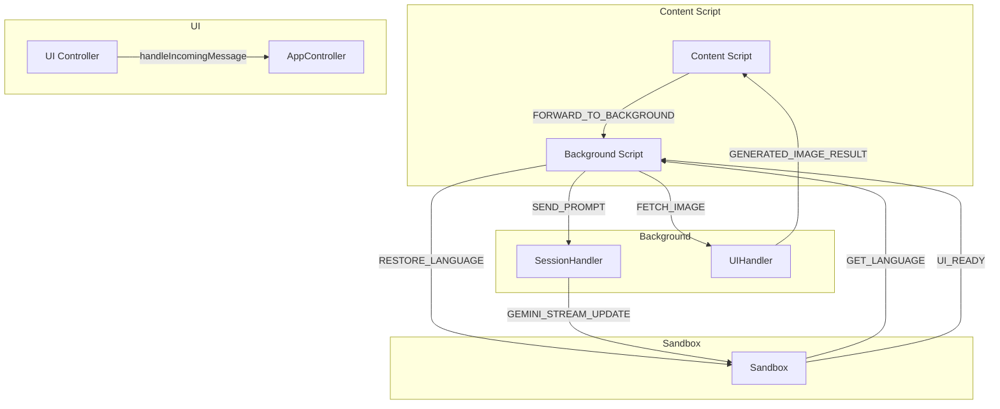
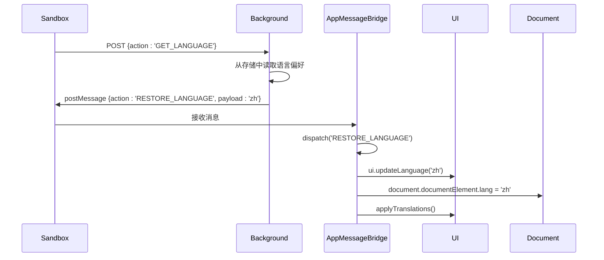
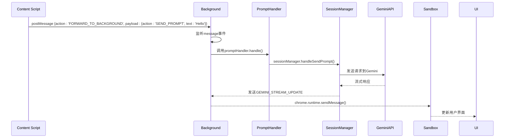
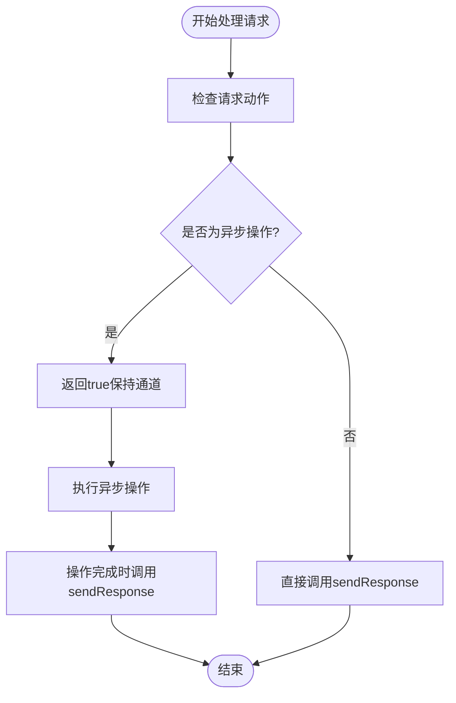
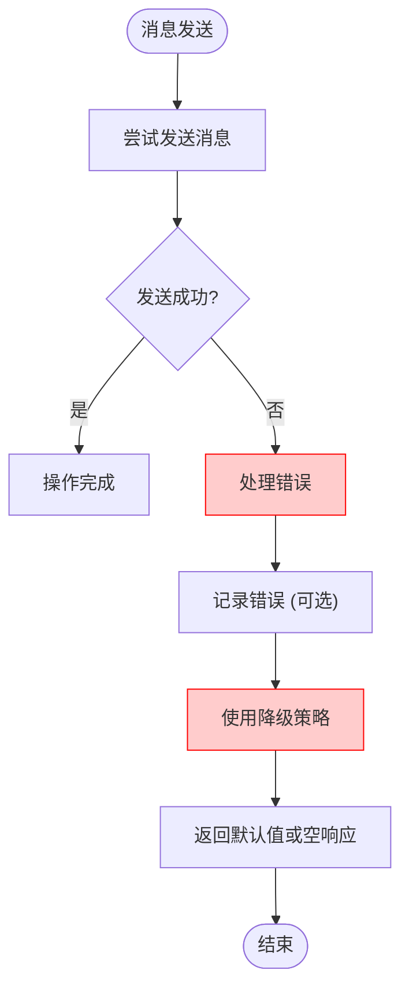

# 通信示例

<cite>
**本文档中引用的文件**  
- [messaging.js](file://lib/messaging.js)
- [messages.js](file://background/messages.js)
- [app.js](file://sandbox/boot/app.js)
- [messaging.js](file://sandbox/boot/messaging.js)
- [bridge.js](file://content/toolbar/bridge.js)
- [i18n.js](file://sandbox/core/i18n.js)
- [prompt_handler.js](file://background/handlers/session/prompt_handler.js)
- [session.js](file://background/handlers/session.js)
- [ui.js](file://background/handlers/ui.js)
</cite>

## 目录
1. [简介](#简介)
2. [核心通信机制](#核心通信机制)
3. [Sandbox 环境中的语言设置通信示例](#sandbox-环境中的语言设置通信示例)
4. [Content Script 消息转发示例](#content-script-消息转发示例)
5. [异步响应处理机制](#异步响应处理机制)
6. [错误处理与降级策略](#错误处理与降级策略)
7. [总结](#总结)

## 简介
本文件详细说明了Gemini Nexus扩展中的消息通信机制，涵盖Sandbox环境、Content Script、Background Script之间的交互模式。文档重点展示如何通过`lib/messaging.js`和`AppMessageBridge`实现跨上下文通信，以及异步响应和错误处理的最佳实践。

## 核心通信机制

该扩展采用分层消息传递架构，主要通过`window.postMessage`和`chrome.runtime.sendMessage`实现跨上下文通信。Sandbox环境使用`lib/messaging.js`向父窗口发送消息，Background Script通过`chrome.runtime.onMessage`监听并处理请求。

**Diagram sources**
- [messaging.js](file://lib/messaging.js#L4-L96)
- [messages.js](file://background/messages.js#L22-L81)
- [app.js](file://sandbox/boot/app.js#L19-L22)

**Section sources**
- [messaging.js](file://lib/messaging.js#L1-L96)
- [messages.js](file://background/messages.js#L1-L82)

## Sandbox 环境中的语言设置通信示例

在Sandbox环境中，通过`lib/messaging.js`的`requestLanguageFromStorage()`函数请求语言设置，`AppMessageBridge`接收`RESTORE_LANGUAGE`消息并更新UI。

**Diagram sources**
- [messaging.js](file://lib/messaging.js#L36-L38)
- [messaging.js](file://sandbox/boot/messaging.js#L58-L60)
- [i18n.js](file://sandbox/core/i18n.js#L225-L250)
- [app.js](file://sandbox/boot/app.js#L16-L17)

**Section sources**
- [messaging.js](file://lib/messaging.js#L36-L45)
- [messaging.js](file://sandbox/boot/messaging.js#L58-L60)
- [i18n.js](file://sandbox/core/i18n.js#L211-L250)

## Content Script 消息转发示例

Content Script通过发送`FORWARD_TO_BACKGROUND`消息来触发Background处理`SEND_PROMPT`请求。这种模式允许Content Script发起操作，由Background Script执行核心逻辑。

**Diagram sources**
- [bridge.js](file://content/toolbar/bridge.js#L40-L49)
- [messages.js](file://background/messages.js#L70-L71)
- [prompt_handler.js](file://background/handlers/session/prompt_handler.js#L13-L102)

**Section sources**
- [bridge.js](file://content/toolbar/bridge.js#L1-L66)
- [messages.js](file://background/messages.js#L69-L72)
- [prompt_handler.js](file://background/handlers/session/prompt_handler.js#L13-L103)

## 异步响应处理机制

Background Script在处理异步操作时，通过返回`true`保持`sendResponse`通道打开，并在Promise完成后调用`sendResponse`。这种模式确保了长时间运行的操作能够正确响应。

**Diagram sources**
- [messages.js](file://background/messages.js#L31-L32)
- [prompt_handler.js](file://background/handlers/session/prompt_handler.js#L97-L98)
- [ui.js](file://background/handlers/ui.js#L20-L21)

**Section sources**
- [messages.js](file://background/messages.js#L30-L32)
- [prompt_handler.js](file://background/handlers/session/prompt_handler.js#L97-L101)
- [ui.js](file://background/handlers/ui.js#L13-L23)

## 错误处理与降级策略

系统实现了多层次的错误处理机制，包括监听失败时的降级策略和超时处理。所有`chrome.runtime.sendMessage`调用都包含`.catch(() => {})`来防止未处理的Promise拒绝。

**Diagram sources**
- [prompt_handler.js](file://background/handlers/session/prompt_handler.js#L17-L21)
- [ui.js](file://background/handlers/ui.js#L16-L18)
- [bridge.js](file://content/toolbar/bridge.js#L25-L26)

**Section sources**
- [prompt_handler.js](file://background/handlers/session/prompt_handler.js#L17-L21)
- [ui.js](file://background/handlers/ui.js#L16-L18)
- [bridge.js](file://content/toolbar/bridge.js#L25-L26)

## 总结
本文档详细展示了Gemini Nexus扩展中的通信模式，包括Sandbox环境的语言设置获取、Content Script的消息转发、异步响应处理和错误降级策略。这些模式共同构成了一个健壮、可维护的消息通信系统，确保了不同执行上下文之间的可靠交互。