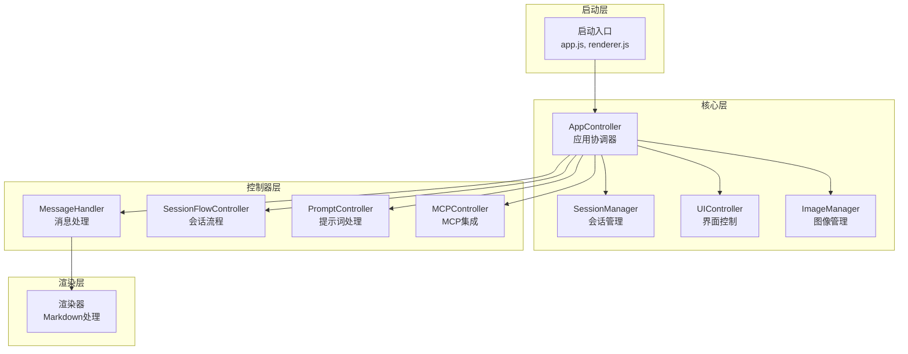
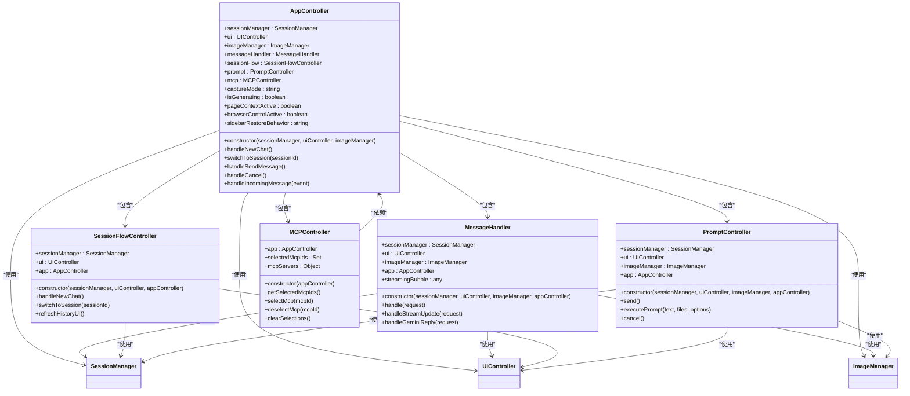
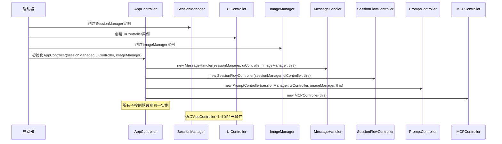
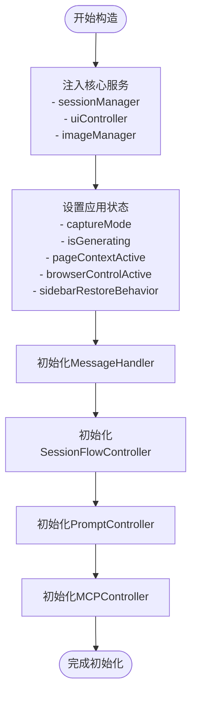
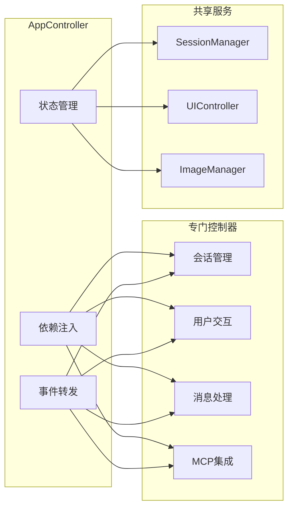
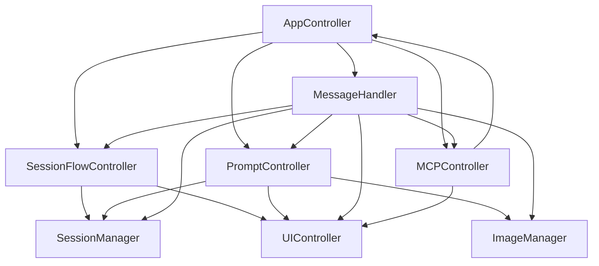
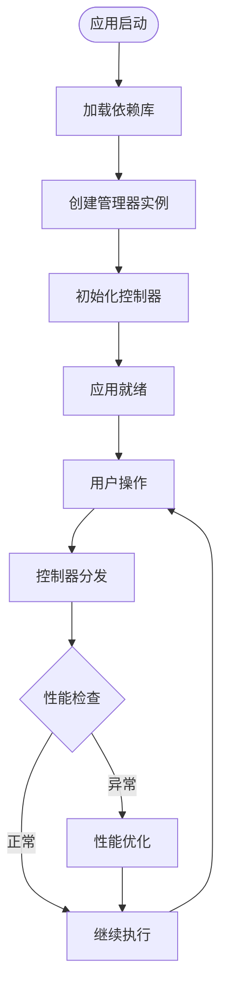
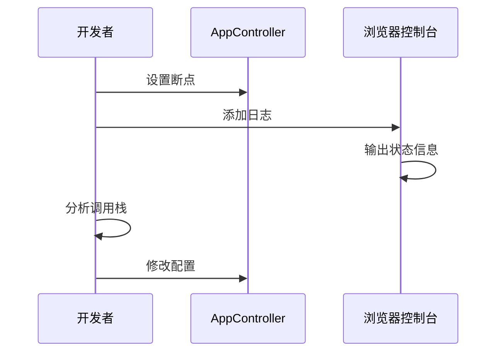

# AppController与子控制器初始化关系

<cite>
**本文档引用的文件**
- [app_controller.js](file://sandbox/controllers/app_controller.js)
- [message_handler.js](file://sandbox/controllers/message_handler.js)
- [session_flow.js](file://sandbox/controllers/session_flow.js)
- [prompt.js](file://sandbox/controllers/prompt.js)
- [mcp_controller.js](file://sandbox/controllers/mcp_controller.js)
- [ui_controller.js](file://sandbox/ui/ui_controller.js)
- [session_manager.js](file://sandbox/core/session_manager.js)
- [app.js](file://sandbox/boot/app.js)
- [renderer.js](file://sandbox/boot/renderer.js)
</cite>

## 目录
1. [简介](#简介)
2. [项目结构](#项目结构)
3. [核心组件](#核心组件)
4. [架构概览](#架构概览)
5. [详细组件分析](#详细组件分析)
6. [依赖关系分析](#依赖关系分析)
7. [性能考虑](#性能考虑)
8. [故障排除指南](#故障排除指南)
9. [结论](#结论)

## 简介

本文档深入分析了AppController作为应用核心协调者的初始化过程，重点解析其构造函数如何作为中央协调器完成依赖注入。通过详细说明AppController在构造函数中依次初始化MessageHandler、SessionFlowController、PromptController和MCPController四个子控制器的过程，展示这种组合模式如何实现关注点分离，确保子控制器间共享状态的一致性，并提高模块的可测试性和可维护性。

## 项目结构

该应用采用模块化的前端架构，主要分为以下层次：

**图表来源**
- [app.js](file://sandbox/boot/app.js#L35-L88)
- [app_controller.js](file://sandbox/controllers/app_controller.js#L10-L36)

**章节来源**
- [app.js](file://sandbox/boot/app.js#L1-L90)
- [app_controller.js](file://sandbox/controllers/app_controller.js#L1-L207)

## 核心组件

### AppController - 应用协调器

AppController是整个应用的核心协调者，负责管理所有子控制器的生命周期和相互协作。其构造函数展示了典型的依赖注入模式：

**图表来源**
- [app_controller.js](file://sandbox/controllers/app_controller.js#L10-L36)
- [message_handler.js](file://sandbox/controllers/message_handler.js#L8-L15)
- [session_flow.js](file://sandbox/controllers/session_flow.js#L7-L12)
- [prompt.js](file://sandbox/controllers/prompt.js#L7-L13)
- [mcp_controller.js](file://sandbox/controllers/mcp_controller.js#L5-L13)

**章节来源**
- [app_controller.js](file://sandbox/controllers/app_controller.js#L10-L36)

## 架构概览

AppController采用组合模式设计，通过集中式初始化确保所有子控制器共享相同的核心服务实例：

**图表来源**
- [app.js](file://sandbox/boot/app.js#L48-L79)
- [app_controller.js](file://sandbox/controllers/app_controller.js#L24-L35)

## 详细组件分析

### AppController构造函数初始化流程

AppController的构造函数展示了精心设计的初始化顺序，确保依赖关系的正确建立：

#### 第一步：核心服务注入

**图表来源**
- [app_controller.js](file://sandbox/controllers/app_controller.js#L11-L36)

#### 第二步：MessageHandler初始化
MessageHandler负责处理来自后台脚本的消息，接收所有核心服务实例：

**章节来源**
- [app_controller.js](file://sandbox/controllers/app_controller.js#L24-L30)
- [message_handler.js](file://sandbox/controllers/message_handler.js#L8-L15)

#### 第三步：SessionFlowController初始化
SessionFlowController管理会话生命周期，包括新聊天创建、会话切换和历史记录刷新：

**章节来源**
- [app_controller.js](file://sandbox/controllers/app_controller.js#L32-L33)
- [session_flow.js](file://sandbox/controllers/session_flow.js#L7-L12)

#### 第四步：PromptController初始化
PromptController处理用户输入和提示词执行，协调图像管理和MCP集成：

**章节来源**
- [app_controller.js](file://sandbox/controllers/app_controller.js#L33-L35)
- [prompt.js](file://sandbox/controllers/prompt.js#L7-L13)

#### 第五步：MCPController初始化
MCPController管理MCP服务器选择和状态，为其他控制器提供MCP集成能力：

**章节来源**
- [app_controller.js](file://sandbox/controllers/app_controller.js#L35-L35)
- [mcp_controller.js](file://sandbox/controllers/mcp_controller.js#L5-L13)

### 子控制器职责划分

#### SessionFlowController - 会话生命周期管理
- **职责**：创建新会话、切换会话、管理历史记录UI、删除会话
- **关键方法**：`handleNewChat()`, `switchToSession()`, `refreshHistoryUI()`, `handleDeleteSession()`
- **协作**：与SessionManager和UIController深度集成

#### PromptController - 用户输入处理
- **职责**：处理用户输入、执行提示词、管理生成状态、取消操作
- **关键方法**：`send()`, `executePrompt()`, `cancel()`
- **特性**：支持页面上下文、浏览器控制、MCP集成

#### MessageHandler - 消息协调器
- **职责**：处理AI回复流、图像处理、OCR功能、MCP工具集成
- **关键方法**：`handle()`, `handleStreamUpdate()`, `handleGeminiReply()`
- **状态管理**：跟踪生成状态和流式消息

#### MCPController - 工具集成管理
- **职责**：MCP服务器选择、状态显示、工具选择UI
- **关键方法**：`getSelectedMcpIds()`, `selectMcp()`, `deselectMcp()`, `clearSelections()`
- **UI集成**：动态更新MCP标签和服务器列表

**章节来源**
- [session_flow.js](file://sandbox/controllers/session_flow.js#L14-L94)
- [prompt.js](file://sandbox/controllers/prompt.js#L15-L116)
- [message_handler.js](file://sandbox/controllers/message_handler.js#L17-L86)
- [mcp_controller.js](file://sandbox/controllers/mcp_controller.js#L157-L213)

### 关注点分离实现

通过AppController的集中式初始化，实现了清晰的关注点分离：

**图表来源**
- [app_controller.js](file://sandbox/controllers/app_controller.js#L75-L192)

## 依赖关系分析

### 组件耦合度分析

**图表来源**
- [app_controller.js](file://sandbox/controllers/app_controller.js#L3-L6)
- [message_handler.js](file://sandbox/controllers/message_handler.js#L3-L6)

### 依赖注入模式优势

1. **单一职责原则**：每个控制器专注于特定功能领域
2. **可测试性**：通过构造函数注入，便于单元测试
3. **可维护性**：清晰的依赖关系便于理解和修改
4. **扩展性**：新的功能可以通过添加新控制器实现

**章节来源**
- [app_controller.js](file://sandbox/controllers/app_controller.js#L10-L36)
- [ui_controller.js](file://sandbox/ui/ui_controller.js#L8-L33)

## 性能考虑

### 初始化优化策略

1. **延迟加载**：通过动态导入确保按需加载
2. **资源共享**：所有子控制器共享相同的SessionManager和UIController实例
3. **事件委托**：减少DOM事件监听器数量
4. **内存管理**：及时清理流式消息引用

### 运行时性能监控

**图表来源**
- [app.js](file://sandbox/boot/app.js#L35-L88)

## 故障排除指南

### 常见问题诊断

1. **控制器未初始化**
   - 检查AppController构造函数中的依赖注入
   - 验证核心服务实例的有效性

2. **状态不一致**
   - 确认所有子控制器都引用同一个AppController实例
   - 检查isGenerating状态的同步

3. **MCP功能异常**
   - 验证MCPController的选择状态
   - 检查MCP服务器连接状态

### 调试技巧

**章节来源**
- [app_controller.js](file://sandbox/controllers/app_controller.js#L129-L192)

## 结论

AppController的初始化模式展现了优秀的软件架构设计：

1. **集中式协调**：通过单一入口管理所有子控制器，确保状态一致性
2. **依赖注入**：清晰的依赖关系，便于测试和维护
3. **关注点分离**：每个控制器专注于特定功能领域
4. **可扩展性**：模块化设计支持功能扩展

这种设计模式不仅提高了代码的可读性和可维护性，还为未来的功能扩展奠定了坚实基础。通过AppController作为中央协调者，系统实现了高内聚、低耦合的架构目标。