# 控制器协作模式

<cite>
**本文档引用的文件**
- [sandbox/controllers/app_controller.js](file://sandbox/controllers/app_controller.js)
- [sandbox/controllers/message_handler.js](file://sandbox/controllers/message_handler.js)
- [sandbox/controllers/session_flow.js](file://sandbox/controllers/session_flow.js)
- [sandbox/controllers/prompt.js](file://sandbox/controllers/prompt.js)
- [sandbox/controllers/mcp_controller.js](file://sandbox/controllers/mcp_controller.js)
- [sandbox/boot/app.js](file://sandbox/boot/app.js)
- [sandbox/ui/ui_controller.js](file://sandbox/ui/ui_controller.js)
- [sandbox/core/session_manager.js](file://sandbox/core/session_manager.js)
- [sandbox/core/image_manager.js](file://sandbox/core/image_manager.js)
- [lib/messaging.js](file://lib/messaging.js)
- [background/index.js](file://background/index.js)
</cite>

## 目录
1. [简介](#简介)
2. [项目结构](#项目结构)
3. [核心组件](#核心组件)
4. [架构概览](#架构概览)
5. [详细组件分析](#详细组件分析)
6. [依赖关系分析](#依赖关系分析)
7. [性能考虑](#性能考虑)
8. [故障排除指南](#故障排除指南)
9. [结论](#结论)

## 简介

本文档深入分析了Gemini Nexus沙箱环境中AppController作为核心协调者的控制器协作模式。该系统采用分层控制器架构，通过外观模式（Facade Pattern）实现了高度模块化的设计，提升了代码的可维护性和可扩展性。

AppController作为系统的中央协调者，在构造函数中初始化多个子控制器，包括MessageHandler、SessionFlowController、PromptController和MCPController，通过方法委托实现职责分离。这种设计模式确保了各组件的专业化分工，同时保持了清晰的控制流和数据流。

## 项目结构

沙箱环境采用模块化的文件组织方式，主要分为以下几个层次：

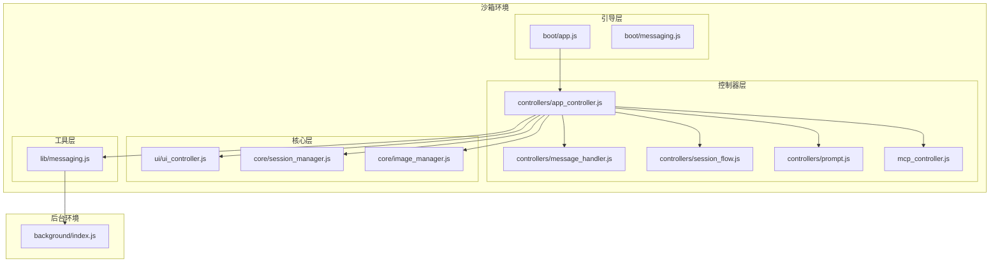

**图表来源**
- [sandbox/boot/app.js](file://sandbox/boot/app.js#L1-L90)
- [sandbox/controllers/app_controller.js](file://sandbox/controllers/app_controller.js#L1-L207)

**章节来源**
- [sandbox/boot/app.js](file://sandbox/boot/app.js#L1-L90)
- [sandbox/controllers/app_controller.js](file://sandbox/controllers/app_controller.js#L1-L207)

## 核心组件

### AppController - 外观模式协调者

AppController是整个沙箱环境的核心协调者，采用了外观模式的设计原则，为复杂的子系统提供简化的统一接口。

#### 构造函数初始化流程

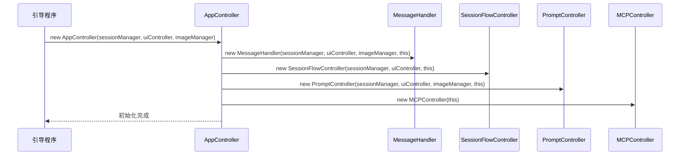

**图表来源**
- [sandbox/controllers/app_controller.js](file://sandbox/controllers/app_controller.js#L11-L36)

#### 状态管理属性

AppController维护着关键的运行时状态：
- `captureMode`: 截图捕获模式（snip/ocr/screenshot_translate）
- `isGenerating`: 生成状态标志
- `pageContextActive`: 页面上下文激活状态
- `browserControlActive`: 浏览器控制激活状态
- `sidebarRestoreBehavior`: 侧边栏恢复行为配置

#### 方法委托机制

AppController通过简洁的方法委托实现职责分离：

| 委托方法 | 调用目标 | 功能描述 |
|---------|---------|----------|
| `handleNewChat()` | `sessionFlow.handleNewChat()` | 创建新会话聊天 |
| `handleSendMessage()` | `prompt.send()` | 发送用户消息 |
| `handleCancel()` | `prompt.cancel()` | 取消当前操作 |
| `switchToSession(sessionId)` | `sessionFlow.switchToSession(sessionId)` | 切换到指定会话 |

**章节来源**
- [sandbox/controllers/app_controller.js](file://sandbox/controllers/app_controller.js#L10-L36)
- [sandbox/controllers/app_controller.js](file://sandbox/controllers/app_controller.js#L75-L125)

### MessageHandler - 消息中枢处理器

MessageHandler作为消息处理的核心中枢，根据不同的action类型调用相应的处理逻辑，实现了松耦合的消息路由机制。

#### 消息处理流程

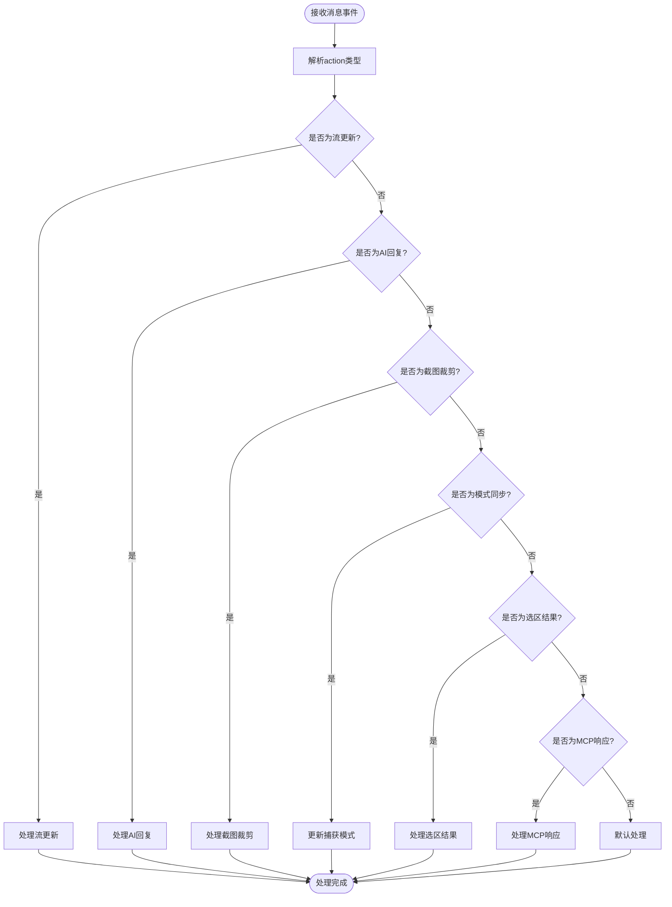

**图表来源**
- [sandbox/controllers/message_handler.js](file://sandbox/controllers/message_handler.js#L17-L86)

#### 关键处理逻辑

MessageHandler针对不同action类型实现了专门的处理方法：

1. **流更新处理** (`GEMINI_STREAM_UPDATE`): 实时更新AI回复内容
2. **AI回复处理** (`GEMINI_REPLY`): 完成最终回复并更新UI状态
3. **截图裁剪处理** (`CROP_SCREENSHOT`): 处理截图并根据捕获模式执行相应操作
4. **模式同步处理** (`SET_SIDEBAR_CAPTURE_MODE`): 更新捕获模式状态

**章节来源**
- [sandbox/controllers/message_handler.js](file://sandbox/controllers/message_handler.js#L17-L86)
- [sandbox/controllers/message_handler.js](file://sandbox/controllers/message_handler.js#L318-L341)

### SessionFlowController - 会话流程管理

SessionFlowController专注于会话生命周期管理，负责会话的创建、切换、删除和历史记录维护。

#### 会话切换流程

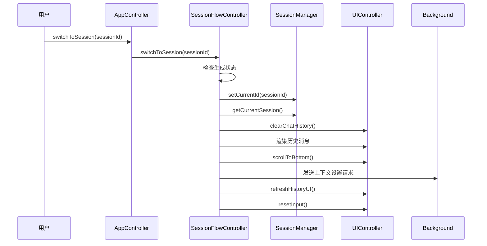

**图表来源**
- [sandbox/controllers/session_flow.js](file://sandbox/controllers/session_flow.js#L24-L58)

**章节来源**
- [sandbox/controllers/session_flow.js](file://sandbox/controllers/session_flow.js#L7-L96)

### PromptController - 提示词控制器

PromptController负责用户输入的处理和AI提示词的发送，实现了智能的输入验证和上下文管理。

#### 提示词发送流程

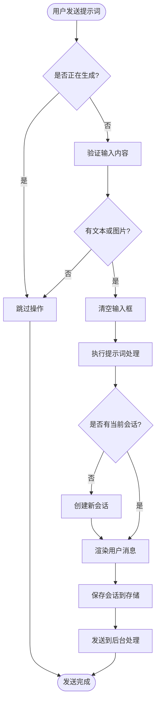

**图表来源**
- [sandbox/controllers/prompt.js](file://sandbox/controllers/prompt.js#L15-L33)

**章节来源**
- [sandbox/controllers/prompt.js](file://sandbox/controllers/prompt.js#L7-L117)

### MCPController - MCP服务器管理

MCPController负责MCP（Model Context Protocol）服务器的选择和状态管理，提供了直观的用户界面用于MCP服务器的配置和选择。

#### MCP服务器选择流程

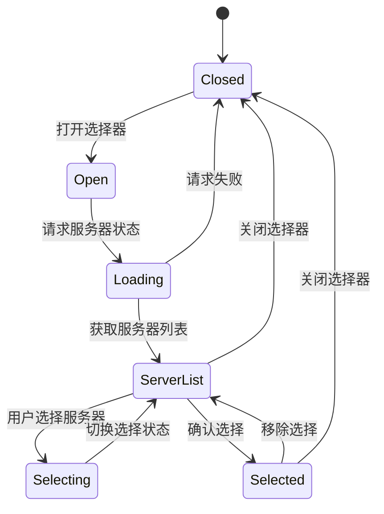

**图表来源**
- [sandbox/controllers/mcp_controller.js](file://sandbox/controllers/mcp_controller.js#L57-L86)

**章节来源**
- [sandbox/controllers/mcp_controller.js](file://sandbox/controllers/mcp_controller.js#L5-L221)

## 架构概览

整个沙箱环境采用了清晰的分层架构设计，实现了关注点分离和模块化管理。

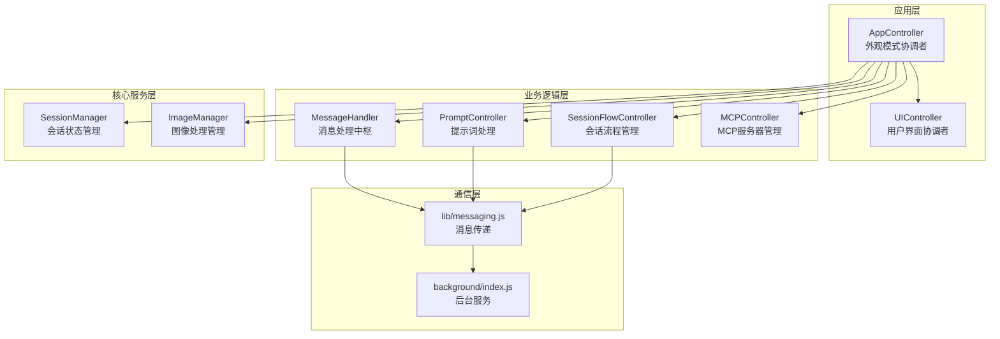

**图表来源**
- [sandbox/controllers/app_controller.js](file://sandbox/controllers/app_controller.js#L1-L207)
- [sandbox/ui/ui_controller.js](file://sandbox/ui/ui_controller.js#L1-L66)
- [lib/messaging.js](file://lib/messaging.js#L1-L96)

## 详细组件分析

### AppController类结构分析

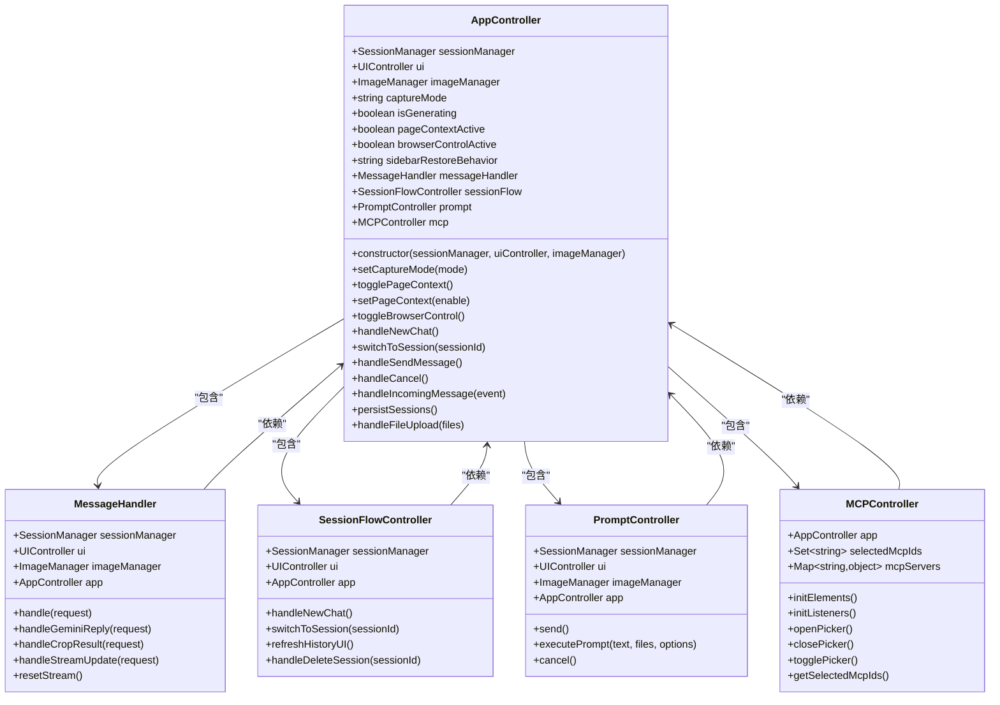

**图表来源**
- [sandbox/controllers/app_controller.js](file://sandbox/controllers/app_controller.js#L10-L36)
- [sandbox/controllers/message_handler.js](file://sandbox/controllers/message_handler.js#L8-L15)
- [sandbox/controllers/session_flow.js](file://sandbox/controllers/session_flow.js#L7-L12)
- [sandbox/controllers/prompt.js](file://sandbox/controllers/prompt.js#L7-L13)
- [sandbox/controllers/mcp_controller.js](file://sandbox/controllers/mcp_controller.js#L5-L13)

### 消息处理序列图

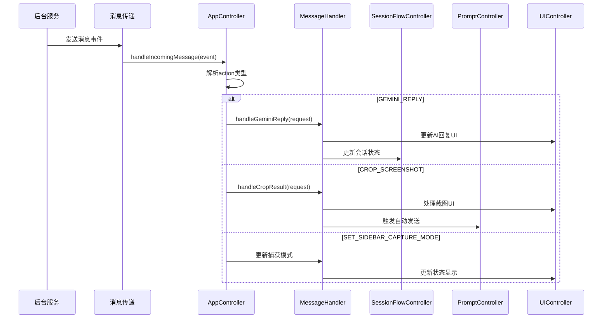

**图表来源**
- [sandbox/controllers/app_controller.js](file://sandbox/controllers/app_controller.js#L129-L192)
- [sandbox/controllers/message_handler.js](file://sandbox/controllers/message_handler.js#L24-L86)

### 会话管理流程图

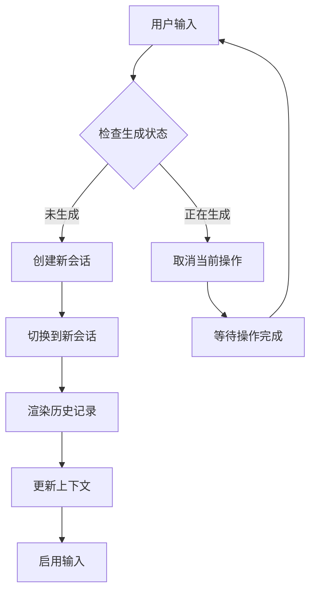

**图表来源**
- [sandbox/controllers/session_flow.js](file://sandbox/controllers/session_flow.js#L14-L22)

**章节来源**
- [sandbox/controllers/app_controller.js](file://sandbox/controllers/app_controller.js#L1-L207)
- [sandbox/controllers/message_handler.js](file://sandbox/controllers/message_handler.js#L1-L365)
- [sandbox/controllers/session_flow.js](file://sandbox/controllers/session_flow.js#L1-L96)
- [sandbox/controllers/prompt.js](file://sandbox/controllers/prompt.js#L1-L117)
- [sandbox/controllers/mcp_controller.js](file://sandbox/controllers/mcp_controller.js#L1-L221)

## 依赖关系分析

### 组件间依赖关系

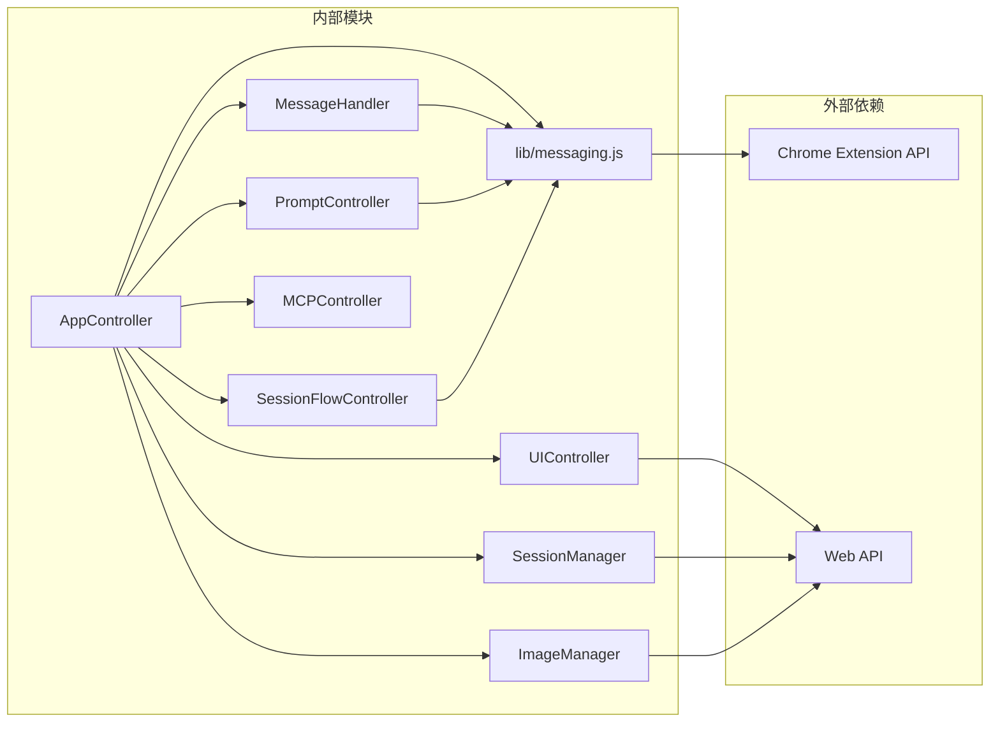

**图表来源**
- [sandbox/controllers/app_controller.js](file://sandbox/controllers/app_controller.js#L1-L207)
- [lib/messaging.js](file://lib/messaging.js#L1-L96)

### 数据流分析

系统中的数据流遵循单向传播原则，确保了状态的一致性和可预测性：

1. **用户交互** → **AppController** → **具体控制器** → **UI更新**
2. **后台消息** → **AppController** → **MessageHandler** → **UI更新**
3. **状态变更** → **SessionManager** → **持久化存储** → **UI同步**

**章节来源**
- [sandbox/boot/app.js](file://sandbox/boot/app.js#L78-L88)
- [lib/messaging.js](file://lib/messaging.js#L4-L9)

## 性能考虑

### 内存管理优化

系统采用了多种内存管理策略来确保长期运行的稳定性：

1. **流式消息处理**: 使用`streamingBubble`对象管理实时更新，避免重复创建DOM元素
2. **状态重置机制**: 在会话切换和操作取消时及时清理状态，防止内存泄漏
3. **懒加载模式**: 控制器按需初始化，减少初始启动时间

### 并发处理策略

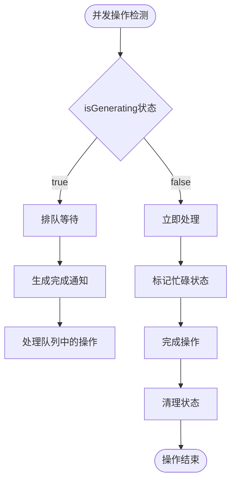

**图表来源**
- [sandbox/controllers/prompt.js](file://sandbox/controllers/prompt.js#L15-L33)
- [sandbox/controllers/session_flow.js](file://sandbox/controllers/session_flow.js#L14-L22)

## 故障排除指南

### 常见问题诊断

#### 1. 消息处理异常

**症状**: AI回复不显示或显示错误
**排查步骤**:
1. 检查`MessageHandler.handle()`方法的action类型匹配
2. 验证`isGenerating`状态是否正确更新
3. 确认UI更新方法调用顺序

#### 2. 会话切换失败

**症状**: 切换会话后历史记录不刷新
**排查步骤**:
1. 验证`SessionManager.setCurrentId()`调用
2. 检查`appendMessage()`调用参数
3. 确认`refreshHistoryUI()`触发时机

#### 3. MCP服务器连接问题

**症状**: MCP服务器列表为空或无法选择
**排查步骤**:
1. 检查`MCPController.requestMcpStatus()`调用
2. 验证`handleMcpStatus()`回调处理
3. 确认服务器状态数据格式

**章节来源**
- [sandbox/controllers/message_handler.js](file://sandbox/controllers/message_handler.js#L212-L280)
- [sandbox/controllers/session_flow.js](file://sandbox/controllers/session_flow.js#L24-L58)
- [sandbox/controllers/mcp_controller.js](file://sandbox/controllers/mcp_controller.js#L88-L99)

## 结论

Gemini Nexus的控制器协作模式展现了现代前端架构的最佳实践。通过AppController作为外观模式协调者，系统实现了：

### 设计优势

1. **职责分离**: 每个控制器专注于特定功能领域
2. **可扩展性**: 新功能可通过添加新的控制器轻松集成
3. **可维护性**: 清晰的依赖关系和单一职责原则
4. **测试友好**: 模块化设计便于单元测试和集成测试

### 架构特色

- **外观模式**: AppController提供简化的统一接口
- **命令模式**: 方法委托实现松耦合的控制流
- **观察者模式**: 消息处理实现事件驱动的响应机制
- **策略模式**: 不同的捕获模式和上下文处理策略

这种分层控制器架构不仅提升了代码质量，还为未来的功能扩展奠定了坚实的基础。通过持续的模块化改进和性能优化，系统能够适应不断变化的需求和技术演进。