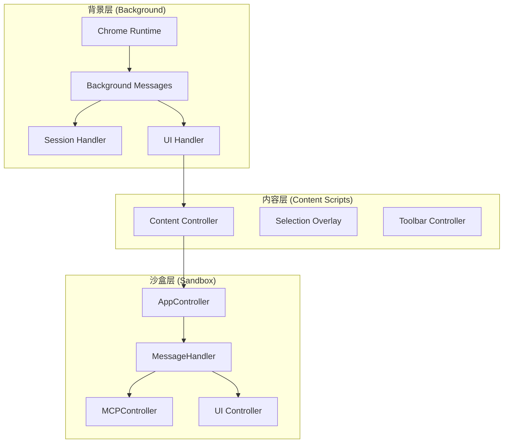
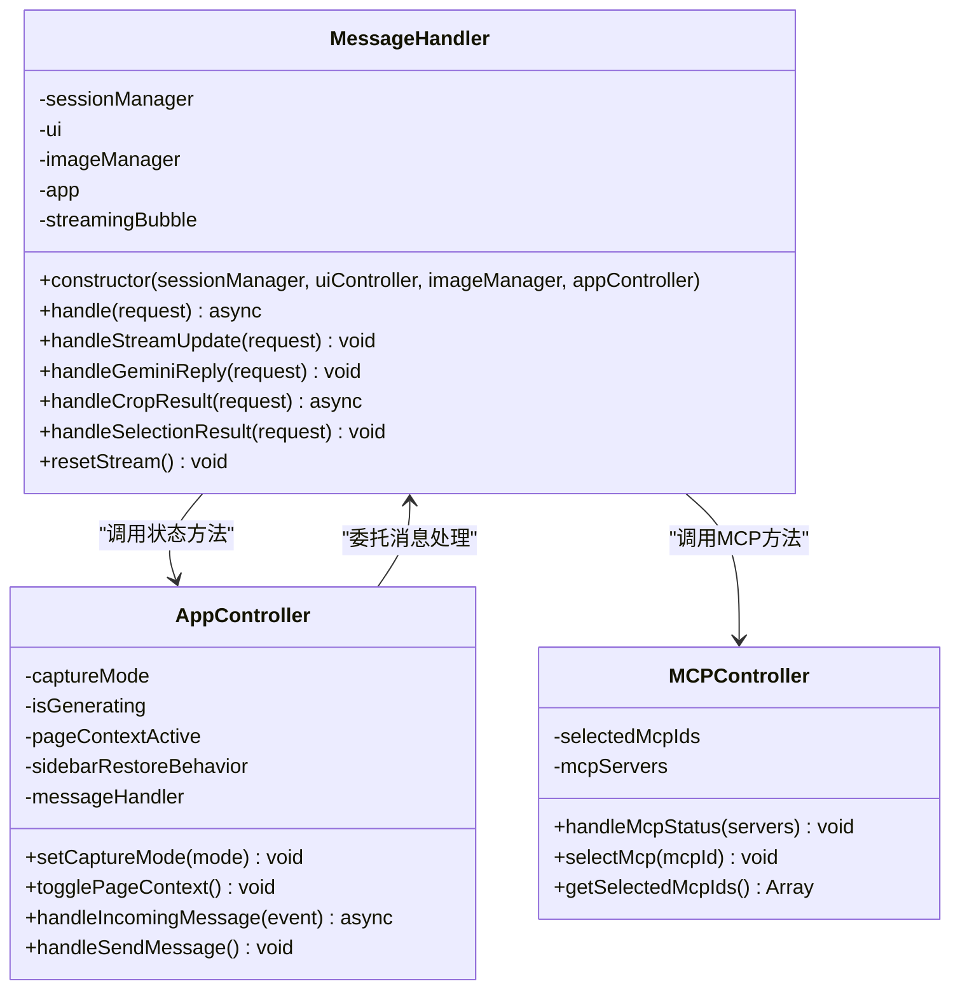
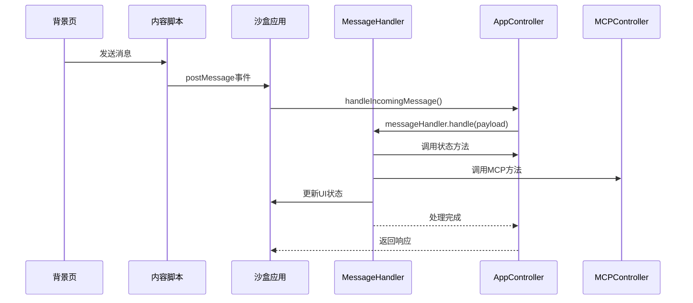
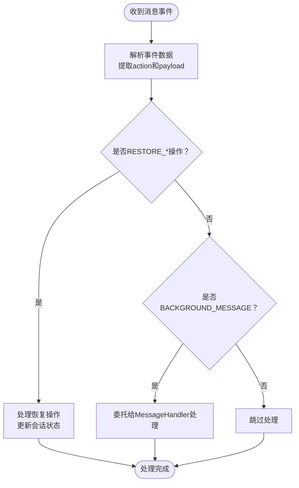
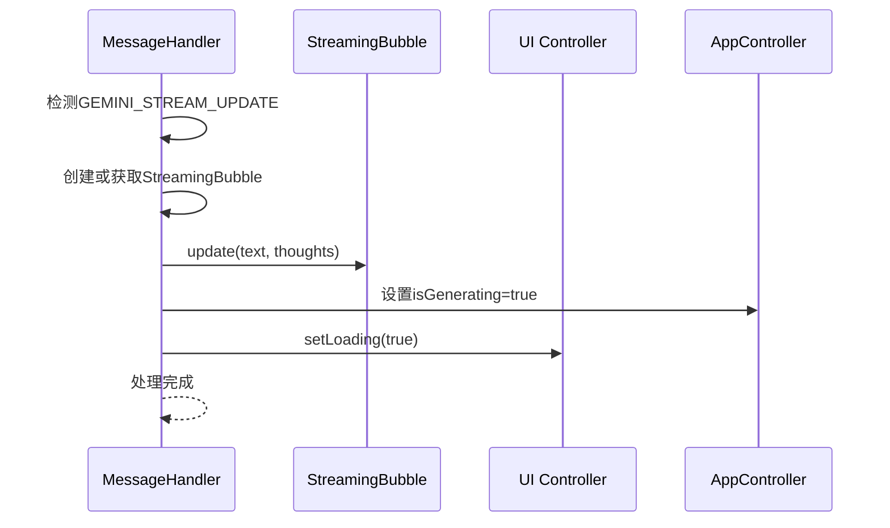
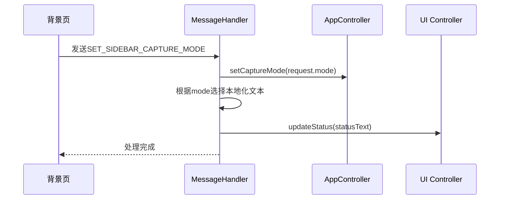
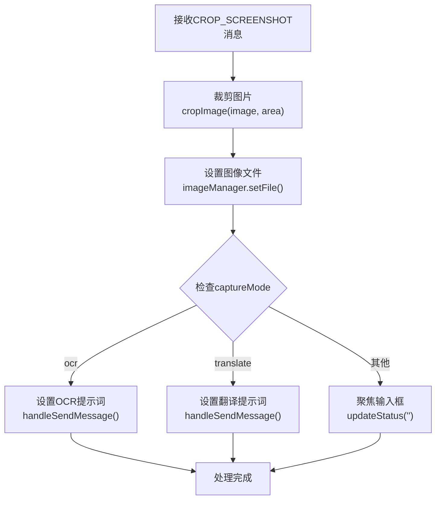
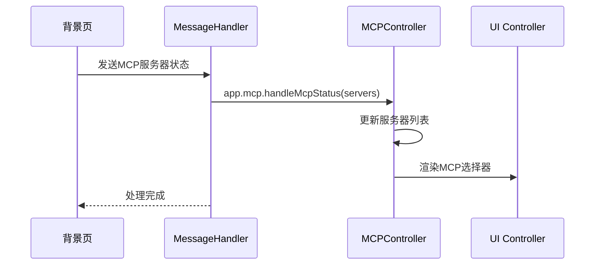
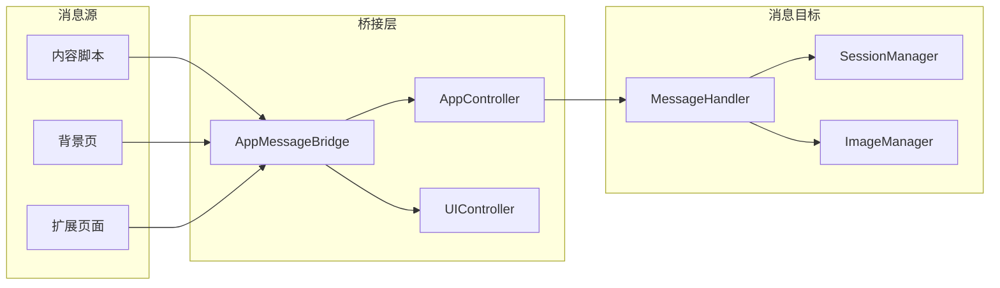
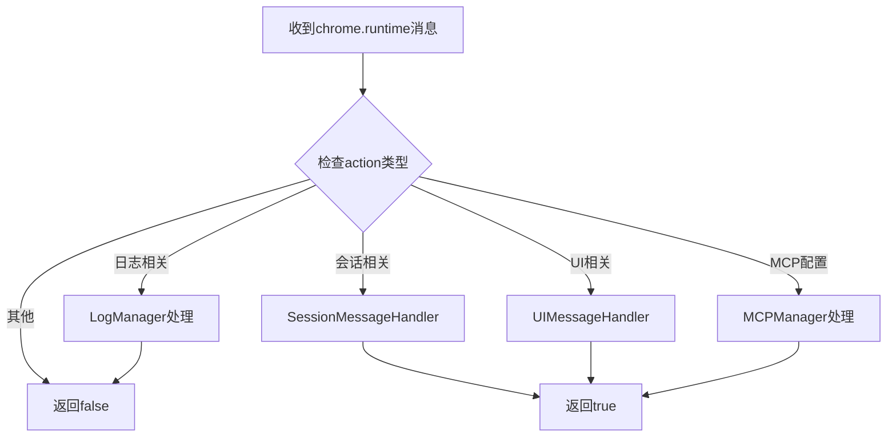

# 跨控制器消息处理流程

<cite>
**本文档引用的文件**
- [message_handler.js](file://sandbox/controllers/message_handler.js)
- [app_controller.js](file://sandbox/controllers/app_controller.js)
- [messaging.js](file://sandbox/boot/messaging.js)
- [messages.js](file://background/messages.js)
- [mcp_controller.js](file://sandbox/controllers/mcp_controller.js)
- [ui.js](file://background/handlers/ui.js)
- [session.js](file://background/handlers/session.js)
- [messaging.js](file://lib/messaging.js)
- [controller.js](file://content/toolbar/controller.js)
</cite>

## 目录
1. [简介](#简介)
2. [项目结构概览](#项目结构概览)
3. [核心组件分析](#核心组件分析)
4. [架构总览](#架构总览)
5. [详细组件分析](#详细组件分析)
6. [消息路由机制](#消息路由机制)
7. [性能考虑](#性能考虑)
8. [故障排除指南](#故障排除指南)
9. [结论](#结论)

## 简介

本文档深入分析了Gemini Nexus扩展程序中的跨控制器消息处理流程，重点研究MessageHandler作为消息中枢的工作机制。该系统采用分层架构设计，通过统一的消息路由机制实现了背景页、内容脚本和沙盒界面之间的解耦通信。

系统的核心设计理念是将消息处理逻辑与业务逻辑分离，通过MessageHandler集中管理各种消息类型的分发和处理，从而便于扩展新的消息类型和维护系统的可维护性。

## 项目结构概览

系统采用模块化架构，主要分为三个层次：

**图表来源**
- [messages.js](file://background/messages.js#L14-L81)
- [app_controller.js](file://sandbox/controllers/app_controller.js#L10-L36)
- [message_handler.js](file://sandbox/controllers/message_handler.js#L8-L15)

**章节来源**
- [messages.js](file://background/messages.js#L1-L82)
- [app_controller.js](file://sandbox/controllers/app_controller.js#L1-L207)

## 核心组件分析

### MessageHandler - 消息中枢

MessageHandler是整个消息处理系统的核心组件，负责接收来自不同来源的消息并进行智能分发。其构造函数注入了四个关键依赖：

- **sessionManager**: 会话管理器，用于处理对话历史和状态
- **uiController**: 用户界面控制器，负责UI状态更新
- **imageManager**: 图像管理器，处理图片相关的操作
- **appController**: 应用控制器引用，用于访问应用级状态

**图表来源**
- [message_handler.js](file://sandbox/controllers/message_handler.js#L8-L15)
- [app_controller.js](file://sandbox/controllers/app_controller.js#L10-L36)
- [mcp_controller.js](file://sandbox/controllers/mcp_controller.js#L5-L13)

**章节来源**
- [message_handler.js](file://sandbox/controllers/message_handler.js#L8-L86)
- [app_controller.js](file://sandbox/controllers/app_controller.js#L10-L36)

## 架构总览

系统采用事件驱动的架构模式，通过消息传递实现组件间的松耦合通信：

**图表来源**
- [app_controller.js](file://sandbox/controllers/app_controller.js#L129-L192)
- [message_handler.js](file://sandbox/controllers/message_handler.js#L17-L86)

## 详细组件分析

### AppController.handleIncomingMessage - 事件入口点

AppController的handleIncomingMessage方法是整个消息处理链的入口点，负责接收来自背景页的消息并进行初步处理：

**图表来源**
- [app_controller.js](file://sandbox/controllers/app_controller.js#L129-L192)

当接收到BACKGROUND_MESSAGE时，AppController会检查payload中的具体action类型：

- **SWITCH_SESSION**: 切换到指定会话
- **ACTIVE_TAB_INFO**: 处理活动标签页信息
- **其他消息**: 委托给MessageHandler进行统一处理

**章节来源**
- [app_controller.js](file://sandbox/controllers/app_controller.js#L129-L192)

### MessageHandler.handle - 消息分发核心

MessageHandler的handle方法实现了基于action的多路分支路由机制，支持多种消息类型：

#### 流式更新处理 (GEMINI_STREAM_UPDATE)

**图表来源**
- [message_handler.js](file://sandbox/controllers/message_handler.js#L212-L229)

#### 截图模式切换 (SET_SIDEBAR_CAPTURE_MODE)

这是文档要求的重点分析对象，展示了如何从上下文菜单同步模式状态：

**图表来源**
- [message_handler.js](file://sandbox/controllers/message_handler.js#L48-L57)

**章节来源**
- [message_handler.js](file://sandbox/controllers/message_handler.js#L17-L86)

### 截图处理流程 (CROP_SCREENSHOT)

MessageHandler对截图结果的处理体现了完整的业务逻辑：

**图表来源**
- [message_handler.js](file://sandbox/controllers/message_handler.js#L318-L341)

**章节来源**
- [message_handler.js](file://sandbox/controllers/message_handler.js#L318-L341)

### MCP集成处理

MessageHandler还负责处理MCP（Model Context Protocol）相关的消息：

**图表来源**
- [message_handler.js](file://sandbox/controllers/message_handler.js#L82-L85)
- [mcp_controller.js](file://sandbox/controllers/mcp_controller.js#L95-L99)

**章节来源**
- [message_handler.js](file://sandbox/controllers/message_handler.js#L75-L85)
- [mcp_controller.js](file://sandbox/controllers/mcp_controller.js#L95-L99)

## 消息路由机制

### 跨组件通信桥接

系统通过AppMessageBridge实现跨组件的消息桥接：

**图表来源**
- [messaging.js](file://sandbox/boot/messaging.js#L4-L47)
- [messaging.js](file://lib/messaging.js#L4-L96)

### 背景页消息处理

背景页通过setupMessageListener统一处理来自不同来源的消息请求：

**图表来源**
- [messages.js](file://background/messages.js#L22-L80)

**章节来源**
- [messages.js](file://background/messages.js#L14-L81)
- [messaging.js](file://sandbox/boot/messaging.js#L29-L89)

## 性能考虑

### 异步处理优化

系统大量使用异步处理来避免阻塞主线程：

- **流式消息处理**: 使用StreamingBubble实现渐进式UI更新
- **图片处理**: 异步裁剪和水印移除操作
- **MCP状态查询**: 异步获取服务器状态信息

### 内存管理

- **消息队列**: AppMessageBridge使用队列机制避免消息丢失
- **流式气泡复用**: 重用StreamingBubble实例减少内存分配
- **MCP选择器**: 使用Set数据结构存储选中服务器ID

### 错误处理策略

系统采用多层次的错误处理机制：

- **捕获异常**: 所有异步操作都包含try-catch块
- **状态回滚**: 失败时恢复到之前的状态
- **用户反馈**: 通过UI状态变化告知用户操作结果

## 故障排除指南

### 常见问题诊断

#### 消息未到达问题

1. **检查消息桥接**: 确认AppMessageBridge已正确初始化
2. **验证事件监听**: 确保window.addEventListener正常工作
3. **检查消息格式**: 确认postMessage的数据结构正确

#### 模式同步失败

1. **验证captureMode状态**: 检查AppController.setCaptureMode是否被调用
2. **检查UI更新**: 确认UI.updateStatus方法正常执行
3. **本地化资源**: 验证t()函数返回正确的本地化文本

#### 截图处理异常

1. **验证裁剪参数**: 检查request.area的有效性
2. **图像格式**: 确认base64图像数据格式正确
3. **权限检查**: 确认有适当的图像访问权限

**章节来源**
- [message_handler.js](file://sandbox/controllers/message_handler.js#L337-L340)
- [app_controller.js](file://sandbox/controllers/app_controller.js#L38-L40)

## 结论

Gemini Nexus的跨控制器消息处理系统展现了优秀的架构设计原则：

### 设计优势

1. **解耦性**: MessageHandler作为单一职责的中枢，有效解耦了消息处理与业务逻辑
2. **可扩展性**: 新增消息类型只需在MessageHandler中添加相应的分支处理
3. **可维护性**: 统一的消息路由机制简化了代码维护和调试
4. **可靠性**: 完善的错误处理和状态管理确保了系统的稳定性

### 架构亮点

- **分层设计**: 背景层、内容层、沙盒层的清晰分工
- **事件驱动**: 基于postMessage的异步通信机制
- **状态管理**: 通过AppController集中管理应用状态
- **MVC分离**: 控制器、模型、视图的明确职责划分

### 扩展建议

1. **消息验证**: 可以添加消息格式验证机制
2. **性能监控**: 实现消息处理时间统计
3. **日志记录**: 添加更详细的操作日志
4. **测试覆盖**: 为关键消息处理路径添加单元测试

这个系统为类似扩展程序提供了优秀的消息处理架构参考，通过合理的分层设计和解耦机制，实现了高内聚、低耦合的系统结构。