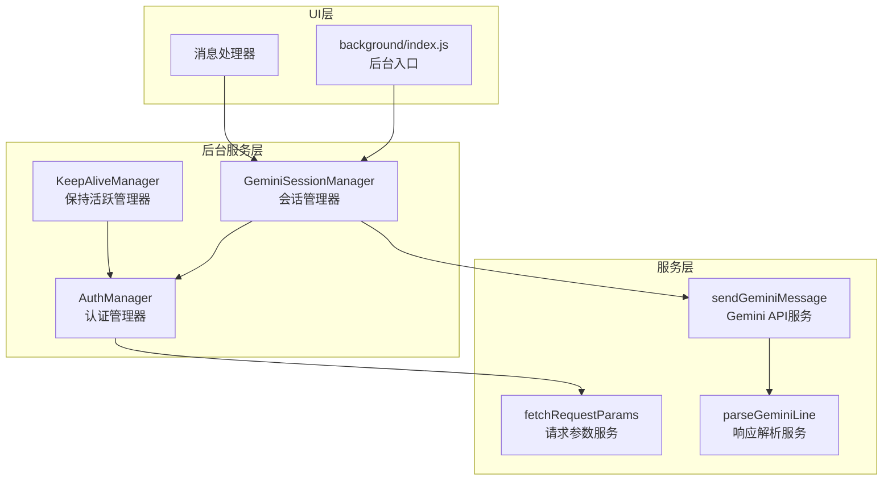
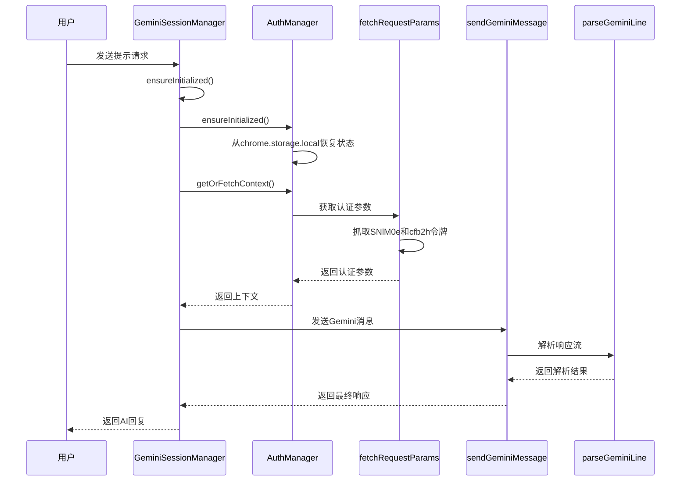
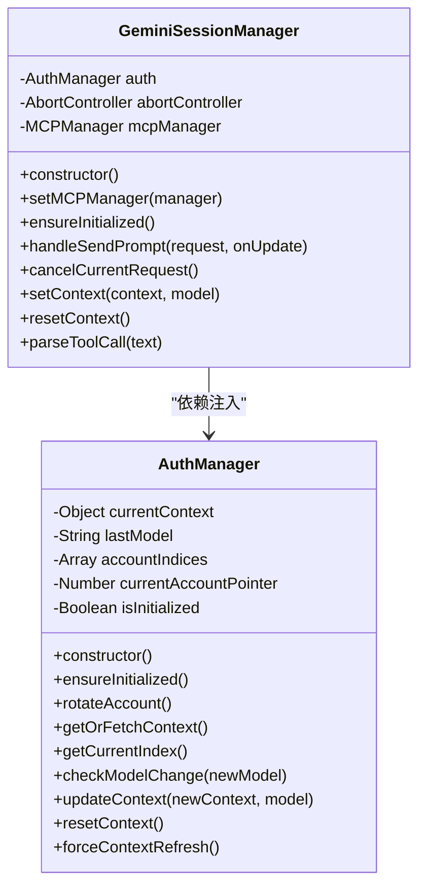
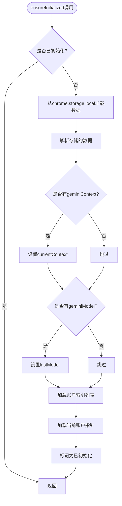
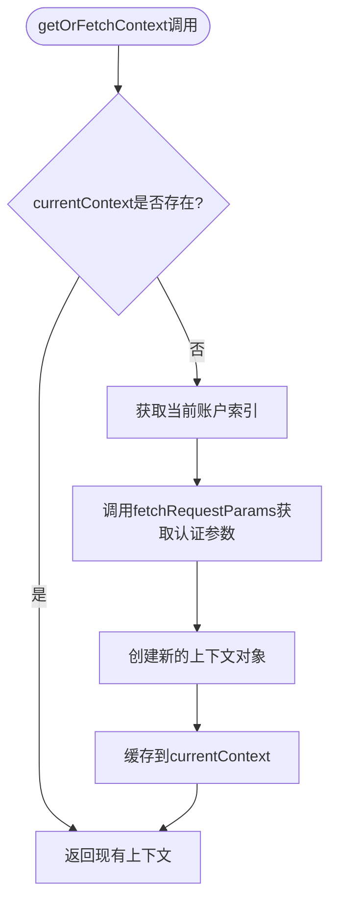
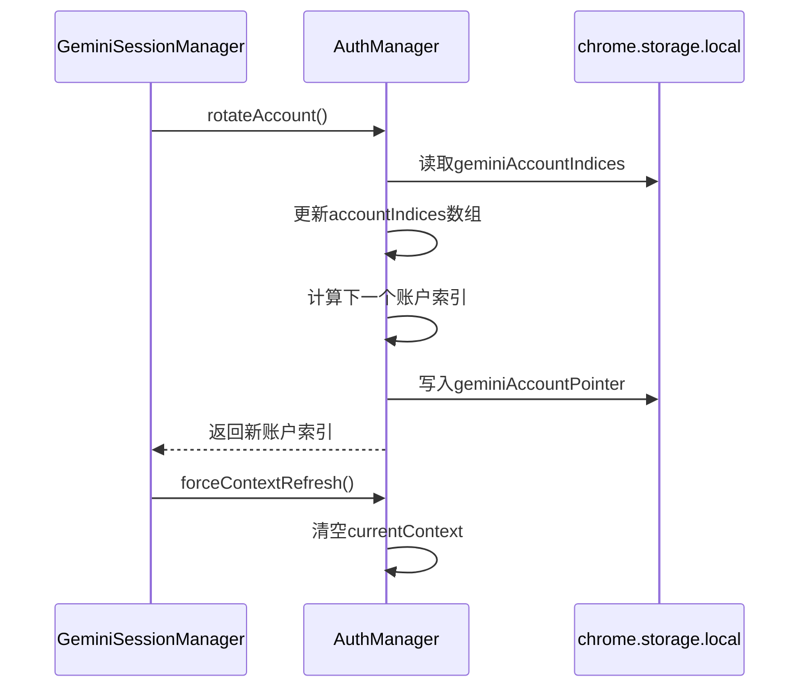
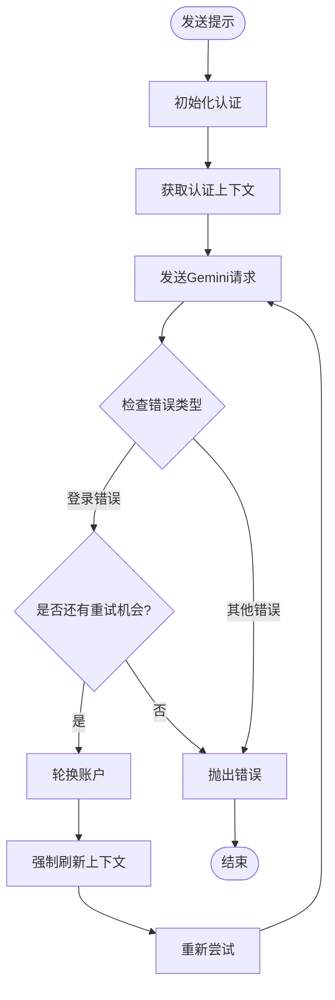
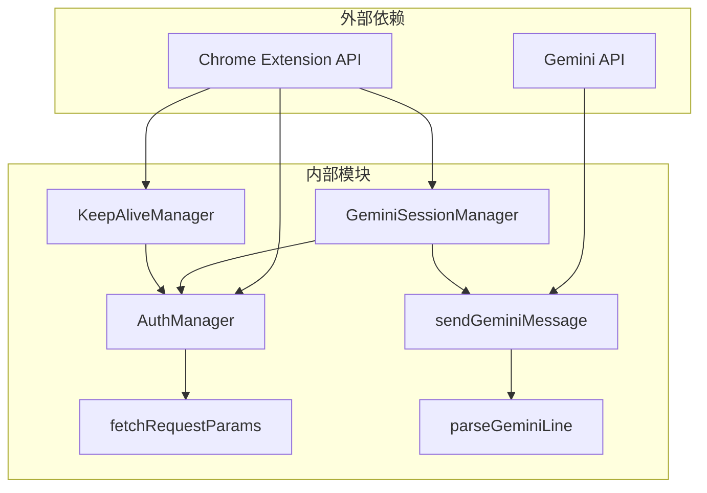
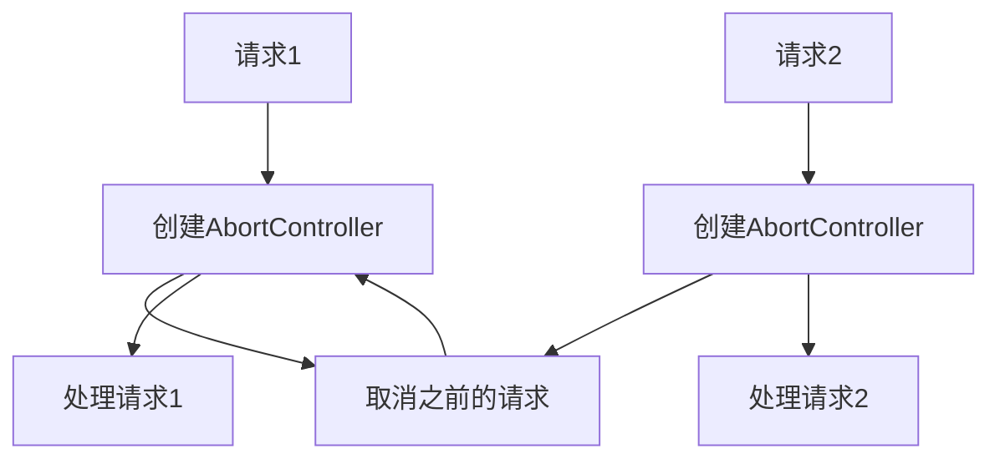

# SessionManager与AuthManager集成

<cite>
**本文档引用的文件**
- [background/managers/session_manager.js](file://background/managers/session_manager.js)
- [background/managers/auth_manager.js](file://background/managers/auth_manager.js)
- [services/gemini_api.js](file://services/gemini_api.js)
- [services/auth.js](file://services/auth.js)
- [background/index.js](file://background/index.js)
- [background/messages.js](file://background/messages.js)
- [background/managers/keep_alive.js](file://background/managers/keep_alive.js)
- [services/parser.js](file://services/parser.js)
- [manifest.json](file://manifest.json)
</cite>

## 目录
1. [简介](#简介)
2. [项目结构](#项目结构)
3. [核心组件](#核心组件)
4. [架构概览](#架构概览)
5. [详细组件分析](#详细组件分析)
6. [依赖关系分析](#依赖关系分析)
7. [性能考虑](#性能考虑)
8. [故障排除指南](#故障排除指南)
9. [结论](#结论)

## 简介

本文档深入分析了Gemini Nexus扩展中SessionManager与AuthManager的集成机制，重点阐述了GeminiSessionManager在构造函数中通过`this.auth = new AuthManager()`进行依赖注入的实现方式。详细说明了SessionManager如何调用AuthManager的`ensureInitialized`方法进行认证状态初始化，以及`getOrFetchContext`方法获取Gemini API调用所需的上下文凭证。通过代码示例展示在发送提示前如何调用`await this.auth.getOrFetchContext()`获取认证上下文，解释AuthManager如何从chrome.storage.local中持久化存储和恢复认证状态，并实现多账户轮换功能。

## 项目结构

Gemini Nexus采用模块化的架构设计，主要分为以下几个核心模块：

**图表来源**
- [background/managers/session_manager.js](file://background/managers/session_manager.js#L6-L11)
- [background/managers/auth_manager.js](file://background/managers/auth_manager.js#L5-L12)
- [services/gemini_api.js](file://services/gemini_api.js#L26-L37)

**章节来源**
- [background/managers/session_manager.js](file://background/managers/session_manager.js#L1-L285)
- [background/managers/auth_manager.js](file://background/managers/auth_manager.js#L1-L130)
- [background/index.js](file://background/index.js#L1-L30)

## 核心组件

### GeminiSessionManager类

GeminiSessionManager是系统的核心控制器，负责管理与Gemini AI的交互流程。其主要职责包括：

- **依赖注入**：通过构造函数注入AuthManager实例
- **会话管理**：处理用户提示的发送、取消和重试逻辑
- **上下文管理**：协调认证上下文的获取和更新
- **错误处理**：实现智能的错误检测和自动重试机制

### AuthManager类

AuthManager专门负责认证状态的管理和持久化，提供以下核心功能：

- **状态初始化**：从chrome.storage.local恢复认证状态
- **上下文获取**：动态获取或生成认证上下文
- **多账户支持**：支持多个Google账户的轮换使用
- **持久化存储**：将认证状态保存到浏览器存储中

**章节来源**
- [background/managers/session_manager.js](file://background/managers/session_manager.js#L6-L11)
- [background/managers/auth_manager.js](file://background/managers/auth_manager.js#L5-L12)

## 架构概览

系统采用分层架构设计，实现了清晰的关注点分离：

**图表来源**
- [background/managers/session_manager.js](file://background/managers/session_manager.js#L21-L74)
- [background/managers/auth_manager.js](file://background/managers/auth_manager.js#L75-L92)
- [services/gemini_api.js](file://services/gemini_api.js#L26-L230)

## 详细组件分析

### 依赖注入机制

GeminiSessionManager通过构造函数实现AuthManager的依赖注入：

**图表来源**
- [background/managers/session_manager.js](file://background/managers/session_manager.js#L6-L11)
- [background/managers/auth_manager.js](file://background/managers/auth_manager.js#L5-L12)

在构造函数中，SessionManager通过`this.auth = new AuthManager()`创建并注入AuthManager实例，这种设计实现了：

1. **松耦合**：两个类之间没有直接的强依赖关系
2. **可测试性**：可以轻松替换AuthManager的模拟实现
3. **单一职责**：每个类专注于自己的核心功能

**章节来源**
- [background/managers/session_manager.js](file://background/managers/session_manager.js#L7-L8)

### 认证状态初始化流程

AuthManager的`ensureInitialized`方法负责从chrome.storage.local恢复持久化的认证状态：

**图表来源**
- [background/managers/auth_manager.js](file://background/managers/auth_manager.js#L14-L48)

### 上下文获取机制

`getOrFetchContext`方法实现了智能的上下文获取策略：

**图表来源**
- [background/managers/auth_manager.js](file://background/managers/auth_manager.js#L75-L92)
- [services/auth.js](file://services/auth.js#L7-L40)

### 多账户轮换功能

系统支持多个Google账户的智能轮换，通过`rotateAccount`方法实现：

**图表来源**
- [background/managers/auth_manager.js](file://background/managers/auth_manager.js#L53-L69)
- [background/managers/auth_manager.js](file://background/managers/auth_manager.js#L126-L128)

**章节来源**
- [background/managers/auth_manager.js](file://background/managers/auth_manager.js#L53-L69)
- [background/managers/auth_manager.js](file://background/managers/auth_manager.js#L126-L128)

### 错误处理与自动重试机制

SessionManager实现了智能的错误检测和自动重试机制：

**图表来源**
- [background/managers/session_manager.js](file://background/managers/session_manager.js#L129-L147)

**章节来源**
- [background/managers/session_manager.js](file://background/managers/session_manager.js#L129-L147)

## 依赖关系分析

系统各组件之间的依赖关系如下：

**图表来源**
- [manifest.json](file://manifest.json#L6-L10)
- [background/managers/session_manager.js](file://background/managers/session_manager.js#L3-L4)
- [background/managers/auth_manager.js](file://background/managers/auth_manager.js#L3)

### 关键依赖特性

1. **权限要求**：系统需要`storage`、`alarms`等权限来支持持久化存储和定时任务
2. **异步通信**：所有网络操作都基于Promise和async/await模式
3. **错误传播**：底层错误会向上传播，由上层统一处理
4. **状态同步**：认证状态在内存和存储之间保持同步

**章节来源**
- [manifest.json](file://manifest.json#L6-L10)
- [background/messages.js](file://background/messages.js#L14-L21)

## 性能考虑

### 缓存策略

系统采用了多层次的缓存机制来优化性能：

1. **内存缓存**：AuthManager将认证上下文缓存在内存中
2. **存储缓存**：使用chrome.storage.local持久化认证状态
3. **响应缓存**：避免重复的认证请求

### 并发控制

SessionManager实现了请求取消机制，防止并发请求导致的状态冲突：

**图表来源**
- [background/managers/session_manager.js](file://background/managers/session_manager.js#L21-L30)

### 资源管理

系统实现了完善的资源清理机制：

- **内存释放**：请求完成后清理AbortController引用
- **存储同步**：及时更新持久化状态
- **错误清理**：错误发生时清理临时状态

## 故障排除指南

### 常见问题及解决方案

#### 认证失败
**症状**：显示"未登录"或"会话已过期"错误
**原因**：认证令牌失效或账户未登录
**解决**：
1. 检查账户登录状态
2. 手动刷新Gemini页面
3. 使用`resetContext()`重置认证状态

#### 多账户轮换问题
**症状**：账户切换不生效
**原因**：账户索引配置错误
**解决**：
1. 检查`geminiAccountIndices`存储值
2. 验证账户可用性
3. 重新配置账户列表

#### 速率限制
**症状**：收到"请求过于频繁"错误
**原因**：超出API速率限制
**解决**：
1. 等待一段时间后重试
2. 减少请求频率
3. 检查KeepAliveManager状态

**章节来源**
- [background/managers/session_manager.js](file://background/managers/session_manager.js#L159-L192)
- [background/managers/auth_manager.js](file://background/managers/auth_manager.js#L115-L124)

### 调试技巧

1. **启用日志**：检查控制台输出的调试信息
2. **监控存储**：使用Chrome开发者工具查看存储状态
3. **网络监控**：观察API请求和响应
4. **状态检查**：定期验证认证状态的完整性

## 结论

GeminiSessionManager与AuthManager的集成展现了现代浏览器扩展开发的最佳实践。通过精心设计的依赖注入、智能的认证状态管理和完善的错误处理机制，系统实现了稳定可靠的Gemini AI交互体验。

关键优势包括：

- **模块化设计**：清晰的职责分离和接口定义
- **持久化支持**：完整的认证状态恢复能力
- **多账户支持**：灵活的账户管理和轮换机制
- **错误恢复**：智能的错误检测和自动重试
- **性能优化**：高效的缓存策略和资源管理

这一架构为类似AI助手扩展的开发提供了优秀的参考模板，展示了如何在浏览器环境中实现复杂的认证和状态管理功能。